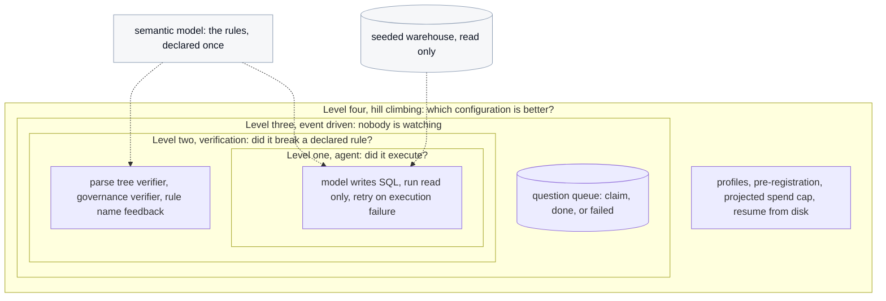

# Onboarding hub

This is the starting point for an engineer who has just joined and has never seen this
repository, this domain, or this codebase. It assumes you can read Python and SQL and that
you know what an HTTP request is. It assumes nothing else.

Read this page first. It gives you the product, the shared vocabulary, the machine setup
for macOS, Windows, and Linux, and how the tests work. Then pick the area document for
whatever you have been asked to work on. Each area document is self-contained after this
one and follows the same structure.

| Area | Document | What it covers |
|---|---|---|
| Preflight | [demos/00_preflight/ONBOARDING.md](demos/00_preflight/ONBOARDING.md) | The cheapest possible check that your checkout and your key work. Run this before anything that spends. |
| Level 1, the agent loop | [demos/01_agent_loop/ONBOARDING.md](demos/01_agent_loop/ONBOARDING.md) | An AI model writes SQL, the SQL runs, failures are retried. Plus the trap, which shows why retrying is not enough. |
| Level 2, the verification loop | [demos/02_verification_loop/ONBOARDING.md](demos/02_verification_loop/ONBOARDING.md) | Checking a query that ran cleanly against declared business rules, and sending it back when it broke one. |
| Level 3, the event driven loop | [demos/03_event_driven_loop/ONBOARDING.md](demos/03_event_driven_loop/ONBOARDING.md) | A queue and a worker, running with no human watching. |
| Level 4, the hill climbing loop | [demos/04_hill_climbing_loop/ONBOARDING.md](demos/04_hill_climbing_loop/ONBOARDING.md) | The measurement harness: run every configuration, score it, chart it, and refuse to overstate the result. |
| The web screens | [demos/ONBOARDING-views.md](demos/ONBOARDING-views.md) | Six browser screens over the levels above, served by one entry point. |

---

## 1. Overview

This repository is a workshop application. It runs an AI agent that answers business
questions by writing SQL against a small database, and it wraps that agent in four nested
loops, each one catching a failure the layer below cannot see.

It exists to make one gap concrete: **the gap between a rule you have written down and a
rule something actually enforces.** In most data platforms the business rules live in a
config file, a semantic layer, or a wiki page. Everyone can point at them. Far fewer teams
can point at the thing that checks them. This application declares its rules once, renders
them into the model's instructions from that one place, checks queries against them with
real parse tree analysis, and fails its own build when a declared rule has no check.

The user facing problem underneath is called a **silent error**: an agent writes SQL that
parses, runs, and returns a single clean plausible number that is wrong. No exception, no
empty result, nothing to alert on. A retry loop cannot help, because nothing crashed. That
is what the four loops are built to detect and measure.

The unusual constraint that shapes almost every design decision here is that these numbers
get shown to a room of people on a projector while being computed. **A number displayed
must never be able to pass for something it is not.** A stored number must not look freshly
computed. An unmeasured cell must not render as zero. A statistic that cannot be computed
must say so rather than showing a blank.

---

## 2. Glossary

Every term below appears across several area documents. Each area document adds its own
terms on top of these.

| Term | Definition |
|---|---|
| **Agent** | A program that calls a large language model in a loop, feeds the model's output to a tool, and feeds the result back to the model. Here the tool is a SQL database. |
| **Large language model, LLM** | A model that takes text and produces text. This project calls Anthropic's models over HTTPS. |
| **Silent error** | An answer that ran successfully, returned data in the right shape, looks completely plausible, and is wrong. Contrast with a **visible failure**, which is a crash, a syntax error, a timeout, or an empty result. You can spot a visible failure without knowing the right answer. You cannot spot a silent error that way. Defined at `src/loopeng/agent/classify.py :: Outcome`. |
| **Silent-error rate** | The share of answers that ran and returned data but were wrong. The headline number of the whole project. |
| **Warehouse** | The database the agent queries: a single DuckDB file, `warehouse.duckdb`, generated from a fixed seed so everyone gets identical data. Schema at `src/loopeng/warehouse/schema.py :: SCHEMA_DDL`. |
| **DuckDB** | An embedded analytical SQL database. It is a library and a file, not a server. Nothing to install, nothing to start. |
| **Semantic model** | `src/loopeng/warehouse/semantic_model.yaml`, which declares the warehouse's business rules in one place, for example "exclude soft deleted rows" and "convert currency before summing". |
| **Rule** | One named entry in the semantic model, for example `soft_delete` or `fan_out`. Rules are rendered into prompts and checked by verifiers from this single source. |
| **Gold set, gold item** | The test questions, each paired with the SQL that answers it correctly and the rows that SQL returns. Built at `src/loopeng/gold/build.py :: build_gold()`. |
| **Pattern** | One question template, for example "net revenue by region", parameterised into several concrete gold items. |
| **Prompt level, L0 and L3** | How much of the semantic model goes into the model's instructions. **L0** is the bare schema with no rules. **L3** is the schema plus every rule written out. Defined at `src/loopeng/prompts.py :: LEVELS`. |
| **Role, worker and frontier** | Which model answers. **worker** is the cheap fast model, `claude-haiku-4-5`. **frontier** is the expensive capable model, `claude-sonnet-5`. Mapped at `src/loopeng/registry.py :: REGISTRY`. |
| **Verifier** | A function that inspects generated SQL and decides whether it broke a declared rule. Implemented at `src/loopeng/verify/verifiers.py`. |
| **Parse tree, AST** | The structured form of a SQL statement after parsing, as opposed to its raw text. Checking a parse tree can see that a filter is inside a subquery that never runs; checking text cannot. |
| **Termination reason** | Why a loop stopped: success, out of attempts, out of budget, or a call the loop refuses to retry. Defined at `src/loopeng/agent/loop.py :: TerminationReason`. |
| **Wilson interval** | A way of putting an uncertainty range around a percentage from a small sample. Asymmetric, which matters near zero and near one hundred percent. At `src/loopeng/metric.py :: _wilson()`. |
| **Metric** | A number that cannot exist without its sample size, its interval, and the time it was computed. At `src/loopeng/metric.py :: Metric`. |
| **Idempotent** | An operation that gives the same result whether run once or five times, with no duplicate side effects. |
| **uv** | The Python package manager and virtual environment tool this project uses. It replaces `pip`, `venv`, and `pip-tools`. Every command here starts with `uv run`. |
| **structlog** | A logging library that emits key and value pairs rather than formatted strings. Configured at `src/loopeng/logging.py :: configure_logging()`. |
| **LangSmith** | A third party service for recording model calls so you can inspect them later. Entirely optional here, and it never holds a number this project reports. |
| **Gradio** | A Python library that turns functions into a web page. The six screens are built with it. |

---

## 3. Prerequisites

| Requirement | Version pinned | Where |
|---|---|---|
| Python | 3.12 | `.python-version` contains `3.12`; `pyproject.toml` sets `requires-python = ">=3.12"` |
| uv | any recent version, verified on 0.11.20 | `pyproject.toml` build system requires `uv_build>=0.11.20,<0.12.0` |
| Anthropic API key | not needed for the tests or for any offline demo | `src/loopeng/settings.py :: Settings.anthropic_api_key` |
| Database server | **none**, DuckDB is embedded | `src/loopeng/warehouse/connect.py` |
| Message broker | **none**, the queue is a DuckDB table | `src/loopeng/queue/store.py :: SCHEMA` |
| Container runtime | **none**, there is no `Dockerfile` and no compose file, and `README.md` section 16 says that absence is deliberate | verified by listing the repository root |

Direct dependencies from `pyproject.toml`: `anthropic`, `duckdb`, `gradio`, `langsmith`,
`matplotlib`, `pydantic-settings`, `pyyaml`, `qrcode`, `sqlglot`, `structlog`. Development
dependencies: `pytest`, `pytest-timeout`, `ruff`.

---

## 4. Repository map, at the top level

| Path | Responsibility |
|---|---|
| `demos/` | Thin command line entry points, one folder per loop level, plus a runbook and an onboarding document beside each. No loop logic lives here. |
| `src/loopeng/agent/` | Level 1: the model call, SQL extraction, execution, and retry. |
| `src/loopeng/verify/` | Level 2: the verifiers, the governance check, and the verification loop. |
| `src/loopeng/queue/` | Level 3: the queue table and the polling worker. |
| `src/loopeng/sweep/` | Level 4: profiles, the runner, the orchestrator, provenance, comparisons, and charts. |
| `src/loopeng/views/` | The six Gradio screens. |
| `src/loopeng/warehouse/` | The seeded generator, the schema, the semantic model, and the read only connection factory. |
| `src/loopeng/gold/` | Question patterns and the gold answer builder. |
| `src/loopeng/triage/` | Abstention scoring, escalation, and failure classification. |
| `src/loopeng/metric.py`, `paired.py`, `pricing.py`, `usage.py` | Numbers, statistics, prices, and token accounting. |
| `src/loopeng/settings.py`, `env_guard.py` | Configuration, loaded once and frozen, plus a guard against an environment that breaks imports. |
| `tools/` | The numeric literal lint rule, the README image renderer, a deployment sync script, and a resumability probe. |
| `tests/` | The offline suite, plus `tests/live/` behind an opt in marker. |
| `results/` | Measurements. Most of it is ignored by git; see `README.md` section 8 for what is committed and why. |
| `assets/` | Generated README images, written only by `tools/render_readme_charts.py`. |

---

## 5. Architecture and responsibilities

The four levels nest. Each one wraps the level below and catches something that level
cannot see by itself.



Read that diagram from the inside out.

**Level 1 asks "did it execute?"** If the SQL crashes, retry with the error text as
feedback. This is the loop most teams build. It cannot see a wrong answer, because a wrong
answer does not crash.

**Level 2 asks "did it break a declared rule?"** After the query runs cleanly, parse it and
check it against the rules the semantic model declares for that question. Reject and send
it back with the rule name. This is the layer that can catch a silent error.

**Level 3 removes the human.** A worker claims a question from a queue and answers it with
nobody reading the output. That turns the verifiers from an argument about measurement into
an argument about what ships.

**Level 4 asks "is any of this actually better?"** Run every configuration over the whole
gold set, score every answer, and compare the configurations with a statistical test that
refuses to overstate what it found.

Communication between levels is **direct Python function calls**. The only boundaries that
are not function calls are three: outbound HTTPS to Anthropic, the DuckDB files on disk,
and the JSON files that the sweep writes and the charts read.

---

## 6. Run it locally

These steps are the same for every area document. Do them once.

### Step 1: install uv

`Unverified:` these installer commands come from the uv project's published instructions,
not from this repository. This repository names uv as a prerequisite in `README.md` section
9 but does not carry an installer.

**macOS and Linux**

```bash
curl -LsSf https://astral.sh/uv/install.sh | sh
```

**macOS with Homebrew, as an alternative**

```bash
brew install uv
```

**Windows, in PowerShell**

```powershell
powershell -ExecutionPolicy ByPass -c "irm https://astral.sh/uv/install.ps1 | iex"
```

Confirm it worked on any operating system:

```bash
uv --version
```

**Expected output:** a version string such as `uv 0.11.20`. If the command is not found,
close and reopen your terminal so the updated path is picked up.

### Step 2: clone and install

```bash
git clone https://github.com/ANI-IN/loop-engineering-workshop.git
cd loop-engineering-workshop
uv sync
```

**Expected output:** uv downloads Python 3.12 if needed, creates a `.venv` directory, and
prints the packages it installed. There is no separate step to activate a virtual
environment. Every command starts with `uv run`, which uses the project environment
automatically.

**Where you put the clone matters on macOS.** Do not put it inside iCloud Drive, which
means avoid `~/Documents` and `~/Desktop` if iCloud Desktop and Documents syncing is on.
iCloud sets a hidden flag on files it considers cold, CPython silently ignores hidden
`.pth` files, and the editable install then vanishes with an import error that points
nowhere near the cause. `src/loopeng/env_guard.py :: check_environment()` detects this and
refuses to start with an explanatory message. Use `~/Projects` or similar.

`Inferred:` on Windows and Linux that guard finds nothing, because it looks for two macOS
specific path fragments in `ICLOUD_MARKERS` and for a file flag that
`getattr(pth.stat(), "st_flags", 0)` returns zero for elsewhere. A OneDrive synced checkout
on Windows would therefore not be caught. Evidence: `src/loopeng/env_guard.py`.

### Step 3: run the offline test suite

```bash
uv run pytest -q
```

**Expected output:** a row of dots and a final line of the form
`784 passed, 5 deselected in 60s`. The exact count grows as tests are added.

- **`deselected` is correct, not a problem.** `pyproject.toml` sets
  `addopts = "-m 'not live'"`, which excludes the five tests that hit the network and cost
  money. Opting in is an explicit act.
- **On Linux you will also see `2 skipped`.** Two tests are platform conditional: one needs
  a BSD only file flag function, and one only asserts image byte identity on the machine
  that generated the images. See `tests/test_env_guard.py :: test_detects_a_hidden_pth_file`
  and `tests/test_readme_charts.py :: test_byte_identity_with_a_fresh_render_where_that_can_hold`.

If this passes, your checkout is sound and you have spent nothing.

### Step 4: run the two lint checks

```bash
uv run ruff check .
uv run python tools/lint_no_numbers.py
```

**Expected output:** `All checks passed!` from the first, and from the second a line of the
form `no typed measurements in 11 rendering file(s); 92 literal(s) marked` followed by the
exemption counts. Both counts are printed on success deliberately: an escape hatch whose
usage nobody counts is how a rule ends up exempting what it was written to catch.

### Step 5: create the environment file

Needed only for demos that call a model. Every demo document says clearly whether its
walkthrough costs anything.

**macOS and Linux**

```bash
cp .env.example .env
```

**Windows, in PowerShell**

```powershell
Copy-Item .env.example .env
```

Open `.env` and put your key after `ANTHROPIC_API_KEY=`. Leave `LANGSMITH_API_KEY` empty;
everything works without it. Confirm:

```bash
uv run python -c "from loopeng.settings import load_settings; load_settings(); print('settings ok')"
```

**Expected output:** `settings ok`. If the key is missing you get, verbatim:

```
ANTHROPIC_API_KEY is not set. Add ANTHROPIC_API_KEY=<your key> to .env (see .env.example).
```

### Step 6: there are no migrations and no seed step

The warehouse is created on first use by `warehouse/connect.py :: ensure_warehouse()`, the
queue table is created on connect by `queue/store.py :: connect()`, and the gold set is
rebuilt from its patterns. Every entry point cold starts, and `tests/test_demo_structure.py`
runs each one from an empty working directory to prove it.

---

## 7. Configuration

Every variable below is read by code in this repository.

### Read through the settings object

Consumed by `src/loopeng/settings.py :: Settings`, which reads a `.env` file in the working
directory and then the process environment.

| Variable | Purpose | Type | Default | Required |
|---|---|---|---|---|
| `ANTHROPIC_API_KEY` | Credential for every live model call. | secret string | none | **Yes**, for anything that calls a model. |
| `LANGSMITH_API_KEY` | Credential for the optional trace recording service. | secret string or absent | `None` | No. Absent means tracing degrades to one logged warning. |
| `LANGSMITH_PROJECT` | Which project traces are filed under. | string | `loop-eng-workshop` | No |
| `LANGSMITH_TRACING` | Whether to send traces. | boolean | `false` | No. Must stay false for the offline suite. |
| `WAREHOUSE_SEED` | The seed the warehouse is generated from. Changing it changes every gold answer. | integer | `20260729` | No |
| `WAREHOUSE_PATH` | Where the warehouse file lives. | path | `warehouse.duckdb` | No |
| `RESULTS_DIR` | Where result files are written. | path | `results` | No |

`Inferred:` the last three variable names are the uppercased field names
`warehouse_seed`, `warehouse_path`, and `results_dir`. I did not execute a run that sets
them through the environment, so I am relying on the documented behaviour of
`pydantic_settings.BaseSettings`. The first four are named explicitly in `.env.example` and
are therefore certain.

### Read directly from the process environment

| Variable | Purpose | Default | Consumed at |
|---|---|---|---|
| `LOOPENG_LIVE` | Master switch for a hosted instance that may call models. Must be `1`, `true`, `True`, or `yes`. | unset, meaning off | `src/loopeng/views/live_mode.py :: read_config()` |
| `LOOPENG_LIVE_CEILING_USD` | Spending ceiling for that hosted instance. Required when `LOOPENG_LIVE` is set. | none | `src/loopeng/views/live_mode.py :: read_config()` |
| `LOOPENG_LIVE_MAX_CALLS` | Call count ceiling for that hosted instance. | none | `src/loopeng/views/live_mode.py :: read_config()` |
| `LOOPENG_WAREHOUSE` | Warehouse path, public exhibit only. | `/tmp/loopeng_warehouse.duckdb` | `deploy/hf/app.py` |
| `GRADIO_ANALYTICS_ENABLED` | Set to `False` so launching a screen makes no outbound telemetry call. | set by the code | `src/loopeng/views/chrome.py`, `deploy/hf/app.py` |
| `PYTHONUNBUFFERED` | Set to `1` for the detached sweep so its log is written as it goes. | set by the code | `src/loopeng/sweep/detach.py :: detach()` |
| `MPLCONFIGDIR` | Where matplotlib caches its font index. Continuous integration only. | not set locally | `.github/workflows/ci.yml` |

**Never put a real key in `.env.example`.** It is committed. `.env` is ignored by
`.gitignore`.

---

## 8. Testing

All tests live under `tests/`. `pyproject.toml` sets `testpaths = ["tests"]`, so pytest
finds them with no arguments.

```bash
uv run pytest -q
```

Two configuration choices matter:

- `addopts = "-m 'not live'"` deselects every test marked `live`. Those are the only ones
  that touch the network or cost money.
- `timeout = 300` with `timeout_method = "thread"` fails a hung test with a traceback
  naming it. This exists because a continuous integration run was once cancelled at the job
  timeout with no indication of which test was stuck.

Run one file, one test, or a keyword match:

```bash
uv run pytest tests/test_verify.py -q
uv run pytest "tests/test_sweep.py::test_the_sonnet_comparisons_are_testable_now" -q
uv run pytest -q -k fingerprint
```

Run the live tests, which cost money and need a key:

```bash
uv run pytest -m live -q
```

On Windows in PowerShell the quoting shown above is already correct; keep the quotes around
any argument containing `::`.

`tests/conftest.py :: _tracing_off_unless_live` applies to every test automatically. It
forces four tracing environment variables to false and removes the endpoint variable, so a
developer machine with tracing exported cannot silently break the zero network property.

---

## 9. Continuous integration

`.github/workflows/ci.yml` defines one job, `offline`, on Ubuntu, on every push and pull
request. In order it: installs uv, installs Python 3.12, runs `uv sync --locked`, runs
`ruff check .`, runs `tools/lint_no_numbers.py`, asserts that a checkout with only
`ANTHROPIC_API_KEY` set can load its settings, runs the offline suite, and confirms the
live tests were deselected rather than silently skipped.

**No API key is set anywhere in that job, deliberately.** If a test ever starts needing
one, the job fails, and that is the correct outcome.

---

## 10. Observability, across the whole repository

Logging is configured at `src/loopeng/logging.py :: configure_logging()` using `structlog`
with a console renderer at level `INFO` and a timestamp of hours, minutes, and seconds. It
renders for a human reading a terminal, not as JSON for a log aggregator, because these
logs are read live by a room of people.

**There are no metrics.** No counter, gauge, histogram, Prometheus endpoint, or StatsD
client exists anywhere in this repository.

**Tracing is optional and off by default.** With `LANGSMITH_API_KEY` set and
`LANGSMITH_TRACING` true, model calls are recorded to LangSmith.
`src/loopeng/langsmith_ds.py :: advisory()` catches every exception and logs a warning, so a
tracing outage cannot fail a measurement. No number this project reports is read back from
it.

The log events that exist anywhere in the repository:

| Event | Level | Emitted at |
|---|---|---|
| `model_call_refused` | error | `src/loopeng/agent/loop.py :: run_question()`, `src/loopeng/verify/loop.py :: run_verified()` |
| `model_call_failed` | warning | `src/loopeng/agent/loop.py :: run_question()` |
| `trap_cell_failed` | error | `src/loopeng/agent/trap.py` |
| `claimed` | info | `src/loopeng/queue/worker.py :: process_one()` |
| `failed` | warning and error | `src/loopeng/queue/worker.py :: process_one()` |
| `langsmith_unavailable` | warning | `src/loopeng/langsmith_ds.py :: advisory()` |
| `escalated` and related | info | `src/loopeng/triage/escalate.py` |

---

## 11. Troubleshooting, shared across areas

Area specific failures are in each area document. These apply everywhere.

| Symptom | Likely cause | Diagnostic | Fix |
|---|---|---|---|
| `ANTHROPIC_API_KEY is not set. Add ANTHROPIC_API_KEY=<your key> to .env (see .env.example).` | No `.env`, or the key line is empty. | `cat .env`, or `Get-Content .env` on Windows. | Copy `.env.example` to `.env` and fill in the key. From `settings.py :: load_settings()`. |
| `EnvironmentUnsafe` naming an iCloud path | The checkout or its virtual environment is on an iCloud synced path. | The message names the exact path. | Move the checkout, then run `uv sync` again. Do not disable the guard. From `env_guard.py :: check_environment()`. |
| `ModuleNotFoundError: No module named 'loopeng'` | `uv sync` has not been run, or the editable install marker was hidden by cloud sync. | `uv run python -c "import loopeng; print(loopeng.__file__)"` | Run `uv sync`. On macOS, move the checkout off the synced path if it persists. |
| `QueryTimeout: query exceeded its 30.0s budget and was interrupted` | The model wrote a query with no natural end, often an unintended cross join. | Look at the SQL in the run output. | Nothing to fix in the harness. The timeout is the protection. From `warehouse/connect.py :: run_sql()`. |
| `UnknownModelPrice: no price entry for '<model>'` | A model identifier with no row in the price table. | Read `src/loopeng/pricing.py :: PRICES`. | Add the entry. It raises rather than defaulting to zero, because a run that looked free would be the most misleading possible failure. |
| A model call fails once and everything stops | The failure was classified as one retrying cannot fix, for example authentication or a bad request. | Look for a `model_call_refused` log line naming the termination reason. | Fix the cause. Retrying will not help, which is why it stops. From `agent/loop.py :: triage_call_failure()`. |
| Repeated `model_call_failed` warnings | Rate limiting. | Read the warning. | Lower concurrency. The wait honours the server's `retry-after` header when present. |

---

## 12. Changing this code safely, the repository wide rules

Four conventions are enforced by tests rather than by review. Breaking any of them fails
the build.

1. **Demos stay thin.** No loop logic in `demos/`. `tests/test_demo_structure.py` caps every
   file there at one hundred lines and asserts the logic lives in `src/loopeng/`.
2. **Every demo cold starts.** No stage may depend on an earlier one having run.
   `tests/test_demo_structure.py` runs each entry point from an empty working directory.
3. **No typed numbers in files that render to a screen.** `tools/lint_no_numbers.py` scans
   eleven rendering files and rejects numeric literals, including numbers inside strings. A
   literal that is genuine layout geometry is exempted by a trailing `# layout` comment on
   that exact line, and the exemption count is printed on every run.
4. **Documentation is checked.** `tests/test_docs.py` walks every markdown file in the
   repository: relative links must resolve, scripts named in shell blocks must exist,
   diagrams must carry no digits, and diagrams duplicated between a stage runbook and the
   root README must stay byte identical.

Pre merge checklist:

1. `uv run pytest -q` passes.
2. `uv run ruff check .` reports `All checks passed!`.
3. `uv run python tools/lint_no_numbers.py` exits zero.
4. If you touched `src/loopeng/sweep/` or `results/reference/`, run
   `uv run python tools/render_readme_charts.py` and confirm `git status --short assets/`
   prints nothing.
5. Read the "Changing this code safely" section of the area document you touched.

---

## 13. Open questions, repository wide

Area specific questions are in each area document. These cut across everything.

1. **The `spliced` block has no producer in this repository.** Every cell file in
   `results/sweep/` and every cell in `results/reference/measurements.json` and
   `results/reference/worker_baseline.json` carries a `spliced` object recording that ten
   items were re-run and forty kept. Searching every `.py` and `.md` file for the string
   `spliced` returns nothing. **Was the splice performed by a script that was never
   committed, and can it be added to `tools/`?**

2. **`results/reference/abstention_curve.json` has no writer in this repository.** It is
   read by `src/loopeng/views/exhibit.py :: _frozen_curve_table()` and by
   `tools/render_readme_charts.py`. **Which tool produced it?**

3. **The environment guard checks for iCloud only.** `env_guard.py :: ICLOUD_MARKERS`
   contains two macOS specific fragments. **Should OneDrive and Dropbox markers be added for
   Windows and Linux contributors?**

4. **Windows support is undeclared.** `src/loopeng/sweep/detach.py :: detach()` passes
   `start_new_session=True`, which is a POSIX feature, and prints a `tail -f` hint that is
   not a Windows command. **Is Windows a supported development platform, and if so should
   `detach()` support it or refuse explicitly?**

5. **`WAREHOUSE_SEED`, `WAREHOUSE_PATH`, and `RESULTS_DIR` are undocumented in
   `.env.example`.** They are real settings fields. **Should they be listed, or are they
   deliberately internal?**
