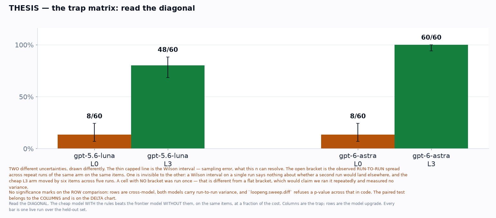
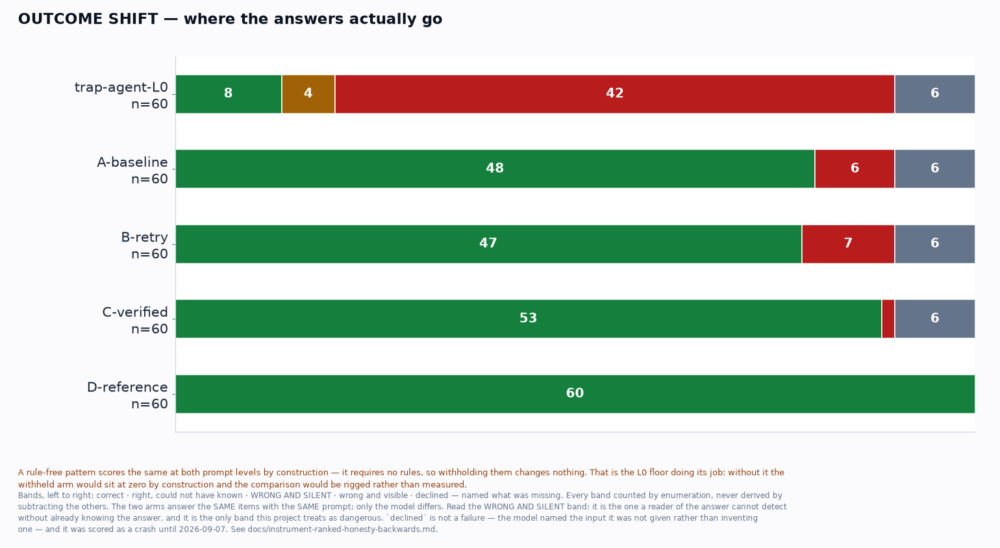
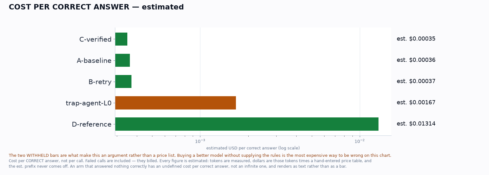
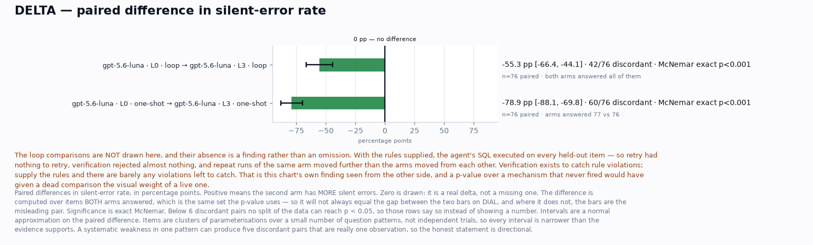
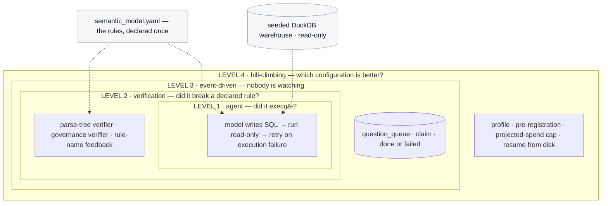
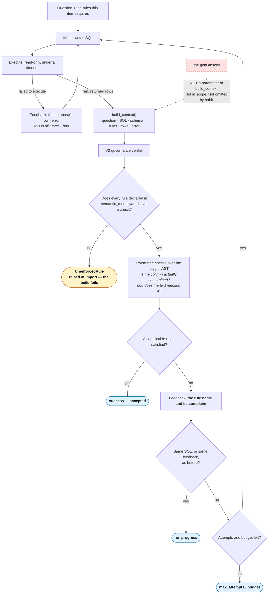
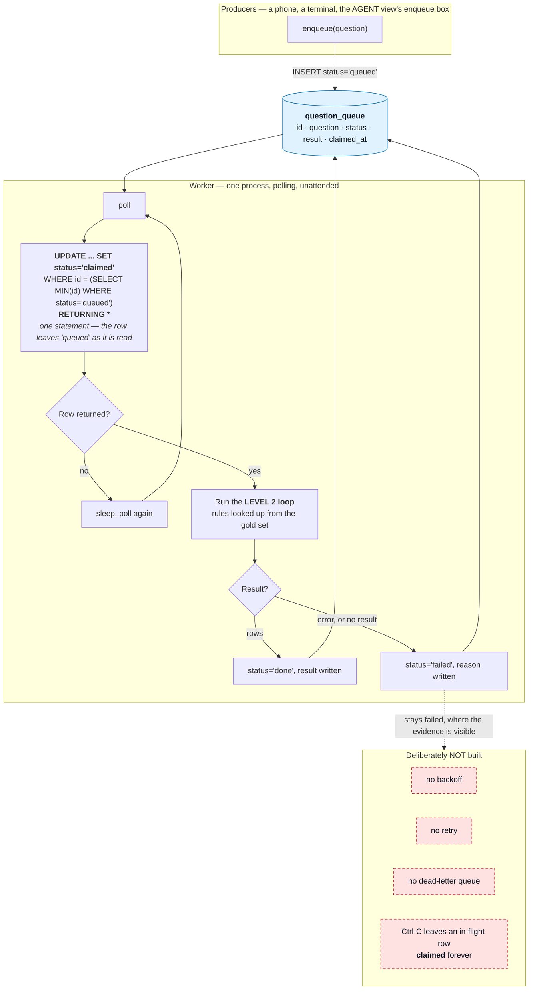
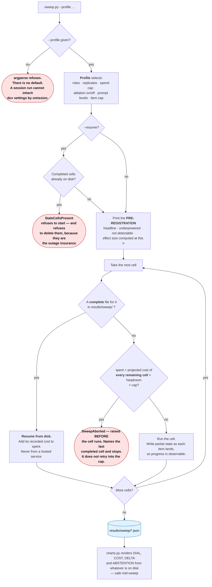

# Loop Engineering

**A text-to-SQL agent that is wrong in two different ways, and only one of them is
visible.**

A *visible failure* is detectably wrong without knowing the answer: invalid SQL, a
timeout, three columns where one was asked for. A retry loop can see those.

A *silent error* ran cleanly, returned one plausible number, and is wrong. Nothing in
the output distinguishes it from a correct answer, and detecting it requires the answer
— which in production you do not have.

This repository is four nested loops around one agent, built to show that the second
category is the one that matters and that **verification does not mainly make an agent
right; it makes it stop being confidently wrong.** Those move independently, and only
one of them is what a reader of the answer is exposed to.

It also turned out to be an argument about something else. Every figure here is
produced by a budget model. The frontier model appears exactly once, as the bar being
cleared — and with the business rules withheld, both models land on the *same floor*.
The constraint is information, not capability.

---

## Contents

| | |
|---|---|
| [Quickstart](#quickstart) | prove your checkout for a fraction of a cent |
| [What it costs](#what-it-costs) | the split, because the profile cap is not the bill |
| [What you should expect](#what-you-should-expect) | one full run, committed |
| [The trap](#the-trap-rules-withheld-against-rules-given) | the session's headline |
| [Model policy](#model-policy) | three roles, two providers, one that gates nothing |
| [The four conditions](#the-four-conditions) | what each arm is for |
| [The four loops](#the-four-loops) | L1 through L4, and where to see each |
| [Notebooks](#notebooks) | three, and the loop map |
| [Installation](#installation) | uv, per platform |
| [Environment](#environment) | one required key |
| [Running the session](#running-the-session) | live, in front of the room |
| [Repository structure](#repository-structure) | what is where |
| [Testing](#14--testing) · [Design decisions](#15--design-decisions) | |
| [Limitations](#16--limitations) · [CI caveats](#ci-and-what-it-does-not-cover) | |
| [Troubleshooting](#18--troubleshooting) · [FAQ](#19--faq) · [Glossary](#glossary) | |

---

## Quickstart

**One credential. `OPENAI_API_KEY`, and nothing else.** The Anthropic key buys the
judge, the judge never gates a result, and every figure in a session is produced
without it.

```bash
git clone https://github.com/ANI-IN/loop-engineering.git
cd loop-engineering
uv sync
cp .env.example .env          # add OPENAI_API_KEY only

uv run pytest -q                                  # offline, free, ~90s
uv run python demos/00_preflight/check.py         # 2 calls, a fraction of a cent
uv run python demos/04_hill_climbing_loop/sweep.py --profile smoke --foreground
uv run python demos/04_hill_climbing_loop/charts.py
```

**What the preflight prints on a good checkout** — note the `[SKIP]`, which is a skip
and not a pass, because "we did not call it" and "we called it and it worked" are
different facts:

```
[PASS] OPENAI_API_KEY is set — present (values never printed or logged)
[PASS] agent model reachable (gpt-5.6-luna) — answered with the registry's own kwargs
[SKIP] judge model reachable (claude-haiku-4-5) — not called — ANTHROPIC_API_KEY is
       not set, and this role gates nothing
[PASS] reference model reachable (gpt-6-astra) — answered with the registry's own kwargs
[PASS] warehouse matches the declared schema
[PASS] gold set builds — 84 items in 11 clusters
[PASS] rule surface (offline, free) — rejects 6/6 rule-breaking queries, accepts 6/6
```

**Expected cost of the quickstart**, measured rather than estimated in advance:

| step | calls | cost |
|---|---|---|
| offline suite | 0 | free |
| preflight | 2 | est. $0.0005 |
| `smoke` sweep | ~16 | est. $0.0047 |
| charts | 0 | free |

---

## What it costs

**The profile cap is not the bill.** Someone re-running this will look at `session`'s
cap and assume that is the number; it is not, because the two comparisons that need a
frontier model are not in that profile.

| what | how | cost |
|---|---|---|
| `smoke` sweep | 2 cells, 8 items | est. $0.005 |
| `session` sweep | 4 cells, 60 items, both prompt levels | est. $0.10 |
| the four conditions + the trap | six arms, 60 items each | est. $1.85 |
| — of which the two **frontier** arms | `D-reference`, `trap-reference-L0` | est. $1.79 |
| **a full run, everything** | | **est. $1.95** |

The frontier arms are the overwhelming majority of the bill and they are only two of
the six. They exist because the named secondary and the trap's reference row both need
a frontier measurement, and there is no way to have those without paying for them.

---

## What you should expect

**This is an expectation, not a guarantee.** One run, on one account, on one day,
against one gold set. Committed in [`reference/`](reference/) so you can see what this
produces before spending anything.

Measured 2026-09-08 · agent `gpt-5.6-luna` · reference
`gpt-6-astra` · n=60 held out · OpenAI paid tier, single account, concurrency 6-8

| arm | model | level | loops | n | correct | silent | visible | abstained | unearned | est. cost |
|---|---|---|---|---|---|---|---|---|---|---|
| `trap-agent-L0` | gpt-5.6-luna | L0 | none — single shot | 60 | 8 | 42 | 6 | 0 | 4 | est. $0.0134 |
| `A-baseline` | gpt-5.6-luna | L3 | none — single shot | 60 | 48 | 6 | 6 | 0 | 0 | est. $0.0174 |
| `B-retry` | gpt-5.6-luna | L3 | L1 only | 60 | 47 | 7 | 6 | 0 | 0 | est. $0.0174 |
| `C-verified` | gpt-5.6-luna | L3 | L1 + L2 | 60 | 53 | 1 | 6 | 0 | 0 | est. $0.0186 |
| `D-reference` | gpt-6-astra | L3 | none — single shot | 60 | 60 | 0 | 0 | 0 | 0 | est. $0.7887 |
| `trap-reference-L0` | gpt-6-astra | L0 | none — single shot | 60 | 8 | 28 | 6 | 18 | 0 | est. $0.9965 |

**Both models sit on the same floor with the rules withheld.** Eight of sixty each.
They diverge entirely on whether the specification is supplied, which is the cleanest
statement available that the constraint is information rather than capability — and it
removes the "you just used a weak model" objection, because at L0 the frontier model is
no better.

**Your numbers will differ, and that difference is a finding rather than a fault.**
Neither scoring model accepts a pinned temperature; both pin a seed, which the vendor
documents as best-effort. The run-to-run floor is measured, not assumed away — see
[`results/noise_floor_seeded.json`](results/noise_floor_seeded.json), which the
pre-registration cites by name before the first cell runs. Between two runs of this
build, one arm moved by two items and `B-retry` crossed *below* the arm it normally sits
above. That is why A→B carries no claim: the honest reading is that retry's mechanism
did not fire, not that retry hurt.

### The figures

Every one of these was drawn by the run that produced the table above. There is no
stored set: the render path cannot express "stored", which is why it cannot show one.









---

## The trap: rules withheld against rules given

The session's primary result, and it is *within* each model — the same model, the same
items, the same loop, with only the presence of the business rules changing. Nothing
about the models' relative capability enters it.

| model | rules withheld (L0) | rules given (L3) |
|---|---|---|
| `gpt-5.6-luna` (agent) | 8/60 | 48/60 |
| `gpt-6-astra` (reference) | 8/60 | 60/60 |

Read the diagonal: **the budget model *with* the rules beats the frontier model
*without* them, on the same items, at a fraction of the cost.** Columns are the trap;
rows are the model upgrade.

At L0 the two models fail differently, and that difference is the second beat. The
budget model invented conversion factors it had not been given. The frontier model named
the input it was missing, in SQL, and declined — eighteen times. Our own classifier
originally scored the refusal as a crash and the confabulation as a near miss; see
[the instrument note](docs/instrument-ranked-honesty-backwards.md).

---

## Model policy

Three roles, two providers, and the split matters:

| role | model | provider | what it does | gates a result? |
|---|---|---|---|---|
| `agent` | `gpt-5.6-luna` | OpenAI | everything the agent does, in every loop | yes |
| `reference` | `gpt-6-astra` | OpenAI | the bar being cleared, one call per item, never inside a loop | yes |
| `judge` | `claude-haiku-4-5` | Anthropic | triage and failure sorting | **no, structurally** |

**No LLM judge is a blocking check anywhere in this repository.** Correctness is decided
by executing SQL against a seeded warehouse and comparing rows to a frozen answer. That
is why the Anthropic key is optional, and why a checkout without one runs every scored
path.

The roles do not share request kwargs. Neither scoring model accepts a pinned
temperature — both answer a non-default sampling parameter with a `400` — so they pin a
seed instead, while the judge is the only role that pins `temperature=0`. The preflight
calls each role with the registry's own kwargs for exactly this reason: a probe that
simplified them into one shape could pass on an account where the sweep fails.

---

## The four conditions

| id | name | model | loops | what it is for |
|---|---|---|---|---|
| A | baseline | agent | none — single shot | the floor everything else is measured against |
| B | retry | agent | L1 only | what retry ALONE buys: execution errors, and very little semantic correctness |
| C | verified | agent | L1 + L2 | the only arm that can send back a query that ran cleanly |
| D | reference | reference | none — single shot | cheap-plus-loops against frontier-bare |

**C vs D is pre-committed to one of three readings**, with criteria, in
[`docs/three-endings.md`](docs/three-endings.md) — written before the run and selected
by `sweep/endings.py`, not by someone reading a chart. The criteria carry no p-value,
because this project refuses one across models in code.

---

## The four loops

| level | what it is | where to see it |
|---|---|---|
| **L1** agent loop | ask, run the SQL, retry when it **fails to execute**. Sees crashes only. | [`notebooks/02_one_question_live.ipynb`](notebooks/02_one_question_live.ipynb), `demos/01_agent_loop/` |
| **L2** verification loop | verifiers read a query that **ran** and reject it for breaking a declared rule | same notebook, `demos/02_verification_loop/` |
| **L3** event-driven loop | a queue and a worker, with nobody watching | `demos/03_event_driven_loop/` — **terminal only** |
| **L4** hill-climbing loop | the loop around the loop: a sweep across configurations | [`notebooks/03_read_a_sweep_free.ipynb`](notebooks/03_read_a_sweep_free.ipynb), `demos/04_hill_climbing_loop/` |

**Level 3 has no notebook and no view, deliberately.** A notebook is a supervised
surface — a cell you run, whose output you read, in a tab you are watching — and Level
3's whole claim is that nobody is watching. Demonstrating unsupervised operation under
supervision teaches the wrong thing.

---

## Run it on your own key

Everything in [Running the session](#running-the-session) is written for delivering a
workshop. This part is for someone who just cloned, and it is the whole journey:

```bash
cp .env.example .env          # add OPENAI_API_KEY only; Anthropic and LangSmith are optional
uv sync && uv run pytest -q   # offline, free, proves the checkout

uv run python demos/00_preflight/check.py                      # a fraction of a cent
uv run python demos/04_hill_climbing_loop/sweep.py --profile smoke --foreground
uv run python demos/04_hill_climbing_loop/charts.py
```

**Expected output** from the offline suite:

```
1141 passed, 6 deselected
```

The `passed` count moves as tests are added and is illustrative. What matters is
`passed` with **no failures**, and `deselected` rather than `skipped` for the live
tests — `6 deselected` is pinned by a test, because that number is a claim: it says the
live suite is exactly the six tests that cost money. Opting in is explicit:
`uv run pytest -m live`.

**No chart in this repo can be produced without live model calls.** That is
unconditional and structural: there is no stored cell format, no loader and no flag, so
a render path that cannot express "stored" cannot show one. A fresh clone renders *not
yet measured* until you run something.

### The views

```bash
uv run python -u demos/views.py --view {agent,trap,verify,dial,oversight}
```

Five screens, read-only over what a run wrote. Level 3 has none, for the reason in
[the loop table](#the-four-loops).

### Tools

| tool | what it does |
|---|---|
| `tools/lint_no_numbers.py` | bans typed numbers in the modules that render to a projector, and fails when a declared target does not resolve |
| `tools/resumability_probe.py` | measures whether LangSmith resumes an interrupted run, which is why `results/` is the system of record |

---

## Notebooks

```bash
uv sync --extra notebooks
uv run --extra notebooks jupyter lab notebooks/
```

| notebook | cost | what it is for |
|---|---|---|
| [`01_the_rules_free`](notebooks/01_the_rules_free.ipynb) | free | the declared rules, both prompt levels, the rule-surface probes, the gold set |
| [`02_one_question_live`](notebooks/02_one_question_live.ipynb) | a fraction of a cent | one question through L1 and L2, with the attempt timeline and the cost |
| [`03_read_a_sweep_free`](notebooks/03_read_a_sweep_free.ipynb) | free | the pre-registration, every cell, the figures, the comparisons |

**The numbers are session order, not loop levels.** `02` covers Levels 1 *and* 2; `03`
covers Level 4. `demos/` used to number by level and readers carried the convention
across, which is why the map above is explicit. See
[`notebooks/README.md`](notebooks/README.md).

Notebooks import from `loopeng` and contain no loop logic, and they are committed with
every output cleared — a notebook carrying stored outputs shows numbers computed on
another machine on another day inside a document that looks live. Both are enforced by
`tests/test_notebooks.py`.

---

## Running the session

**Everything runs live, in front of the room.** That is a change, and the measurement
is the reason for it.

The sweep and the trap were originally launched detached, at the top of a stage, and
revealed later — because a job that holds the terminal cannot be started while you keep
talking. The dress rehearsal measured what those jobs actually take:

| job | measured | budget |
|---|---|---|
| the six arms — the trap plus the four conditions | 233s | must fit a lecture block |
| the session sweep — 4 cells, 60 items, both levels | 113s | 4200s |

Under three percent of the sweep's own clock. **So the room watches the
pre-registration go up, and then watches the cells land against it** — a hypothesis
stated before the data, with the data arriving while everyone is still looking at the
hypothesis. That is a better session than a log file and a reveal, and it is available
only because the numbers came in this small.

The deadline stays. It never existed to trim an expected overrun; it bounds the tail —
a rate-limited or degraded API — so a stage ends with a partial result carrying an
honest `n` rather than eating the next one.

### Stage 0 — ground truth, offline and free

```bash
uv run python demos/00_preflight/check.py
uv run python -c "from loopeng.prompts import render_rules; print(render_rules())"
uv run python -c "
from loopeng.verify.probes import run_probes
r = run_probes()
print(f\"{r['n_sound']}/{r['n_rules']} rules sound, "
      f\"{r['n_missed_violations']} missed, {r['n_false_rejections']} false rejections\")"
```

### Stage 1 — the agent loop, and the trap

```bash
uv run python demos/01_agent_loop/run.py            # one question, attempts and cost ticking
uv run python -u demos/01_agent_loop/trap.py        # every gold question at both levels
```

The trap is the headline. Run it in the foreground and let the room watch both models
sit on the same floor with the rules withheld.

### Stage 2 — verification

```bash
uv run python demos/02_verification_loop/run.py
uv run python demos/02_verification_loop/regex_swap.py            # a worse verifier
uv run python demos/02_verification_loop/regex_swap.py --level L0 # the beat that matters
uv run python demos/02_verification_loop/failure_paths.py
```

The `--level L0` swap is the one to spend time on: a verifier that is satisfied while
almost nothing is right.

### Stage 3 — event driven

Two commands, and you are meant to be able to walk away between them. Nobody is
watching, which is the point, and why this stage has no view and no notebook.

```bash
uv run python demos/03_event_driven_loop/enqueue.py "your question here"
uv run python demos/03_event_driven_loop/worker.py --drain
```

### Stage 4 — hill climbing

```bash
# the pre-registration prints BEFORE the first cell. Read it out.
uv run python demos/04_hill_climbing_loop/sweep.py --profile session --foreground

# render every chart from whatever exists so far; safe to run repeatedly mid-sweep
uv run python demos/04_hill_climbing_loop/charts.py
```

`--foreground` is deliberate. `--detach` still exists for a machine you want to leave
running; it is no longer how the session is delivered. `--deadline SECONDS` overrides
the profile's clock for a rehearsal on a shorter budget — a cell stops BETWEEN items,
never mid-item, so no item is ever scored having run under less than its condition.

The four conditions and the trap's reference arm come from a separate runner, because
they need the frontier model and the sweep profile does not:

```bash
uv run python scripts/run_experiments.py
```

---

## The system, in one diagram

Four loops, nested, around one agent. The inner one asks whether the query executed;
each outer one asks a question the inner one structurally cannot see.



---

## 6 · Architecture

The loops **wrap one another rather than sitting side by side**. Level 2 calls Level 1's
generator and adds a verifier around it. Level 3 runs the Level 2 loop against a claimed
queue row. Level 4 sweeps Levels 1 and 2 across models and prompt completeness.

That nesting is the architectural claim, and it is why **the implementation lives in
`src/loopeng/` while `demos/` holds thin entry points**. Four folders each owning a copy
of the loop would be four places for it to drift, and every number the room sees has to
come out of one system or the comparisons between levels mean nothing. A test caps demo
files at a hundred lines and fails the build when logic leaks.

The system-overview diagram is at the top of this file. Each level's control flow
follows.

> Each diagram below is the same source as the one in that stage's runbook, and a test
> asserts they are byte-identical. A diagram duplicated by hand is a diagram that drifts.

### Level 1 — the agent loop

A model writes SQL, the query runs against a read-only connection, and a failure comes
back as the database's own error. It retries on execution failure and nothing else.

**It catches syntactic failure. It cannot catch a query that parses, runs, returns a
clean number and is wrong.** Six termination conditions are recorded by name so their
distribution across a run can be reported — a policy branch nobody counts is a branch
nobody knows fires.


Runbook: [`demos/01_agent_loop/README.md`](demos/01_agent_loop/README.md)

### Level 2 — the verification loop

Rule checks read the query's **parse tree** and reject one that ran but broke a declared
business rule, handing back **the rule name rather than the answer**.

The verifier never receives the gold answer, and that is structural: the context type has
no field for it and the function that builds one takes no such argument. A second,
deliberately weaker verifier checks the same rules with regular expressions, to
demonstrate what happens when an instrument gets weaker and every dashboard number
improves.



Runbook: [`demos/02_verification_loop/README.md`](demos/02_verification_loop/README.md)

### Level 3 — the event-driven loop

A queue table, and a worker that claims a row and runs the Level 2 loop against it with
no human in the path.

Deliberately minimal: **no backoff, no dead-letter queue, no retries.** A failed row
stays failed where the evidence is visible. Those omissions are the list of things you
would have to build before this went near production, and naming them is more useful
than half-implementing them.



Runbook: [`demos/03_event_driven_loop/README.md`](demos/03_event_driven_loop/README.md)

### Level 4 — the hill-climbing loop

A sweep across model and prompt completeness, with its hypothesis printed before the
first cell runs. It resumes from local results rather than from any hosted service,
aborts on **projected** rather than actual spend, and renders cells that are still
running as in progress with their current interval — never as blank or zero.



Runbook: [`demos/04_hill_climbing_loop/README.md`](demos/04_hill_climbing_loop/README.md)

---


---

## 13 · Profiles and cost

`--profile` is **required** on the sweep and has no default, so a delivery run cannot
inherit development settings from a flag nobody typed.

| profile | what it runs | when |
|---|---|---|
| **delivery** | One model across four cells, with a small allowance for live escalation. Cost is a hard constraint rather than a target. | In front of a room, every time. |
| **development** | Both models with replicates and the ablation. | Once, to establish the findings. Not repeated per delivery. |
| **exhibit** | Nothing. No roles, no cells, a zero cap. | The public Space, where any attempt to run a cell must refuse immediately. |

Both spending profiles print their **projected** cost before the first cell and refuse to
start if the projection would breach the cap — a cap checked against money already spent
only discovers the breach afterwards. The delivery figure appears on screen in the
application, stamped with the time it was computed.

**Prompt caching fires in no cell of any profile here, and that is measured rather than
assumed.** On the current provider caching is automatic — there is no `cache_control`
marker to set — but it applies only above a minimum cacheable prefix length, and every
prefix in this project is shorter than that minimum at every role and level. So the
schema-and-rules block is re-sent at full input price on every call, and the COST chart
says so in those words rather than reporting a nil hit rate: **there was no cache to hit,
and a zero would read as a measurement of one.**

Prompt caching was on the build plan as a cost lever and was **dropped after the
measurement**, rather than tuned until it fired. Padding the prefix with few-shot
examples to clear the threshold would have bought a discount by making every call larger
— optimising the metric instead of the bill — so the honest outcome is that this lever
does not apply at this prompt size.

What survives is the teaching beat, and it is a better one. The apparatus was all present
long before the optimisation was: `pricing.py` has priced cache reads and writes since
Phase 0, `usage.py` has carried all four token classes on every call, and a probe reported
which prefixes could cache. The instrument existed, the number was known, and nothing
acted on it. See `src/loopeng/caching.py`, which is now purely reporting.

*This paragraph previously quoted per-model minimums and prefix lengths, cited
`results/gate0.json`, and concluded that one combination did clear the threshold. All of
it described the previous provider, and the file it cited had already been deleted — a
citation printed as provenance that resolves to nothing, which is the exact failure the
pre-registration's own noise-floor citation was fixed for.*

**Every dollar figure in this project is an estimate and the label never comes off.**
Tokens are measured — they come off the response, all four classes separately, including
calls that errored or timed out. Dollars are those tokens multiplied by a price table
typed in by hand on a particular day. Only a billing export would make cost a
measurement, and this project does not read one.

---

### The starter branch

```bash
git clone -b starter https://github.com/ANI-IN/loop-engineering
```

`run_question` (Level 1) and `run_verified` (Level 2) are removed, with their
signatures and docstrings kept. **Everything that measures whether you have put them
back correctly is intact** — the warehouse, the gold set, the verifiers, the
classifier, the charts and every guard. 76 tests fail; making them pass is the
exercise, and the tests are the specification. See `STARTER.md` on that branch.

It is **generated** by `scripts/make_starter.py`, not maintained. A hand-maintained
starter is correct for about a week and then describes a system that no longer exists
— this repository's own subject, arriving in the thing an attendee clones first. Fix
bugs on `main` and regenerate. CI skips that branch on purpose: a run that is red by
design is indistinguishable at a glance from one that is red by accident.

---


---

## 14 · Testing

```bash
uv run pytest -q                              # offline: no network, no keys, no cost
uv run pytest -m live -q                      # live: real API calls, real money
uv run ruff check .
uv run python tools/lint_no_numbers.py
```

Live tests carry a marker and are deselected by default. The split is not a convention:
the offline suite is what runs in CI on every push, and it cannot be broken by a missing
secret because it never needed one. CI additionally asserts the live tests were
*deselected* rather than silently skipped.

**The numeric-literal rule** bans typed numbers in the eleven modules that render to a
projector, because a typed number is indistinguishable from a measured one once it is on
screen. Genuine layout geometry — figure coordinates, string truncation widths, a slider
step — is exempt via a trailing `# layout` marker on the line. There is a second, much
narrower exemption for measurement-shaped text that describes the *method* rather than a
result, held as an enumerated list of exact phrases. The rule prints **both** counts on
every run, so neither hatch can widen quietly, and a test fails the build on an allowlist
entry that exempts nothing.

That rule was itself broken **three times**, and all three failures are now
regression-tested.

It pointed at a path that no longer existed, so it scanned nothing and passed. And the
test written to prevent that planted its violation by *writing* the file, which created
the missing target — proving the walker worked while never checking the target was real.
A declared target that does not resolve is now a build failure.

**The third is the sharpest, because the rule was green while enforcing the opposite of
its own justification.** It inspected numeric literals only. A number inside a *string*
is a string constant, so it was skipped — and a string is the only form that reaches a
projector at all. A bare `PASS_RATE = 78` never reaches anyone; a rendered label does.
The single most quoted screen in the session carried two hardcoded statistical
conclusions with typed p-values, in a file the rule had always scanned, and the build was
green. The rule now inspects string constants and f-string literal parts for
measurement-shaped text, and the readings on that screen are derived from the cells on
disk. Deriving them changed what they say: the comparison is cross-model, and the
comparability guardrail that had lived only in prose now refuses to put a significance
claim across it.

Docstrings and comments are deliberately out of scope. Nothing here renders one — checked
rather than assumed — and they are where measured numbers get their provenance recorded.
Banning them would strip the rationale that makes this code reviewable in exchange for
catching nothing anyone can see.

**A citation printed as provenance must resolve.** The pre-registration named a
determinism-floor file that `.gitignore` dropped, so on every clone it cited a path that
did not exist. The file is committed, the figure is read out of it rather than restated
beside it, and a test asserts every repo path named in `sweep/orchestrator.py` and
`sweep/reference.py` exists on disk.

---


---

## 15 · Design decisions

Each of these was a real fork in the road. What was given up is stated, because a
decision recorded without its cost is advocacy.

**DuckDB over a hosted Postgres.**
*Reasoning:* the deployment target is a laptop on venue wifi. A hosted database is a
network dependency at the exact moment a network is least reliable, and it buys nothing
when the data is generated from a seed. Everything goes through one connection factory,
so swapping the backend is a change to one file.
*Given up:* no concurrent multi-machine access, and nothing here proves the design works
against a real warehouse's scale or messiness.

**No LangChain.**
*Reasoning:* the loops here are small enough that the framework would be more code than
the thing it wraps. Two of its equivalent primitives also contradict choices made
deliberately — a rubric middleware that scores with an LLM judge, which this refuses as a
blocking check, and a hill-climbing loop in which an agent rewrites the harness
configuration, where here a human moves one dial and re-measures.
*Given up:* none of the ecosystem's tracing, retries or tool abstractions come for free,
and every one of them is hand-rolled here.

**No LLM judge as a blocking check.**
*Reasoning:* everything runs against one provider, so a judge would come from the same
family as the thing being judged, which is not an independent check. Judges are useful
for triage and for sorting failures. They do not get to block.
*Given up:* the only rules that can be enforced are ones expressible as structure over a
parse tree. A structural verifier can confirm a query *converts currency* and cannot
confirm the *rates are right* — and that ceiling is demonstrated rather than hidden.

**Thin demo entry points.**
*Reasoning:* the loops are nested, not parallel, so a copy of a loop in a demo file is a
second place for it to drift, and every number the room sees has to come out of one
system. A test caps demo files at a hundred lines.
*Given up:* no demo file is readable standalone; understanding one means following it
into `src/loopeng/`.

**Frontier thinking left on.**
*Reasoning:* omitting the `thinking` key runs adaptive thinking, which is how the frontier
model would actually be deployed, and it is what makes the cost gap between the arms real.
*Given up:* `max_tokens` caps thinking *plus* the SQL together, so budgets are sized with
headroom rather than to the query; and the frontier model rejects a pinned temperature,
so its error bars carry run-to-run variance the cheap model's do not.

**LangSmith advisory, never the system of record.**
*Reasoning:* a probe measured that a killed experiment re-runs everything on restart
rather than skipping completed work. Resuming from a hosted service was therefore not
available, and depending on one for anything load-bearing would put the session at the
mercy of venue wifi.
*Given up:* no hosted experiment comparison, and trace links degrade to nothing when the
network does.

**`results/` as the system of record.**
*Reasoning:* every reported number must be re-derivable without another model call, so
each cell file holds its SQL, its rows, its judgement and its usage. That is also what
makes the sweep resumable and what makes splicing a corrected subset possible.
*Given up:* the results directory is large and awkward, and the committed-versus-ignored
split needs a paragraph of explanation — which it has, in `.gitignore`.

**A freshness guard that is ON BY DEFAULT and refuses rather than deletes.**
*Reasoning:* cell files must be *present* as outage insurance and *absent* when the live
sweep starts. Silently deleting the insurance to satisfy a flag trades one failure for a
worse one, and only the operator knows whether those files are still needed.
*Given up:* one manual step on the day, which the checklist carries.

---


---

## 16 · Limitations

Stated here rather than left in prose, because a limitation that only appears next to the
number it qualifies is one that gets separated from it.

**The questions are templated.** A small set of patterns, parameterised. That caps how far
any of this generalises to freely-phrased questions.

**Every committed measurement predates a verifier fix, and has NOT been re-run.**
The AST verifier's rule checks asked only whether a column *appeared* in a `WHERE`
or `JOIN` — no polarity, no table. So `deleted_at IS NOT NULL` satisfied a rule
demanding `IS NULL`, a predicate on `orders` alone satisfied a rule whose complaint
says "for customers and orders independently", `status = 'cancelled'` satisfied the
rule excluding cancelled orders, and a bare `WHERE c.is_internal` satisfied the rule
excluding internal accounts. That is fixed, and the four bypasses are pinned as
tests.

**Every measurement taken against those old checks has been deleted rather than
annotated.** `results/reference/`, `results/prefix_v1/`, the figure tables that used to
sit in §12 and the images in `assets/` are all gone. The earlier version of this paragraph
asked a reader to mentally discount them — "treat every silent-error rate here as measured
against a *weaker* verifier" — which is a caveat doing the job of a deletion, and this
project's whole argument is that a caveat nothing enforces is not a control. Numbers you
have to remember to distrust are numbers that will eventually be quoted without the
caveat. Nothing measured under the old verifier survives in this repository, so there is
nothing left to discount.

**The Level 3 queue is single-writer, and that is a non-goal rather than a bug.** DuckDB
locks the database file exclusively, so exactly one process can hold the queue at a time
and the stage runs as enqueue-then-drain rather than as a polling worker alongside a live
submitter. The `UPDATE … RETURNING` claim is still atomic, but atomicity across *workers*
is a guarantee about a situation that cannot arise here. Making it true means an engine
with real multi-writer support — SQLite in WAL mode, or Postgres — and the point of this
level is the handoff to something nobody is watching, not the storage engine underneath
it. Recorded because the runbook claimed the opposite for the whole life of the stage:
it said "two terminals", and a room following it would have hit
`IOException: Could not set lock on file`.

**The items are clustered, not independent.** Each pattern contributes several
parameterisations, so a systematic flaw in one pattern fails all of its items together.
**Every interval this project shows is therefore narrower than the evidence strictly
supports**, and every chart caption says so.

**The warehouse is synthetic.** Generated from a seed, deliberately rule-heavy so each
rule has rows on both sides of it. Real data is messier in ways not simulated here.

**Both scoring roles are the same provider.** `agent` and `reference` are both OpenAI
models, so every comparison this project draws is within one vendor's family. Nothing
here is evidence about cross-provider behaviour, and the cheap-versus-frontier result
would need re-running against another vendor before it could be claimed as a general
one. The judge is Anthropic and gates nothing, which is why a checkout with no Anthropic
key runs every scored path.

*This paragraph read "Both roles are Anthropic models" until 2026-09-08 — true of the
build it was written for, and a limitation section that names the wrong vendor is worse
than one that names none, because it invites a reader to discount the wrong thing.*


## CI, and what it does not cover

CI runs one job, `offline`, on every push: ruff, the numeric-literal rule, a checkout
starting with only the required key, gold-set validation, the offline suite, and a check
that the live tests are still marked. **It is the only automated verification this
project has**, and it is worth being explicit about its edges.

**It never calls a model.** No secret is available to that job, on purpose. So nothing
CI runs can catch a change that breaks a live path — a request-kwarg the vendor rejects,
a response shape that moved, a retry that no longer fires. Those are caught by the
preflight and by running a smoke sweep, both of which cost money and neither of which
is automated.

**It runs on Linux only, and development happens on macOS.** The suite passes on both,
and the two platform-conditional skips are documented, but "works on Windows" is
untested and stated as such in §9.

**The GitHub Actions runners have deprecated Node 20, and three of the actions this
workflow uses still target it** — `actions/checkout@v4`, `actions/cache@v4` and
`astral-sh/setup-uv@v5`. Every run currently prints:

> Node.js 20 is deprecated. The following actions target Node.js 20 but are being forced
> to run on Node.js 24.

It passes today because the runner forces the newer runtime. **When that forcing stops,
this workflow fails for a reason unrelated to anything in this repository**, and a
cloner six months from now will hit it on a version they did not choose. The pins are
deliberately not bumped: pinning to a newer action would hide the date this was known
and swap a loud future failure for a silent present change. The caveat is here instead,
with the date, so the failure arrives explained.

**A green CI badge means the offline contract holds.** It does not mean the numbers are
reproducible on your account, that your key works, or that a session would run. Those
are what §11.0 is for.

**One rule is exercised by a single pattern.** The sweep can make no claim about it: a
flat line there means *not measured here*, not *the verifier missed it*. Its enforcement
is covered by the rule-surface probes instead, which test the verifier directly rather
than inferring it from sweep outcomes.

**No arm can be pinned, so every interval carries run-to-run variance.** Both scoring
models are reasoning models and both reject a non-default `temperature` with a 400.
`seed` is pinned instead, which the vendor documents as best-effort rather than a
guarantee. The residual is measured rather than assumed away — see
`results/noise_floor_seeded.json` — and the measurement is small but its `n` is 8, so
what it supports is an upper bound rather than a point estimate.

This is a loss compared to the previous design, where the cheap model could be pinned.
It is also symmetric now, which the previous design was not: both arms sit in the same
sampling regime from the same vendor, so a cheap-versus-frontier comparison is no longer
confounded by one side being pinned and the other not.

**The subset analysis was chosen post-hoc.** Two patterns were found — by triaging
failures — to be under-specified about whether refunds are netted. The exclusion criterion
is visible in the question text without seeing any result, which is what makes it
defensible rather than fitted, but post-hoc is post-hoc and both figures are always shown.

**The hosted-live spend guard is not wired into any view.** `loopeng.views.live_mode`
implements and tests the three-condition opt-in and the per-process ceiling, but no view
constructs a `LiveBudget` — so today it is a declared control rather than an enforced one.
It is documented here rather than quietly left out, since that is precisely the defect
this project is about.

**This is not a benchmark, and it is not a service.** There is no Dockerfile, no compose
file, no health check and no cloud configuration, and that absence is deliberate rather
than unfinished. A container is one more thing to fail at a venue and it buys nothing when
the deployment target is the machine already on the table.

---


---

## 17 · Future improvements

Specific, and each one is a thing this build does not do rather than a direction to
gesture at.

**Queue backoff and dead-lettering.** Level 3 has neither, on purpose, and the omission is
part of the teaching. Making it production-shaped means: exponential backoff on model
errors so an outage does not spin the worker; a dead-letter table with the failure reason
and attempt count; a reaper for rows left `claimed` by an interrupted worker; and a
visible retry budget per row so *"nothing quietly tries again"* stays true even once retry
exists.

**A second provider for independent judging.** The reason no LLM judge blocks anything is
that a judge from the same family as the thing being judged is not an independent check.
A second provider makes a judge worth building — for triage and failure sorting first, and
only then as a candidate blocking check, with its own rule-surface probes.

**Independent gold items rather than templated ones.** The clustering caveat exists
because each pattern contributes several parameterisations. More patterns with fewer
parameterisations each would buy real independence, at the cost of writing and verifying
many more gold queries by hand. That is the honest fix for narrow intervals — not a
different statistic.

**More patterns for the single-cluster rule.** `refunds_net` is carried by one pattern, so
the sweep can say nothing about it. Two or three more patterns exercising refunds at
different grains would move it from *not measured* to measured.

**Wire the hosted-live guard into the views, or delete it.** It is currently declared and
not enforced. Either a view constructs the budget and checks it before each call, or the
module and its section of this README come out.

**A `Metric` for latency with a real interval.** `Metric.from_value` collapses the interval
onto the value, because computing one needs the spread of the samples and the constructor
is handed a single number. Recording the sample vector would let latency carry a genuine
interval instead of an honest refusal to invent one.

---


---

## 18 · Troubleshooting

**Imports fail with a missing module after a successful `uv sync`.** iCloud Drive has
probably evicted the editable-install path file. Move the checkout outside any synced
directory. A guard raises a clear error at import rather than letting this surface as a
confusing failure later.

**The wrong Python runs.** A conda base environment on `PATH` shadows the project
interpreter, and the symptom is installed packages being reported as absent. Run
everything through `uv run`, and confirm with `uv run python -V`.

**A share link never appears.** Almost always stdout buffering rather than a broken
tunnel. When launch output is redirected to a file, Python block-buffers it and the URL
never reaches the log even though the tunnel came up fine. Use `python -u`. If it
genuinely fails, check that the tunnel binary downloaded and is executable, and that macOS
has not quarantined it.

**A phone cannot reach the LAN URL.** Many conference access points enable client
isolation, which blocks device-to-device traffic. Use `--share`. If both fail, stage 3 has
a third path written down in its runbook, and it is not an apology.

**The sweep finishes instantly and the chart is already full.** Completed cell files are on
disk and the sweep resumed from them. That is correct behaviour, and exactly what you do
not want in front of a room told nothing was precomputed. The sweep refuses to
start rather than deleting anything, then clear the results directory yourself if you no
longer need those cells for outage cover.

**The sweep refuses to start.** That is the freshness guard finding completed cells. Do not reach for the
flag to get past it.

**A rate limit appears mid-sweep.** The recorded ceilings hold for one account on one tier.
Lower the per-model concurrency before the sweep rather than after it starts failing, and
say out loud that it will take longer.

**Charts say "not yet measured".** There are no sweep cells on disk. That is correct on a
fresh clone. Run the sweep first.

**Port already in use.** Another view is still running. `pkill -f "views.py --view"` or
pick a different `--port`.

**The build raises `UnenforcedRule`.** A rule was added to `semantic_model.yaml` without a
check in `RULE_CHECKS`. That is the governance gate doing its job, and it is the single
best live demonstration in the repository if you have the nerve.

---


---

## 19 · FAQ

**Why not LangChain — and why is `langchain-core` in `pyproject.toml`?** Both are true and
they are about different things, so it is worth being precise rather than leaving a reader
to find the dependency and conclude the answer above was marketing.

*Not used:* the loop primitives. The loops here are small enough that the framework would
be more code than the thing it wraps, and two of its equivalents contradict choices made
deliberately — a rubric middleware that scores with an LLM judge, which this project
refuses as a blocking check, and a hill-climbing loop in which an agent rewrites the
harness configuration, where here a human moves one dial and re-measures. See
[Design decisions](#15--design-decisions).

*Used:* a serialisation format, in exactly one place. LangSmith's `push_prompt` takes a
langchain-core prompt object, and the L0 and L3 prompts are pushed as two versioned
prompts so the trap renders in the experiment comparison view natively rather than only
as a local chart. Nothing in `agent/`, `verify/`, `sweep/` or `queue/` imports it, and two
tests enforce that rather than asserting it: one pins the single importing module, the
other walks every loop package.

**Why is there no LLM judge?** No judge blocks anything. The judge is Anthropic while both
scoring arms are OpenAI, which makes it an independent read rather than a model grading
its own family — that is the objection this project used to raise against itself when
everything ran on one provider. It triages and sorts failures by cause. It does not get to
decide whether a run passed.

**Why is the frontier model not temperature pinned?** It rejects non-default sampling
parameters. The cheaper model accepts them and is pinned. The consequence is that the two
models' error bars carry different things, and any cross-model comparison says so on the
chart itself rather than in a caption.

**Why is the silent-error rate computed only over answers that ran?** Folding visible
failures into the denominator would inflate the headline with failures the room can
already see, which is the opposite of what the metric is for. The two counts are reported
separately and never summed into one rate.

**Why McNemar rather than comparing two intervals?** Every arm answers the same questions,
so the data is paired, and asking whether two confidence intervals overlap throws the
pairing away — besides being a poor proxy for significance even on unpaired data. McNemar
uses only the discordant pairs. It still overstates here, because the items are clustered,
so the on-screen statement is directional and never a specific gap.


---


---

## 20 · Attribution and licence

**The four-loop framing** is LangChain's, from [*The Art of Loop
Engineering*](https://www.langchain.com/blog/the-art-of-loop-engineering), which credits
swyx's [*Loopcraft: the art of stacking
loops*](https://www.latent.space/p/loopcraft) for the idea that
loops stack and extend. This repository takes the taxonomy and builds a system where each
level's claim is checked.

**No images or other assets are reproduced from either source.** Every diagram here is a
Mermaid block describing this repository's own control flow, and every chart is generated
from this repository's own measurements.

**Everything else** — the warehouse, the semantic model, the gold set, the verifiers, the
sweep, the views and the tooling — is original to this project.

### Licence and community

| | |
|---|---|
| [`LICENSE`](LICENSE) | MIT. |
| [`CONTRIBUTING.md`](CONTRIBUTING.md) | How to set up, what CI enforces, and the rules that will fail your build — including how to add a business rule end to end. |
| [`CODE_OF_CONDUCT.md`](CODE_OF_CONDUCT.md) | Contributor Covenant v2.1. |
| [`SECURITY.md`](SECURITY.md) | How to report a vulnerability privately, and the two controls that actually matter here: the exhibit constructing no model client, and the Space sync refusing rather than filtering. |

### Contact

| Reason | Where |
|---|---|
| A bug, or something in the docs that is wrong | [Open an issue](https://github.com/ANI-IN/loop-engineering/issues) — there is a bug-report template |
| A security or credential concern | **Do not open a public issue.** Follow [`SECURITY.md`](SECURITY.md) |
| A change you want to make | Read [`CONTRIBUTING.md`](CONTRIBUTING.md) first; it lists the four checks CI runs and the rules that will fail your build |
| Anything else | ANI-IN (Animesh Kumar) — via the issue tracker above |

This is a single-maintainer workshop repository, not a supported product. Issues are
read; response time is whatever it is. The most useful bug report is one that names the
command you ran and pastes what it printed.

Before delivering, run the preflight on the venue machine. It prints a go/no-go:
credentials valid, the warehouse and gold set building, and the rule surface intact —
for a fraction of a cent.

```bash
uv run python demos/00_preflight/check.py
```

It replaced a hand-written checklist. A checklist is a list of things a person has to
remember to do, which is the shape of control this project spends twenty sections
arguing against — every item on it that mattered is now a check that runs and fails,
and every item that could not be made to run was not load-bearing.

---


---

## Glossary

Every domain term and acronym this repository uses, in one place. Terms are defined as
this project uses them, which is occasionally narrower than the general meaning.

### The two categories the whole project turns on

| Term | Meaning here |
|---|---|
| **Visible failure** | The answer is detectably wrong **without knowing the right answer**: invalid SQL, a timeout, an empty result, three columns where one was asked for, a row of NULLs. A retry loop can see these. |
| **Silent error** | It ran, returned one plausible number, and is wrong. **You cannot tell by looking.** Detecting it requires the answer, which in production you do not have. This is the category the workshop exists for. |
| **Declared vs enforced** | A rule written in a config that nothing checks. The project's subject, and the pattern behind most of its own defects. |

### The data and the rules

| Term | Meaning here |
|---|---|
| **Semantic model** | `src/loopeng/warehouse/semantic_model.yaml` — the one file where business rules, the schema vocabulary and the currency factors are declared. Rendered into prompts and read by the governance verifier, so a rule cannot exist in one and not the other. |
| **Gold set / gold item** | The answer key: **84 items built from 11 SQL patterns**, each executed against the seeded warehouse to freeze its correct answer. Split into **60 held out** (every reported figure) and **24 development** (used while building, never scored). Committed at `gold/gold.jsonl` and re-validated against a freshly seeded warehouse by `scripts/validate_gold.py`. A gold item carries the question, the rules that apply to it, the gold SQL and the gold rows. |
| **Pattern** | One of the **11** parameterised SQL templates in `gold/patterns.py`. Ten contribute 8 items each and one contributes 4, which is why items are *clustered* rather than independent — a flaw in one pattern fails eight items together. |
| **Warehouse** | A DuckDB database generated deterministically from a seed (`warehouse_seed`, default `20260729`). Read-only to the agent. Rebuilt on first use, never committed. |
| **Rule** | One declared business constraint. Seven of them: `soft_delete`, `cancelled_orders`, `internal_accounts`, `multi_currency`, `minor_units`, `fan_out`, `refunds_net`. |
| **Soft delete** | Rows with `deleted_at IS NOT NULL` are deleted and must be excluded — for customers and orders **independently**. |
| **Minor units** | Money is stored in the currency's smallest unit. USD and EUR have two decimal places; **JPY has zero**, so a flat divide by 100 is wrong. |
| **`usd_factor`** | The declared per-currency conversion table. Folds the decimal scale and the FX rate together. |
| **Fan-out** | `orders` → `order_items` is one-to-many, so aggregating `orders.amount_minor` after joining `order_items` double-counts. The trap that produces the most plausible wrong number. |
| **Refunds-net** | Revenue must be net of refunds. Carried by a single pattern, so the sweep can make no claim about it — only the probes can. |

### The loops

| Term | Meaning here |
|---|---|
| **Level 1 / agent loop** | Ask, run the SQL, retry when it **fails to execute**. Sees crashes only. |
| **Level 2 / verification loop** | Level 1 plus verifiers that read a query which **ran**, and reject it for breaking a declared rule. |
| **Level 3 / event-driven loop** | A queue and a worker: claim a question, run Level 2, write the answer back, with nobody watching. |
| **Level 4 / hill-climbing loop** | The loop around the loop — a sweep across configurations, measuring which is better. |
| **Attempt** | One pass through a loop: the SQL the model wrote, whether it executed, and what came back. |
| **Termination** | Why **one agent loop stopped on one item**: `success`, `max_attempts`, `budget`, `no_progress`, `declined`, `credential`, `bad_request`, `model_unavailable`. A test pins the set, so a new reason has to arrive with the test that fires it. There is deliberately **no `deadline`**: the deadline stops the runner *between* items, so an item that never started has no run and no reason — see `sweep/deadline.py`. |

### The verifiers

| Term | Meaning here |
|---|---|
| **AST verifier** | Checks rules against the parsed **syntax tree** (via `sqlglot`). The one held up as correct. |
| **Regex verifier** | The same checks done with regular expressions over the query **text**. Deliberately worse, and the point of the swap demo: the score goes **up** while the quality goes **down**. |
| **Governance verifier (V2)** | Reads its rule set **from the config** and fails the build when a declared rule has no check. The strongest enforcement mechanism here. |
| **Probe / rule surface** | A pair of queries per rule: one that **breaks** it and must be rejected, one that is **correct but unusual** and must be accepted. The second is what stops a verifier scoring perfectly by rejecting everything. |
| **The swap** | Replacing the AST verifier with the regex one mid-demo, to show a rising score and falling quality. |

### The measurement

| Term | Meaning here |
|---|---|
| **Cell** | One measured configuration: role × level × mode × replicate. Keyed `agent_L0_loop_r0`. Its label is **derived from the registry**, not typed, so a bar cannot be captioned with a model the run did not call. |
| **Sweep** | A run over all the cells a profile defines. Resumable, self-aborting on **projected** spend. |
| **Profile** | What a sweep run is *for*: `smoke` (a few cents, proves your key works), `session` (runs in front of a room), `dev` (run once to establish findings). The item cap is a property of the profile rather than a flag, because a ceiling that depends on someone typing `--limit` is not a ceiling. |
| **Role** | One of three, resolved through `registry.spec_for`: `agent` (the budget model everything the agent does runs on), `reference` (the frontier model, called once per item as the bar being cleared, never inside a loop), and `judge` (triage and failure sorting, **never a blocking check**). |
| **Level, as a prompt spec** | `L0` = rules withheld; `L3` = rules given. The difference between them is the experiment. |
| **Mode** | `one_shot` (no retry) or `loop` (the full loop). |
| **Replicate** | A repeat run of the same cell, to see run-to-run variance. |
| **Metric** | The only way a measured number enters this project. Carries its own `n` and interval, so no figure can appear without them. |
| **Deadline** | A wall-clock budget on a sweep, checked cooperatively **between items**. An item runs fully under its condition or not at all; a cell the clock stops is final at a smaller `n`, and that `n` reaches every figure it produces. Distinct from the spend cap: the cap *raises* because breaching a budget is a mistake, the deadline *returns* because running out of time is the expected end of a fixed slot. |
| **Abstention** | The loop declining to answer rather than guessing — coverage becomes a *choice* instead of a synonym for "did not crash". |
| **Escalation** | Handing a declined question to the more expensive model. **Implemented and not run in this build** — see §16. |
| **Triage** | Classifying failures by **cause** rather than counting them. |
| **Pre-registration** | The headline comparison, what the design is underpowered for, and what it cannot detect — printed **before the first cell runs**, so it cannot be chosen after the numbers are in. |
| **Noise floor** | The determinism baseline: how much a cell moves when nothing changed. Cited before any effect is claimed. |
| **Fingerprint** | What makes two cell files the same measurement run — recorded, not inferred. |

### Statistics

| Term | Meaning here |
|---|---|
| **McNemar's test** | The paired significance test used here. Correct for "same questions, two configurations". |
| **Discordant pairs** | Items where the two arms disagreed. The only ones McNemar uses — which is why `n` can be 60 and the test still be underpowered. |
| **Wilson interval** | The confidence interval used for a proportion. Behaves sensibly near 0% and 100%, where the textbook normal interval does not. |
| **Clustering** | Items come in 11 groups — ten of 8 and one of 4 — so a flaw in one pattern fails eight items together. **Every interval shown is narrower than the evidence strictly supports**, and every caption says so. |
| **p-value** | Reported only within a model. Refused across models — see §16. |

### Acronyms

| | |
|---|---|
| **AST** | Abstract Syntax Tree — the parsed structure of a query, as opposed to its text |
| **CTE** | Common Table Expression — a `WITH … AS (…)` clause |
| **FX** | Foreign exchange, i.e. currency conversion |
| **CI** | Continuous Integration — here, the GitHub Actions workflow |
| **SQL** | Structured Query Language |
| **LLM** | Large Language Model |
| **API** | Application Programming Interface — here, the OpenAI API for both scoring roles and the Anthropic API for the judge |
| **UUID** | Universally Unique Identifier |
| **WAL** | Write-Ahead Logging — a journal mode enabling multi-writer access, which DuckDB does not offer |
| **PEP** | Python Enhancement Proposal — e.g. PEP 561, which `py.typed` relates to |
| **DIAL / COST / DELTA / ABSTENTION** | Four of the **seven** rendered charts: silent-error rate per cell, spend per cell, the paired difference between cells, and the coverage-versus-precision curve |
| **TRAP MATRIX / OUTCOME SHIFT / COST PER CORRECT** | The other three, and the first of them is the session's headline: two models × two prompt levels, rules withheld against rules given |
