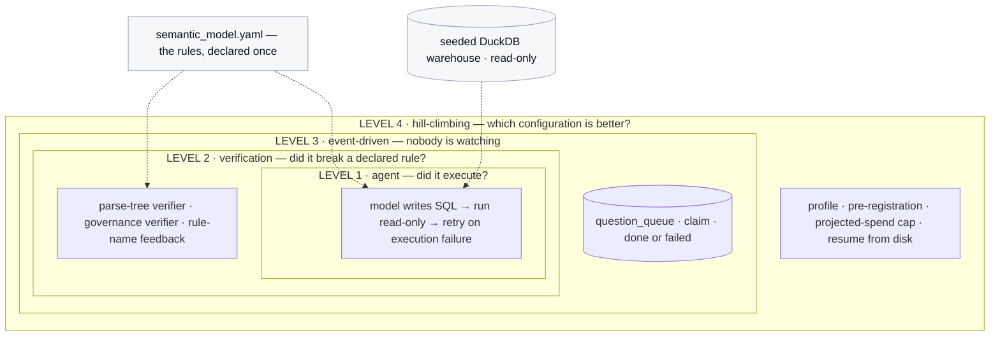
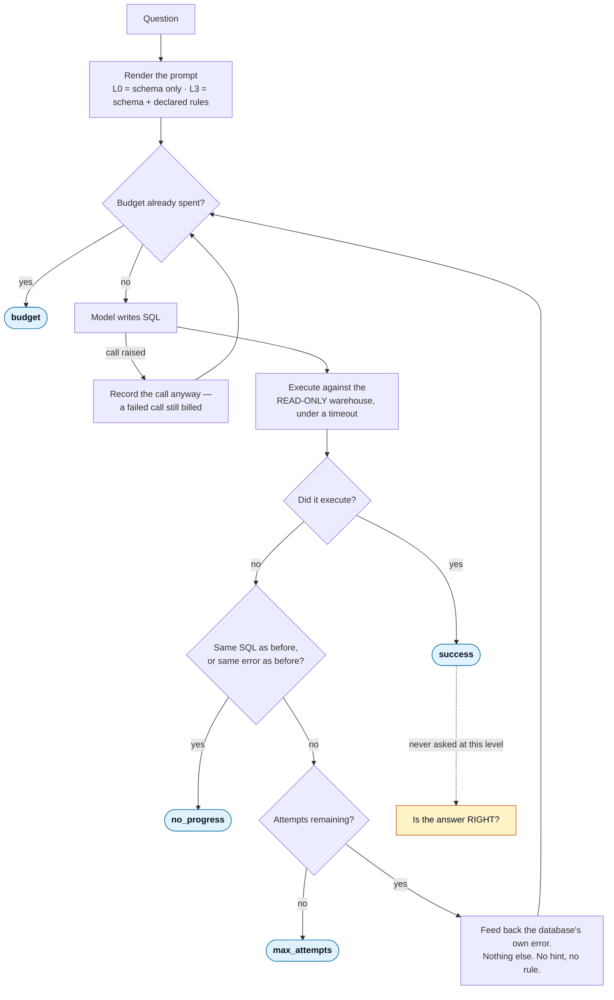
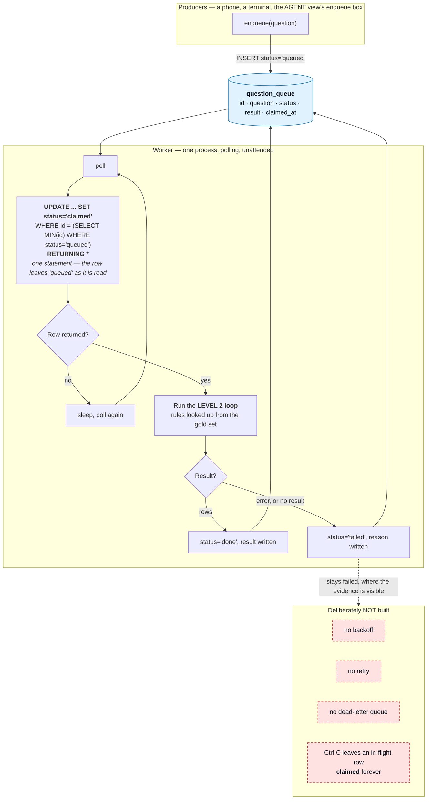
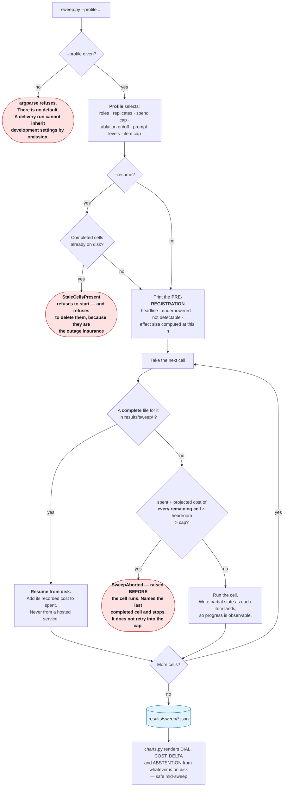

# Loop Engineering

A workshop application about the gap between a rule you declared and a rule something
actually enforces.

It runs a text-to-SQL agent against a seeded warehouse whose business rules live in one
config file, and builds four nested loops around that agent: retrying on failure,
verifying what the retry cannot see, running with nobody watching, and measuring which
configuration is better. Every figure it renders carries the time it was computed and
the number of observations behind it, because a number on a projector with neither is
indistinguishable from a number somebody typed.

**The application is the argument.** There is no slide claiming that measurement matters
without something on screen doing the measuring.



**How to read this.** The boxes are **nested, not sequential** — that is the single most
important thing about the picture. Level 1 sits *inside* Level 2, which sits inside
Level 3, which sits inside Level 4. Each level does not replace the one below it; it
wraps it and adds a question the inner loop cannot ask.

Read from the inside out:

- **Level 1** asks *did it execute?* A model writes SQL, the query runs read-only against
  the warehouse, and a failure triggers a retry. This loop only ever learns that
  something **crashed**.
- **Level 2** asks *did it break a declared rule?* It takes a query that **ran** — no
  crash, a clean plausible number — and checks it against the rules, handing back the
  name of the rule that was broken. This is the level that can see a wrong answer, which
  is why the whole project exists at this layer.
- **Level 3** asks *what happens when nobody is watching?* The question arrives on a
  queue and a worker claims it, runs Level 2, and writes the answer back with no human in
  the loop. Nothing new is verified here; what changes is that no one is looking.
- **Level 4** asks *which configuration is better?* It runs the whole thing repeatedly
  across models and prompt completeness, under a pre-registered hypothesis and a
  projected-spend cap, and measures the difference.

**The two grey boxes are not loops — they are the ground truth everything else stands
on.** `semantic_model.yaml` is the one file where the business rules are declared, and
the dotted arrows show it feeding **both** the prompt the model sees *and* the verifier
that judges it. That is deliberate: a rule cannot exist in one and not the other. The
seeded DuckDB warehouse is read-only to the agent and rebuilt deterministically from a
seed, so the answer key is reproducible rather than remembered.

**If you take one thing from the diagram:** the arrows from `semantic_model.yaml` are
what make a rule *enforced* rather than merely *declared*. Everything this project has to
say is about how easily that second arrow goes missing without anything failing.

---

## 1. Contents

| Section | What it covers |
|---|---|
| [2 · The session](#2--the-session) | duration, audience, format |
| [3 · The problem](#3--the-problem) | a clean, plausible, wrong number |
| [4 · Why this is needed](#4--why-this-is-needed) | declared versus enforced |
| [5 · What loop engineering is](#5--what-loop-engineering-is) | the four-loop framing and where it comes from |
| [6 · Architecture](#6--architecture) | the nesting, and each loop's control flow |
| [7 · Technologies](#7--technologies) | what each dependency does here |
| [8 · Repository structure](#8--repository-structure) | every module and what it owns, annotated |
| [9 · Installation](#9--installation) | prerequisites with the command to check each one, and uv per platform |
| [10 · Environment setup](#10--environment-setup) | every variable, and why tracing defaults off |
| [11 · Running each demo](#11--running-each-demo) | **step by step — start here** |
| [12 · Expected outputs](#12--expected-outputs) | the result images |
| [13 · Profiles and cost](#13--profiles-and-cost) | delivery, development, exhibit — and why prompt caching saves nothing |
| [14 · Testing](#14--testing) | the offline/live split, and the numeric-literal rule |
| [15 · Design decisions](#15--design-decisions) | each with what was given up |
| [16 · Limitations](#16--limitations) | templated questions, a single-writer queue, and measurements that predate a verifier fix |
| [17 · Future improvements](#17--future-improvements) | queue backoff and dead-lettering, and a second provider for judging |
| [18 · Troubleshooting](#18--troubleshooting) | real failures with the symptom each one presents as |
| [19 · FAQ](#19--faq) | why not LangChain, why no LLM judge, why the frontier model is unpinned |
| [20 · Attribution and licence](#20--attribution-and-licence) | what is borrowed, what is original, MIT |
| [Glossary](#glossary) | every domain term and acronym, defined — reference, at the end |

---

## 2 · The session

**Duration:** three to three and a half hours.

**Audience:** engineers and data people who are already building with agents, or about
to. No prior agent framework experience is assumed; SQL is assumed.

**Format: opt-in floater.** People arrive mid-session and leave mid-session, and the
stage that runs is whichever one the room has arrived for. That is a constraint on the
code, not just on the schedule:

> **Every stage cold-starts.** No demo may depend on another having run. Every entry
> point generates or loads what it needs — the warehouse is created on first use, the
> gold set is rebuilt from its patterns, the queue table is created on connect. A test
> runs each entry point from an empty working directory, so *"it worked when I ran them
> in order"* cannot pass for working.

The stages map one-to-one onto the loop levels, and each stage's runbook lives beside
its code in [`demos/`](demos/). There is deliberately no separate runbook document: one
kept apart from its code drifts, and a runbook that lies at minute forty of a live
session is the thing this cannot afford.

---

## 3 · The problem

An agent writes a SQL query. The query parses. It runs. It returns a single, clean,
plausible number, formatted exactly like the right answer.

And it is wrong.

It is wrong because it counted orders that were soft-deleted, or summed euros and yen as
though they were the same unit, or double-counted revenue by aggregating order totals
after joining the line items. Every one of those produces a number that looks like every
other number.

**You cannot tell by looking.** That is the whole difficulty:

| | you can detect it without the answer | example |
|---|---|---|
| **visible failure** | **yes** | invalid SQL, a timeout, an empty result, three columns where one was asked for |
| **silent error** | **no** | it ran, returned one plausible number, and is wrong |

A retry loop catches the first column. Nothing about a retry loop touches the second,
because a retry loop only ever learns that something *crashed* — and a wrong answer does
not crash.

The uncomfortable part is that every mitigation people reach for first has the same
shape. A more capable model produces a more plausible wrong number. A larger context
window produces a more plausible wrong number. An LLM judge from the same model family
agrees with the wrong number.

---

## 4 · Why this is needed

Ask where the business rules live and you will be shown a config file, a semantic layer,
a dbt model, a wiki page. The rules are written down. Everyone can point at them.

Then ask: **what enforces them?**

Often the honest answer is *the prompt* — the rules are pasted into a system message and
the model is trusted to apply them. That is not enforcement. It is a request.

Sometimes the answer is *a check* — and the check is a regular expression looking for the
right words in the query text, which passes a query that mentions `deleted_at IS NULL`
inside a comment, inside a subquery that never filters, or negated.

Sometimes the rule is enforced only as a side effect of another rule's check, which is
indistinguishable — from the config's point of view — from not being enforced at all.

**A rule written in a config that nothing checks is not a rule.** It is a comment with
ambitions.

This project makes that gap concrete and then closes it, in one narrow place, with
machinery you can read in an afternoon:

- the rules are declared **once**, in `semantic_model.yaml`, and rendered into prompts
  from that one place, so a rule cannot exist in the prompt and not in the model
- a governance verifier reads its rule set **from the config** and **fails the build**
  when a declared rule has no check
- each rule has **two probes** — a query that breaks it and must be rejected, and one
  that is correct but unusual and must be accepted — because a verifier that rejects
  everything scores perfectly without the second
- and the project points the same lens at itself: three things in this build were
  declared and never enforced, and all three passed code review

---

## 5 · What loop engineering is

The framing is not ours. LangChain's [**The Art of Loop
Engineering**](https://www.langchain.com/blog/the-art-of-loop-engineering) describes four
loops that stack on one another — the agent loop, a verification loop, an event-driven
loop, and a hill-climbing loop — and credits swyx's [**Loopcraft: the art of stacking
loops**](https://www.latent.space/p/loopcraft) for the idea
that loops can be stacked and extended to build more effective agents.

We take the taxonomy and disagree with nothing in it. What this repository adds is the
part a blog post cannot: **a running system where each level's claim is checked**, and
where the levels are built so you can see exactly what each one buys and exactly what it
still cannot see.

> All diagrams here are drawn from our own control flow. No images are reproduced from
> either source.

The shift the term names is this. **Prompt engineering** asks what to put in the context
window. **Loop engineering** asks what happens after the model answers: what checks it,
what feeds back, what stops, and how you know any of it is working. The interesting part
of a loop is never the repetition — it is always the termination condition, and whether
anything counts how often each one fires.

---

## 6 · Architecture

The loops **wrap one another rather than sitting side by side**. Level 2 calls Level 1's
generator and adds a verifier around it. Level 3 runs the Level 2 loop against a claimed
queue row. Level 4 sweeps Levels 1 and 2 across models and prompt completeness.

That nesting is the architectural claim, and it is why **the implementation lives in
`src/loopeng/` while `demos/` holds thin entry points**. Four folders each owning a copy
of the loop would be four places for it to drift, and every number the room sees has to
come out of one system or the comparisons between levels mean nothing. A test caps demo
files at a hundred lines and fails the build when logic leaks.

The system-overview diagram is at the top of this file. Each level's control flow
follows.

> Each diagram below is the same source as the one in that stage's runbook, and a test
> asserts they are byte-identical. A diagram duplicated by hand is a diagram that drifts.

### Level 1 — the agent loop

A model writes SQL, the query runs against a read-only connection, and a failure comes
back as the database's own error. It retries on execution failure and nothing else.

**It catches syntactic failure. It cannot catch a query that parses, runs, returns a
clean number and is wrong.** Six termination conditions are recorded by name so their
distribution across a run can be reported — a policy branch nobody counts is a branch
nobody knows fires.



Runbook: [`demos/01_agent_loop/README.md`](demos/01_agent_loop/README.md)

### Level 2 — the verification loop

Rule checks read the query's **parse tree** and reject one that ran but broke a declared
business rule, handing back **the rule name rather than the answer**.

The verifier never receives the gold answer, and that is structural: the context type has
no field for it and the function that builds one takes no such argument. A second,
deliberately weaker verifier checks the same rules with regular expressions, to
demonstrate what happens when an instrument gets weaker and every dashboard number
improves.


Runbook: [`demos/02_verification_loop/README.md`](demos/02_verification_loop/README.md)

### Level 3 — the event-driven loop

A queue table, and a worker that claims a row and runs the Level 2 loop against it with
no human in the path.

Deliberately minimal: **no backoff, no dead-letter queue, no retries.** A failed row
stays failed where the evidence is visible. Those omissions are the list of things you
would have to build before this went near production, and naming them is more useful
than half-implementing them.



Runbook: [`demos/03_event_driven_loop/README.md`](demos/03_event_driven_loop/README.md)

### Level 4 — the hill-climbing loop

A sweep across model and prompt completeness, with its hypothesis printed before the
first cell runs. It resumes from local results rather than from any hosted service,
aborts on **projected** rather than actual spend, and renders cells that are still
running as in progress with their current interval — never as blank or zero.



Runbook: [`demos/04_hill_climbing_loop/README.md`](demos/04_hill_climbing_loop/README.md)

---

## 7 · Technologies

| technology | what it does **here** |
|---|---|
| **Python 3.12** | Pinned by `.python-version` and `requires-python`. `StrEnum`, `Self` and PEP 604 unions are used throughout. |
| **uv** | Dependency resolution, the lock file, and the virtualenv. Every command in this README runs through `uv run`, which resolves to the project's own interpreter rather than whatever is first on `PATH`. |
| **DuckDB** | The seeded warehouse, and separately the question queue. Opened **read-only** for the agent, enforced by the database rather than by convention. Chosen over a hosted database so the workshop has no network dependency it does not need. |
| **Gradio** | The five views. Chosen because a view is a function plus a layout, and the alternative was a frontend build step at a venue. |
| **sqlglot** | Parses model-written SQL into an AST so rule checks can ask whether a column is actually constrained, rather than whether the query text mentions it. Also detects whether the outer query carries an `ORDER BY`, which decides whether result comparison is order-sensitive. |
| **matplotlib** | **A runtime dependency.** Draws the live charts in Stage 4 (`src/loopeng/sweep/charts.py`). Every figure it produces is computed by the run that renders it; there is no stored set and no separate README renderer. |
| **LangSmith** | Traces and the gold dataset upload. **Advisory only** — `results/*.json` is the system of record, and a test runs a cell with the client stubbed to raise and asserts the results file is still complete and correct. |
| **pydantic-settings** | Loads settings once, frozen, with `SecretStr` so a key cannot be printed by accident. A missing credential raises an error naming the exact variable and the exact fix. |
| **structlog** | Console-rendered logs, not JSON: these are read live, on a projector, by a room of people, not shipped to an aggregator. |
| **ruff** | Lint and import sorting, run in CI on every push. |
| **pytest** | The offline suite, plus a `live` marker that is deselected by default so the default run needs no key and no network. |
| **OpenAI API** | The provider for both **scoring** roles: `agent` (`gpt-5.6-luna`, the budget model everything the agent does runs on) and `reference` (`gpt-6-astra`, the frontier bar, called once per item and never inside a loop). |
| **Anthropic API** | The provider for the `judge` role (`claude-haiku-4-5`) only — triage and failure sorting. **It gates nothing**, by design: no LLM judge is a blocking check anywhere in this repo, so a checkout with no Anthropic key runs every scoring path and every number in the session. |
| **`providers.py`** | One `complete()` across two vendor SDKs, because the roles no longer share a provider. It also absorbs the two vendors' **opposite cached-token conventions** — Anthropic's `input_tokens` excludes cached tokens, OpenAI's `prompt_tokens` includes them as a subset — and raises rather than guessing if a response ever reports more cached tokens than prompt tokens. |

---

## 8 · Repository structure

```
src/loopeng/
  settings.py        frozen settings, fail fast, secrets never rendered
  registry.py        role to model, with the request kwargs each model accepts
  metric.py          Metric and MetricStore; no value without its n
  pricing.py         the price table, dated, per model, per token class
  usage.py           token accounting for every call including the failed ones
  paired.py          McNemar for paired comparisons
  prompts.py         the L0 and L3 prompts, rules rendered from config
  contracts.py       the verifier's view of an attempt — no field for the answer
  api_probes.py      LIVE probes of the API: rate-limit ceilings and
                     prompt cacheability. Renamed from probes.py, which
                     collided by name with verify/probes.py — a different
                     thing entirely (offline rule-surface probes)
  gate0.py           assembles the foundation evidence report
  langsmith_ds.py    gold to LangSmith dataset, advisory and failure-tolerant
  env_guard.py       refuses to run from a cloud-synced path that breaks imports
  warehouse/         seeded generator, semantic model, read-only connection factory
  gold/              patterns, build, comparison
  agent/             level 1 loop, classification, the trap
  verify/            level 2 loop, verifiers, governance, the OFFLINE
                     rule-surface probes, the swap
  queue/             level 3 queue and worker
  sweep/             level 4 runner, profiles, deadline, charts, provenance
  triage/            abstention, escalation, failure triage
  views/             the Gradio views
demos/               thin entry points and the runbooks, one folder per loop level
notebooks/           three notebooks, thin by the same rule; the filename says whether
                     each one spends. Needs `uv sync --extra notebooks`
tools/               the numeric-literal rule (`tools/lint_no_numbers.py`) and the
                     LangSmith resume probe (`tools/resumability_probe.py`)
results/             live cell output; see below
tests/               the offline suite, plus tests/live/ behind the live marker
```

**What is committed under `results/`: almost nothing, and that is the design.**

| path | committed | why |
|---|---|---|
| `results/noise_floor_seeded.json` | **yes** | the measured run-to-run floor the pre-registration cites BY NAME before the first cell runs. A citation printed as provenance has to resolve. |
| `results/sweep/`, `results/ablation/`, `results/charts/` | **no** | live cell output. A committed cell would arrive on every clone and make the *first* live sweep on a fresh machine resume-and-complete instantly, rendering finished numbers to a room told nothing was precomputed. |

**A fresh clone renders *not yet measured*, and nothing can override that any more.**

This used to be defended by five mechanisms at once: a hatched fill, a REFERENCE badge
on the row, a date beside every stored value, a four-way `--reference` mode flag with a
carefully chosen default, and a test running the chart entry point against an empty
directory. All five guarded the same thing — the possibility of drawing a stored cell —
and the guarding was the tell. **Removing the capability is stronger than defending it.**
There is no stored cell format, no loader, and no flag; a render path that cannot express
"stored" cannot show one.

**`reference/` is not in the tree.** This section used to describe it as holding one full
session run, committed so a cloner knows what to expect. The directory does not exist: it
was removed along with the stored-cell path, and it is to be rebuilt from a dress
rehearsal under the current model policy rather than inherited from a build with different
models, a different gold set and a different price table. Until it lands there is nothing
to point a cloner at except a `smoke` run on their own key, which §11.0 covers and which
is better evidence anyway — it is theirs.

---

## 9 · Installation

**Prerequisites.** Two, and nothing else — no Docker, no database server, no cloud
account, no API key to get a green test suite.

| Need | Version | Check you have it | Expected |
|---|---|---|---|
| [uv](https://docs.astral.sh/uv/) | any recent; `0.11.20` is what this was built and locked with | `uv --version` | `uv 0.11.20` or later |
| Python | **3.12** (`requires-python = ">=3.12"`, pinned by `.python-version`) | `uv run python -V` | `Python 3.12.x` |
| git | any | `git --version` | any |

You do **not** need to install Python yourself. `uv sync` reads `.python-version` and
fetches 3.12 if your machine does not have it, which is why the table checks Python
*through* uv rather than directly — a system `python3` of a different version is
irrelevant here and checking it only causes confusion.

### Install uv, per platform

**macOS and Linux**

```bash
curl -LsSf https://astral.sh/uv/install.sh | sh
```

**macOS, with Homebrew instead**

```bash
brew install uv
```

**Windows, in PowerShell**

```powershell
powershell -ExecutionPolicy ByPass -c "irm https://astral.sh/uv/install.ps1 | iex"
```

If `uv --version` is not found afterwards, close and reopen the terminal so the updated
`PATH` is picked up.

### Clone, install, and prove it worked

```bash
git clone https://github.com/ANI-IN/loop-engineering.git
cd loop-engineering
uv sync
uv run pytest -q
```

**Expected output** from the last command:

```
949 passed, 6 deselected
```

The `passed` count moves as tests are added and the number above is illustrative —
what matters is `passed` with **no failures**, and `deselected` rather than `skipped`
for the live tests. The `6 deselected` is pinned by a test, because that number is a
claim: it says the live suite is exactly the six tests that cost money.

- **`6 deselected` is correct, not a problem.** `pyproject.toml` sets
  `addopts = "-m 'not live'"`, which excludes the six tests that hit the network and
  cost money. Opting in is an explicit act: `uv run pytest -m live`.
- **On Linux you may also see skips.** The platform-conditional tests need a BSD-only
  file-flag function; see `tests/test_env_guard.py`. The image byte-identity test that
  used to be the other one is gone, along with the committed images it checked.

If that passes, your checkout is sound and you have spent nothing.

**Platform verification status, stated honestly:** every command in this section has
been executed on **macOS (Darwin, arm64)**. The Linux notes come from CI, which runs the
full offline suite on `ubuntu-latest` on every push. **The Windows instructions have not
been executed** — they are reproduced from the uv documentation and reviewed against the
code, and `demos/04_hill_climbing_loop/sweep.py --detach` is known not to detach on
Windows (`subprocess`'s `start_new_session` is a no-op there). Treat Windows as
unverified. See §16.

The test suite is **offline by default**. It needs no API key, makes no network call, and
costs nothing, so a green suite on a fresh clone tells you the checkout is sound before
you have spent anything.

**Put the checkout somewhere your cloud storage does not sync.** iCloud Drive evicts
files it thinks are cold, and an evicted `.pth` file breaks the editable install in a way
that looks like a mysterious import error. A guard catches this at import and says what
happened, but moving the directory is the actual fix.

---

## 10 · Environment setup

Copy `.env.example` to `.env` and fill in the keys. The example file holds names only and
is committed; `.env` holds values and is ignored.

| variable | required by | notes |
|---|---|---|
| `OPENAI_API_KEY` | **everything that calls a model** — the agent loop, the verification loop, the Level 3 worker, the trap, the sweep, the conditions | **The one credential this repo cannot run live without.** Both scoring roles are OpenAI models. Not needed for the offline suite, the warehouse, the gold build or the rule-surface probes, all of which are free and make no network calls. |
| `ANTHROPIC_API_KEY` | the `judge` role — triage and failure sorting only | **Optional. It gates nothing, and that is structural rather than a convention:** no LLM judge is a blocking check anywhere in this repo. Every figure in the session is produced without it. This table used to name it as the required key, which was wrong in the way most likely to turn away a valid checkout — a cloner with a working `OPENAI_API_KEY` and no Anthropic account can run the entire thing. |
| `LANGSMITH_API_KEY` | the dataset upload and trace links | Everything works without it; traces degrade, measurements do not. |
| `LANGSMITH_PROJECT` | the project experiments are filed under | Defaults to the workshop project rather than the SDK's shared `default` bucket. |
| `LANGSMITH_TRACING` | — | Defaults to **false** and must stay false for the offline suite. See below. |
| `LOOPENG_LIVE` | a *hosted* instance that may call models | **INERT.** Read by `live_mode.read_config()`, which no entry point calls. Setting it changes nothing at runtime. See SECURITY.md. |
| `LOOPENG_LIVE_CEILING_USD` | a hosted live instance | **INERT.** Read by `live_mode.read_config()`, which no entry point calls. Setting it changes nothing at runtime. See SECURITY.md. |
| `LOOPENG_LIVE_MAX_CALLS` | a hosted live instance | **INERT.** Read by `live_mode.read_config()`, which no entry point calls. Setting it changes nothing at runtime. See SECURITY.md. |

Settings are loaded once, frozen, and fail fast. A missing key raises an error naming the
exact variable and the exact fix, rather than failing forty minutes into a session.

**Why tracing defaults off.** The LangSmith SDK enables itself from the environment, so a
machine with the tracing flag exported would have ordinary test runs attempting
background network sends — quietly breaking the zero-network property the offline suite
is built on. A test asserts tracing is off outside the live marker, and the suite forces
every known spelling of the variable to false.

---

## 11 · Running each demo

### 11.0 · Run it on your own key

Everything below §11.0 is written for the author delivering a workshop. This part is for
someone who just cloned.

```bash
cp .env.example .env          # add OPENAI_API_KEY only; Anthropic and LangSmith are optional
uv sync && uv run pytest -q   # offline, free, proves the checkout

uv run python demos/00_preflight/check.py                      # a fraction of a cent
uv run python demos/04_hill_climbing_loop/sweep.py --profile smoke --foreground
uv run python demos/04_hill_climbing_loop/charts.py
```

The preflight is the cheap one to run first. One call per scoring role, **with the request
kwargs the registry declares** — which is the point: the roles do not accept the same
request. Neither scoring model accepts a pinned `temperature` (both answer a non-default
sampling parameter with a `400`), so they pin `seed` instead and the agent additionally
sends `reasoning_effort` and `max_completion_tokens`; the judge is the only role that
pins `temperature=0`, and it uses `max_tokens`. A probe that simplified those kwargs into
one shape could pass on an account where the sweep fails. The preflight also builds the
warehouse and the gold set and runs the rule-surface probes, and those three are offline,
so a bad key still tells you the rest of the checkout is sound.

What each profile projects, from the repo's own `project_remaining`:

| profile | cells | items | projected |
|---|---|---|---|
| `smoke` | 2 | 8 | est. $0.01 |
| `delivery` | 4 | 50 | est. $0.09 |
| `development` | 12 | 50 | est. $9.38 |

`smoke` measures nothing worth quoting — eight items cannot separate anything, and it does
not pretend to. It proves the whole pipeline on your key: real calls, cells on disk, and
charts rendered from them.

The `development` figure is dominated by one role. The reference model is a frontier
model, and it is ~50x the agent's cost per item; the twelve cells are eight cheap ones
and four expensive ones. That ratio is not an accident to be optimised away — it is the
comparison the session exists to make.

**No chart in this repo can be produced without live model calls.** That is unconditional
now. It used to carry two exceptions — cells badged as stored measurements, and a frozen
exhibit view — and both are gone along with the code that could render them. If a figure
is on your screen, your key paid for it.

If your key is wrong you will find out in **one** call, not three. The loops stop on a
`401`, `403` or `400` rather than retrying, and the message names the variable and the fix.
Nothing anywhere will tell you the database said it.

---

**This is the section to actually use.** Each stage below is self-contained: it
cold-starts, it needs no earlier stage, and it says what to look at rather than only what
to type. Full detail — including what to say when the expected shape does not appear —
is in each stage's runbook.

Everything runs through `uv run`. Use `python -u` for anything that serves a browser:
without it Python block-buffers stdout when you redirect to a file and the URL never
appears even though the server is fine.

### Stage 0 — ground truth

```bash
# the rules, declared once
cat src/loopeng/warehouse/semantic_model.yaml

# the rule surface: two probes per rule, offline and free
uv run python -c "
from loopeng.verify.probes import run_probes
import json; print(json.dumps(run_probes(), indent=2))"
```

**On screen:** the seven rules as configuration, then — for six of them — whether the
verifier caught a violating query *and* accepted a correct-but-unusual one.

**Six, not seven, and the report says so.** `minor_units` and `multi_currency` are one
SQL change (the declared `usd_factor` against a naive `/100`) and share a single check,
so one probe pair covers both; a second pair would measure the same code twice and report
it as two. The exemption is named in `probes.py` as `UNPROBED_BY_DESIGN`, the report
carries `n_declared_rules` alongside `n_rules`, and a rule that arrives unprobed *and*
unlisted fails the suite. This is worth reading twice: the output used to say `6/6`, a
fraction whose denominator was itself the thing that had drifted.

**What to observe:** both columns. A verifier that rejects everything scores perfectly on
the first alone.

**The question to sit with:** *how would you know your own rule checks are not just
rejecting everything?*

### Stage 1 — the agent loop, and the trap

```bash
# one question, live, with the attempt timeline and cost ticking
uv run python demos/01_agent_loop/run.py \
  --question "What was gross revenue in March 2025 from our euro and yen orders, in US dollars?"

# the trap: every gold question at both spec levels, then the reveal
uv run python -u demos/01_agent_loop/trap.py
```

**On screen:** for `run.py`, one block per attempt — the SQL, and either the rows or the
database error. For `trap.py`, a grid filling in, with **every landed cell rendering
identically** until you press reveal.

**What to observe:** while the trap fills, the two columns look the same. That is
deliberate — a cell reading "failed" would hand the room a free answer key for that row.
After the reveal, the split into correct, **silently wrong**, and visible failure.

**The question to sit with:** *of the cells that are wrong, how many could you have
spotted without the answer key?*

→ [full runbook](demos/01_agent_loop/README.md)

### Stage 2 — verification

```bash
# one question through the verifiers, showing the attempt diffs
uv run python demos/02_verification_loop/run.py

# swap the parse-tree verifier for the regex one
uv run python demos/02_verification_loop/regex_swap.py

# the beat that matters most: a satisfied verifier and almost nothing right
uv run python demos/02_verification_loop/regex_swap.py --level L0

# the three ways a run ends without succeeding
uv run python demos/02_verification_loop/failure_paths.py
```

**On screen:** a query that **ran cleanly, returned rows, and was still sent back** with a
named rule. Then the swap's two arms side by side — acceptance rate, actual correctness,
rejections, cost, and probe surface.

**What to observe:** the acceptance rate rising while the probe surface degrades. Three of
those four numbers look like an improvement on a dashboard.

**The question to sit with:** *which of those numbers would have told you the instrument
got worse — and would it have been on your dashboard?*

→ [full runbook](demos/02_verification_loop/README.md)

### Stage 3 — event driven

**One terminal, two commands, in this order.**

```bash
# 1 — submit a question. Opens the queue, writes a row, exits.
uv run python demos/03_event_driven_loop/enqueue.py \
  --question "What share of beauty orders ended up with a refund?"

# 2 — the worker claims it, runs Level 2, writes the answer back, and stops
#     once the queue is empty
uv run python demos/03_event_driven_loop/worker.py --drain
```

> **Why not two terminals.** This runbook used to say "two terminals, make both
> visible before you start" — a worker polling in one while you submit from the
> other. It cannot work. **DuckDB takes an exclusive write lock per file**, and the
> worker holds its connection open for its whole life, sleeping between polls, so
> the second terminal fails at connect with `IOException: Could not set lock on
> file … Conflicting lock is held`. The demo is single-writer, and the commands
> above are the shape that is honest about it. See §16 for why that is a non-goal
> rather than a bug.

The room can also submit from the enqueue box in the AGENT view, which opens and
releases the queue per action rather than holding it — so it works whenever a
worker is *not* polling, and hits the same lock when one is.

**On screen:** command 1 prints the row id and the queue counts. Command 2, with
nobody typing into it, prints `claimed`, then the loop running, then `done` or
`failed`, then exits.

**What to observe:** nobody typed anything into terminal 1.

**The question to sit with:** *the verifiers just decided, alone, whether that answer was
good enough to write back. Would you have shipped what they accepted?*

→ [full runbook](demos/03_event_driven_loop/README.md)

### Stage 4 — hill climbing

```bash
# start the sweep — detaches and hands the terminal straight back.
# --deadline SECONDS stops it cleanly when the slot ends: cells are started only while
# there is time left, the one in flight stops BETWEEN items (never mid-item, so no item
# is scored having run under less than its condition), and the reduced n reaches every
# figure it produces. Without it the stage overruns into the next one.
uv run python demos/04_hill_climbing_loop/sweep.py --profile session

# render every chart from whatever exists so far; safe to run repeatedly mid-sweep
uv run python demos/04_hill_climbing_loop/charts.py
```

**On screen:** the pre-registration, printed **before the first cell** — the headline
comparison, what the design is underpowered for, what it already knows it cannot detect,
and the detectable effect size at this `n`, computed rather than asserted.

**What to observe:** run `charts.py` twice a minute apart. The intervals narrow as more
items land. That narrowing is the session's argument about measurement happening live
rather than being asserted.

**The question to sit with:** *the pre-registration named an effect size this design can
detect. Is the gap you are looking at bigger than that?*

→ [full runbook](demos/04_hill_climbing_loop/README.md)

### The views

```bash
uv run python -u demos/views.py --view {agent,trap,verify,dial,oversight}
```

Each launch prints a local URL, the LAN address a phone on the same wifi needs, and writes
a QR code — because nobody types a URL off a projector. Add `--share` for a public tunnel
when the venue wifi isolates clients. `--port` lets you run several at once, which is how
the workshop uses them: one tab per stage.

**The event-driven loop is deliberately not a view.** The point of that stage is that
nobody is watching, and a browser tab implies a person supervising it.

---

## 12 · Expected outputs

**There are no committed figures in this README, and that is the change.**

Every chart this repository can draw is drawn from cells computed by the run that is
drawing them. There is no stored set to fall back on, no hatched bar, and no
`--reference` flag — the whole apparatus is gone, along with the three PNGs that used
to sit in this section and the tool that rendered them.

The reason is not tidiness. A stored figure that could pass for a fresh one breaks the
session's central claim quietly, and the previous design defended against that with
badges, hatching, dates on rows, a four-way mode flag and a test asserting a fresh
clone renders nothing — five mechanisms guarding a capability that did not need to
exist. Removing the capability is stronger than guarding it: a render path that cannot
express "stored" cannot show one.

**`reference/` is not in the tree yet, and this section used to say it was.** The plan is
one full session run — the JSONL, the rendered PNGs and a summary table — committed where
**nothing under `src/loopeng/` may import it**, so a cloner knows what to expect before
spending anything and no render path can reach it. It has to be rebuilt from a dress
rehearsal under the current model policy rather than carried over: the models, the gold
set and the price table have all changed, and a stored run from the previous build would
be a reference to a system that no longer exists — which is the failure this whole section
is about, arriving through the door marked "documentation".

Until then, the cheapest honest answer to "what should I expect?" is
[§11.0](#110--run-it-on-your-own-key): a `smoke` run on your own key for a few cents. It
is better evidence than a committed one anyway, because it is yours.

See [§13](#13--profiles-and-cost) for what a run costs.

---

## 13 · Profiles and cost

`--profile` is **required** on the sweep and has no default, so a delivery run cannot
inherit development settings from a flag nobody typed.

| profile | what it runs | when |
|---|---|---|
| **delivery** | One model across four cells, with a small allowance for live escalation. Cost is a hard constraint rather than a target. | In front of a room, every time. |
| **development** | Both models with replicates and the ablation. | Once, to establish the findings. Not repeated per delivery. |
| **exhibit** | Nothing. No roles, no cells, a zero cap. | The public Space, where any attempt to run a cell must refuse immediately. |

Both spending profiles print their **projected** cost before the first cell and refuse to
start if the projection would breach the cap — a cap checked against money already spent
only discovers the breach afterwards. The delivery figure appears on screen in the
application, stamped with the time it was computed.

**Prompt caching fires in no cell of any profile here, and that is measured rather than
assumed.** On the current provider caching is automatic — there is no `cache_control`
marker to set — but it applies only above a minimum cacheable prefix length, and every
prefix in this project is shorter than that minimum at every role and level. So the
schema-and-rules block is re-sent at full input price on every call, and the COST chart
says so in those words rather than reporting a nil hit rate: **there was no cache to hit,
and a zero would read as a measurement of one.**

Prompt caching was on the build plan as a cost lever and was **dropped after the
measurement**, rather than tuned until it fired. Padding the prefix with few-shot
examples to clear the threshold would have bought a discount by making every call larger
— optimising the metric instead of the bill — so the honest outcome is that this lever
does not apply at this prompt size.

What survives is the teaching beat, and it is a better one. The apparatus was all present
long before the optimisation was: `pricing.py` has priced cache reads and writes since
Phase 0, `usage.py` has carried all four token classes on every call, and a probe reported
which prefixes could cache. The instrument existed, the number was known, and nothing
acted on it. See `src/loopeng/caching.py`, which is now purely reporting.

*This paragraph previously quoted per-model minimums and prefix lengths, cited
`results/gate0.json`, and concluded that one combination did clear the threshold. All of
it described the previous provider, and the file it cited had already been deleted — a
citation printed as provenance that resolves to nothing, which is the exact failure the
pre-registration's own noise-floor citation was fixed for.*

**Every dollar figure in this project is an estimate and the label never comes off.**
Tokens are measured — they come off the response, all four classes separately, including
calls that errored or timed out. Dollars are those tokens multiplied by a price table
typed in by hand on a particular day. Only a billing export would make cost a
measurement, and this project does not read one.

---

## 14 · Testing

```bash
uv run pytest -q                              # offline: no network, no keys, no cost
uv run pytest -m live -q                      # live: real API calls, real money
uv run ruff check .
uv run python tools/lint_no_numbers.py
```

Live tests carry a marker and are deselected by default. The split is not a convention:
the offline suite is what runs in CI on every push, and it cannot be broken by a missing
secret because it never needed one. CI additionally asserts the live tests were
*deselected* rather than silently skipped.

**The numeric-literal rule** bans typed numbers in the eleven modules that render to a
projector, because a typed number is indistinguishable from a measured one once it is on
screen. Genuine layout geometry — figure coordinates, string truncation widths, a slider
step — is exempt via a trailing `# layout` marker on the line. There is a second, much
narrower exemption for measurement-shaped text that describes the *method* rather than a
result, held as an enumerated list of exact phrases. The rule prints **both** counts on
every run, so neither hatch can widen quietly, and a test fails the build on an allowlist
entry that exempts nothing.

That rule was itself broken **three times**, and all three failures are now
regression-tested.

It pointed at a path that no longer existed, so it scanned nothing and passed. And the
test written to prevent that planted its violation by *writing* the file, which created
the missing target — proving the walker worked while never checking the target was real.
A declared target that does not resolve is now a build failure.

**The third is the sharpest, because the rule was green while enforcing the opposite of
its own justification.** It inspected numeric literals only. A number inside a *string*
is a string constant, so it was skipped — and a string is the only form that reaches a
projector at all. A bare `PASS_RATE = 78` never reaches anyone; a rendered label does.
The single most quoted screen in the session carried two hardcoded statistical
conclusions with typed p-values, in a file the rule had always scanned, and the build was
green. The rule now inspects string constants and f-string literal parts for
measurement-shaped text, and the readings on that screen are derived from the cells on
disk. Deriving them changed what they say: the comparison is cross-model, and the
comparability guardrail that had lived only in prose now refuses to put a significance
claim across it.

Docstrings and comments are deliberately out of scope. Nothing here renders one — checked
rather than assumed — and they are where measured numbers get their provenance recorded.
Banning them would strip the rationale that makes this code reviewable in exchange for
catching nothing anyone can see.

**A citation printed as provenance must resolve.** The pre-registration named a
determinism-floor file that `.gitignore` dropped, so on every clone it cited a path that
did not exist. The file is committed, the figure is read out of it rather than restated
beside it, and a test asserts every repo path named in `sweep/orchestrator.py` and
`sweep/reference.py` exists on disk.

---

## 15 · Design decisions

Each of these was a real fork in the road. What was given up is stated, because a
decision recorded without its cost is advocacy.

**DuckDB over a hosted Postgres.**
*Reasoning:* the deployment target is a laptop on venue wifi. A hosted database is a
network dependency at the exact moment a network is least reliable, and it buys nothing
when the data is generated from a seed. Everything goes through one connection factory,
so swapping the backend is a change to one file.
*Given up:* no concurrent multi-machine access, and nothing here proves the design works
against a real warehouse's scale or messiness.

**No LangChain.**
*Reasoning:* the loops here are small enough that the framework would be more code than
the thing it wraps. Two of its equivalent primitives also contradict choices made
deliberately — a rubric middleware that scores with an LLM judge, which this refuses as a
blocking check, and a hill-climbing loop in which an agent rewrites the harness
configuration, where here a human moves one dial and re-measures.
*Given up:* none of the ecosystem's tracing, retries or tool abstractions come for free,
and every one of them is hand-rolled here.

**No LLM judge as a blocking check.**
*Reasoning:* everything runs against one provider, so a judge would come from the same
family as the thing being judged, which is not an independent check. Judges are useful
for triage and for sorting failures. They do not get to block.
*Given up:* the only rules that can be enforced are ones expressible as structure over a
parse tree. A structural verifier can confirm a query *converts currency* and cannot
confirm the *rates are right* — and that ceiling is demonstrated rather than hidden.

**Thin demo entry points.**
*Reasoning:* the loops are nested, not parallel, so a copy of a loop in a demo file is a
second place for it to drift, and every number the room sees has to come out of one
system. A test caps demo files at a hundred lines.
*Given up:* no demo file is readable standalone; understanding one means following it
into `src/loopeng/`.

**Frontier thinking left on.**
*Reasoning:* omitting the `thinking` key runs adaptive thinking, which is how the frontier
model would actually be deployed, and it is what makes the cost gap between the arms real.
*Given up:* `max_tokens` caps thinking *plus* the SQL together, so budgets are sized with
headroom rather than to the query; and the frontier model rejects a pinned temperature,
so its error bars carry run-to-run variance the cheap model's do not.

**LangSmith advisory, never the system of record.**
*Reasoning:* a probe measured that a killed experiment re-runs everything on restart
rather than skipping completed work. Resuming from a hosted service was therefore not
available, and depending on one for anything load-bearing would put the session at the
mercy of venue wifi.
*Given up:* no hosted experiment comparison, and trace links degrade to nothing when the
network does.

**`results/` as the system of record.**
*Reasoning:* every reported number must be re-derivable without another model call, so
each cell file holds its SQL, its rows, its judgement and its usage. That is also what
makes the sweep resumable and what makes splicing a corrected subset possible.
*Given up:* the results directory is large and awkward, and the committed-versus-ignored
split needs a paragraph of explanation — which it has, in `.gitignore`.

**A freshness guard that is ON BY DEFAULT and refuses rather than deletes.**
*Reasoning:* cell files must be *present* as outage insurance and *absent* when the live
sweep starts. Silently deleting the insurance to satisfy a flag trades one failure for a
worse one, and only the operator knows whether those files are still needed.
*Given up:* one manual step on the day, which the checklist carries.

---

## 16 · Limitations

Stated here rather than left in prose, because a limitation that only appears next to the
number it qualifies is one that gets separated from it.

**The questions are templated.** A small set of patterns, parameterised. That caps how far
any of this generalises to freely-phrased questions.

**Every committed measurement predates a verifier fix, and has NOT been re-run.**
The AST verifier's rule checks asked only whether a column *appeared* in a `WHERE`
or `JOIN` — no polarity, no table. So `deleted_at IS NOT NULL` satisfied a rule
demanding `IS NULL`, a predicate on `orders` alone satisfied a rule whose complaint
says "for customers and orders independently", `status = 'cancelled'` satisfied the
rule excluding cancelled orders, and a bare `WHERE c.is_internal` satisfied the rule
excluding internal accounts. That is fixed, and the four bypasses are pinned as
tests.

**Every measurement taken against those old checks has been deleted rather than
annotated.** `results/reference/`, `results/prefix_v1/`, the figure tables that used to
sit in §12 and the images in `assets/` are all gone. The earlier version of this paragraph
asked a reader to mentally discount them — "treat every silent-error rate here as measured
against a *weaker* verifier" — which is a caveat doing the job of a deletion, and this
project's whole argument is that a caveat nothing enforces is not a control. Numbers you
have to remember to distrust are numbers that will eventually be quoted without the
caveat. Nothing measured under the old verifier survives in this repository, so there is
nothing left to discount.

**The Level 3 queue is single-writer, and that is a non-goal rather than a bug.** DuckDB
locks the database file exclusively, so exactly one process can hold the queue at a time
and the stage runs as enqueue-then-drain rather than as a polling worker alongside a live
submitter. The `UPDATE … RETURNING` claim is still atomic, but atomicity across *workers*
is a guarantee about a situation that cannot arise here. Making it true means an engine
with real multi-writer support — SQLite in WAL mode, or Postgres — and the point of this
level is the handoff to something nobody is watching, not the storage engine underneath
it. Recorded because the runbook claimed the opposite for the whole life of the stage:
it said "two terminals", and a room following it would have hit
`IOException: Could not set lock on file`.

**The items are clustered, not independent.** Each pattern contributes several
parameterisations, so a systematic flaw in one pattern fails all of its items together.
**Every interval this project shows is therefore narrower than the evidence strictly
supports**, and every chart caption says so.

**The warehouse is synthetic.** Generated from a seed, deliberately rule-heavy so each
rule has rows on both sides of it. Real data is messier in ways not simulated here.

**One provider.** Both roles are Anthropic models. That is why no LLM judge blocks
anything, and it means nothing here is evidence about cross-provider behaviour.

**One rule is exercised by a single pattern.** The sweep can make no claim about it: a
flat line there means *not measured here*, not *the verifier missed it*. Its enforcement
is covered by the rule-surface probes instead, which test the verifier directly rather
than inferring it from sweep outcomes.

**No arm can be pinned, so every interval carries run-to-run variance.** Both scoring
models are reasoning models and both reject a non-default `temperature` with a 400.
`seed` is pinned instead, which the vendor documents as best-effort rather than a
guarantee. The residual is measured rather than assumed away — see
`results/noise_floor_seeded.json` — and the measurement is small but its `n` is 8, so
what it supports is an upper bound rather than a point estimate.

This is a loss compared to the previous design, where the cheap model could be pinned.
It is also symmetric now, which the previous design was not: both arms sit in the same
sampling regime from the same vendor, so a cheap-versus-frontier comparison is no longer
confounded by one side being pinned and the other not.

**The subset analysis was chosen post-hoc.** Two patterns were found — by triaging
failures — to be under-specified about whether refunds are netted. The exclusion criterion
is visible in the question text without seeing any result, which is what makes it
defensible rather than fitted, but post-hoc is post-hoc and both figures are always shown.

**The hosted-live spend guard is not wired into any view.** `loopeng.views.live_mode`
implements and tests the three-condition opt-in and the per-process ceiling, but no view
constructs a `LiveBudget` — so today it is a declared control rather than an enforced one.
It is documented here rather than quietly left out, since that is precisely the defect
this project is about.

**This is not a benchmark, and it is not a service.** There is no Dockerfile, no compose
file, no health check and no cloud configuration, and that absence is deliberate rather
than unfinished. A container is one more thing to fail at a venue and it buys nothing when
the deployment target is the machine already on the table.

---

## 17 · Future improvements

Specific, and each one is a thing this build does not do rather than a direction to
gesture at.

**Queue backoff and dead-lettering.** Level 3 has neither, on purpose, and the omission is
part of the teaching. Making it production-shaped means: exponential backoff on model
errors so an outage does not spin the worker; a dead-letter table with the failure reason
and attempt count; a reaper for rows left `claimed` by an interrupted worker; and a
visible retry budget per row so *"nothing quietly tries again"* stays true even once retry
exists.

**A second provider for independent judging.** The reason no LLM judge blocks anything is
that a judge from the same family as the thing being judged is not an independent check.
A second provider makes a judge worth building — for triage and failure sorting first, and
only then as a candidate blocking check, with its own rule-surface probes.

**Independent gold items rather than templated ones.** The clustering caveat exists
because each pattern contributes several parameterisations. More patterns with fewer
parameterisations each would buy real independence, at the cost of writing and verifying
many more gold queries by hand. That is the honest fix for narrow intervals — not a
different statistic.

**More patterns for the single-cluster rule.** `refunds_net` is carried by one pattern, so
the sweep can say nothing about it. Two or three more patterns exercising refunds at
different grains would move it from *not measured* to measured.

**Wire the hosted-live guard into the views, or delete it.** It is currently declared and
not enforced. Either a view constructs the budget and checks it before each call, or the
module and its section of this README come out.

**A `Metric` for latency with a real interval.** `Metric.from_value` collapses the interval
onto the value, because computing one needs the spread of the samples and the constructor
is handed a single number. Recording the sample vector would let latency carry a genuine
interval instead of an honest refusal to invent one.

---

## 18 · Troubleshooting

**Imports fail with a missing module after a successful `uv sync`.** iCloud Drive has
probably evicted the editable-install path file. Move the checkout outside any synced
directory. A guard raises a clear error at import rather than letting this surface as a
confusing failure later.

**The wrong Python runs.** A conda base environment on `PATH` shadows the project
interpreter, and the symptom is installed packages being reported as absent. Run
everything through `uv run`, and confirm with `uv run python -V`.

**A share link never appears.** Almost always stdout buffering rather than a broken
tunnel. When launch output is redirected to a file, Python block-buffers it and the URL
never reaches the log even though the tunnel came up fine. Use `python -u`. If it
genuinely fails, check that the tunnel binary downloaded and is executable, and that macOS
has not quarantined it.

**A phone cannot reach the LAN URL.** Many conference access points enable client
isolation, which blocks device-to-device traffic. Use `--share`. If both fail, stage 3 has
a third path written down in its runbook, and it is not an apology.

**The sweep finishes instantly and the chart is already full.** Completed cell files are on
disk and the sweep resumed from them. That is correct behaviour, and exactly what you do
not want in front of a room told nothing was precomputed. The sweep refuses to
start rather than deleting anything, then clear the results directory yourself if you no
longer need those cells for outage cover.

**The sweep refuses to start.** That is the freshness guard finding completed cells. Do not reach for the
flag to get past it.

**A rate limit appears mid-sweep.** The recorded ceilings hold for one account on one tier.
Lower the per-model concurrency before the sweep rather than after it starts failing, and
say out loud that it will take longer.

**Charts say "not yet measured".** There are no sweep cells on disk. That is correct on a
fresh clone. Run the sweep first.

**Port already in use.** Another view is still running. `pkill -f "views.py --view"` or
pick a different `--port`.

**The build raises `UnenforcedRule`.** A rule was added to `semantic_model.yaml` without a
check in `RULE_CHECKS`. That is the governance gate doing its job, and it is the single
best live demonstration in the repository if you have the nerve.

---

## 19 · FAQ

**Why not LangChain — and why is `langchain-core` in `pyproject.toml`?** Both are true and
they are about different things, so it is worth being precise rather than leaving a reader
to find the dependency and conclude the answer above was marketing.

*Not used:* the loop primitives. The loops here are small enough that the framework would
be more code than the thing it wraps, and two of its equivalents contradict choices made
deliberately — a rubric middleware that scores with an LLM judge, which this project
refuses as a blocking check, and a hill-climbing loop in which an agent rewrites the
harness configuration, where here a human moves one dial and re-measures. See
[Design decisions](#15--design-decisions).

*Used:* a serialisation format, in exactly one place. LangSmith's `push_prompt` takes a
langchain-core prompt object, and the L0 and L3 prompts are pushed as two versioned
prompts so the trap renders in the experiment comparison view natively rather than only
as a local chart. Nothing in `agent/`, `verify/`, `sweep/` or `queue/` imports it, and two
tests enforce that rather than asserting it: one pins the single importing module, the
other walks every loop package.

**Why is there no LLM judge?** No judge blocks anything. The judge is Anthropic while both
scoring arms are OpenAI, which makes it an independent read rather than a model grading
its own family — that is the objection this project used to raise against itself when
everything ran on one provider. It triages and sorts failures by cause. It does not get to
decide whether a run passed.

**Why is the frontier model not temperature pinned?** It rejects non-default sampling
parameters. The cheaper model accepts them and is pinned. The consequence is that the two
models' error bars carry different things, and any cross-model comparison says so on the
chart itself rather than in a caption.

**Why is the silent-error rate computed only over answers that ran?** Folding visible
failures into the denominator would inflate the headline with failures the room can
already see, which is the opposite of what the metric is for. The two counts are reported
separately and never summed into one rate.

**Why McNemar rather than comparing two intervals?** Every arm answers the same questions,
so the data is paired, and asking whether two confidence intervals overlap throws the
pairing away — besides being a poor proxy for significance even on unpaired data. McNemar
uses only the discordant pairs. It still overstates here, because the items are clustered,
so the on-screen statement is directional and never a specific gap.


---

## 20 · Attribution and licence

**The four-loop framing** is LangChain's, from [*The Art of Loop
Engineering*](https://www.langchain.com/blog/the-art-of-loop-engineering), which credits
swyx's [*Loopcraft: the art of stacking
loops*](https://www.latent.space/p/loopcraft) for the idea that
loops stack and extend. This repository takes the taxonomy and builds a system where each
level's claim is checked.

**No images or other assets are reproduced from either source.** Every diagram here is a
Mermaid block describing this repository's own control flow, and every chart is generated
from this repository's own measurements.

**Everything else** — the warehouse, the semantic model, the gold set, the verifiers, the
sweep, the views and the tooling — is original to this project.

### Licence and community

| | |
|---|---|
| [`LICENSE`](LICENSE) | MIT. |
| [`CONTRIBUTING.md`](CONTRIBUTING.md) | How to set up, what CI enforces, and the rules that will fail your build — including how to add a business rule end to end. |
| [`CODE_OF_CONDUCT.md`](CODE_OF_CONDUCT.md) | Contributor Covenant v2.1. |
| [`SECURITY.md`](SECURITY.md) | How to report a vulnerability privately, and the two controls that actually matter here: the exhibit constructing no model client, and the Space sync refusing rather than filtering. |

### Contact

| Reason | Where |
|---|---|
| A bug, or something in the docs that is wrong | [Open an issue](https://github.com/ANI-IN/loop-engineering/issues) — there is a bug-report template |
| A security or credential concern | **Do not open a public issue.** Follow [`SECURITY.md`](SECURITY.md) |
| A change you want to make | Read [`CONTRIBUTING.md`](CONTRIBUTING.md) first; it lists the four checks CI runs and the rules that will fail your build |
| Anything else | ANI-IN (Animesh Kumar) — via the issue tracker above |

This is a single-maintainer workshop repository, not a supported product. Issues are
read; response time is whatever it is. The most useful bug report is one that names the
command you ran and pastes what it printed.

Before delivering, run the preflight on the venue machine. It prints a go/no-go:
credentials valid, the warehouse and gold set building, and the rule surface intact —
for a fraction of a cent.

```bash
uv run python demos/00_preflight/check.py
```

It replaced a hand-written checklist. A checklist is a list of things a person has to
remember to do, which is the shape of control this project spends twenty sections
arguing against — every item on it that mattered is now a check that runs and fails,
and every item that could not be made to run was not load-bearing.

---

## Glossary

Every domain term and acronym this repository uses, in one place. Terms are defined as
this project uses them, which is occasionally narrower than the general meaning.

### The two categories the whole project turns on

| Term | Meaning here |
|---|---|
| **Visible failure** | The answer is detectably wrong **without knowing the right answer**: invalid SQL, a timeout, an empty result, three columns where one was asked for, a row of NULLs. A retry loop can see these. |
| **Silent error** | It ran, returned one plausible number, and is wrong. **You cannot tell by looking.** Detecting it requires the answer, which in production you do not have. This is the category the workshop exists for. |
| **Declared vs enforced** | A rule written in a config that nothing checks. The project's subject, and the pattern behind most of its own defects. |

### The data and the rules

| Term | Meaning here |
|---|---|
| **Semantic model** | `src/loopeng/warehouse/semantic_model.yaml` — the one file where business rules, the schema vocabulary and the currency factors are declared. Rendered into prompts and read by the governance verifier, so a rule cannot exist in one and not the other. |
| **Gold set / gold item** | The answer key: **84 items built from 11 SQL patterns**, each executed against the seeded warehouse to freeze its correct answer. Split into **60 held out** (every reported figure) and **24 development** (used while building, never scored). Committed at `gold/gold.jsonl` and re-validated against a freshly seeded warehouse by `scripts/validate_gold.py`. A gold item carries the question, the rules that apply to it, the gold SQL and the gold rows. |
| **Pattern** | One of the **11** parameterised SQL templates in `gold/patterns.py`. Ten contribute 8 items each and one contributes 4, which is why items are *clustered* rather than independent — a flaw in one pattern fails eight items together. |
| **Warehouse** | A DuckDB database generated deterministically from a seed (`warehouse_seed`, default `20260729`). Read-only to the agent. Rebuilt on first use, never committed. |
| **Rule** | One declared business constraint. Seven of them: `soft_delete`, `cancelled_orders`, `internal_accounts`, `multi_currency`, `minor_units`, `fan_out`, `refunds_net`. |
| **Soft delete** | Rows with `deleted_at IS NOT NULL` are deleted and must be excluded — for customers and orders **independently**. |
| **Minor units** | Money is stored in the currency's smallest unit. USD and EUR have two decimal places; **JPY has zero**, so a flat divide by 100 is wrong. |
| **`usd_factor`** | The declared per-currency conversion table. Folds the decimal scale and the FX rate together. |
| **Fan-out** | `orders` → `order_items` is one-to-many, so aggregating `orders.amount_minor` after joining `order_items` double-counts. The trap that produces the most plausible wrong number. |
| **Refunds-net** | Revenue must be net of refunds. Carried by a single pattern, so the sweep can make no claim about it — only the probes can. |

### The loops

| Term | Meaning here |
|---|---|
| **Level 1 / agent loop** | Ask, run the SQL, retry when it **fails to execute**. Sees crashes only. |
| **Level 2 / verification loop** | Level 1 plus verifiers that read a query which **ran**, and reject it for breaking a declared rule. |
| **Level 3 / event-driven loop** | A queue and a worker: claim a question, run Level 2, write the answer back, with nobody watching. |
| **Level 4 / hill-climbing loop** | The loop around the loop — a sweep across configurations, measuring which is better. |
| **Attempt** | One pass through a loop: the SQL the model wrote, whether it executed, and what came back. |
| **Termination** | Why **one agent loop stopped on one item**: `success`, `max_attempts`, `budget`, `no_progress`, `declined`, `credential`, `bad_request`, `model_unavailable`. A test pins the set, so a new reason has to arrive with the test that fires it. There is deliberately **no `deadline`**: the deadline stops the runner *between* items, so an item that never started has no run and no reason — see `sweep/deadline.py`. |

### The verifiers

| Term | Meaning here |
|---|---|
| **AST verifier** | Checks rules against the parsed **syntax tree** (via `sqlglot`). The one held up as correct. |
| **Regex verifier** | The same checks done with regular expressions over the query **text**. Deliberately worse, and the point of the swap demo: the score goes **up** while the quality goes **down**. |
| **Governance verifier (V2)** | Reads its rule set **from the config** and fails the build when a declared rule has no check. The strongest enforcement mechanism here. |
| **Probe / rule surface** | A pair of queries per rule: one that **breaks** it and must be rejected, one that is **correct but unusual** and must be accepted. The second is what stops a verifier scoring perfectly by rejecting everything. |
| **The swap** | Replacing the AST verifier with the regex one mid-demo, to show a rising score and falling quality. |

### The measurement

| Term | Meaning here |
|---|---|
| **Cell** | One measured configuration: role × level × mode × replicate. Keyed `agent_L0_loop_r0`. Its label is **derived from the registry**, not typed, so a bar cannot be captioned with a model the run did not call. |
| **Sweep** | A run over all the cells a profile defines. Resumable, self-aborting on **projected** spend. |
| **Profile** | What a sweep run is *for*: `delivery` (runs in front of a room), `development` (run once to establish findings), `smoke` (a few cents, proves your key works), `exhibit` (runs nothing). The item cap is a property of the profile rather than a flag, because a ceiling that depends on someone typing `--limit` is not a ceiling. |
| **Role** | One of three, resolved through `registry.spec_for`: `agent` (the budget model everything the agent does runs on), `reference` (the frontier model, called once per item as the bar being cleared, never inside a loop), and `judge` (triage and failure sorting, **never a blocking check**). |
| **Level, as a prompt spec** | `L0` = rules withheld; `L3` = rules given. The difference between them is the experiment. |
| **Mode** | `one_shot` (no retry) or `loop` (the full loop). |
| **Replicate** | A repeat run of the same cell, to see run-to-run variance. |
| **Metric** | The only way a measured number enters this project. Carries its own `n` and interval, so no figure can appear without them. |
| **Deadline** | A wall-clock budget on a sweep, checked cooperatively **between items**. An item runs fully under its condition or not at all; a cell the clock stops is final at a smaller `n`, and that `n` reaches every figure it produces. Distinct from the spend cap: the cap *raises* because breaching a budget is a mistake, the deadline *returns* because running out of time is the expected end of a fixed slot. |
| **Abstention** | The loop declining to answer rather than guessing — coverage becomes a *choice* instead of a synonym for "did not crash". |
| **Escalation** | Handing a declined question to the more expensive model. **Implemented and not run in this build** — see §16. |
| **Triage** | Classifying failures by **cause** rather than counting them. |
| **Pre-registration** | The headline comparison, what the design is underpowered for, and what it cannot detect — printed **before the first cell runs**, so it cannot be chosen after the numbers are in. |
| **Noise floor** | The determinism baseline: how much a cell moves when nothing changed. Cited before any effect is claimed. |
| **Fingerprint** | What makes two cell files the same measurement run — recorded, not inferred. |

### Statistics

| Term | Meaning here |
|---|---|
| **McNemar's test** | The paired significance test used here. Correct for "same questions, two configurations". |
| **Discordant pairs** | Items where the two arms disagreed. The only ones McNemar uses — which is why `n` can be 60 and the test still be underpowered. |
| **Wilson interval** | The confidence interval used for a proportion. Behaves sensibly near 0% and 100%, where the textbook normal interval does not. |
| **Clustering** | Items come in 11 groups — ten of 8 and one of 4 — so a flaw in one pattern fails eight items together. **Every interval shown is narrower than the evidence strictly supports**, and every caption says so. |
| **p-value** | Reported only within a model. Refused across models — see §16. |

### Acronyms

| | |
|---|---|
| **AST** | Abstract Syntax Tree — the parsed structure of a query, as opposed to its text |
| **CTE** | Common Table Expression — a `WITH … AS (…)` clause |
| **FX** | Foreign exchange, i.e. currency conversion |
| **CI** | Continuous Integration — here, the GitHub Actions workflow |
| **SQL** | Structured Query Language |
| **LLM** | Large Language Model |
| **API** | Application Programming Interface — here, the OpenAI API for both scoring roles and the Anthropic API for the judge |
| **UUID** | Universally Unique Identifier |
| **WAL** | Write-Ahead Logging — a journal mode enabling multi-writer access, which DuckDB does not offer |
| **PEP** | Python Enhancement Proposal — e.g. PEP 561, which `py.typed` relates to |
| **DIAL / COST / DELTA / ABSTENTION** | Four of the **seven** rendered charts: silent-error rate per cell, spend per cell, the paired difference between cells, and the coverage-versus-precision curve |
| **TRAP MATRIX / OUTCOME SHIFT / COST PER CORRECT** | The other three, and the first of them is the session's headline: two models × two prompt levels, rules withheld against rules given |
