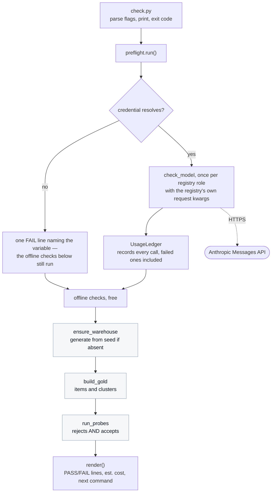

# Onboarding: preflight, the cheapest check that this checkout can spend

**Read [the onboarding hub](../../ONBOARDING.md) first.** It carries the product overview,
the shared glossary, the machine setup for macOS, Windows, and Linux, the configuration
reference, and how the tests work. This document assumes you have done that and covers
only preflight.

When you have read this and run the demo in section 10, you should be able to run
preflight on your own machine, explain what each of its five lines proves, read a failure
and know which file to open, and add a check without weakening the ones already there.

---

## 0. Scope of this document, and what I inspected

Preflight is numbered `00` because it runs **before** the loops, not because it is a loop
level. It is the smallest area in the repository and the only one whose entire purpose is
to run before you spend anything.

### What I read to write this

| Area | Files inspected |
|---|---|
| Entry point | `demos/00_preflight/check.py`, `demos/00_preflight/README.md` |
| The checks | `src/loopeng/preflight.py`, in full |
| What each check calls into | `src/loopeng/registry.py`, `src/loopeng/settings.py`, `src/loopeng/warehouse/connect.py`, `src/loopeng/gold/build.py`, `src/loopeng/verify/probes.py`, `src/loopeng/agent/loop.py :: triage_call_failure()` |
| Cost accounting | `src/loopeng/usage.py`, `src/loopeng/pricing.py` |
| Tests | `tests/test_preflight.py`, `tests/test_demo_structure.py` |

### What I deliberately excluded, and why

| Excluded | Why |
|---|---|
| How the verifiers decide a query breaks a rule | Preflight only reads the probe report's two counts. The verifiers themselves are [Level 2](../02_verification_loop/ONBOARDING.md). |
| How gold items are generated and gated | Preflight only reads the item and cluster counts. The generator is covered where it is used. |
| The sweep that preflight tells you to run next | [Level 4](../04_hill_climbing_loop/ONBOARDING.md). |

---

## 1. Overview

Preflight answers one question — **"will this actually work on my key, on this machine?"**
— for roughly two thousandths of a cent.

The problem it was written for is stated plainly in the module docstring. Before it
existed, the smallest path that made a live model call was `--profile delivery`: four
cells, fifty items, about two hundred calls. A first-time cloner had no way to spend a
fraction of a cent finding out whether their key was valid, whether both model
identifiers resolved **on their account**, and whether the warehouse and gold set built at
all. They found out by starting the thing that spends.

Five checks run in order and print one `[PASS]` or `[FAIL]` line each:

1. `ANTHROPIC_API_KEY` is set. Named, never printed.
2. The **worker** model answers.
3. The **frontier** model answers.
4. The warehouse builds from its seed, and the gold set builds on top of it.
5. The rule surface runs offline and reports **both** columns.

Four properties are load-bearing, and each one is a decision that could plausibly have
gone the other way.

**Each model is called with the request keyword arguments the registry declares**, not
with a simplified probe call. `temperature=0` is legal on the worker model and an HTTP 400
on the frontier one. A preflight that dropped the keyword arguments would pass on an
account where the sweep fails, which is precisely the failure it exists to prevent.

**Only `max_tokens` is trimmed, and only where it is purely an output cap.** On the
frontier role it also bounds adaptive thinking, so it is left alone there. Squeezing it
would invent a failure the sweep would never have hit.

**Steps 4 and 5 make no network calls**, so they still run when the key is bad. A cloner
with a typo in `.env` learns that the rest of their checkout is sound, rather than learning
nothing.

**The cost line always carries `est.`** Tokens are measured — they come off the response.
Dollars are those tokens multiplied by a hand-entered price table. The label never gets
upgraded.

---

## 2. Glossary

[The hub's glossary](../../ONBOARDING.md#2-glossary) defines the terms shared across every
area. Three terms belong to this area specifically.

| Term | Definition |
|---|---|
| **Step** | One check: a name, a boolean verdict, a detail line, and — only when it failed — a `fix`. At `src/loopeng/preflight.py :: Step`. A remedy printed beside a pass is noise that trains people to skip the line, so `fix` is absent on success. |
| **Rule surface** | The set of rules a verifier actually enforces, measured in two directions at once: how many rule-breaking queries it rejects, and how many rule-honouring queries it accepts. At `src/loopeng/verify/probes.py :: run_probes()`. |
| **Cluster** | A group of gold items derived from the same question pattern. Reported by preflight because items in one cluster are **not independent trials**, and a reader who treats fifty items as fifty independent observations will overstate every interval built on them. |

---

## 3. Prerequisites

Everything in [the hub, section 3](../../ONBOARDING.md#3-prerequisites). Nothing extra.

The one thing worth restating: `--help` works with no key at all, and steps 4 and 5 run
with no key at all. Only steps 1 to 3 need one.

---

## 4. Repository map

Preflight is two files, and the split between them is a rule with a test behind it.

| Path | Responsibility | Lines |
|---|---|---|
| `demos/00_preflight/check.py` | Parse two flags, call `run()`, print `render()`, return an exit code. Nothing else. | ~30 |
| `src/loopeng/preflight.py` | Every check, the ordering, the rendering, and the cost line. | ~256 |
| `demos/00_preflight/README.md` | The presenter's runbook for the same command. | ~55 |

Everything preflight touches is somebody else's module, reached through its public
function:

| It calls | To find out |
|---|---|
| `settings.py :: load_settings()` | Whether the credential resolves |
| `registry.py :: REGISTRY` | Which models to probe, and with which request keyword arguments |
| `agent/loop.py :: triage_call_failure()` | What to say about a refused call |
| `warehouse/connect.py :: ensure_warehouse()` | Whether the database builds from its seed |
| `gold/build.py :: build_gold()`, `clustering_summary()` | Whether the questions build, and how they cluster |
| `verify/probes.py :: run_probes()` | Whether the verifier enforces what it declares |
| `usage.py :: UsageLedger` | What the two probe calls billed |

---

## 5. Architecture and responsibilities

### The shape of it

There is no server, no state, and no file written. Preflight reads configuration, makes at
most two HTTPS calls, builds two things in memory, and prints. It is the only entry point
in the repository that produces no artefact.



The grey boxes are the ones that make no network call. That is why the diagram keeps
running down the left after a missing credential.

### Who owns what

**`check.py` owns argument parsing and the exit code, and nothing else.**
`tests/test_demo_structure.py` caps every file under `demos/` at one hundred lines and
asserts the logic lives in `src/loopeng/`. `tests/test_preflight.py ::
test_the_entry_point_is_thin_and_delegates` asserts the same thing again from the other
side, because this is the module whose logic must not migrate into a demo file.

**`preflight.py :: run()` owns the ordering and the skip rule.** It is the only place that
knows a missing key means "do not attempt the model probes, but do run everything else".

**`Step` owns presentation of a single verdict.** Including the indentation of a failure's
continuation lines, which exists because the triage messages are deliberately multi-line —
they name the variable, the fix, and the API's own words — and unindented they run back to
the left margin and stop reading as one block belonging to one failed check.

**`agent/loop.py :: triage_call_failure()` owns what a refused call means.** Preflight does
not classify API exceptions itself. It hands the exception to the same function the agent
loop uses, which is why a bad key produces identical wording whether you meet it here or
forty minutes into a sweep.

**The settings class owns its own defaults, even on the failure path.** When there is no
key, `run()` still needs a warehouse path and a seed. It reads them off
`Settings.model_fields` rather than retyping them, because instantiating `Settings` is what
just failed, and a second copy of the defaults here would drift from the real ones and
mislead exactly the person who most needs these lines to pass.

---

## 6. Execution flow

The order below is the call order in `preflight.py :: run()`.

1. **`check_key()`** calls `load_settings()`. On `MissingCredential` it returns a failing
   `Step` whose detail is the exception's first line and whose fix names `.env` and
   `.env.example`. On success the detail says `present (value never printed or logged)` —
   and a test asserts the key's value does not appear anywhere in the rendered output.

2. **If the key resolved**, an `anthropic.Anthropic` client is constructed and
   **`check_model(role)`** runs once per registry role, in sorted order, so `frontier`
   comes before `worker`. Each call sends `PROBE_PROMPT` — `"Reply with the single word:
   ok"` — with `spec.request_kwargs` splatted in unchanged, except that the worker role's
   `max_tokens` is replaced with `PROBE_MAX_TOKENS`.

3. **If the key did not resolve**, one combined failing step is added saying the models
   were *not attempted*, and the warehouse path and seed are read off the settings class.

4. **`check_warehouse_and_gold()`** generates `warehouse.duckdb` if it is absent and then
   builds the gold set. It returns two steps, so a warehouse that builds and a gold set
   that does not are distinguishable at a glance. If the warehouse fails, the gold step
   reports `not attempted — it needs the warehouse` rather than a second traceback.

5. **`check_rule_surface()`** runs every probe pair offline and reports both counts.

6. **`render()`** prints the header, every step, the cost line, and then either the next
   command to run or the sentence `Fix the FAIL line(s) above and run this again. Nothing
   has been spent on a sweep yet.`

### The failure paths, and what each one is for

| Path | What happens | Why it is shaped that way |
|---|---|---|
| No key | Steps 4 and 5 still run | A typo in `.env` should not hide the fact that the rest of the checkout is sound |
| A call raises `AuthenticationError` or `PermissionDeniedError` | One `FAIL` line, fix names `ANTHROPIC_API_KEY` and points back at preflight | The key is wrong, revoked, or the account is unfunded. Retrying bills three times for the same refusal |
| A call raises `BadRequestError` | One `FAIL` line, fix points at `src/loopeng/registry.py` | The model rejected the request itself. That is a registry problem, not a `.env` problem |
| Any other exception from a call | One `FAIL` line carrying the exception class and message | Everything else is retryable in the loops, but preflight makes one attempt by design |
| The warehouse raises | `FAIL`, fix says to delete the file and re-run | It is generated from a seed, so deleting it is safe |
| A gold pattern stops discriminating | `FAIL`, fix points at `src/loopeng/gold/build.py` | The generator emitted thin data for that slice, which would flatten a sweep silently |
| A probe pair fails | `FAIL` naming the specific rules | The verifier is not enforcing what it declares, which is this repository's own subject |

Every failed call is recorded in the ledger as `CallUsage(model_id, "error")`. The tokens
are gone either way, and dropping them would make preflight look cheaper than it is.

---

## 7. Interfaces and data

**Preflight writes no file.** It has no output format to version, no schema for anything
downstream to depend on, and nothing to clean up. The only side effect it can have is
generating `warehouse.duckdb` if it was absent, which is the same cold-start behaviour
every other entry point has.

### The command line surface

```
usage: check.py [-h] [--quiet]

Cheapest possible check that this checkout can spend.

options:
  -h, --help  show this help message and exit
  --quiet     Exit code only. For scripts and CI.
```

### The exit code

`0` if every step passed, `1` otherwise. This is the whole machine-readable interface, and
`--quiet` exists so a script can consume it without parsing text.

### The constants a caller can depend on

| Name | Value | Why it is a constant |
|---|---|---|
| `KEY_VAR` | `ANTHROPIC_API_KEY` | Named once so the fix text and the check cannot disagree |
| `PROBE_PROMPT` | `Reply with the single word: ok` | Enough to prove the model answers, few enough output tokens to be free in practice |
| `PROBE_MAX_TOKENS` | small | Applied only to the worker role, per section 1 |
| `NEXT_COMMAND` | the smoke sweep | Asserted by `tests/test_preflight.py`, so a renamed entry point breaks the test rather than the reader's next step |

---

## 8. Configuration

[The hub, section 7](../../ONBOARDING.md#7-configuration) carries the full table. Preflight
reads three of those variables and nothing else:

| Variable | Effect here |
|---|---|
| `ANTHROPIC_API_KEY` | Required for steps 1 to 3. Steps 4 and 5 run without it. |
| `WAREHOUSE_PATH` | Which file step 4 builds or verifies. |
| `WAREHOUSE_SEED` | Which seed it is generated from, and what the pass line reports. |

`LANGSMITH_API_KEY` is deliberately **not** consulted. A checkout with a valid Anthropic
key and no LangSmith key must pass preflight, and
`tests/test_preflight.py :: test_a_missing_langsmith_key_does_not_fail_preflight` asserts
it — that is the single-key journey the whole check exists to prove.

---

## 9. Run it locally

Follow [the hub, section 6](../../ONBOARDING.md#6-run-it-locally) from a fresh clone:
install uv, clone, `uv sync`, run the tests, run the two lint checks.

For preflight specifically, only step 5 of the hub — creating `.env` — is required, and
only for the two model probes.

---

## 10. Demo

### Part A: the offline half, free, no key required

The two checks that cost nothing can be run directly, which is also how you confirm your
checkout is sound before you have a key at all.

```bash
uv run python -c "from loopeng.preflight import check_rule_surface; print(check_rule_surface().render())"
```

**Actual output, captured:**

```
[PASS] rule surface (offline, free) — rejects 6/6 rule-breaking queries, accepts 6/6 rule-honouring ones
```

Both numbers matter and neither is sufficient alone. A verifier that rejected every query
would score `6/6` on the left and `0/6` on the right. That is why the line reports two
columns rather than a pass rate.

The warehouse and gold checks are the same shape:

```bash
uv run python -c "
from loopeng.preflight import check_warehouse_and_gold
from loopeng.settings import load_settings
s = load_settings()
for step in check_warehouse_and_gold(warehouse_path=s.warehouse_path, seed=s.warehouse_seed):
    print(step.render())
"
```

**Actual output, captured:**

```
[PASS] warehouse builds — warehouse.duckdb verified from seed 20260729
[PASS] gold set builds — 50 items in 10 clusters (5 per cluster — not independent trials)
```

Read the parenthetical. Fifty items are not fifty independent observations; they are ten
patterns parameterised five ways each. Every interval computed downstream inherits that,
and this is the earliest point in the repository where you are told so.

### Part B: the whole thing, which makes two model calls

```bash
uv run python demos/00_preflight/check.py
```

`Unverified:` this command bills. I did not run it while writing this document, for the
same reason section 10 of the [Level 4 document](../04_hill_climbing_loop/ONBOARDING.md)
marks its live commands — the offline half above is captured output, this part is read off
`render()` and `test_preflight.py`.

**What to expect:** the header line, then one line per step, then the cost line, then the
next command. On success the last block is:

```
Everything the sweep needs is in place. Next, for a few cents:
    uv run python demos/04_hill_climbing_loop/sweep.py --profile smoke --foreground

Then render the charts with your run beside the committed baseline:
    uv run python demos/04_hill_climbing_loop/charts.py --reference=compare
```

**What to observe:** the two model lines report the tokens each call actually used, and
they say `answered with the registry's own kwargs`. That phrase is the point of the check.
A probe that had simplified the request would still say `[PASS]` and would still be
worthless.

### Part C: prove that a bad key does not hide a sound checkout

```bash
uv run pytest tests/test_preflight.py::test_the_offline_steps_run_without_any_key -q
```

**Actual output, captured:**

```
.                                                                        [100%]
1 passed in 2.12s
```

This is the property from section 1, asserted rather than described: with the key
deliberately removed, `warehouse builds`, `gold set builds`, and `rule surface` are all
still `ok`.

---

## 11. Observability

Preflight is the least instrumented thing in the repository, and deliberately so: **its
output is its observability.** Five lines, each carrying its own verdict and its own
remedy.

- It creates a structlog logger at module level and never calls it.
- It emits no metrics. Nothing in this repository does.
- It writes no file, so there is nothing to inspect afterwards.

`Inferred:` the absence of logging here is a choice rather than an omission, on the same
reasoning the sweep gives for printing instead of logging — the reader is a person at a
terminal who is about to decide whether to spend money, and a structured record filed
somewhere else does not help them. Evidence: `src/loopeng/logging.py`, whose docstring says
console rendering exists because these logs are read live.

### What healthy looks like

Every line `[PASS]`, a cost line beginning `est. $0.0000`, and the next command printed for
you.

### What unhealthy looks like

- **`[FAIL] ANTHROPIC_API_KEY is set`** — there is no key. Everything below it still ran.
- **`[FAIL] <role> model reachable`** with `the call was refused` — read the indented `fix:`
  block. It names the exception class, the variable or file to look at, and the API's own
  words.
- **`[FAIL] rule surface`** — this is the serious one. It means a verifier stopped
  enforcing a rule it declares, and no amount of correct configuration on your machine will
  fix it. Do not run a sweep against it.

---

## 12. Troubleshooting

Rows shared with every other area are in
[the hub, section 11](../../ONBOARDING.md#11-troubleshooting-shared-across-areas). These
are specific to preflight.

| Symptom | Likely cause | Diagnostic | Fix |
|---|---|---|---|
| `[FAIL] ANTHROPIC_API_KEY is set — ANTHROPIC_API_KEY is not set.` | No `.env`, or the key line is empty. | The `fix:` line names both files. | `cp .env.example .env` and fill in the key. `LANGSMITH_API_KEY` can stay empty. |
| `[FAIL] worker model reachable — the call was refused: AuthenticationError` | The key is wrong, revoked, or the account is unfunded. | Nothing further; the API already answered. | Replace the key. Note the message: it stopped after **one** call, because retrying a rejected credential bills three times for the same refusal. |
| `[FAIL] frontier model reachable — the call was refused: BadRequestError` | The model rejected the request itself. | Read `src/loopeng/registry.py` and compare `request_kwargs` for that role. | This points at the registry, not at `.env`. The frontier role rejects any non-default sampling parameter, which is why `temperature` is pinned on the worker role and not on that one. |
| `[FAIL] worker model reachable — the call was refused: PermissionDeniedError` | The account exists but may not call that model. | The API's own words are in the `fix:` block. | An account or model-access problem. Nothing in this repository can work around it. |
| `[FAIL] warehouse builds` | The database file is corrupt or half-written. | The step names the exception class. | Delete `warehouse.duckdb` and re-run. It is generated from a seed and is gitignored. |
| `[FAIL] gold set builds — IndistinguishableGoldItem` | A pattern's gold answer equals its naive answer, so the item cannot tell L0 from L3. | The exception names the pattern. | The generator emitted thin data for that slice. It raises rather than retrying a third time, because quietly regenerating hides exactly the defect worth knowing about. See `src/loopeng/gold/build.py`. |
| `[FAIL] rule surface` naming one or more rules | A verifier stopped rejecting a violation, or started rejecting a correct query. | Run `uv run pytest tests/test_verify.py -q`. | Fix the verifier. Do not run a sweep until this passes; every number it produces would be measured with a broken instrument. |
| Every line passes but a later sweep fails immediately | Preflight makes one call per model; a sweep makes hundreds concurrently. | Look for repeated `model_call_failed` warnings. | Rate limiting, not a credential problem. Lower the sweep's `--concurrency`. |
| `--quiet` prints nothing on failure | That is what it is for. | `echo $?` on macOS and Linux, `$LASTEXITCODE` in PowerShell. | Drop `--quiet` to see which line failed. |

---

## 13. Testing

Preflight's own tests must not spend either, which shapes all of them:
**every network step goes through a stub client, and the offline steps run for real,
because they are free.**

```bash
uv run pytest tests/test_preflight.py -q
```

**Actual output, captured:**

```
..............                                                           [100%]
14 passed in 9.24s
```

No `deselected` line here, unlike the whole-suite run: the five `live` tests are in
`tests/live/`, which this path does not collect.

### The two test doubles

| Double | What it does |
|---|---|
| `StubClient` | Answers every role with a fixed response and **records the model ids and keyword arguments it was asked for**. That recording is what makes the "registry's own kwargs" property assertable rather than merely stated. |
| `RefusingClient` | Raises a real `anthropic.AuthenticationError`, built with a genuine `httpx.Response`, and counts its calls. The call count is the assertion: one, not three. |

### What is asserted, grouped by the property it protects

| Property | Test |
|---|---|
| The key's value never reaches the screen | `test_the_key_value_is_never_printed` |
| One Anthropic key is enough to proceed | `test_a_missing_langsmith_key_does_not_fail_preflight` |
| Every registry role is probed | `test_every_registry_role_is_probed` |
| The probe is not simplified | `test_the_probe_uses_the_kwargs_the_registry_declares` |
| The frontier `max_tokens` is not squeezed | `test_the_frontier_max_tokens_is_left_alone` |
| A refused call stops after one call and reports a fix | `test_a_refused_call_reports_the_fix_not_a_traceback` |
| Dollars are labelled as an estimate | `test_the_probe_cost_is_reported_and_estimated` |
| A bad key does not hide a sound checkout | `test_the_offline_steps_run_without_any_key` |
| Both rule-surface columns are reported | `test_the_rule_surface_reports_both_columns` |
| Success prints the next command, failure says nothing was spent | `test_a_passing_run_prints_the_next_command`, `test_a_failing_run_says_nothing_was_spent` |
| The entry point stays thin | `test_the_entry_point_is_thin_and_delegates` |

### Visible coverage gaps

1. **No test exercises `check.py :: main()` end to end.** The flag parsing, the `--quiet`
   branch, and the exit code are covered only by reading. `tests/test_demo_structure.py`
   runs the entry point, but for cold-start behaviour rather than for its verdict.
2. **`RefusingClient` is only used with a `401`.** The `BadRequestError` branch of
   `triage_call_failure()` is covered in `tests/test_agent_loop.py`, not here, so the
   *preflight rendering* of that branch is unasserted.

---

## 14. Changing this code safely

### Low risk to modify

- **The wording of any `detail` or `fix` string**, provided the substrings the tests assert
  survive: `ANTHROPIC_API_KEY` in the key fix, `.env` in the key fix, `items in` and
  `clusters` in the gold detail, `rejects` and `accepts` in the rule-surface detail.
- **`PROBE_PROMPT`**, as long as it stays something a model answers in a word or two.
- **Adding a new offline check.** Append a `result.add(...)` in `run()` after the existing
  ones and it inherits the rendering and the `ok` aggregation for free.

### Load bearing, and why

- **`check_model()` splatting `spec.request_kwargs` unchanged.** This is the entire value of
  the check. Simplifying the call — dropping a keyword argument to make the probe
  "cleaner" — turns preflight into a check that passes on accounts where the sweep fails.
  `test_the_probe_uses_the_kwargs_the_registry_declares` guards it, but only for the worker
  role's `temperature`.
- **The `role == "worker"` condition on trimming `max_tokens`.** Widening it to every role
  would cap adaptive thinking on the frontier model and invent a failure that does not
  exist.
- **The offline steps running after the key check fails.** Moving them inside the `if
  key_step.ok` branch would be a one-line change that silently removes the property
  described in section 1.
- **Reading `Settings.model_fields` for the no-key defaults.** Retyping the default path
  and seed there would work today and drift tomorrow.
- **Delegating to `triage_call_failure()`.** Writing preflight's own exception handling
  would give a cloner different words for the same problem depending on which command they
  ran.
- **`NEXT_COMMAND`.** It is asserted by a test *and* printed to a first-time user. If the
  sweep entry point is renamed, this must move with it.

### What depends on the current behaviour

| Depends on | What it consumes |
|---|---|
| `demos/00_preflight/README.md` | The five check names and the two failure modes it calls out |
| `PRE-DELIVERY-CHECKLIST.md` | The command and its exit code |
| `src/loopeng/agent/loop.py :: triage_call_failure()` messages | Named in reverse: that function's credential message tells the reader to run **this** command |
| Any CI or script using `--quiet` | The exit code only |

### Pre merge checklist

The repository-wide list is in
[the hub, section 12](../../ONBOARDING.md#12-changing-this-code-safely-the-repository-wide-rules).
Two additions for this area:

1. If you added a check, confirm it is offline or explain in the review why it must bill.
   The cost line is printed to a first-time user and this is the one command that promises
   to be nearly free.
2. If you changed a `fix:` string, re-read it as somebody who has never seen this
   repository. It should name a variable or a file, not a concept.

---

## 15. Open questions and assumptions

### Questions for the team

1. **Preflight does not check that the two models are the ones the reference measurements
   were taken with.** It confirms the registry's model identifiers resolve on your account,
   which is a different claim. **Should it warn when a registry model identifier differs
   from the one stamped in `results/reference/`?**

2. **The probe cost is estimated but never compared to anything.** A run that suddenly
   billed a hundred times more would print a larger number and still say `[PASS]`.
   **Should preflight carry an upper bound on its own cost, given that "cheap" is its
   entire premise?**

3. **There is no `--offline` flag.** The offline half is genuinely useful on its own — it is
   what section 10 Part A demonstrates — but reaching it requires the two `python -c`
   invocations above. **Should the offline subset be a documented flag?**

4. **`check_model()` catches bare `Exception`.** That is correct for reporting rather than
   tracebacking at a cloner, but it means a bug inside `CallUsage.from_response()` would be
   reported as "the call was refused". **Is that trade acceptable, or should the recording
   step sit outside the `try`?**

### Assumptions I made, and the evidence

| Assumption | Evidence it rests on |
|---|---|
| The full command's output shape is as described in section 10 Part B. | Read off `preflight.py :: render()` and the assertions in `tests/test_preflight.py`. Not executed, because it bills — marked `Unverified:` at that point. |
| The absence of logging is deliberate. | The docstring of `src/loopeng/logging.py`, plus the fact that the module-level logger here is created and never used, matching the same pattern in the sweep. |
| Sorted registry order puts `frontier` before `worker`. | `run()` iterates `sorted(REGISTRY)`, and those are the two keys. |

### Things I verified by executing them

The three commands in section 10 Parts A and C were run on macOS with the project's pinned
Python and uv. The outputs quoted under **Actual output, captured** are what those commands
printed. Part B is marked `Unverified:` because it makes billed API calls.
