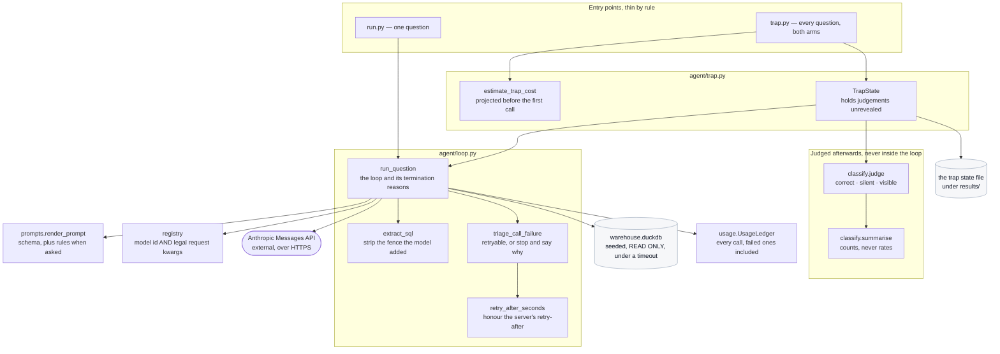
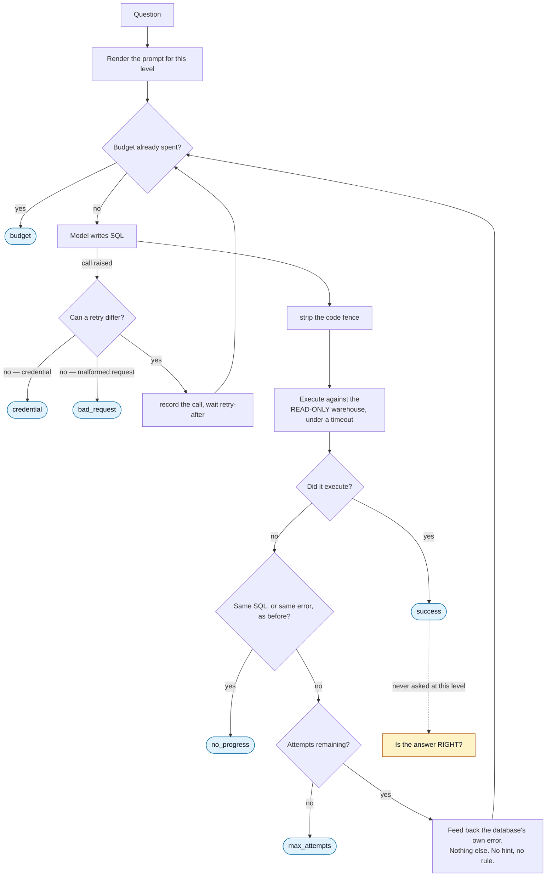

# Onboarding: Level 1, the agent loop and the trap

**Read [the onboarding hub](../../ONBOARDING.md) first.** It carries the product overview,
the shared glossary, the machine setup for macOS, Windows, and Linux, the configuration
reference, and how the tests work. This document assumes you have done that and covers
only Level 1.

When you have read this and run the demo in section 10, you should be able to run the loop
on your own machine, name every reason it can stop and say which ones can fire, explain
why a successful run tells you nothing about whether the answer is right, debug a failure,
and change the loop without weakening what it measures.

---

## 0. Scope of this document, and what I inspected

Level 1 is the loop most teams already have: **a model writes SQL, the SQL runs, and when
it fails the database's own error goes back to the model.** This document covers that loop,
the classification that judges its output afterwards, and the trap demonstration built on
top of both.

### What I read to write this

| Area | Files inspected |
|---|---|
| Entry points | `demos/01_agent_loop/run.py`, `demos/01_agent_loop/trap.py`, `demos/01_agent_loop/README.md` |
| The loop | `src/loopeng/agent/loop.py`, in full |
| Judging its output | `src/loopeng/agent/classify.py`, in full |
| The trap | `src/loopeng/agent/trap.py`, in full |
| What the loop calls | `src/loopeng/prompts.py`, `src/loopeng/registry.py`, `src/loopeng/caching.py`, `src/loopeng/warehouse/connect.py` |
| Money and numbers | `src/loopeng/usage.py`, `src/loopeng/pricing.py`, `src/loopeng/metric.py`, `src/loopeng/paired.py` |
| Rendering | `src/loopeng/views/render.py`, `src/loopeng/views/agent.py`, `src/loopeng/views/trap.py` |
| Tests | `tests/test_agent_loop.py`, `tests/test_agent_classify.py`, `tests/test_registry.py`, `tests/test_usage.py` |

### What I deliberately excluded, and why

| Excluded | Why |
|---|---|
| The verifiers and the verification loop | [Level 2](../02_verification_loop/ONBOARDING.md). Level 1 deliberately cannot see what they see, and that gap is this document's subject. |
| How gold items and their naive variants are generated | Covered where it is used. Here you need to know a gold item **has** a correct answer and one wrong answer per rule; not how the SQL templates are parameterised. |
| The Gradio layout of the two screens | [The views document](../ONBOARDING-views.md). This document covers the pure renderers in `views/render.py`, because the terminal path uses them too. |
| Prompt caching arithmetic | [Level 4](../04_hill_climbing_loop/ONBOARDING.md), where it changes the cost comparison. Level 1 only marks the prefix cacheable. |

---

## 1. Overview

**Level 1 catches syntactic failure. It cannot catch semantic failure.** Everything else in
this document follows from that sentence, so it is worth stating precisely what each half
means.

It retries when the SQL did not parse, did not run, or timed out. The feedback it receives
is the database's error and **nothing else** — not a hint, not a rule reminder, not a
gesture at what was wrong. That is all a Level 1 loop is entitled to.

It cannot catch SQL that parses, runs, returns a clean plausible number, and is wrong.
Nothing at this level compares the answer to anything, because there is nothing to compare
against that the agent is allowed to see. A silent error terminates the loop as `success`,
and `tests/test_agent_loop.py :: test_a_wrong_but_valid_query_terminates_as_success`
asserts exactly that — the property is pinned down rather than left as a caveat.

**The loop never touches gold.** Classification against the correct answer happens
afterwards, in a separate module, on a finished run.
`tests/test_agent_loop.py :: test_the_loop_cannot_be_handed_a_gold_item` asserts the
isolation structurally rather than by convention.

**The trap makes the gap visible before it is named.** It runs every gold question twice
with the *same model*, once with the business rules written into the prompt and once with
them withheld. The rules are the only variable. Running two different models instead would
teach "buy the bigger one", which is the opposite of this project's argument and would have
to be argued against later.

Two design choices in the trap are worth flagging now because they look like implementation
detail and are not:

- **Scoring is separated from execution.** Every cell is judged the moment its result lands
  and the judgement is held unrevealed. Pressing reveal flips a boolean. A test asserts it
  makes zero model calls.
- **Every landed cell renders identically before the reveal.** A cell reading "failed" would
  hand the room a free answer key for that row.

---

## 2. Glossary

[The hub's glossary](../../ONBOARDING.md#2-glossary) defines the shared terms. These are
specific to Level 1.

| Term | Definition |
|---|---|
| **Attempt** | One model call plus the execution of whatever SQL it returned. Carries its own `CallUsage`, so a failed attempt still records what it billed. At `src/loopeng/agent/loop.py :: Attempt`. |
| **Termination reason** | Why the loop stopped, recorded by name on every run. Six exist; see section 6. At `loop.py :: TerminationReason`. |
| **Visible failure** | A crash, a syntax error, a timeout, an empty result, an all-null result, or a result of the wrong **shape**. You can tell it is wrong without knowing the right answer. At `classify.py :: VisibleKind`. |
| **Shape mismatch** | The query returned a different number of columns, or a different number of rows, than the question asked for. Classified **visible**, not silent — a column count is knowable without the answer key. |
| **Tie-break allowance** | Two answers that differ only in how a tie was ordered are both correct. "Which five products sold the most?" does not say what to do when two sold the same number. |
| **Attribution** | Which declared rule a wrong answer can be blamed on, decided by matching the answer against that rule's naive variant. "Ignored `soft_delete`" is a far more useful statement than "wrong". |
| **Arm** | One column of the trap: a role and a prompt level, for example `worker@L0`. At `trap.py :: arm_key()`. |
| **Cell** (trap) | One question against one arm. Not the same thing as a [Level 4](../04_hill_climbing_loop/ONBOARDING.md) cell, which is a whole configuration over the whole gold set. |

---

## 3. Prerequisites

Everything in [the hub, section 3](../../ONBOARDING.md#3-prerequisites).

One thing specific to this area: **an Anthropic API key is required for both entry points**
when they actually run. Section 10 Part A shows how to exercise the loop end to end with no
key and no spend, by substituting the client — which is the same thing every test here does.

---

## 4. Repository map

| Path | Responsibility |
|---|---|
| `demos/01_agent_loop/run.py` | One question. Terminal with `--question`, browser without. Thin by rule. |
| `demos/01_agent_loop/trap.py` | Every gold question, both arms, then the reveal. Thin by rule. |
| `src/loopeng/agent/loop.py` | The loop, the termination reasons, the retry triage, the backoff, and SQL extraction. |
| `src/loopeng/agent/classify.py` | Judging a finished run against gold. The visible/silent split and the attribution taxonomy. |
| `src/loopeng/agent/trap.py` | The two-arm runner, the cost projection, the state that holds unrevealed judgements, and the terminal grid. |
| `src/loopeng/prompts.py` | Renders the prompt for a level. The rules come from the semantic model, never retyped here. |
| `src/loopeng/registry.py` | Role to model identifier, **plus the request keyword arguments legal for it**. |
| `src/loopeng/warehouse/connect.py` | The read-only connection and the query timeout. |
| `src/loopeng/usage.py` | Token accounting for every call, including failed ones. |
| `src/loopeng/views/render.py` | Pure string renderers. Used by the terminal path and the browser path alike. |

---

## 5. Architecture and responsibilities

### The shape of it

One synchronous loop, one outbound HTTPS boundary, one embedded database file. The trap
adds a thread pool and a JSON file; nothing else.



Notice what has no arrow into it: **`classify` is downstream of the loop and nothing flows
back.** That is the isolation described in section 1, drawn.

### Who owns what

**`run_question()` owns termination, and it never raises.** A model failure, a SQL failure,
and a timeout are all outcomes recorded on the returned `AgentRun`, not exceptions. A loop
that raised on a bad answer would make a sweep over fifty items impossible to run
unattended.

**`triage_call_failure()` owns the decision to stop.** This is the least obvious
responsibility in the area and the most valuable. A bare `except Exception` around the
model call treated a revoked API key exactly like a transient overload: three round trips,
then `max_attempts`, and a screen reading `database said: AuthenticationError` — blaming
the warehouse for a credential problem. At sweep scale that is roughly two hundred doomed
calls before a uniformly failed grid.

The rule it encodes: **a retry is only a retry when the next attempt could plausibly
differ.** Credential errors and malformed requests cannot differ, so the loop stops on the
first one with a message naming the variable and the fix. Everything else — rate limits,
5xx, timeouts, connection resets — stays retryable and is reached through the broad
`except Exception` arm deliberately, so a transport failure class nobody has met yet still
gets its retry.

**`retry_after_seconds()` owns waiting.** The server's own `retry-after` header wins when
present, because the server knows when the pool refills and a client doubling a guess is
what makes a rate limit last longer than it had to.

**The registry owns what is legal per model.** It is not a dictionary of strings, and it
cannot be: the worker model accepts a pinned `temperature` and the frontier model returns
an HTTP 400 for any non-default sampling parameter. Swapping a model is still one edit; the
edit is just larger than a string.

**`classify.py` owns the definition of the headline number.** Silent-error rate is computed
**only over answers that ran and returned something**. Folding visible failures into the
denominator would inflate the headline with failures the room can already see, which is the
opposite of what the metric is for. The two counts are reported separately and never summed.

**`summarise()` computes counts and no rates.** Rates are built by the caller through
`Metric.from_counts`, so every number that reaches a screen carries its own sample size and
its own interval.

**`TrapState` owns the withholding.** `reveal()` sets one boolean and does nothing else,
which is the property the demo depends on.

---

## 6. Execution flow

### The loop, one iteration at a time



The amber box is the point of the level. Nothing in that diagram asks it.

### The six termination reasons

| Reason | Fires when | Reachable at the trap's defaults? |
|---|---|---|
| `success` | The SQL executed without error | Yes |
| `max_attempts` | The attempt cap ran out | Yes |
| `budget` | The per-question estimated spend was already at its cap **before** the next call | No — structurally impossible at one attempt |
| `no_progress` | The model returned SQL it already returned, or hit an error it already hit | No — needs a second attempt to compare against |
| `credential` | HTTP 401 or 403 | Yes |
| `bad_request` | HTTP 400 | Yes |

`budget` and `no_progress` cannot fire in the trap because it runs one attempt per
question. [Level 2](../02_verification_loop/ONBOARDING.md) raises the cap and is where they
first become reachable. `tests/test_agent_loop.py :: test_every_termination_reason_is_reachable`
asserts none of the six is decoration.

**The budget is checked before spending, not after.** A cap enforced in arrears is a report
of what was overspent rather than a cap, and there is a test named for exactly that.

### What goes into the prompt, and what does not

The first message is the rendered prompt for the level plus the question. Retry feedback is
appended as **later turns**, deliberately outside the cacheable prefix — feedback inside the
prefix would break the cache on every retry, which is every call a loop makes beyond the
first.

The two levels really are the whole experiment. Measured on this checkout:

```
--- L0: 1027 chars, 41 lines ---
--- L3: 2406 chars, 53 lines ---
```

The difference is the rules, rendered from `semantic_model.yaml` rather than retyped, so a
rule added to the model reaches the prompt without anyone remembering to copy it:

```
1. [soft_delete] Rows where deleted_at IS NOT NULL are deleted and must be excluded from
   every result. This applies to customers and to orders independently.
2. [cancelled_orders] Orders with status = 'cancelled' must be excluded from all revenue,
   order-count, and average-order-value metrics.
...
```

### Judging, afterwards

`judge(run, item)` walks a fixed order of checks and returns at the first that matches:

1. No attempts at all → visible, `no_attempts`
2. The final attempt errored → visible, `timeout` if it began `QueryTimeout`, else
   `execution_error`
3. No rows → visible, `empty_result`
4. All rows null or NaN → visible, `null_result`
5. Wrong column count, or wrong row count on an order-insensitive item → visible,
   `shape_mismatch`
6. Rows equal gold → **correct**
7. Rows differ from gold only in how a tie was ordered → **correct**
8. Otherwise → **silent error**, attributed to every rule whose naive variant it matches

Steps 5 and 7 are both corrections made after real runs, and both moved answers *out* of
the silent bucket. Step 5 was worth eleven of thirty-five apparent silent errors on the
first trap — a model returning the right numbers alongside an extra label column — which
had been inflating the headline by a third while measuring how precisely the question
pinned down an output schema rather than whether the model understood the rules.

For step 8, **every** matching variant is returned, not the first. When an item's variants
for two rules are indistinguishable, both are reported: saying "`soft_delete` or
`internal_accounts`" is honest, and picking one would be a coin flip presented as a finding.

---

## 7. Interfaces and data

### `AgentRun`, the return value of the loop

| Field | Meaning |
|---|---|
| `question`, `level`, `role`, `model_id` | What was asked, and how |
| `attempts` | Every attempt in order, each with its SQL, rows, error, and usage |
| `termination` | One of the six reasons |
| `item_id` | Set when the question came from a gold item; `None` for an ad-hoc question |
| `ledger` | Every call made, including the failed ones |

`final`, `rows`, `sql`, and `error` are conveniences over the last attempt.

**`Attempt.model_call_failed` is read off the recorded outcome, never inferred from an empty
SQL string.** An empty string is also what a model that answered with nothing produces, and
*that* failure genuinely is a database failure — the executor rejects the empty query and
the error text comes from DuckDB. Renderers must not say `database said` about a call that
never reached the database.

### `results/phase1_trap.json`, written by the trap

The trap is the only part of Level 1 that writes a file. It is the system of record:
everything needed to re-derive every reported number without another model call.

| Key | Contents |
|---|---|
| `arms` | The two arm keys, in order |
| `n_cells`, `wall_clock_seconds` | Size and duration |
| `usage` | The merged ledger: totals, by outcome, by model, estimated cost, and every call |
| `cells` | Per cell: item, arm, model, question, seconds, SQL, rows, error, termination, attempt count, outcome, visible kind, attributed rules, ambiguity flag |
| `summary_by_arm` | The `summarise()` counts per arm |
| `paired` | McNemar over the items both arms answered, or `null` if there are not exactly two arms |

It is serialised with the gold builder's encoder rather than `default=str`. That exact
shortcut once turned `Decimal('76744.66')` into the *string* `'76744.66'`, and `rows_equal`
correctly refuses to equate a number with its string form — so every revenue row in the
file would have come back unusable for any later analysis.

### The two command line surfaces

```
usage: run.py [-h] [--question QUESTION] [--role {worker,frontier}]
              [--level {L0,L3}] [--max-attempts MAX_ATTEMPTS] [--share]
```

```
usage: trap.py [-h] [--headless] [--limit LIMIT] [--cap-usd CAP_USD] [--share]
```

Omitting `--question` serves a browser screen instead of running headless. `--limit` on the
trap exists for development and is the flag to reach for while you are changing anything in
this area.

---

## 8. Configuration

[The hub, section 7](../../ONBOARDING.md#7-configuration) carries the full table. Level 1
reads three variables:

| Variable | Effect here |
|---|---|
| `ANTHROPIC_API_KEY` | Required for any real run of either entry point |
| `WAREHOUSE_PATH` | Which database file the generated SQL runs against |
| `WAREHOUSE_SEED` | Which seed it is generated from, and therefore what every gold answer is |

Two values behave like configuration but are code, and both are deliberate:

| Constant | Where | Why it is not a flag |
|---|---|---|
| `DEFAULT_BUDGET_USD` | `loop.py` | Per **question**, not per run. Sized so one pathological question cannot eat a sweep. |
| `CONCURRENCY_PER_MODEL` | `trap.py` | Far below the measured ceiling recorded in `results/gate0.json`. The cap exists to be polite and predictable, not because the limit is near. |

---

## 9. Run it locally

Follow [the hub, section 6](../../ONBOARDING.md#6-run-it-locally) from a fresh clone.

Nothing here needs a migration or a seed step: `run.py` and `trap.py` both call
`ensure_warehouse()`, which generates the database if it is absent, and the gold set is
rebuilt from its patterns.

Before spending anything, run [preflight](../00_preflight/ONBOARDING.md).

---

## 10. Demo

### Part A: the whole loop, free, no key, no network

The loop takes a `client` argument precisely so it can be substituted. This is the same
technique every test in the area uses, and it means you can watch a retry happen against
the **real** warehouse without an API key.

Script two replies: a query with a typo, then a corrected one.

```bash
uv run python -c "
from types import SimpleNamespace
from loopeng.agent.loop import run_question
from loopeng.views.render import render_attempt_timeline, render_cost
from loopeng.settings import load_settings
from loopeng.warehouse.connect import ensure_warehouse

class Scripted:
    def __init__(self, replies):
        self._r = list(replies); self.calls = 0
        self.messages = SimpleNamespace(create=self._create)
    def _create(self, **kw):
        self.calls += 1
        return SimpleNamespace(
            content=[SimpleNamespace(type='text', text=self._r[min(self.calls-1, len(self._r)-1)])],
            usage=SimpleNamespace(input_tokens=812, output_tokens=57))

s = load_settings()
w = ensure_warehouse(s.warehouse_path, seed=s.warehouse_seed)
run = run_question('How many products do we sell in the apparel range?', warehouse=w,
    client=Scripted(['SELECT COUNT(*) FROM prodcts WHERE category = \\'apparel\\'',
                     'SELECT COUNT(*) FROM products WHERE category = \\'apparel\\'']),
    sleeper=lambda s: None)
print(render_attempt_timeline(run)); print(render_cost(run.ledger))
"
```

**Actual output, captured** (the renderer emits markdown, so the fences below are its own):

````text
**termination:** `success` · **model:** `claude-haiku-4-5`

### Attempt 1 — failed to execute
```sql
SELECT COUNT(*) FROM prodcts WHERE category = 'apparel'
```
**database said:** `CatalogException: Catalog Error: Table with name prodcts does not exist!
Did you mean "products"?

LINE 1: SELECT COUNT(*) FROM prodcts WHERE category = 'apparel'
                             ^`

### Attempt 2 — ran
```sql
SELECT COUNT(*) FROM products WHERE category = 'apparel'
```
**returned:** `[[38]]`

est. $0.0022 · 2 calls · 1738 tokens (in 1624, out 114, cache-w 0, cache-r 0)
````

**What to observe.** Four things are visible in that output and each is a decision:

1. **The feedback is the database's own complaint**, verbatim, including DuckDB's "did you
   mean" hint and the caret. Nothing was added to it.
2. **Both calls are billed**, including the one whose query failed. Recording only the
   useful call would drop exactly the retries a loop exists to make — and that bias runs in
   one direction, flattering a cheap model with a loop against an expensive model without
   one.
3. **The dollar figure says `est.`** It always will. Tokens came off the response; dollars
   are a hand-entered price table.
4. **The termination is `success`.** Now change the second reply to something that runs
   cleanly and is wrong — say `SELECT COUNT(*) FROM products` with no filter. The
   termination is still `success`. **That is the entire teaching point of this level.**

`sleeper=lambda s: None` is passed so the backoff does not actually wait; it is a seam for
exactly this purpose.

### Part B: what the loop is blind to, asserted

```bash
uv run pytest "tests/test_agent_loop.py::test_a_wrong_but_valid_query_terminates_as_success" -q
```

**Actual output, captured:**

```
.                                                                        [100%]
1 passed in 2.52s
```

The blindness is a pinned property, not a caveat in a comment. If somebody ever taught
Level 1 to check its answers, this test would fail — and it *should*, because that work
belongs one level up.

### Part C: the trap's cost projection, free

The trap refuses to start if its projection breaches `--cap-usd`, so the projection can be
inspected without running anything.

```bash
uv run python -c "
from loopeng.agent.trap import estimate_trap_cost, ARMS
from loopeng.gold.build import build_gold
from loopeng.settings import load_settings
from loopeng.warehouse.connect import ensure_warehouse
s = load_settings()
items = build_gold(ensure_warehouse(s.warehouse_path, seed=s.warehouse_seed))
print('arms:', ARMS)
print(f'{len(items)} items, projected est. \${estimate_trap_cost(len(items)):.2f}')
"
```

**Actual output, captured:**

```
arms: (('worker', 'L3'), ('worker', 'L0'))
50 items, projected est. $0.21
```

**Read the arms tuple.** Both are `worker`. The model is held constant and the prompt level
is the variable, which is the design decision from section 1 visible as data.

The projection is deliberately pessimistic — measured average token counts, times the price
table, times headroom — because refusing a run that would have just fit is a cheap mistake
and discovering the cap was breached afterwards is not. Its calibration is also a small
lesson: the first version sampled the first three gold items, which are all the same
pattern, and under-estimated by roughly six times because the revenue patterns write joins
and CASE expressions. **An unrepresentative sample is a worse input to a spend cap than a
small one.**

### Part D: the live runs

```bash
uv run python demos/01_agent_loop/run.py \
  --question "What was gross revenue in March 2025 from our euro and yen orders, in US dollars?"
```

```bash
uv run python demos/01_agent_loop/trap.py --headless --limit 6
```

`Unverified:` both commands bill. I did not run them while writing this document. Their
output shapes are read off `views/render.py :: render_attempt_timeline()` and
`trap.py :: print_grid()`; Part A above is the same renderer over a real run, so what you
see there is what you will see here.

**What to expect from the trap:** a line reporting how many cells landed and that scores
are withheld, then — after `reveal()` — a block per arm carrying the silent-error rate with
its sample size, the counts, the visible-failure kinds, the termination distribution, and
the attribution by rule. Then the paired McNemar line and the cost.

**The question to sit with:** of the cells that are wrong, how many could you have spotted
without the answer key?

---

## 11. Observability

### Logging

Two events come from this area, both from `agent/loop.py :: run_question()`:

| Event | Level | Fields | Meaning |
|---|---|---|---|
| `model_call_refused` | error | `question`, `attempt`, `termination`, `error` | The call failed in a way retrying cannot fix. The loop stopped. |
| `model_call_failed` | warning | `question`, `attempt`, `error` | The call failed in a way retrying might fix. The loop waited and went round. |

One more comes from the trap:

| Event | Level | Fields | Meaning |
|---|---|---|---|
| `trap_cell_failed` | error | `item_id`, `arm`, `error` | One cell raised. It is recorded as an empty cell and the grid continues — a dead cell must not kill the grid. |

The question text is truncated in the log fields. The API key never appears anywhere.

**There are no metrics**, here or anywhere in this repository.

### What healthy looks like

- Most questions terminate `success` on the first attempt.
- The cost line ticks upward and every call is in it.
- In the trap, cells fill in steadily and **both columns look the same** while running. That
  is deliberate and worth saying out loud to a room.

### What unhealthy looks like

- **Repeated `model_call_failed` warnings** — rate limiting. The loop is already waiting;
  lower concurrency if it persists.
- **One `model_call_refused` and everything stops** — a credential or a malformed request.
  Retrying will not help, which is why it stopped. The message names the file to open.
- **Every question terminating `max_attempts`** — check the warehouse exists and the schema
  in the prompt matches it.
- **The grid never fills** — confirm the key resolves:
  `uv run python demos/00_preflight/check.py`.

---

## 12. Troubleshooting

Shared rows are in
[the hub, section 11](../../ONBOARDING.md#11-troubleshooting-shared-across-areas). These are
specific to Level 1.

| Symptom | Likely cause | Diagnostic | Fix |
|---|---|---|---|
| Every attempt reads `the model call failed` with `AuthenticationError` | The key is wrong, revoked, or the account unfunded. | The message names `ANTHROPIC_API_KEY` and points at preflight. | Fix the key. Note it stopped after **one** call, not three. |
| `BadRequestError` on the frontier role only | A sampling parameter was added to a role that rejects it. | Read `src/loopeng/registry.py` and compare `request_kwargs` per role. | Remove it. `temperature` is pinned on the worker role and must not be on the frontier one. |
| A run reads `database said: ...` for a failure that was really the API | This was a real bug and is now impossible. | Check `Attempt.model_call_failed`. | If you see it again, the renderer is inferring from an empty SQL string instead of the recorded outcome. |
| `QueryTimeout: query exceeded its 30.0s budget and was interrupted` | The model wrote a query with no natural end, usually an unintended cross join. | Read the attempt's SQL. | Nothing to fix in the harness. One such query would otherwise stall a whole sweep. |
| Termination is `no_progress` and the SQL looks fine | The model returned SQL it had already returned, or hit an identical error twice. | Compare the attempts in the timeline. | Correct behaviour. The feedback is not moving the model, and further attempts only spend. |
| Termination is `budget` on a single question | The per-question cap was reached before the next call. | `DEFAULT_BUDGET_USD` in `loop.py`. | Usually means retries are long. Raise it deliberately, or lower `--max-attempts`. |
| The trap prints `ABORT: projected est. $... exceeds the $... cap.` | The projection breached `--cap-usd`. | The message carries both figures. | Use `--limit`, or raise `--cap-usd` deliberately. |
| A trap cell is blank after the run finishes | That cell raised. | Look for a `trap_cell_failed` error line naming the item and arm. | The grid deliberately survives it. Investigate the named item. |
| The browser screen never shows a URL when output is redirected | Python block-buffers stdout to a file. | — | Use `uv run python -u ...`. The `-u` is in the runbook for this reason. |
| A correct-looking answer is scored a silent error | Possibly a tie-break or a shape difference the classifier should be allowing. | Compare the rows against `item.gold_rows` and read section 6. | If it is a genuine new category, it belongs in `classify.py` with a test, not in a caveat. |

---

## 13. Testing

```bash
uv run pytest tests/test_agent_loop.py tests/test_agent_classify.py -q
```

**Actual output, captured:**

```
.....................................................                    [100%]
53 passed in 8.87s
```

### The test doubles, and what each one is for

| Double | Purpose |
|---|---|
| `FakeClient` | Returns canned SQL in order and **counts calls**. The count is what makes spend assertable. |
| `ExplodingClient` | Raises a generic `RuntimeError`, standing in for a transient failure that must still be retried. |
| `RefusingClient` | Raises a real `anthropic` exception built with a genuine `httpx.Response`. Used for the 401, 403, and 400 branches. |

There are no containers and no database fixtures: the warehouse is a file built into a
temporary directory by a module-scoped fixture.

### What is asserted, grouped by the property it protects

| Property | Tests |
|---|---|
| The fence a model adds does not cost an attempt | `test_extracts_sql_from_a_fence`, `test_unfenced_sql_passes_through` |
| Every termination reason can actually fire | `test_every_termination_reason_is_reachable`, plus one test per reason |
| The budget is a cap, not a report | `test_budget_is_checked_before_spending_not_after` |
| **Level 1 is blind to a wrong answer** | `test_a_wrong_but_valid_query_terminates_as_success` |
| The loop never sees gold | `test_the_loop_never_receives_gold`, `test_the_loop_cannot_be_handed_a_gold_item` |
| Failed calls still bill | `test_failed_model_calls_are_still_recorded`, `test_a_refused_call_is_still_recorded_in_the_ledger` |
| All four token classes survive | `test_all_four_token_classes_survive_into_the_run` |
| A non-retryable failure stops at one call | `test_a_rejected_credential_stops_after_one_call`, `test_a_403_is_also_non_retryable` |
| A retryable failure is still retried | `test_a_transient_failure_is_still_retried` |
| A model failure is never blamed on the database | `test_a_model_failure_is_never_reported_as_a_database_failure` |
| The visible/silent split holds in both directions | `test_a_column_count_mismatch_is_VISIBLE_not_silent`, `test_an_all_null_answer_is_VISIBLE_not_silent`, `test_the_right_shape_with_a_wrong_number_is_still_SILENT`, `test_a_row_count_mismatch_is_VISIBLE_not_silent` |
| Tie-breaks are allowed and rankings are not | `test_a_tie_break_difference_is_not_an_error`, `test_a_genuinely_different_ranking_is_still_an_error`, `test_a_different_top_five_is_still_an_error` |
| Ambiguous attribution names every rule | `test_the_ambiguous_item_reports_both_rules_and_picks_neither` |
| **Reveal makes no model calls** | `test_reveal_triggers_zero_model_calls` |
| The trap holds the model constant | `test_the_default_arms_hold_the_model_constant` |
| A rate with no observations is not rendered as zero | `test_silent_error_rate_is_none_before_anything_lands` |

### Visible coverage gaps

1. **`retry_after_seconds()` is exercised only through the retry tests.** No test asserts
   directly that a `retry-after` header wins over the doubling fallback, or that the ceiling
   clamps.
2. **The trap's thread pool is only exercised with a substituted client.** Real behaviour
   under concurrent rate limiting is not covered end to end.
3. **`save_state()` output shape is not asserted against a fixture.** A key renamed in that
   payload would not fail any test in this area.
4. **Neither entry point's `main()` is tested for its flag handling.**
   `tests/test_demo_structure.py` runs them for cold-start behaviour, not for their output.

---

## 14. Changing this code safely

### Low risk to modify

- **`DEFAULT_MAX_ATTEMPTS`** and the `--max-attempts` default. Nothing frozen depends on
  them.
- **The wording of the retry feedback message** in `_build_messages()`, provided it stays
  the database error and nothing else. Adding a hint changes what the level measures.
- **`ARM_LABELS`** in `trap.py`. They are display strings, though the two default arms are
  asserted by a test.
- **The terminal grid layout** in `print_grid()`, provided unrevealed cells stay identical.
- **Adding a new `VisibleKind`**, provided you also add the branch in `judge()` and a test.
  This is the extension point the shape-mismatch and null-result categories both came in
  through.

### Load bearing, and why

- **`FATAL_CALL_ERRORS` and `triage_call_failure()`.** Widening the fatal set turns a
  transient outage into a stopped sweep. Narrowing it brings back two hundred doomed calls
  against a revoked key. The set is named against the client library's own exception classes
  rather than status codes, deliberately: the SDK already models that mapping and a second
  copy here is a second thing to drift.
- **The `except Exception` fallback being the retryable arm.** It is broad on purpose so a
  transport failure class nobody has met yet still gets its retry. Narrowing it to a
  specific tuple would make an unknown failure fatal.
- **Recording usage on the failure path.** Three lines that stop the loop from looking
  cheaper than it is. The bias runs one way and it flatters exactly the comparison this
  project is built to make.
- **`Attempt.model_call_failed` reading the recorded outcome.** Reverting it to `sql == ""`
  reintroduces a bug that sent readers to the wrong file.
- **The loop taking no gold argument.** The isolation is structural. A `gold_rows` parameter
  added "just for logging" ends the guarantee, and two tests exist to stop it.
- **The silent-error denominator in `classify.py`.** Changing it from "ran and returned" to
  "all attempts" changes the headline number of the entire project.
- **`registry.py :: REGISTRY` request keyword arguments.** They are not interchangeable
  between roles. Adding `temperature` to the frontier role makes every call to it fail with
  an HTTP 400.
- **`reveal()` doing nothing but set a flag.** Making it recompute would burn the wall clock
  again in front of a room, and a test asserts it does not.
- **The prompt levels being rendered from `semantic_model.yaml`.** Writing the rules out in
  `prompts.py` would let the declared rules and the prompted rules drift — the exact defect
  this project exists to demonstrate.

### What depends on the current behaviour

| Depends on | What it consumes |
|---|---|
| [Level 2](../02_verification_loop/ONBOARDING.md) | `run_question()` as its generator, and every termination reason |
| [Level 3](../03_event_driven_loop/ONBOARDING.md) | The Level 2 loop, and therefore this one |
| [Level 4](../04_hill_climbing_loop/ONBOARDING.md) | `run_question()`, `judge()`, and the `Outcome` values, per gold item |
| `src/loopeng/views/render.py` | `AgentRun`, `Attempt`, `TrapState`, and the `Outcome` enum |
| `src/loopeng/preflight.py` | `triage_call_failure()`, for its failure wording |
| `demos/01_agent_loop/README.md` | The termination reason names and the diagram |
| `results/` files already written | The `phase1_trap.json` shape as it was when they were written |

### Pre merge checklist

The repository-wide list is in
[the hub, section 12](../../ONBOARDING.md#12-changing-this-code-safely-the-repository-wide-rules).
Three additions for this area:

1. If you touched `classify.py`, re-run `tests/test_agent_classify.py` and read the diff of
   which category each moved answer landed in. Moving an answer between **visible** and
   **silent** changes the headline number.
2. If you touched the loop's control flow, confirm
   `test_every_termination_reason_is_reachable` still passes. It is what stops a branch
   becoming decoration.
3. If you touched the diagram in `demos/01_agent_loop/README.md`, it must stay byte
   identical to the copy in the root `README.md`.
   `tests/test_docs.py :: test_each_stage_diagram_is_byte_identical_in_the_readme` enforces
   it, and that duplication is deliberate.

---

## 15. Open questions and assumptions

### Questions for the team

1. **`estimate_trap_cost()` carries a calibration measured on one day.** The token averages
   in `_CALIBRATION` are dated in a comment and would drift if either model's verbosity
   changed. **Should the projection be re-derived from a committed measurement file, the way
   the sweep's noise floor now is, rather than living as literals?**

2. **`save_state()` writes `results/phase1_trap.json` and nothing in the repository reads
   it.** Searching for the filename finds only the writer. **Is it an artefact for humans, or
   was there a consumer that has not been committed?**

3. **The trap's default arms are worker-only, but `ARM_LABELS` carries frontier entries.**
   Nothing in the repository passes frontier arms to `run_trap()`. **Are those labels for a
   variant that is run by hand, or are they dead?**

4. **`DEFAULT_BUDGET_USD` is per question and not configurable from either entry point.** A
   pathological question terminates `budget` with no way to raise the cap short of editing
   the module. **Should it be a flag, or is that deliberately not a knob?**

5. **`_shape_mismatch()` exempts order-sensitive items from the row-count check but not from
   the column-count check.** That is almost certainly right. **Is there a top-N case where a
   legitimate answer carries a different column count?**

### Assumptions I made, and the evidence

| Assumption | Evidence it rests on |
|---|---|
| `budget` and `no_progress` cannot fire at the trap's defaults. | `run_trap()` passes `max_attempts=1`; both branches need a second iteration. Read from the code, not executed. |
| The live output shapes in section 10 Part D. | Read off `render_attempt_timeline()` and `print_grid()`. Part A exercises the same renderer over a real run, so the shape is confirmed even though the live command is not. |
| The concurrency cap is well below the real limit. | The docstring cites `results/gate0.json`, which is committed. I read the file's presence, not a fresh rate-limit measurement. |
| A `sleeper` argument exists solely as a test seam. | It defaults to `time.sleep` and is overridden only in tests. |

### Things I verified by executing them

Every command in section 10 Parts A, B, and C was run on macOS from this checkout, and the
blocks marked **Actual output, captured** are what they printed. Part D is marked
`Unverified:` because those two commands make billed API calls.
