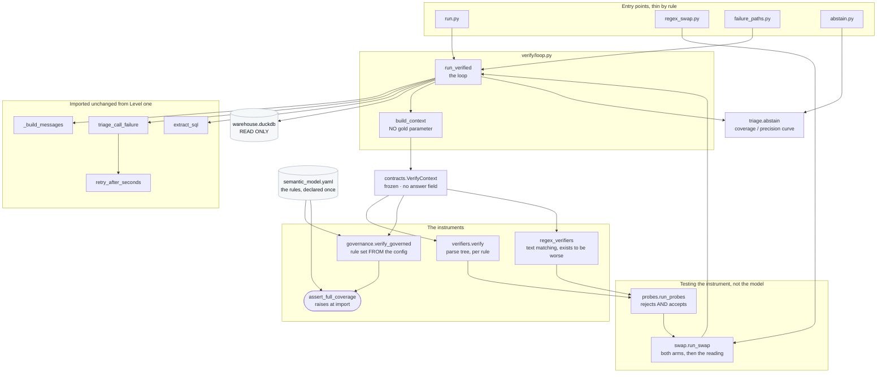
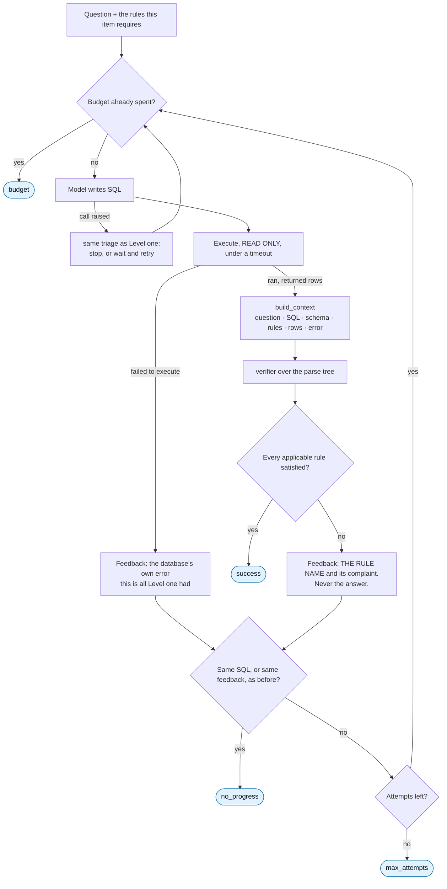

# Onboarding: Level 2, the verification loop

**Read [the onboarding hub](../../ONBOARDING.md) first.** It carries the product overview,
the shared glossary, the machine setup for macOS, Windows, and Linux, the configuration
reference, and how the tests work. This document assumes you have done that and covers
only Level 2.

When you have read this and run the demo in section 10, you should be able to run the
verification loop, explain why a verifier that scores better can be worse, add a rule
without the build letting you forget to enforce it, read every way a run can end without
succeeding, and change a verifier without weakening the instrument.

---

## 0. Scope of this document, and what I inspected

Level 2 adds the thing [Level 1](../01_agent_loop/ONBOARDING.md) structurally cannot do:
**look at a query that ran cleanly and say it is wrong anyway, naming the rule it broke.**

This document covers the loop, both generations of verifier, the governance gate that
fails the build when a declared rule has no check, the regex swap that demonstrates a
weakened instrument scoring better, the three non-success termination paths, and
abstention.

### What I read to write this

| Area | Files inspected |
|---|---|
| Entry points | All four of `demos/02_verification_loop/*.py`, plus its `README.md` |
| The loop | `src/loopeng/verify/loop.py`, in full |
| The contract | `src/loopeng/contracts.py`, in full |
| Verifiers | `src/loopeng/verify/verifiers.py`, `governance.py`, `regex_verifiers.py`, `probes.py` |
| Demonstrations | `src/loopeng/verify/swap.py`, `failure_paths.py` |
| Abstention | `src/loopeng/triage/abstain.py`, and `escalate.py` and `failures.py` for what consumes it |
| Rendering | `src/loopeng/views/render.py`, `src/loopeng/views/verify.py`, `src/loopeng/views/intervention.py` |
| Tests | `tests/test_verify.py`, `tests/test_governance.py`, `tests/test_contracts.py`, `tests/test_triage.py` |

### What I deliberately excluded, and why

| Excluded | Why |
|---|---|
| The model call, retry triage, and backoff | Level 2 imports them unchanged from [Level 1](../01_agent_loop/ONBOARDING.md). Only what Level 2 *adds* is here. |
| Judging against gold | Also Level 1's `classify.py`. It runs after this loop, never inside it — which is the whole architecture of the area. |
| Escalation's measured results | The numbers belong to [Level 4](../04_hill_climbing_loop/ONBOARDING.md). The *mechanism* is summarised here because abstention feeds it. |
| The Gradio layout of the two screens | [The views document](../ONBOARDING-views.md). |
| `src/loopeng/verify/batch.py` | A thin fan-out over `run_verified`. Nothing in it changes the loop's behaviour. |

---

## 1. Overview

Level 2 is where the project's thesis becomes machinery. Four claims, in the order they
build on each other.

**A verifier reads the query, never the answer — and that is structural, not
conventional.** `VerifyContext` has no field for the gold answer, and `build_context()`
takes no gold parameter, so there is nothing in scope at the construction site for a
careless author to pass through. A verifier that could see the answer would score
perfectly and measure nothing. Four tests hold this from four directions.

**Checks run on the parse tree, not on the text.** A check that greps for
`deleted_at IS NULL` passes a query with that string inside a comment, inside a subquery
that never joins, or negated. The parse tree can see that the column is not actually
constrained anywhere in the query's logic.

**A weakened instrument scores better, and that is the demonstration.** The regex verifier
is not a strawman — it is the check a competent engineer writes first, because it is quick,
readable, and passes its own unit tests. Swap it in and the acceptance rate rises, the cost
falls, and the rejections fall. Every one of those looks like an improvement on a
dashboard. The only way to tell an improvement from a weakened instrument is to test the
instrument against inputs whose answer is already known.

**A rule declared and not enforced fails the build.** V1 is a dictionary of Python checks
and carries the exact defect this workshop is about: the rule set it enforces and the rule
set the config declares are two separate lists that nobody compares. V2 makes the config
the source of truth and raises at import if a declared rule has no check, or has a check
with no probes.

---

## 2. Glossary

[The hub's glossary](../../ONBOARDING.md#2-glossary) defines the shared terms. These are
specific to Level 2.

| Term | Definition |
|---|---|
| **`VerifyContext`** | Everything a verifier is allowed to see: question, SQL, schema, the rules this item requires, the attempt number, and what happened when the query ran. Frozen. At `src/loopeng/contracts.py`. |
| **Violation** | One rule name plus a complaint written for the model. The complaint names the rule and never names a result value. |
| **Rejection** | An attempt whose query **executed** and was sent back anyway. `VerifiedRun.rejections` counts them, and it is the number [Level 1](../01_agent_loop/ONBOARDING.md) structurally cannot produce. |
| **V1 verifier** | `verify()` in `verifiers.py`. A dictionary of parse-tree checks, each asking whether its rule is in `context.rules`. |
| **V2 governance verifier** | `verify_governed()` in `governance.py`. Same checks, but the applicable rule set is read from `semantic_model.yaml`, and it refuses to run at all if the config declares something unenforced. |
| **Rule-surface probe** | A pair of queries per rule: one that **breaks** it and must be rejected, one that **honours** it and must be accepted. Both directions, because one direction alone is free to fake. |
| **Nearby-legitimate probe** | V2's stronger version of the accept side: a correct query written in an unusual-but-valid shape — filtering in a CTE, using `COALESCE`, aliasing differently. A check that pattern-matches rather than understands rejects those. |
| **Confidence band** | An ordinal label for how a run ended, read off the loop's own telemetry. At `triage/abstain.py :: CONFIDENCE`. |
| **Abstention** | The loop declining to answer. Turns "coverage" from a synonym for *did not crash* into a choice the operator makes. |
| **Coverage / precision** | Coverage is answered over asked. Precision is right over **answered**. Different denominators, deliberately, and they move in opposite directions. |

---

## 3. Prerequisites

Everything in [the hub, section 3](../../ONBOARDING.md#3-prerequisites).

One dependency matters here specifically: **`sqlglot`**, which parses the model's SQL into
the tree every check walks. It is a runtime dependency, not a development one.

An Anthropic API key is needed only for the runs that call a model. Sections 10 Parts A, B,
and C run with no key and no spend, and they cover the verifiers, the governance gate, and
the loop itself.

---

## 4. Repository map

| Path | Responsibility |
|---|---|
| `demos/02_verification_loop/run.py` | One question through the loop, rendering every attempt and its verdict. |
| `demos/02_verification_loop/regex_swap.py` | Both verifiers over the same items, then the reading. |
| `demos/02_verification_loop/failure_paths.py` | The three ways a run ends without succeeding. |
| `demos/02_verification_loop/abstain.py` | The coverage/precision curve and the intervention screen. |
| `src/loopeng/contracts.py` | `VerifyContext`, and the field-name pattern that guards it. |
| `src/loopeng/verify/loop.py` | The Level 2 loop and `build_context()`. |
| `src/loopeng/verify/verifiers.py` | V1: the parse-tree checks, one per rule, and `RULE_CHECKS`. |
| `src/loopeng/verify/governance.py` | V2: the config-driven verifier, the two-probe requirement, and the build gate. |
| `src/loopeng/verify/regex_verifiers.py` | The text-matching verifier that exists to be worse. |
| `src/loopeng/verify/probes.py` | V1's rule surface: honours/breaks pairs and the two-column report. |
| `src/loopeng/verify/swap.py` | The AST-versus-regex comparison and its deliberately honest reading. |
| `src/loopeng/verify/failure_paths.py` | The three scenarios and the two over-strict verifiers that provoke them. |
| `src/loopeng/triage/abstain.py` | Confidence bands, the decision, and the coverage/precision curve. |
| `src/loopeng/triage/escalate.py` | What to do with a declined question: hand it to the frontier model. |
| `src/loopeng/triage/failures.py` | Classifying failures by **cause** rather than counting them. |

---

## 5. Architecture and responsibilities

### The shape of it

Level 2 wraps Level 1. It reuses the model call, the SQL extraction, the retry triage, and
the backoff **by importing them**, and adds exactly one thing to the cycle: a verdict on a
query that ran.



Notice there is no arrow from gold to anything in this diagram. There is no gold in this
diagram at all.

### Who owns what

**`build_context()` owns the isolation.** Its guarantee is not "we do not pass gold" but
"gold is not in scope at the construction site". The design note behind it is precise: the
field-name pattern on `VerifyContext` constrains the type's *shape*, and only *scope*
constrains what can reach it. So the pattern is a cheap structural guard that catches the
obvious regression — a future author adding `gold_rows` because it was convenient — at the
moment the field is added rather than after the numbers have been reported. It cannot catch
a field named `payload` that happens to carry the answer, which is why the construction
site has to stay honest too, and why a separate test asserts the signature.

**`verifiers.py` owns the checks, one small function per rule.** They are deliberately
small and independent so a probe can exercise one at a time. `_has_column_predicate()` is
the workhorse: it walks the tree for a comparison, `IS NULL`, or `NOT` involving the
column, plus bare conditions under `WHERE` and `JOIN`. That is what "actually constrained"
means, mechanically.

**`governance.py` owns the build gate**, and it runs at import — the last line of the module
is a bare `assert_full_coverage()`. A declared-but-unenforced rule cannot survive to
runtime. It also owns the two-probe requirement, and the second probe is the half that is
easy to skip and does the most work.

One detail in `RULE_CHECKS` is worth reading closely, because it is the gate catching a real
gap on its first run. `minor_units` and `multi_currency` are one SQL change — the declared
conversion factor versus a naive divide by a hundred — so they share a check. Both are
listed explicitly rather than one being folded silently into the other, because **a rule
enforced only as a side effect of another is indistinguishable, from the config's side,
from one that is not enforced at all.**

**`regex_verifiers.py` owns being worse honestly.** Its `fan_out` entry is inverted
relative to the others: mentioning `order_items` is what a *correct* query does, so text
has no way to express the actual trap. It is included anyway, because leaving it out would
make the regex verifier look more careful than it is.

**`swap.py :: _reading()` owns the narration, and it refuses to flatter.** It is written to
be honest in every direction, because a demo whose narration only fits the flattering
result is a demo that will narrate a result it did not get. Three of its branches say some
version of "do not claim this":

- If the probe surface does not show the regex verifier catching less on this run, it says
  nothing else here is evidence of anything.
- If the regex verifier provably catches less but no headline number moved in its favour, it
  says the argument still holds on the probe surface but not to claim a dashboard effect
  that did not appear.
- In every case it declares the correctness comparison **underpowered**, and explains that
  the comparison is bounded by construction: the arms can only differ on items the AST
  verifier actually rejected, so running more items does not fix it. The bound is
  structural.

**`abstain.py` owns turning coverage into a choice.** The confidence signal is read off the
loop's own telemetry — whether the query ran, how many times the verifier sent it back,
which branch terminated it — rather than from an extra model call asking "are you sure?".
That is cheaper, and more honest: a model's stated confidence is another generation to be
wrong about, while a `no_progress` termination is a fact about what happened. Because the
signal is telemetry, the whole curve can be recomputed over runs already measured, so
calibrating abstention costs nothing.

---

## 6. Execution flow

### One iteration



### What changed from Level 1, precisely

| | Level 1 | Level 2 |
|---|---|---|
| Retries on | Execution failure only | Execution failure **or** a rule violation |
| Feedback on a clean-but-wrong query | *none — it terminates as success* | The rule name and its complaint |
| No-progress detection compares | SQL, and the database error | SQL, and **the feedback**, whichever kind it was |
| `max_attempts` default | Three, but the trap runs one | Three |
| Per-question budget | Lower | Higher, because a loop makes more calls |
| Records `rejections` | Cannot | Yes |

**`budget` and `no_progress` become reachable here for the first time.** At Level 1's
one-attempt trap they were structurally unable to fire, which means Level 1 was no evidence
they work. `failure_paths.py` exists to fire each one deliberately.

### The three non-success paths, and why they need care

`failure_paths.py` provokes each branch with a deliberately over-strict verifier. Two
over-strict verifiers, not one, and the difference between them was found by running it:

| Scenario | Verifier used | Why |
|---|---|---|
| `max_attempts` | Rejects with a **fresh** complaint each attempt | With an unchanging complaint the loop terminates on `no_progress` long before the cap, so the scenario meant to demonstrate the cap never reached it |
| `budget` | Fresh complaint, cap set very low | The cap is checked before spending, so it fires first |
| `no_progress` | Rejects with **the same** complaint every time | The loop recognises it is going in circles and stops |

Neither over-strict verifier is a strawman. **A rule check with a bug looks exactly like
this from the loop's side**, and a verifier that names a different problem each round looks
like it is making progress when it is not.

All three scenarios make real model calls, deliberately: the thing being demonstrated is
the controller's behaviour under a real generator, and a scripted client would only prove
that the scripted client works.

### Abstention, afterwards

`confidence_of(run)` scores a recorded run by the first band that matches — never executed,
budget exhausted, gave up going in circles, hit the attempt cap, accepted after revision,
clean first try — and returns a plain-English reason with it. `decide(run, threshold)`
answers or declines. `operating_point()` reports coverage and precision **as two counts with
two different denominators**, never as one accuracy number, because a single number hides
the trade completely.

The confidence values are ordinal labels for sorting, not measurements. They never reach a
chart and no rate is ever computed from them.

---

## 7. Interfaces and data

### `VerifyContext` — everything a verifier may see

| Field | Type | Notes |
|---|---|---|
| `question` | `str` | As a business user asked it |
| `sql` | `str` | What the model wrote, fence already stripped |
| `schema_ddl` | `str` | The warehouse schema |
| `rules` | `tuple[str, ...]` | Only the rules **this item** requires |
| `attempt` | `int` | Which round this is |
| `execution_rows` | `tuple[tuple, ...] \| None` | What the query returned |
| `execution_error` | `str \| None` | Why it did not |

Frozen. `execution_rows` and `execution_error` are independently expressible, and a test
covers that: a query can run and return nothing, which is not the same as failing.

`FORBIDDEN_FIELD_PATTERN` matches `gold`, `expected`, `answer`, `truth`, and `reference`,
case-insensitively, and a test asserts it matches the words it claims to *and* does not
match innocent names.

### `VerifiedRun` — the return value

Same shape as Level 1's `AgentRun`, with `attempts` holding `VerifiedAttempt` — an
`Attempt` paired with its `VerifyResult` — plus one property Level 1 cannot have:

```
rejections — how many attempts EXECUTED and were sent back anyway
```

`swap.py :: _as_agent_run()` adapts a `VerifiedRun` back into an `AgentRun` so the Level 1
classifier can judge it unchanged. That adapter is the seam between the two levels.

### `VerifyResult.feedback()` — what the model is told

```
That query does not satisfy the business rules:
- [soft_delete] Soft-deleted rows are not excluded. Rows with deleted_at IS NOT NULL are
  deleted and must be excluded, for customers and orders independently.
Return a corrected query. SQL only.
```

It names the rule. It never names a result value, and two tests hold that: one asserts the
feedback does not depend on what the query returned, the other asserts no result value
appears in it.

### Files written

| File | Written by | Contents |
|---|---|---|
| `results/phase2_swap.json` | `demos/02_verification_loop/regex_swap.py` | Both arms' counts, rates, rejections, cost and tokens; both probe surfaces; the reading |

### The four command line surfaces

| Entry point | Notable flags |
|---|---|
| `run.py` | `--item`, `--role`, `--level`, `--max-attempts`. Defaults to a rule-heavy net-revenue item. |
| `regex_swap.py` | `--limit`, `--rule` (default `fan_out`), `--level`, `--max-attempts` |
| `failure_paths.py` | `--item`. Returns a non-zero exit code if any branch did not terminate as expected. |
| `abstain.py` | `--cell`, `--dir`, `--threshold`, `--headless`. Reads cells a [Level 4](../04_hill_climbing_loop/ONBOARDING.md) sweep wrote. |

`--rule` defaults to `fan_out` for a reason that is easy to miss: **the swap only says
anything on items where the two verifiers disagree**, and text cannot express the fan-out
trap. "`orders.amount_minor` aggregated *after* joining `order_items`" is a shape, not a
word.

---

## 8. Configuration

[The hub, section 7](../../ONBOARDING.md#7-configuration) carries the full table. Level 2
reads the same three variables as Level 1 — `ANTHROPIC_API_KEY`, `WAREHOUSE_PATH`,
`WAREHOUSE_SEED` — and no others.

The real configuration of this area is not environment variables. It is
**`src/loopeng/warehouse/semantic_model.yaml`**, which declares the rules once and is read
by three consumers that must not disagree:

| Consumer | Reads it for |
|---|---|
| `prompts.py :: render_rules()` | What the model is told at L3 |
| `governance.py :: declared_rules()` | Which rules V2 checks, and what the build gate requires |
| `gold/build.py` | Which naive variants each item gets |

Adding a rule to that file and nothing else **fails the build**, by design.

Two constants behave like configuration:

| Constant | Where | Note |
|---|---|---|
| `DEFAULT_BUDGET_USD` | `verify/loop.py` | Higher than Level 1's, because a verification loop makes more calls per question |
| `DEFAULT_THRESHOLD` | `triage/abstain.py` | Declared **once** because it was previously typed into the view three times — the stored state, the slider default, and the caveat sentence naming it — so the three could drift with nothing to notice |

---

## 9. Run it locally

Follow [the hub, section 6](../../ONBOARDING.md#6-run-it-locally) from a fresh clone.

Nothing here needs a migration or a seed step; every entry point calls `ensure_warehouse()`
and rebuilds the gold set from its patterns.

`abstain.py` is the one exception to cold start: it reads cells that a
[Level 4](../04_hill_climbing_loop/ONBOARDING.md) sweep wrote, and prints
`No cell '<key>' in <dir>. Run the sweep first.` when there are none.

---

## 10. Demo

### Part A: the rule surface, both verifiers, free

This is the load-bearing measurement of the whole area — testing the **instrument** against
inputs whose answer is already known, rather than grading it on the numbers it produces.

```bash
uv run python -c "
from loopeng.verify.probes import run_probes
from loopeng.verify.verifiers import verify
from loopeng.verify.regex_verifiers import verify_with_regex
for name, fn in (('ast', verify), ('regex', verify_with_regex)):
    r = run_probes(fn)
    print(f\"{name:5s}  sound {r['n_sound']}/{r['n_rules']}  missed violations {r['n_missed_violations']}  false rejections {r['n_false_rejections']}\")
"
```

**Actual output, captured:**

```
ast    sound 6/6  missed violations 0  false rejections 0
regex  sound 5/6  missed violations 1  false rejections 0
```

Two columns, not one. A verifier that rejected everything would report zero missed
violations and six false rejections — perfect on the left, useless.

Now look at the query the two disagree on. It joins `order_items` and then aggregates
order-level money, which double-counts:

```bash
uv run python -c "
from loopeng.contracts import VerifyContext
from loopeng.verify.verifiers import verify
from loopeng.verify.regex_verifiers import verify_with_regex
FX = \"CASE o.currency WHEN 'USD' THEN 0.01 WHEN 'EUR' THEN 0.0108 WHEN 'JPY' THEN 0.0067 END\"
TRAP = (f'SELECT SUM(o.amount_minor * {FX}) FROM order_items i '
        'JOIN orders o ON o.order_id = i.order_id '
        'JOIN customers c ON c.customer_id = o.customer_id WHERE o.deleted_at IS NULL')
ctx = VerifyContext(question='(probe)', sql=TRAP, schema_ddl='', rules=('fan_out',),
                    attempt=1, execution_rows=None, execution_error=None)
for name, fn in (('AST  ', verify), ('regex', verify_with_regex)):
    r = fn(ctx)
    print(f'{name}: ok={r.ok}  rules={r.rules}')
"
```

**Actual output, captured:**

```
AST  : ok=False  rules=('fan_out',)
regex: ok=True  rules=()
```

**That single row is the argument.** The regex verifier accepts a query that
double-counts revenue, and by accepting it produces a *higher* pass rate, a *shorter* loop,
and a *lower* bill than the verifier that catches it.

### Part B: the governance gate, free

```bash
uv run python -c "
import json
from loopeng.verify.governance import coverage_report, run_governance_probes
print(json.dumps(coverage_report(), indent=2))
r = run_governance_probes()
print(f\"governance V2: {r['n_sound']}/{r['n_rules']} sound, {r['n_missed_violations']} missed, {r['n_false_rejections']} false rejections\")
"
```

**Actual output, captured:**

```
{
  "declared": [
    "soft_delete",
    "cancelled_orders",
    "internal_accounts",
    "multi_currency",
    "minor_units",
    "fan_out",
    "refunds_net"
  ],
  "enforced": [
    "cancelled_orders",
    "fan_out",
    "internal_accounts",
    "minor_units",
    "multi_currency",
    "refunds_net",
    "soft_delete"
  ],
  "unenforced": [],
  "unprobed": [],
  "probed_but_undeclared": []
}
governance V2: 7/7 sound, 0 missed, 0 false rejections
```

`unenforced` and `unprobed` are both empty, which is the property. To feel the gate, add a
rule to `semantic_model.yaml` and re-run: `assert_full_coverage()` raises `UnenforcedRule`
at import, and the message tells you which file to add a check to.

Note the surface is **seven** rules here and **six** in Part A. V1's probe module covers the
six distinct checks; V2 starts from the config, where `multi_currency` and `minor_units` are
two declared rules sharing one check. That is the deliberate explicitness described in
section 5.

### Part C: the loop rejecting a query that ran, free

The loop takes a `client` argument so it can be substituted. Script a query that runs
cleanly but ignores `soft_delete`, then a corrected one.

```bash
uv run python -c "
from types import SimpleNamespace
from loopeng.verify.loop import run_verified
from loopeng.settings import load_settings
from loopeng.warehouse.connect import ensure_warehouse
from loopeng.gold.build import build_gold

class Scripted:
    def __init__(self, replies):
        self._r = list(replies); self.calls = 0
        self.messages = SimpleNamespace(create=self._create)
    def _create(self, **kw):
        self.calls += 1
        return SimpleNamespace(
            content=[SimpleNamespace(type='text', text=self._r[min(self.calls-1, len(self._r)-1)])],
            usage=SimpleNamespace(input_tokens=980, output_tokens=64))

s = load_settings()
w = ensure_warehouse(s.warehouse_path, seed=s.warehouse_seed)
item = next(i for i in build_gold(w) if 'soft_delete' in i.rules)
BAD  = 'SELECT COUNT(*) FROM orders o JOIN customers c ON c.customer_id = o.customer_id'
GOOD = (\"SELECT COUNT(*) FROM orders o JOIN customers c ON c.customer_id = o.customer_id \"
        \"WHERE o.deleted_at IS NULL AND c.deleted_at IS NULL AND o.status <> 'cancelled' \"
        \"AND NOT c.is_internal\")
run = run_verified(item.question, warehouse=w, rules=item.rules,
                   client=Scripted([BAD, GOOD]), sleeper=lambda s: None)
print('termination:', run.termination, '| rejections:', run.rejections)
for step in run.attempts:
    print(f'--- attempt {step.attempt.n} ---')
    print(step.attempt.sql)
    print(step.verdict.feedback() if not step.verdict.ok else f'accepted; returned {step.attempt.rows}')
    print()
"
```

**Actual output, captured:**

```
termination: success | rejections: 1
--- attempt 1 ---
SELECT COUNT(*) FROM orders o JOIN customers c ON c.customer_id = o.customer_id
That query does not satisfy the business rules:
- [soft_delete] Soft-deleted rows are not excluded. Rows with deleted_at IS NOT NULL are deleted and must be excluded, for customers and orders independently.
Return a corrected query. SQL only.

--- attempt 2 ---
SELECT COUNT(*) FROM orders o JOIN customers c ON c.customer_id = o.customer_id WHERE o.deleted_at IS NULL AND c.deleted_at IS NULL AND o.status <> 'cancelled' AND NOT c.is_internal
accepted; returned [[3594]]
```

**Read attempt 1 carefully.** That query is not broken. It parses, it runs, and it returns a
number. Hand it to [Level 1](../01_agent_loop/ONBOARDING.md) and the run terminates
`success` and the number goes on a slide. Here it was sent back, and the feedback names the
rule — not the answer, which the verifier never saw.

`rejections: 1` is the counter Level 1 cannot produce.

### Part D: the live runs

```bash
uv run python demos/02_verification_loop/run.py
uv run python demos/02_verification_loop/failure_paths.py
uv run python demos/02_verification_loop/regex_swap.py --limit 10
```

`Unverified:` all three bill. I did not run them while writing this document. Part C above
is the same loop and the same renderer over a real warehouse, so what it shows is what
`run.py` shows.

**What to expect from `failure_paths.py`:** three blocks, one per scenario, each printing
what it expected, what it got, and `OK` or `MISMATCH`. It exits non-zero if any branch did
not terminate as designed — it is a demonstration that doubles as a check.

**What to expect from `regex_swap.py`:** both arms' acceptance rate, correctness rate,
rejections, cost, and probe surface, then the reading. **Read the reading, not the table.**
It will tell you the correctness comparison is underpowered and bounded by construction, and
it means it.

---

## 11. Observability

### Logging

One event comes from this area, from `verify/loop.py :: run_verified()`:

| Event | Level | Fields | Meaning |
|---|---|---|---|
| `model_call_refused` | error | `attempt`, `termination`, `error` | A non-retryable call failure. Same triage as Level 1, from the same function. |

`escalate.py` emits `escalated` and related events at info level when a declined question is
handed to the frontier model.

**Everything else is a return value, not a log line.** The rejection count, the verdicts,
and the feedback all live on `VerifiedRun` and are rendered by the caller.

**There are no metrics.**

### What healthy looks like

- Most items terminate `success` with `rejections: 0` — the model wrote a compliant query
  first time.
- Some terminate `success` with `rejections: 1` or `2`. **This is the loop working**, and it
  is the observation the level exists to produce.
- The probe surface reports `6/6 sound` for V1 and `7/7` for V2.

### What unhealthy looks like

- **Every item terminating `no_progress` with a rejection each time** — a check is rejecting
  something it should accept. Run the probes; the accept column will show it.
- **Zero rejections across a whole run** — either the model is doing very well, or a check
  stopped firing. The probe surface distinguishes those two, and nothing else does.
- **`UnenforcedRule` at import** — a rule was added to the semantic model with no check.
  That is the gate working.
- **A rising acceptance rate after a verifier change** — treat this as a warning, not a
  result, until the probe surface confirms the instrument did not get weaker. That is the
  entire subject of `swap.py`.

---

## 12. Troubleshooting

Shared rows are in
[the hub, section 11](../../ONBOARDING.md#11-troubleshooting-shared-across-areas).

| Symptom | Likely cause | Diagnostic | Fix |
|---|---|---|---|
| `UnenforcedRule: declared in semantic_model.yaml but not enforced: [...]` | A rule was added to the config with no check. | The message names the rules. | Add an entry to `RULE_CHECKS` in `verifiers.py`. This is the gate doing its job. |
| `UnprobedRule: enforced but never probed: [...]` | A check exists with no probe pair. | The message names the rules. | Add a `RuleProbes` entry in `governance.py` — a violation **and** a nearby-legitimate query. |
| Every attempt is rejected and the run ends `no_progress` | A check is over-strict, or the complaint never changes. | `uv run python -c "from loopeng.verify.probes import run_probes; print(run_probes())"` — look at `n_false_rejections`. | Fix the check. An over-strict verifier is exactly the failure `failure_paths.py` models. |
| A query with `deleted_at IS NULL` in it is still rejected | The predicate is somewhere the tree does not treat as a constraint. | Parse it: `python -c "import sqlglot; print(repr(sqlglot.parse_one(SQL, read='duckdb')))"`. | If it genuinely constrains the column, `_has_column_predicate()` needs to learn that shape — with a nearby-legitimate probe added alongside. |
| The verifier accepts a query you know is wrong | Either the rule is not in `context.rules` for that item, or no check covers that shape. | Print `context.rules`. | If the rule is absent, that is gold-item configuration. If present, the check has a gap — add a violation probe first, watch it fail, then fix the check. |
| `regex_swap.py` reports no difference between the arms | The items chosen do not exercise a rule the two verifiers disagree on. | Read the reading; it says so explicitly. | Use the default `--rule fan_out`. Text cannot express that trap, which is where the two differ. |
| `failure_paths.py` prints `MISMATCH` | A termination branch no longer fires as designed. | The block names expected and actual. | This is a real regression in the loop's control flow, not a flaky demo. |
| `abstain.py` prints `No cell '...' in results/sweep` | No sweep has been run in that directory. | `ls results/sweep`. | Run a [Level 4](../04_hill_climbing_loop/ONBOARDING.md) sweep, or point `--dir` at one. |
| Precision reads `not yet measured` | The threshold declined everything, so the precision denominator is zero. | Read `n_answered` in the same output. | Correct behaviour. A rate over zero observations is not a rate. |
| A verifier change made the numbers better | Possibly a weakened instrument. | Run the probe surface **before and after**. | If `n_missed_violations` rose, the numbers got better because the check got worse. |

---

## 13. Testing

```bash
uv run pytest tests/test_verify.py tests/test_governance.py tests/test_contracts.py tests/test_triage.py -q
```

**Actual output, captured:**

```
........................................................................ [ 86%]
...........                                                              [100%]
83 passed in 2.51s
```

### What is asserted, grouped by the property it protects

| Property | Tests |
|---|---|
| **Gold cannot reach a verifier** | `test_build_context_has_no_gold_parameter`, `test_build_context_cannot_be_handed_a_gold_item`, `test_the_verified_loop_never_loads_gold`, `test_a_verify_context_still_exposes_no_answer_field`, `test_verify_context_cannot_reach_gold` |
| The guard pattern is not vacuous | `test_the_pattern_actually_matches_the_words_it_claims_to`, `test_the_pattern_is_case_insensitive`, `test_the_pattern_does_not_match_innocent_names` |
| The AST verifier is sound in **both** directions | `test_the_ast_verifier_rejects_a_query_that_breaks_the_rule`, `test_the_ast_verifier_accepts_a_query_that_honours_the_rule`, `test_the_ast_verifier_is_sound_across_the_whole_surface` |
| The probe surface is not itself a fake | `test_the_v1_probe_surface_covers_every_check_it_claims_to` |
| A rule the sweep cannot measure is still probed | `test_refunds_net_is_probed_even_though_the_sweep_cannot_measure_it` |
| Feedback never leaks the answer | `test_verifier_feedback_does_not_depend_on_what_the_query_returned`, `test_verifier_feedback_never_contains_a_result_value` |
| The regex verifier is demonstrably weaker | `test_the_regex_verifier_misses_violations_the_ast_verifier_catches`, `test_the_regex_verifier_is_fooled_by_a_comment`, `test_the_regex_verifier_is_fooled_by_a_subquery_that_never_filters` |
| **A query that ran is sent back, and it really ran** | `test_a_query_that_runs_but_breaks_a_rule_is_sent_back`, `test_the_rejected_attempt_actually_executed` |
| The new termination branches fire | `test_no_progress_fires_when_the_model_repeats_itself`, `test_budget_fires_before_the_attempt_cap` |
| Level 1's triage still applies here | `test_a_rejected_credential_stops_the_level_2_loop_too` |
| Every call is still metered | `test_every_call_is_still_metered` |
| **The reading refuses to overstate** | `test_the_reading_does_not_claim_an_effect_that_did_not_appear`, `test_the_reading_distinguishes_quality_falling_from_quality_flat`, `test_the_reading_always_declares_the_correctness_comparison_underpowered`, `test_the_reading_refuses_to_argue_without_probe_evidence` |
| The governance gate fails the build | `test_every_declared_rule_is_enforced`, `test_every_declared_rule_is_probed`, `test_an_unenforced_rule_raises_rather_than_degrading_quietly`, `test_an_unprobed_rule_raises_too` |
| V2 checks only what the item requires | `test_v2_only_checks_rules_the_item_actually_requires` |
| Confidence costs nothing | `test_confidence_is_read_from_telemetry_not_from_another_model_call` |
| Coverage and precision trade off | `test_raising_the_threshold_lowers_coverage_and_raises_precision`, `test_coverage_and_precision_have_different_denominators` |
| A declined item reports no correctness | `test_a_declined_item_reports_no_correctness` |
| Reasons are plain English | `test_every_reason_is_plain_english_not_a_code` |

The four tests on `_reading()` are unusual and worth noticing: **they test the narration.**
A demo's story is treated as something that can be wrong and is therefore checked.

### Visible coverage gaps

1. **`failure_paths.py`'s scenarios have no offline test.** They make real model calls by
   design, so the demo *is* the check — and it exits non-zero on a mismatch, which is why
   that design is defensible. But nothing runs it in CI.
2. **`verify/batch.py` has no dedicated test file.** It is exercised indirectly through the
   sweep.
3. **`run_swap()` is not tested end to end.** Only `_reading()` is, against synthetic arms.
4. **No test asserts the shape of `results/phase2_swap.json`.** A key renamed there would
   break nothing.

---

## 14. Changing this code safely

### Low risk to modify

- **The wording of a complaint string**, provided it keeps naming the rule and keeps naming
  no result value. Two tests hold the second half.
- **Adding a new nearby-legitimate probe** for an existing rule. Strictly more evidence.
- **The confidence *reasons*** in `abstain.py` — the plain-English strings. A test asserts
  they are prose rather than codes, which is the only constraint.
- **The rendering in `demos/02_verification_loop/run.py :: _render()`.** Nothing parses it.
- **`--limit` and `--rule` defaults** on the swap.

### Load bearing, and why

- **`build_context()` taking no gold parameter.** This is the area's central guarantee.
  Adding a parameter "just for logging" ends it, and five tests exist to stop it.
- **`VerifyContext` field names.** `FORBIDDEN_FIELD_PATTERN` will reject `gold`, `expected`,
  `answer`, `truth`, and `reference` — but it cannot catch a field named `payload` that
  carries the answer. The pattern is a guard, not a proof; the construction site has to stay
  honest.
- **`assert_full_coverage()` running at import.** Moving it to "called by a test" means a
  declared-but-unenforced rule survives to runtime, which is the exact defect the module
  exists to prevent.
- **Both entries for `minor_units` and `multi_currency` in `RULE_CHECKS`.** Folding one into
  the other makes it, from the config's side, indistinguishable from unenforced.
- **Checks operating on the AST, not the text.** A "quick" text check that ships alongside is
  how the regex verifier's failure mode gets in through the back door.
- **The `fan_out` entry in `regex_verifiers.py` being inverted and present.** Removing it
  would make the regex verifier look more careful than it is, which would weaken the
  demonstration rather than the code.
- **`_reading()`'s refusal branches.** Every one of them was written for a run that did not
  come out the flattering way. Deleting one means the demo will narrate a result it did not
  get.
- **Coverage and precision having different denominators.** Collapsing them into one accuracy
  number is exactly what abstention exists to prevent.
- **`DEFAULT_THRESHOLD` being declared once.** It was three literals that could drift, and
  the one that mattered was in a caveat sentence naming a number the slider no longer used.

### What depends on the current behaviour

| Depends on | What it consumes |
|---|---|
| [Level 3](../03_event_driven_loop/ONBOARDING.md) | `run_verified()`, per claimed queue row |
| [Level 4](../04_hill_climbing_loop/ONBOARDING.md) | `run_verified()` for every `loop`-mode cell, and `rejections` in its telemetry |
| `src/loopeng/preflight.py` | `run_probes()`, for its rule-surface line |
| `src/loopeng/triage/escalate.py` | The confidence bands and the decline decision |
| `src/loopeng/views/verify.py`, `views/intervention.py` | `VerifiedRun`, `VerifyResult`, and the abstention curve |
| Cell files already on disk | The per-item `rejections` and `termination` fields, which abstention reads back |
| `demos/02_verification_loop/README.md` | The diagram, which must stay byte identical to the root README's copy |

### Pre merge checklist

The repository-wide list is in
[the hub, section 12](../../ONBOARDING.md#12-changing-this-code-safely-the-repository-wide-rules).
Four additions for this area:

1. **If you touched a verifier, run the probe surface before and after and compare both
   columns.** A change that lowers `n_false_rejections` while raising `n_missed_violations`
   is a weakened instrument that will look like an improvement everywhere else.
2. If you added a rule to `semantic_model.yaml`, add a check **and** two probes. The build
   will tell you, but knowing why is better than being told.
3. If you changed a complaint string, confirm no result value can reach it.
4. If you touched the diagram in `demos/02_verification_loop/README.md`, it must stay byte
   identical to the copy in the root `README.md`.

---

## 15. Open questions and assumptions

### Questions for the team

1. **V1 and V2 both exist, and only V1 is wired into the loop.** `run_verified()` defaults
   to `verify`, not `verify_governed`. The governance gate still runs at import wherever
   `governance` is imported, but the *checks* the loop performs are V1's. **Is V1 the
   intended runtime verifier with V2 as the gate, or should the loop's default move?**

2. **`_has_column_predicate()` falls back to "the column appears anywhere under `WHERE` or
   `JOIN`".** That is deliberately generous so `WHERE NOT is_internal` parses, but it means a
   column merely mentioned in a `JOIN` condition counts as constrained. **Is there a shape
   where that generosity accepts a genuine violation?**

3. **`results/phase2_swap.json` has no reader in this repository.** Same question as the
   trap's state file: artefact for humans, or a consumer that was not committed?

4. **`failure_paths.py` is the only check on three termination branches and it costs money to
   run.** **Should the scenarios also exist as offline tests against a scripted client, with
   the live demo kept for the room?**

5. **The confidence bands are ordinal but stored as floats.** They are compared against a
   float threshold, which works, but the module says explicitly they are not measurements.
   **Would an ordered enum be clearer, or does the slider need the numeric axis?**

### Assumptions I made, and the evidence

| Assumption | Evidence it rests on |
|---|---|
| Attempt 1 in section 10 Part C genuinely executed. | The renderer only prints `accepted; returned ...` or the verifier feedback for attempts that ran; a failure to execute takes a different branch. The rejection counter incremented, and `rejections` counts only executed attempts. |
| V2's surface is seven rules and V1's six because of the shared check. | `coverage_report()` output in Part B lists seven declared, and `probes.PROBES` has six entries. Read from both, not inferred. |
| The live commands in Part D produce the shapes described. | Read off the entry points' own print statements. Not executed, because they bill. |
| `sqlglot` is a runtime rather than development dependency. | It is listed under `dependencies` in `pyproject.toml`, and `verifiers.py` imports it at module level. |

### Things I verified by executing them

Every command in section 10 Parts A, B, and C was run on macOS from this checkout, and the
blocks marked **Actual output, captured** are what they printed. Part D is marked
`Unverified:` because those three commands make billed API calls.
