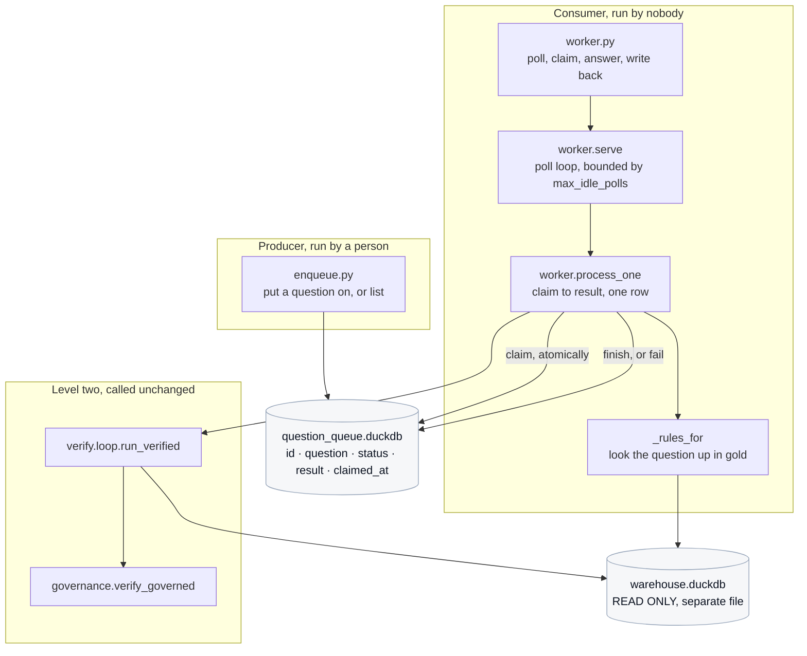
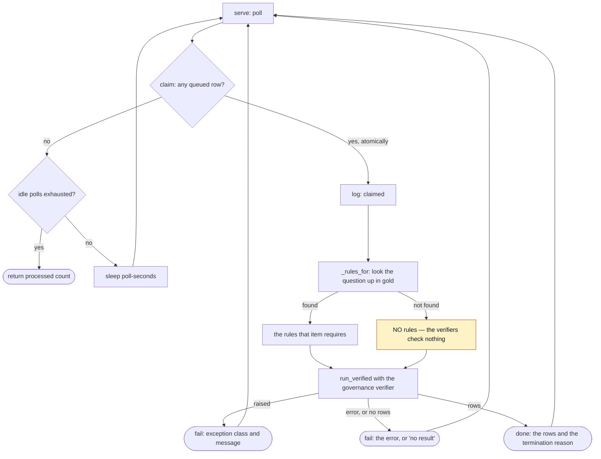

# Onboarding: Level 3, the event driven loop

**Read [the onboarding hub](../../ONBOARDING.md) first.** It carries the product overview,
the shared glossary, the machine setup for macOS, Windows, and Linux, the configuration
reference, and how the tests work. This document assumes you have done that and covers
only Level 3.

When you have read this and run the demo in section 10, you should be able to run a queue
and a worker on your own machine, explain what this level adds and — just as importantly —
what it deliberately does **not** add, name every omission and why each one is a decision
rather than a shortcut, and change the worker without quietly making a failure invisible.

---

## 0. Scope of this document, and what I inspected

Level 3 is the smallest loop level by line count and the one most likely to be
misunderstood, because **it adds no new check.** It removes the human.

### What I read to write this

| Area | Files inspected |
|---|---|
| Entry points | `demos/03_event_driven_loop/enqueue.py`, `worker.py`, and its `README.md` |
| The queue | `src/loopeng/queue/store.py`, in full |
| The worker | `src/loopeng/queue/worker.py`, in full |
| What it runs | `src/loopeng/verify/loop.py :: run_verified()`, `src/loopeng/verify/governance.py :: verify_governed()` |
| Rules lookup | `src/loopeng/gold/build.py :: build_gold()` |
| Tests | `tests/test_queue.py`, `tests/test_demo_structure.py` |

### What I deliberately excluded, and why

| Excluded | Why |
|---|---|
| The verification loop itself | [Level 2](../02_verification_loop/ONBOARDING.md). The worker calls it unchanged and adds nothing to it. |
| The agent loop, the model call, the retry triage | [Level 1](../01_agent_loop/ONBOARDING.md), reached through Level 2. |
| The sweep | [Level 4](../04_hill_climbing_loop/ONBOARDING.md). It has its own concurrency and does not use this queue. |
| Any web screen | There is none for this level. Both entry points are terminal only. |

---

## 1. Overview

**Level 3 adds no new class of check, and saying so plainly is the point.**
[Level 1](../01_agent_loop/ONBOARDING.md) can see a crash.
[Level 2](../02_verification_loop/ONBOARDING.md) can see a rule violation. Level 3 sees
nothing new. What it removes is the person.

Levels 1 and 2 run because somebody typed a command and read the output. Here a worker
claims work from a queue and answers it with no human in the path. That single change is
what turns everything Level 2 said about a verifier being a measuring instrument from **an
argument about measurement into an argument about what ships** — because with nobody
watching, the verifiers are the only thing standing between the queue and whatever consumes
the answers.

The implementation is deliberately minimal, and **the omissions are the point rather than
an apology**:

| Omitted | What that means when it happens |
|---|---|
| **No backoff** | A worker that cannot reach the model spins, and you see it |
| **No dead-lettering** | A failed row stays `failed`, where the evidence is visible |
| **No retry** | Nothing quietly tries again behind your back |

Those are the three things you would have to build before this went near production.
**Naming them is more useful than half-implementing them** — a half-built retry policy is
one that hides failures without fixing them, which is the same defect class this project
exists to demonstrate, applied to operations.

One consequence is visible and left visible: pressing Ctrl-C leaves an in-flight row
`claimed` forever. Nothing sweeps it up. That is what "no retry logic" actually looks like,
and hiding it would teach the wrong lesson.

---

## 2. Glossary

[The hub's glossary](../../ONBOARDING.md#2-glossary) defines the shared terms. These are
specific to Level 3.

| Term | Definition |
|---|---|
| **Queue** | A DuckDB table called `question_queue` with five columns, in **its own file**, separate from the warehouse. At `src/loopeng/queue/store.py :: SCHEMA`. |
| **Status** | One of `queued`, `claimed`, `done`, `failed`. There is no fifth, and no transition back out of `failed`. |
| **Claim** | Taking the oldest queued row and marking it `claimed`, atomically, in one statement. |
| **Poll** | The worker asking the queue for work. When there is nothing, it sleeps and asks again. |
| **Idle poll** | A poll that found nothing. `max_idle_polls` bounds them, which is how `--drain` and the tests terminate. |
| **Drain** | Process everything queued, then stop, rather than polling forever. |

---

## 3. Prerequisites

Everything in [the hub, section 3](../../ONBOARDING.md#3-prerequisites).

**There is no message broker.** No Redis, no RabbitMQ, no SQS, no Celery, nothing to
install and nothing to start. The queue is a table in a DuckDB file that is created on
connect. This is worth stating explicitly because "event driven" usually implies
infrastructure, and here it implies none.

An Anthropic API key is needed for the worker to actually answer anything. `enqueue.py`
needs no key at all, and section 10 runs the whole loop end to end with no key and no spend
by substituting the client.

---

## 4. Repository map

Level 3 is four files and roughly two hundred lines in total.

| Path | Responsibility | Lines |
|---|---|---|
| `demos/03_event_driven_loop/enqueue.py` | Put a question on the queue, or list it. | ~47 |
| `demos/03_event_driven_loop/worker.py` | Start the worker. Print the omissions on the way up. | ~42 |
| `src/loopeng/queue/store.py` | The table, the atomic claim, and the four status transitions. | ~113 |
| `src/loopeng/queue/worker.py` | Claim, look up rules, run the Level 2 loop, write the answer back. | ~83 |

---

## 5. Architecture and responsibilities

### The shape of it

Two processes that never call each other, sharing one file.



**The two databases are separate files, and that is load bearing.** The warehouse is opened
read-only by everything that touches it — a guarantee with its own test file. A queue needs
writes. Sharing one file would mean relaxing that guarantee, so it does not share one.

### Who owns what

**`store.claim()` owns the only genuinely hard part of a queue.** The claim is a single
`UPDATE ... RETURNING` whose `WHERE` clause selects the minimum queued id:

```sql
UPDATE question_queue SET status = 'claimed', claimed_at = now()
WHERE id = (SELECT MIN(id) FROM question_queue WHERE status = 'queued')
RETURNING id, question, status, result, claimed_at
```

Because it is **one statement**, two workers cannot claim the same row: whichever commits
first moves it out of `queued`, and the other's subquery finds nothing. That is the whole
of the concurrency story, and it is the one part of a queue worth getting right even in a
demo.

**`store.fail()` owns doing nothing further.** Its docstring is one line and it is the
level's thesis in miniature: *a failed row stays failed. Nothing sweeps it up, and that is
deliberate.*

**`worker.process_one()` owns the boundary between "this row failed" and "the worker
died".** It wraps the Level 2 call in a broad `except` and marks the row `failed` with the
exception class and message, because **a dead row must not kill the worker**. That is the
same shape as the trap's per-cell guard at [Level 1](../01_agent_loop/ONBOARDING.md): the
unit of failure is the item, not the run.

**`worker._rules_for()` owns an honest gap, and it is the most interesting function in the
area.** It looks the question up in the gold set to find which rules apply. A question that
is **not** in the gold set gets no rules — which means the verifiers check nothing.

That is honest rather than convenient. This demo answers the workshop's questions, and
inventing a rule set for an unknown question would be the verifier claiming a coverage it
does not have. Section 10 Part A shows exactly what that looks like from the outside, and
it is worth seeing, because from the outside it looks like success.

**`worker.serve()` owns termination.** `max_idle_polls` is what makes the loop bounded for
`--drain` and for tests; left as `None` it polls forever, which is the real deployment
shape.

**The entry point owns saying the omissions out loud.** `worker.py` prints them on the way
up, before any work happens:

```
worker up. polling every 2.0s. Ctrl-C to stop.
no backoff, no dead-lettering, no retry — a failed row stays failed.
```

---

## 6. Execution flow

### One row, claim to result



The amber box is the gap from section 5. Nothing downstream of it can tell that the
verifiers were handed nothing to check.

### The status transitions, in full

| From | To | By | Reversible? |
|---|---|---|---|
| — | `queued` | `enqueue()` | — |
| `queued` | `claimed` | `claim()`, atomically | No |
| `claimed` | `done` | `finish()` | No |
| `claimed` | `failed` | `fail()` | **No — deliberately** |
| `claimed` | *stays `claimed`* | the process being interrupted | Nothing picks it up |

There is no path out of `failed` and no path out of an abandoned `claimed`. Both are dead
ends on purpose, and both leave the evidence where you can see it.

### What the worker runs, and why it matters

`process_one()` calls `run_verified(...)` with `max_attempts=3` and
`verifier=verify_governed`. Two details:

- **It runs the Level 2 loop, not Level 1.** That is the teaching point of the stage, and
  `tests/test_queue.py :: test_the_worker_runs_the_level_2_loop_not_level_1` asserts it.
- **It uses the V2 governance verifier**, not the V1 default. So a rule declared in
  `semantic_model.yaml` with no check raises at import here — the build gate is in the path
  of the unattended worker, which is where it matters most.

---

## 7. Interfaces and data

### The table

```sql
CREATE TABLE IF NOT EXISTS question_queue (
    id         INTEGER PRIMARY KEY,
    question   VARCHAR   NOT NULL,
    status     VARCHAR   NOT NULL,
    result     VARCHAR,
    claimed_at TIMESTAMP
);
```

Five columns. `result` carries the answer on success and the reason on failure — one column
for both, which is the minimal choice and means a reader always looks in the same place.

**`id` is assigned by `SELECT COALESCE(MAX(id), 0) + 1`**, not by a sequence. That is a
race under concurrent producers, and it is the one place the concurrency story is
incomplete. It does not affect the claim, which is where correctness actually matters.

### What a finished row's `result` looks like

```
[[38]] (terminated: success)
```

The rows and the termination reason, formatted as one string. **Nothing parses this**, and
nothing should — it is for a person reading `enqueue.py --list`.

### The two command line surfaces

| Entry point | Flags |
|---|---|
| `enqueue.py` | `--question` (free text; defaults to a gold question), `--queue`, `--list` |
| `worker.py` | `--queue`, `--poll-seconds`, `--drain` |

`--drain` sets `max_idle_polls=1`, so the worker stops the first time it finds nothing.
Without it, the worker polls forever, which is the real shape.

### Files written

| File | Written by | Note |
|---|---|---|
| `question_queue.duckdb` | `store.connect()` on first use | Created if absent, schema applied every connect |

`store.connect()` also creates the parent directory, so `--queue` can point anywhere.

---

## 8. Configuration

[The hub, section 7](../../ONBOARDING.md#7-configuration) carries the full table. Level 3
reads three variables:

| Variable | Effect here |
|---|---|
| `ANTHROPIC_API_KEY` | Required for the worker to answer anything. `enqueue.py` does not need it. |
| `WAREHOUSE_PATH` | Which database the generated SQL runs against, and where the gold set is built from |
| `WAREHOUSE_SEED` | Which seed that warehouse is generated from |

Two constants behave like configuration:

| Constant | Where | Note |
|---|---|---|
| `DEFAULT_QUEUE_PATH` | `store.py` | `question_queue.duckdb`, in the working directory. Overridable with `--queue`. |
| `POLL_SECONDS` | `worker.py` | Two seconds. Overridable with `--poll-seconds`. |

**The queue path is deliberately not a settings field.** It is a flag with a default, not
an environment variable, so a second worker against a second queue is one argument rather
than an exported variable that outlives the shell.

---

## 9. Run it locally

Follow [the hub, section 6](../../ONBOARDING.md#6-run-it-locally) from a fresh clone.

Nothing needs migrating or seeding. The queue table is created on connect, the warehouse is
generated on first use, and the gold set is rebuilt from its patterns. Both entry points
cold start from an empty working directory, and `tests/test_demo_structure.py` runs each
one to prove it.

---

## 10. Demo

### Part A: the whole loop, free, no key, no network

The worker takes a `client` argument that it passes straight through to Level 2, so you can
run a real queue against the real warehouse with no API call.

Two questions are queued: one from the gold set, and one that is not.

```bash
uv run python -c "
from types import SimpleNamespace
from pathlib import Path
from loopeng.queue import store, worker
from loopeng.settings import load_settings
from loopeng.warehouse.connect import ensure_warehouse
from loopeng.gold.build import build_gold

class Scripted:
    def __init__(self, sql): self.sql = sql
    @property
    def messages(self): return SimpleNamespace(create=self._c)
    def _c(self, **kw):
        return SimpleNamespace(content=[SimpleNamespace(type='text', text=self.sql)],
                               usage=SimpleNamespace(input_tokens=900, output_tokens=40))

s = load_settings()
w = ensure_warehouse(s.warehouse_path, seed=s.warehouse_seed)
q = Path('demo_queue.duckdb')
if q.exists(): q.unlink()
con = store.connect(q)
store.enqueue(con, build_gold(w)[0].question)
store.enqueue(con, 'a question that is not in the gold set')
print('queued:', store.counts(con))
client = Scripted(\"SELECT COUNT(*) FROM products WHERE category = 'apparel'\")
print('processed:', worker.serve(con, w, poll_seconds=0.01, max_idle_polls=1, client=client))
for row in store.all_rows(con):
    print(f'  {row.id}  {row.status:8s}  {row.question[:52]}')
    if row.result: print(f'       -> {row.result[:80]}')
print(store.counts(con))
"
```

**Actual output, captured** (the structlog lines are the worker's own):

```
queued: {'queued': 2}
2026-08-03 02:18:27 [info     ] claimed                        id=1 question='How many products do we sell in the apparel range?'
2026-08-03 02:18:27 [info     ] done                           id=1 termination=success
2026-08-03 02:18:27 [info     ] claimed                        id=2 question='a question that is not in the gold set'
2026-08-03 02:18:27 [info     ] done                           id=2 termination=success
processed: 2
  1  done      How many products do we sell in the apparel range?
       -> [[38]] (terminated: success)
  2  done      a question that is not in the gold set
       -> [[38]] (terminated: success)
{'done': 2}
```

**Sit with row 2.** It is not in the gold set, so `_rules_for()` returned an empty tuple, so
the verifiers had nothing to check. The row reads `done`, `termination=success`, and carries
a confident number — **the same number as row 1**, because the scripted model answered both
with the same query.

From the outside those two rows are indistinguishable. Nothing in the queue, the log, or
the result column records that one of them was verified against six declared rules and the
other against none. **That is the honest gap named in section 5, and this is what it looks
like from where a consumer stands.**

It is the whole argument for Level 3 in one output: with nobody watching, the verifiers are
the only thing between the queue and whatever consumes the answers — and a question outside
their coverage passes through looking exactly like one inside it.

### Part B: a failed row stays failed

```bash
uv run python -c "
from types import SimpleNamespace
from pathlib import Path
from loopeng.queue import store, worker
from loopeng.settings import load_settings
from loopeng.warehouse.connect import ensure_warehouse

class Broken:
    @property
    def messages(self): return SimpleNamespace(create=self._c)
    def _c(self, **kw):
        return SimpleNamespace(content=[SimpleNamespace(type='text', text='SELECT * FROM nope')],
                               usage=SimpleNamespace(input_tokens=900, output_tokens=10))

s = load_settings(); w = ensure_warehouse(s.warehouse_path, seed=s.warehouse_seed)
q = Path('fail_queue.duckdb')
if q.exists(): q.unlink()
con = store.connect(q)
store.enqueue(con, 'something the model cannot answer')
worker.serve(con, w, poll_seconds=0.01, max_idle_polls=1, client=Broken())
for row in store.all_rows(con):
    print(f'{row.id}  {row.status}')
    print(f'   -> {row.result[:120]}')
print(store.counts(con))
print()
print('--- re-running the worker: nothing picks it up ---')
print('processed:', worker.serve(con, w, poll_seconds=0.01, max_idle_polls=1, client=Broken()))
print(store.counts(con))
"
```

**Actual output, captured** (worker log lines removed for length):

```
1  failed
   -> CatalogException: Catalog Error: Table with name nope does not exist!
Did you mean "orders"?

LINE 1: SELECT * FROM nope
{'failed': 1}

--- re-running the worker: nothing picks it up ---
processed: 0
{'failed': 1}
```

**Two things to observe.** The failure reason is the database's own words, kept verbatim in
the `result` column — the evidence is in the row, not in a log that has scrolled away. And
the second run processed **zero**: nothing retries, nothing dead-letters, nothing sweeps it
up. The row sits there until a person looks at it.

That is a design decision, not a missing feature. A queue that quietly retried would have
turned this into an intermittent cost with no artefact.

### Part C: the atomic claim

```bash
uv run pytest "tests/test_queue.py::test_a_row_can_only_be_claimed_once" -q
```

**Actual output, captured:**

```
.                                                                        [100%]
1 passed in 0.97s
```

This is the one correctness property of the queue, and it is a test rather than a comment.

### Part D: the live runs

```bash
uv run python demos/03_event_driven_loop/enqueue.py
uv run python demos/03_event_driven_loop/worker.py --drain
uv run python demos/03_event_driven_loop/enqueue.py --list
```

`enqueue.py` costs nothing and needs no key — it builds the gold set to pick a default
question, which is offline.

`Unverified:` the worker command bills, so I did not run it. Parts A and B above are the
same worker, the same queue, and the same Level 2 loop against the real warehouse, with only
the model call substituted.

**What to expect:** the worker prints its two-line banner, then one structured log line per
claim and per result. With `--drain` it stops at the first empty poll and prints the final
counts. Without it, press Ctrl-C — and then run `--list`: any row that was in flight is
still `claimed`, and the entry point says so.

---

## 11. Observability

This is the only level whose observability is genuinely **logs**, because there is no human
reading a terminal by design and no artefact file to inspect afterwards.

### Logging

| Event | Level | Fields | Emitted at |
|---|---|---|---|
| `claimed` | info | `id`, `question` (truncated) | `worker.process_one()`, immediately after a successful claim |
| `done` | info | `id`, `termination` | `process_one()`, after a row is finished |
| `failed` | warning | `id`, `reason` | `process_one()`, when the run produced no usable result |
| `failed` | error | `id`, `error` | `process_one()`, when the Level 2 call raised |

**`failed` is emitted at two different levels with two different field names**, which is a
real distinction: a warning means the model could not answer, an error means the machinery
broke. They share a name, which makes filtering on it slightly awkward — noted in section 15.

`model_call_refused` and `model_call_failed` reach you from
[Level 1](../01_agent_loop/ONBOARDING.md) through the loop, unchanged.

**There are no metrics**, so `store.counts(con)` is the closest thing to one — and it is a
query you run, not something emitted.

### What healthy looks like

- One `claimed` line, then one `done` line, per row, in pairs.
- `store.counts(con)` trending toward `{'done': n}`.
- With the queue empty, silence — the worker is sleeping between polls and says nothing.

### What unhealthy looks like

- **Rapid repeated log lines with no `done`** — the worker is spinning. There is no backoff,
  which is exactly why you can see this.
- **Rows accumulating in `failed`** — read the `result` column. The reason is in the row.
- **A row stuck in `claimed` with nothing happening** — the worker was interrupted mid-row.
  Nothing will pick it up.
- **`done` rows whose result looks wrong** — check whether the question is in the gold set.
  If it is not, no rules were checked, and section 10 Part A is what that looks like.

---

## 12. Troubleshooting

Shared rows are in
[the hub, section 11](../../ONBOARDING.md#11-troubleshooting-shared-across-areas).

| Symptom | Likely cause | Diagnostic | Fix |
|---|---|---|---|
| The worker prints its banner and then nothing | The queue is empty. | `uv run python demos/03_event_driven_loop/enqueue.py --list` | Queue something. Silence on an empty queue is correct. |
| A row is stuck in `claimed` | The worker was interrupted while holding it. | `--list` shows the status and `claimed_at`. | Nothing will pick it up. This is what no retry logic looks like. Re-queue the question if you still want it answered. |
| A row went straight to `failed` with a `CatalogException` | The model wrote SQL against a table that does not exist. | The reason is in the `result` column, verbatim. | Usually a model problem, not a harness one. |
| Rows go to `failed` with `MissingCredential` | No key. | `cat .env` | Set `ANTHROPIC_API_KEY`. Run [preflight](../00_preflight/ONBOARDING.md) first. |
| `UnenforcedRule` on worker start-up | A rule was added to `semantic_model.yaml` with no check. | The message names the rules. | Add the check. The worker uses the V2 governance verifier, so the build gate is in its path. See [Level 2](../02_verification_loop/ONBOARDING.md). |
| An answer looks unverified | The question is not in the gold set, so no rules applied. | Compare the question text against `build_gold()`. Matching is on stripped exact text. | This is deliberate. Inventing rules for an unknown question would claim coverage that does not exist. |
| A question you know is in the gold set gets no rules | The text differs by more than whitespace. | `_rules_for()` compares `question.strip()` exactly. | Copy the question verbatim from the gold set. |
| Two workers seem to double-answer a row | They cannot, for the claim. | `test_a_row_can_only_be_claimed_once`. | If you genuinely see it, the claim is no longer one statement. That is a serious regression. |
| `--drain` exits before answering anything | It stops at the first idle poll, and an empty queue is idle immediately. | `--list` before running. | Queue first, then drain. |
| The worker spins hard against a rate limit | No backoff at this level. | Repeated `model_call_failed` warnings from Level 1. | Level 1's own backoff still applies per call. If it persists, stop the worker — this level has no policy for it, by design. |

---

## 13. Testing

```bash
uv run pytest tests/test_queue.py -q
```

**Actual output, captured:**

```
..............                                                           [100%]
14 passed in 1.01s
```

Fourteen tests over roughly two hundred lines of source is a high ratio, and it is because
most of what this level asserts is that something **does not** happen.

### What is asserted, grouped by the property it protects

| Property | Test |
|---|---|
| A row round-trips from enqueue to claim | `test_enqueue_then_claim_round_trips` |
| An empty queue yields nothing rather than blocking | `test_claiming_an_empty_queue_returns_none` |
| **A row can only be claimed once** | `test_a_row_can_only_be_claimed_once` |
| Claims are ordered | `test_claims_are_taken_oldest_first` |
| **A failed row stays failed** | `test_a_failed_row_stays_failed` |
| A finished row is not reclaimed | `test_a_finished_row_is_not_reclaimed` |
| **An interrupted row stays claimed** | `test_an_in_flight_row_stays_claimed` |
| **The worker runs Level 2, not Level 1** | `test_the_worker_runs_the_level_2_loop_not_level_1` |
| **There is no backoff or retry** | `test_the_worker_has_no_backoff_or_retry` |
| A queued question is answered end to end | `test_the_worker_answers_a_queued_question` |
| A broken question is marked failed rather than killing the worker | `test_the_worker_marks_a_broken_question_failed` |
| `serve` terminates when told to | `test_serve_drains_and_stops`, `test_serve_on_an_empty_queue_returns_immediately` |
| **The queue does not share the warehouse file** | `test_the_queue_lives_in_its_own_file` |

The five in bold are tests that an omission **stayed** omitted. That is unusual and worth
noticing: this level's design decisions are enforced, not just documented, so somebody
adding a well-meaning retry has to delete a test that says not to.

The single test double is `ScriptedClient`, which returns fixed SQL. No containers, no
broker, no fixtures beyond a temporary directory.

### Visible coverage gaps

1. **No test exercises two workers racing for real.** The single-claim property is asserted
   by claiming twice in sequence, which is the right shape for the SQL but is not a
   concurrency test.
2. **`enqueue()`'s `MAX(id) + 1` race is untested and real.** Two producers inserting
   simultaneously could collide on the primary key.
3. **Neither entry point's `main()` is tested for flag handling**, including `--drain` and
   `--list`. `tests/test_demo_structure.py` covers cold start only.
4. **The Ctrl-C path is asserted at the store level, not through `serve()`.**
   `test_an_in_flight_row_stays_claimed` claims a row and checks it stays claimed; nothing
   interrupts a running `serve()`.

---

## 14. Changing this code safely

### Low risk to modify

- **`POLL_SECONDS` and `DEFAULT_QUEUE_PATH`.** Both are already flags with defaults.
- **The `result` string format** in `finish()`. Nothing parses it.
- **The listing layout** in `enqueue.py`. Nothing parses that either.
- **The banner text** in `worker.py`, provided it keeps naming the three omissions. That
  banner is the only warning an operator gets.
- **Adding a status *query*** — a `counts_by_age()` or similar. Reads are free.

### Load bearing, and why

- **`claim()` being one statement.** Splitting it into a `SELECT` then an `UPDATE`
  reintroduces the double-claim race that the single statement rules out. This is the one
  correctness property of the queue.
- **`fail()` doing nothing but set the status.** Adding a retry, a backoff, or a
  dead-letter path removes the visible evidence this level exists to show — and three tests
  assert the omissions stayed omitted, so it cannot be done accidentally.
- **The broad `except` in `process_one()`.** Narrowing it means one malformed row kills the
  worker and everything behind it stops.
- **`_rules_for()` returning an empty tuple for an unknown question.** Making it guess would
  be the verifier claiming coverage it does not have — which is the defect this whole
  project demonstrates, committed by the thing built to prevent it.
- **The worker calling `run_verified` rather than `run_question`.** Dropping to Level 1 here
  removes every rule check from the unattended path. A test names this.
- **`verifier=verify_governed`.** This is what puts the build gate in the unattended path.
- **The queue being a separate DuckDB file.** Sharing the warehouse file means opening it
  writable, which breaks a Phase 0 guarantee with its own test file.
- **`serve()`'s `max_idle_polls` defaulting to `None`.** Giving it a numeric default would
  make the real deployment shape — poll forever — the unusual case.

### What depends on the current behaviour

| Depends on | What it consumes |
|---|---|
| **`src/loopeng/views/agent.py`** | `store.connect()`, `all_rows()`, `counts()`, and `enqueue()` — the AGENT screen is a **second producer** |
| `demos/03_event_driven_loop/README.md` | The status names, the omissions, and the diagram |
| The root `README.md` | The same diagram, byte identical |
| `tests/test_demo_structure.py` | Both entry points cold starting from an empty directory |
| Any `question_queue.duckdb` already on disk | The five-column schema |

**The AGENT screen is the one non-obvious consumer, and it matters twice over.** It enqueues
questions typed into a browser, which means `enqueue.py` is not the only producer — so the
id-assignment race in section 15 is reachable by a person clicking a button while a script
runs, not only in theory. It also means a change to the schema breaks a screen that lives in
[the views area](../ONBOARDING-views.md), not in this one.

The `store` module has consumers; `worker.py` has none. Nothing in `src/loopeng/` imports
the worker, so the *consuming* half of this level is a leaf while the *queue* half is not.

### Pre merge checklist

The repository-wide list is in
[the hub, section 12](../../ONBOARDING.md#12-changing-this-code-safely-the-repository-wide-rules).
Three additions for this area:

1. **If you are adding retry, backoff, or dead-lettering, you are deleting a test that says
   not to.** Read that test first and be sure the omission is no longer the point.
2. If you touched `claim()`, confirm it is still a single statement, and re-read
   `test_a_row_can_only_be_claimed_once` to check it still tests what it claims to.
3. If you touched the diagram in `demos/03_event_driven_loop/README.md`, it must stay byte
   identical to the copy in the root `README.md`.

---

## 15. Open questions and assumptions

### Questions for the team

1. **`enqueue()` assigns ids with `SELECT COALESCE(MAX(id), 0) + 1`.** Two producers
   inserting at once can collide on the primary key. The claim is safe; the insert is not.
   This is not hypothetical: `src/loopeng/views/agent.py` enqueues from a browser button, so
   a person clicking while a script runs is two producers. **Should the id come from a
   sequence?**

2. **`failed` is logged at both warning and error level under the same event name.** The
   distinction is real — the model could not answer, versus the machinery broke — but a
   filter on `event == "failed"` cannot tell them apart without also reading the level.
   **Should they be two event names?**

3. **`_rules_for()` rebuilds the entire gold set on every row.** `build_gold()` is cached, so
   this is probably cheap, but it is a full build inside the hot path of a worker.
   **Should the lookup be built once at start-up?**

4. **Nothing reclaims an abandoned `claimed` row, and there is no tooling to do it by hand
   either.** The demo is right to leave it visible. **Should there be a
   `--requeue-stale` flag on `enqueue.py`, or does adding one weaken the lesson?**

5. **There is no web screen for this level**, while every other level has one. **Is that
   deliberate — because the point is that nobody is watching — or a gap?**

### Assumptions I made, and the evidence

| Assumption | Evidence it rests on |
|---|---|
| The single-statement claim is safe under concurrent workers. | DuckDB's handling of `UPDATE ... RETURNING` with a subquery predicate, as described in `store.py`'s own docstring. I did not run two workers concurrently against one file. |
| `build_gold()` is cached, so the per-row rebuild is cheap. | `gold/build.py` carries `read_cache`/`write_cache` and a `cache_key(seed)`. I read the caching path, not a timing measurement. |
| The live worker's output shape in section 10 Part D. | Read off `worker.py`'s print statements and the structlog events. Not executed, because it bills. |
| `views/agent.py` is the only consumer of `store` outside this level. | Searched the source tree for `loopeng.queue` imports: `queue/worker.py` and `views/agent.py`, and nothing else. |

### Things I verified by executing them

Every command in section 10 Parts A, B, and C was run on macOS from this checkout, and the
blocks marked **Actual output, captured** are what they printed — Part B with the worker's
log lines removed for length, which is noted at that point. Part D's worker command is
marked `Unverified:` because it makes billed API calls.
