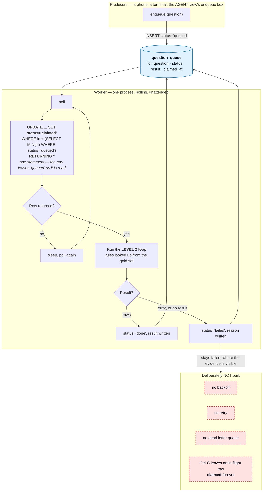

# Stage 03 — The Event-Driven Loop (Level 3)

> Folder numbers are **loop levels and session stage order**, not phase numbers.
> New to the vocabulary? Read [`demos/README.md`](../README.md) first.
>
> **Built after the verification loop, deliberately.** The teaching point below only
> works once the verifiers exist.

---

## Purpose

**Take the human out of the path, and show what that does to the argument about
verifiers.**

A question goes onto a queue. A worker claims it, runs the **Level 2 loop**, and writes
the answer back. Nobody reads the output, nobody approves anything, nobody decides whether
the answer was good enough — the verifiers do, alone.

That is why this stage is built after Level 2 rather than before it. On its own a queue is
plumbing. What it demonstrates here is that **everything Stage 02 said about a verifier
being a measuring instrument stops being an argument about measurement and becomes an
argument about what ships.**

**This stage is single-writer, and the runbook is enqueue-then-drain.** DuckDB takes an
exclusive lock per database file, so a polling worker and a live submitter cannot coexist.
See the boxed note under *Run it COLD* — and the captured lock error under
*Troubleshooting*, which is what the old two-terminal runbook actually produced.

---

## Prerequisites specific to this stage

| | |
|---|---|
| **API key** | **Required by `worker.py`** — it runs the Level 2 loop, which calls a model. **Not required by `enqueue.py`**, which provably makes no call and says so in its own source: it loads settings with `require_credential=False`. |
| **Earlier stages** | None. The queue table is created on first connect and the warehouse is generated on first use. |
| **Cost** | One Level 2 run per queued question, so per-question cost matches stage 02. The difference is that **nothing here is bounded by someone's attention** — the worker keeps claiming rows until the queue is empty. Enqueue a small number of questions. |

**Which commands here are free.** `enqueue.py` in every form — writing a row, and
`--list` — plus `--help` on both entry points. Everything `worker.py` does spends.

The queue lives in its own DuckDB file, separate from the warehouse, and defaults to
`question_queue.duckdb` in the working directory. The warehouse is opened read-only by
everything that touches it and a queue needs writes; sharing one file would mean relaxing
that guarantee.

---

## What this level ADDS

Nobody watching.

Levels 1 and 2 run because a person typed a command and read the output. Here a worker
polls a queue, claims a question, runs the **Level 2 loop**, and writes the answer back
— with no human in the path.

That is the whole point, and it is a point about **Level 2** rather than about queues:

> **The verifiers are now the only thing standing between the queue and whatever
> consumes these answers.**

Everything the previous stage said about a verifier being a measuring instrument stops
being an argument about measurement and becomes an argument about what ships.

### The control flow



**The claim is atomic within the process, and there is only ever one process.** The
`UPDATE ... RETURNING` is a single statement, so the row leaves `queued` in the same
breath as it is read — no window exists in which two readers could both see it queued.

**That guarantee is real and it is not the interesting one.** DuckDB takes an exclusive
write lock per database file, so a second process cannot open this queue at all: it fails
at connect with `IOException: Could not set lock on file`. "Two workers cannot claim the
same row" was the original wording here, and it described a race that the storage engine
makes unreachable. Concurrency across workers would need SQLite in WAL mode or Postgres,
and is a non-goal — see the root README §16.

**The omissions in red are the point, not an apology.** No backoff — a worker that cannot
reach the model spins and you see it. No dead-lettering — a failed row stays `failed`
where the evidence is visible. No retry — nothing quietly tries again behind your back.
Those are the things you would have to build before this went near anything real, and
**naming them is more useful than half-implementing them**.

The queue lives in its own DuckDB file, separate from the warehouse. The warehouse is
opened read-only by everything that touches it and a queue needs writes; sharing one file
would mean relaxing that guarantee.

A question that is not in the gold set gets **no rules**, which means the verifiers check
nothing for it. That is honest rather than convenient: inventing a rule set for an unknown
question would be the verifier claiming a coverage it does not have.

---

## What this level COSTS

One Level 2 run per queued question, so per-question cost matches stage 02. The
difference is that **nothing here is bounded by someone's attention** — the worker keeps
claiming rows until the queue is empty.

Enqueue a small number of questions for the demo. The meter is the same as everywhere:
tokens measured, dollars estimated, `est.` prefix, every call counted.

Stop the worker with Ctrl-C. An in-flight row stays `claimed`; that is a visible
consequence of having no retry logic, and it is worth showing rather than hiding.

---

## Run it COLD

No prior step required. The queue table is created on first connect.

**One terminal.** Set the font size large **before** the session — the event-driven
terminal is not a "view", so it gets missed in the legibility check.

> **This stage used to say "two terminals", and it could never have worked.** A worker
> polling in one terminal while you submit from another is the obvious shape for this
> demo, and DuckDB forbids it: the lock is exclusive per database file, and the worker
> holds its connection open for its whole life, sleeping between polls. The second
> terminal dies at connect with
> `IOException: Could not set lock on file … Conflicting lock is held`.
>
> The order below is the honest one. Each command opens the queue, does its work, and
> releases it. The handoff the stage is about is still real — it just happens between
> two processes that take turns rather than two that overlap.

### 1 — submit a question

```bash
uv run python demos/03_event_driven_loop/enqueue.py \
  --question "What share of beauty orders ended up with a refund?"

# see the whole queue and its status counts
uv run python demos/03_event_driven_loop/enqueue.py --list

# defaults to a gold question if you omit --question
uv run python demos/03_event_driven_loop/enqueue.py
```

**What appears:** `queued id=N` and the status counts. Nothing is running to pick it
up yet, and the row sits in `queued` — which is the point. A queue whose consumer is
down has not lost your question.

**Captured, verbatim, 2026-08-03** — three real commands against a fresh queue file, with
no API key set, because none is needed:

```text
$ uv run python demos/03_event_driven_loop/enqueue.py --question "What share of beauty orders ended up with a refund?"
queued id=1: What share of beauty orders ended up with a refund?
queue now: {'queued': 1}

$ uv run python demos/03_event_driven_loop/enqueue.py
queued id=2: How many products do we sell in the apparel range?
queue now: {'queued': 2}

$ uv run python demos/03_event_driven_loop/enqueue.py --list
    1  queued    What share of beauty orders ended up with a refund?
    2  queued    How many products do we sell in the apparel range?

  {'queued': 2}
```

All three exited `0`. Note the second one: with no `--question` it enqueues the first gold
question, which is how you demo this stage when nobody in the room has submitted anything.
Note also that both rows are still `queued` — **nothing has run**, and that is the state
this stage starts from.

### 2 — the worker

```bash
uv run python demos/03_event_driven_loop/worker.py --drain
```

**What appears:** `worker up.`, then `claimed`, then the Level 2 loop running, then
`done` or `failed` — and it exits once the queue is empty. No backoff, no
dead-lettering, no retry, and the worker says so on startup.

**What to observe:** the handoff. Nobody typed the question into this command; it read
it out of a table a different process wrote, and decided on its own whether the answer
was good enough to write back.

**Polling forever** — `worker.py` with no `--drain` — is the same loop without the exit
condition. Run it *instead of* step 2, and submit beforehand: while it polls it holds
the queue file, so nothing else can write to it.

**The question to sit with:** *the verifiers just decided, alone, whether that answer was
good enough to write back. Would you have shipped what they accepted?*

### Draining, versus polling forever

`--drain` stops once the queue is empty. **That is the form the runbook above uses, and it
is not a compromise for the sake of the dry run** — it is the only form that lets you
enqueue anything afterwards, because a polling worker holds the queue file for its whole
life.

Polling forever is still worth showing, and there is a way to do it that stays honest:
**enqueue everything first, then start the polling worker and leave it up.** The waiting
is the demonstration — a process sitting there with nobody watching it is the whole point
of the level — but understand what you have given up. Nothing can add a row while it
polls, including the enqueue box in the AGENT view, and anything that tries gets the lock
error captured under *Troubleshooting*.

If the room is going to submit questions live, drain.

### If the room cannot reach the enqueue box

There are three paths to a phone and they degrade in this order. **Test the first two
during the dry run**, because the third is the only one that always works.

1. **Share link** — a public tunnel URL, shown with a QR in the AGENT view. Nobody types
   a URL off a projector, so the QR is the actual mechanism.
2. **LAN address** — the laptop's own IP, also shown with a QR. **Many conference access
   points enable client isolation**, which blocks device-to-device traffic and makes this
   fail precisely where it is most needed. Assume nothing.
3. **Shouted from the room, typed by someone who is not the presenter.** Hand the
   keyboard to a person in the front row.

**The third path is not a failure, and this runbook is explicit about that** so nobody
has to improvise an apology. The teaching point of this stage is that **nobody is
watching the worker** — how a row reached the queue is irrelevant to that. A question
typed by an audience member demonstrates it exactly as well, and arguably better, because
the room watches the row appear and then get claimed.

**What you must not do** is type the question yourself and narrate it as though the room
submitted it. Say what happened: *"the wifi is not letting your phones reach my laptop,
so shout it and someone here will type it — watch the worker pick it up."*

### Configuration options

Read from the argparse declarations. The full `--help` output for both entry points is
captured verbatim in
[`captures/03-event-driven-loop-help.txt`](captures/03-event-driven-loop-help.txt).

**`enqueue.py`** — makes no model call, needs no key

| flag | default | what it does |
|---|---|---|
| `--question` | *(the first gold question)* | Free text. Anything not in the gold set gets **no rules**, so the verifiers check nothing for it — see the Limitations below. |
| `--queue` | `question_queue.duckdb` | Path to the queue database. Its own file, deliberately separate from the read-only warehouse. |
| `--list` | off | Print every row and the status counts, then exit. Writes nothing. |

**`worker.py`** — runs the Level 2 loop, needs a key

| flag | default | what it does |
|---|---|---|
| `--queue` | `question_queue.duckdb` | Must be the same path `enqueue.py` wrote to. |
| `--poll-seconds` | `2.0` | How long it sleeps between polls when the queue is empty. |
| `--drain` | off | Stop once the queue is empty instead of polling forever. **This is the flag the runbook above uses**, because a polling worker holds the queue file and nothing else can write to it. |

Both default to the same queue path, so in practice you only pass `--queue` when you want
a throwaway queue for a rehearsal.

### Expected output — what is captured, and what is not

**Captured: everything `enqueue.py` does** — above, verbatim. It is the whole free half of
this stage.

**Not captured: `worker.py` succeeding.** It makes live model calls, so nothing on this
page quotes a successful drain. What it prints, from its own source: a `worker up.` line
naming its poll interval, then the no-backoff/no-dead-lettering/no-retry disclaimer, then
the Level 2 loop's output per claimed row, then a `drained.` line with the number of rows
processed and the final status counts. **Read your own output.**

**Captured: the keyless failure**, 2026-08-03, from a clean directory:

```text
$ uv run python demos/03_event_driven_loop/worker.py --drain

ANTHROPIC_API_KEY is not set. Add ANTHROPIC_API_KEY=<your key> to .env (see .env.example).

```

Exit `1`, stderr, and **the queue was never opened** — the credential is checked before
the connection, so a keyless worker cannot leave a lock behind.

**Captured: the DuckDB lock**, in full, in
[`captures/03-event-driven-loop-queue-lock.txt`](captures/03-event-driven-loop-queue-lock.txt).
That is the error the two-terminal runbook produced, reproduced deliberately.

---

## Expected SHAPE — and what to say if it does not appear

A row moving through its states — `queued`, `claimed`, then `done` or `failed` — with the
worker log showing a claim and a result. The satisfying part is that nobody typed the
question into the worker: it read it out of a table a different process wrote, and decided
on its own whether the answer was good enough to write back.

### If the shape does not appear

*If a row sticks in `claimed`*, that is the no-retry design showing itself. Say so: the
row is stuck because nothing was built to un-stick it, and that is the honest state of a
queue with no dead-letter path.

*If the worker claims nothing*, check the queue actually has a `queued` row — the enqueue
script prints the id it wrote, and `--list` shows the counts. **A silent worker with an
empty queue looks identical to a broken one**, which is itself worth a sentence about
observability.

*If a question fails verification repeatedly*, it lands in `failed` and stays. Point at
it. A queue that quietly drops what it cannot handle is worse than one that leaves the
evidence where you can see it.

*If a submitted question is not in the gold set*, the verifiers check nothing for it and
it will almost certainly come back `done`. Say that out loud — an unverified answer that
looks identical to a verified one is this stage's version of the silent error.

*If nobody in the room can read the terminal*, that is the legibility check failing, not
the demo. This stage is not a "view", so it gets missed in the pass that fixes font sizes.
Fix it before the session, not during it.

---

## Troubleshooting — the real failure text

**`ANTHROPIC_API_KEY is not set. Add ANTHROPIC_API_KEY=<your key> to .env (see
.env.example).`** — `worker.py` only, captured above. Exit 1, stderr, nothing billed and
no lock taken. `enqueue.py` never prints this: it needs no credential.

**`_duckdb.IOException: IO Error: Could not set lock on file "…question_queue.duckdb":
Conflicting lock is held in … by user …`** — **the defining failure of this stage.**
Something else already has the queue open. The full traceback is captured in
[`captures/03-event-driven-loop-queue-lock.txt`](captures/03-event-driven-loop-queue-lock.txt).

Almost always one of:

- a polling `worker.py` (no `--drain`) is still running and holding the file for its whole
  life. That is why the runbook drains rather than polls. `Ctrl-C` it.
- a Gradio view with the enqueue box is open. It opens and releases the queue per action,
  so it coexists with `enqueue.py` — but not with a polling worker.
- a previous run did not exit cleanly. The lock message names the PID; check it is really
  gone before deleting anything.

**Do not "fix" this by running two workers.** It is not a race condition and there is
nothing to tune. DuckDB's lock is exclusive per file, by design; concurrency across
workers needs a different engine and is a stated non-goal.

**`worker.py` claims nothing and just sleeps.** The queue has no `queued` row. Run
`enqueue.py --list` and read the counts. **A silent worker with an empty queue looks
identical to a broken one**, which is itself worth a sentence about observability.

**A row is stuck in `claimed` forever.** A worker was interrupted mid-flight. There is no
reaper, no retry and no dead-letter path — on purpose — so nothing will pick it up. That
is the design showing itself rather than a fault to work around.

**A question comes back `done` suspiciously fast and looks unverified.** It probably is.
A question that is not in the gold set gets no rules, so the verifiers check nothing for
it. See the Limitations below.

**Imports fail after a successful `uv sync`** — iCloud-synced checkout; see
`src/loopeng/env_guard.py`.

---

## Limitations — what this stage does not show

- **It is single-writer, and that is a non-goal rather than a bug.** DuckDB locks the
  database file exclusively, so exactly one process holds the queue at a time and this
  stage runs as enqueue-then-drain. The `UPDATE … RETURNING` claim is still atomic, but
  atomicity *across workers* is a guarantee about a situation that cannot arise here.
  Making it real means SQLite in WAL mode or Postgres.
- **No backoff, no retry, no dead-letter queue, no reaper.** All four are deliberately
  absent and all four are drawn in red in the diagram above. They are what you would have
  to build before this went near anything real, and naming them is more useful than
  half-implementing them.
- **It adds no new class of check.** Levels 1 and 2 each let a loop see a failure it could
  not see before. This level removes the human and adds nothing — which is precisely the
  uncomfortable part.
- **A question outside the gold set is effectively unverified.** It gets no rules, so the
  verifiers have nothing to check and it will almost certainly come back `done`. That is
  honest rather than convenient — inventing a rule set for an unknown question would be
  the verifier claiming coverage it does not have — but it means an audience-submitted
  question is a demonstration of the *handoff*, not of verification.
- **There is no view for this stage, on purpose.** A browser tab implies a person
  supervising it, and the entire point is that nobody is.
- **Nothing measures anything here.** No rates, no intervals, no comparison. Stage 04 is
  where measurement happens.

---

## Where to go next

| | |
|---|---|
| the deep-dive on this stage | [`ONBOARDING.md`](ONBOARDING.md) |
| the vocabulary this page assumes | [`demos/README.md`](../README.md) |
| the whole project | [the root README](../../README.md) |
| this stage in the root README | [§11 Stage 3](../../README.md#11--running-each-demo) |
| why single-writer is a non-goal | [root README §16 Limitations](../../README.md#16--limitations) |
| what a production queue would need | [root README §17](../../README.md#17--future-improvements) |
| **previous stage** — the verifiers this worker relies on | [`02_verification_loop/`](../02_verification_loop/README.md) |
| **next stage** — measuring which configuration is better | [`04_hill_climbing_loop/`](../04_hill_climbing_loop/README.md) |

---

## Where the code lives

| you are looking for | it is in |
|---|---|
| the queue table, the atomic claim, `done`/`failed` | `src/loopeng/queue/store.py` |
| the polling worker and what it does with a failure | `src/loopeng/queue/worker.py` |
| the Level 2 loop it runs | `src/loopeng/verify/loop.py` |
| the room's enqueue box and the QR | `src/loopeng/views/agent.py` |
