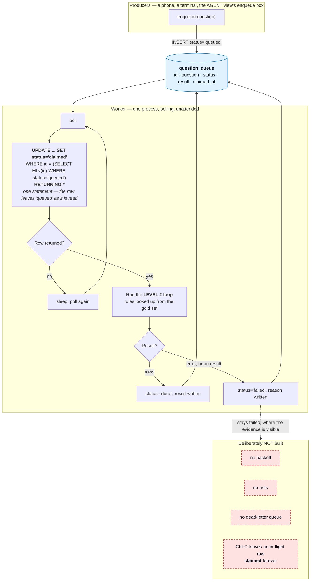

# Stage 03 — The Event-Driven Loop (Level 3)

> Folder numbers are **loop levels and session stage order**, not phase numbers.
> New to the vocabulary? Read [`demos/README.md`](../README.md) first.
>
> **Built after the verification loop, deliberately.** The teaching point below only
> works once the verifiers exist.

---

## What this level ADDS

Nobody watching.

Levels 1 and 2 run because a person typed a command and read the output. Here a worker
polls a queue, claims a question, runs the **Level 2 loop**, and writes the answer back
— with no human in the path.

That is the whole point, and it is a point about **Level 2** rather than about queues:

> **The verifiers are now the only thing standing between the queue and whatever
> consumes these answers.**

Everything the previous stage said about a verifier being a measuring instrument stops
being an argument about measurement and becomes an argument about what ships.

### The control flow



**The claim is atomic within the process, and there is only ever one process.** The
`UPDATE ... RETURNING` is a single statement, so the row leaves `queued` in the same
breath as it is read — no window exists in which two readers could both see it queued.

**That guarantee is real and it is not the interesting one.** DuckDB takes an exclusive
write lock per database file, so a second process cannot open this queue at all: it fails
at connect with `IOException: Could not set lock on file`. "Two workers cannot claim the
same row" was the original wording here, and it described a race that the storage engine
makes unreachable. Concurrency across workers would need SQLite in WAL mode or Postgres,
and is a non-goal — see the root README §16.

**The omissions in red are the point, not an apology.** No backoff — a worker that cannot
reach the model spins and you see it. No dead-lettering — a failed row stays `failed`
where the evidence is visible. No retry — nothing quietly tries again behind your back.
Those are the things you would have to build before this went near anything real, and
**naming them is more useful than half-implementing them**.

The queue lives in its own DuckDB file, separate from the warehouse. The warehouse is
opened read-only by everything that touches it and a queue needs writes; sharing one file
would mean relaxing that guarantee.

A question that is not in the gold set gets **no rules**, which means the verifiers check
nothing for it. That is honest rather than convenient: inventing a rule set for an unknown
question would be the verifier claiming a coverage it does not have.

---

## What this level COSTS

One Level 2 run per queued question, so per-question cost matches stage 02. The
difference is that **nothing here is bounded by someone's attention** — the worker keeps
claiming rows until the queue is empty.

Enqueue a small number of questions for the demo. The meter is the same as everywhere:
tokens measured, dollars estimated, `est.` prefix, every call counted.

Stop the worker with Ctrl-C. An in-flight row stays `claimed`; that is a visible
consequence of having no retry logic, and it is worth showing rather than hiding.

---

## Run it COLD

No prior step required. The queue table is created on first connect.

**One terminal.** Set the font size large **before** the session — the event-driven
terminal is not a "view", so it gets missed in the legibility check.

> **This stage used to say "two terminals", and it could never have worked.** A worker
> polling in one terminal while you submit from another is the obvious shape for this
> demo, and DuckDB forbids it: the lock is exclusive per database file, and the worker
> holds its connection open for its whole life, sleeping between polls. The second
> terminal dies at connect with
> `IOException: Could not set lock on file … Conflicting lock is held`.
>
> The order below is the honest one. Each command opens the queue, does its work, and
> releases it. The handoff the stage is about is still real — it just happens between
> two processes that take turns rather than two that overlap.

### 1 — submit a question

```bash
uv run python demos/03_event_driven_loop/enqueue.py \
  --question "What share of beauty orders ended up with a refund?"

# see the whole queue and its status counts
uv run python demos/03_event_driven_loop/enqueue.py --list

# defaults to a gold question if you omit --question
uv run python demos/03_event_driven_loop/enqueue.py
```

**What appears:** `queued id=N` and the status counts. Nothing is running to pick it
up yet, and the row sits in `queued` — which is the point. A queue whose consumer is
down has not lost your question.

### 2 — the worker

```bash
uv run python demos/03_event_driven_loop/worker.py --drain
```

**What appears:** `worker up.`, then `claimed`, then the Level 2 loop running, then
`done` or `failed` — and it exits once the queue is empty. No backoff, no
dead-lettering, no retry, and the worker says so on startup.

**What to observe:** the handoff. Nobody typed the question into this command; it read
it out of a table a different process wrote, and decided on its own whether the answer
was good enough to write back.

**Polling forever** — `worker.py` with no `--drain` — is the same loop without the exit
condition. Run it *instead of* step 2, and submit beforehand: while it polls it holds
the queue file, so nothing else can write to it.

**The question to sit with:** *the verifiers just decided, alone, whether that answer was
good enough to write back. Would you have shipped what they accepted?*

### Draining instead of polling forever

```bash
uv run python demos/03_event_driven_loop/worker.py --drain
```

Stops once the queue is empty. Useful for a dry run; use the polling form in front of a
room, because the waiting is the demonstration.

### If the room cannot reach the enqueue box

There are three paths to a phone and they degrade in this order. **Test the first two
during the dry run**, because the third is the only one that always works.

1. **Share link** — a public tunnel URL, shown with a QR in the AGENT view. Nobody types
   a URL off a projector, so the QR is the actual mechanism.
2. **LAN address** — the laptop's own IP, also shown with a QR. **Many conference access
   points enable client isolation**, which blocks device-to-device traffic and makes this
   fail precisely where it is most needed. Assume nothing.
3. **Shouted from the room, typed by someone who is not the presenter.** Hand the
   keyboard to a person in the front row.

**The third path is not a failure, and this runbook is explicit about that** so nobody
has to improvise an apology. The teaching point of this stage is that **nobody is
watching the worker** — how a row reached the queue is irrelevant to that. A question
typed by an audience member demonstrates it exactly as well, and arguably better, because
the room watches the row appear and then get claimed.

**What you must not do** is type the question yourself and narrate it as though the room
submitted it. Say what happened: *"the wifi is not letting your phones reach my laptop,
so shout it and someone here will type it — watch the worker pick it up."*

---

## Expected SHAPE — and what to say if it does not appear

A row moving through its states — `queued`, `claimed`, then `done` or `failed` — with the
worker log showing a claim and a result. The satisfying part is that nobody typed the
question into the worker: it read it out of a table a different process wrote, and decided
on its own whether the answer was good enough to write back.

### If the shape does not appear

*If a row sticks in `claimed`*, that is the no-retry design showing itself. Say so: the
row is stuck because nothing was built to un-stick it, and that is the honest state of a
queue with no dead-letter path.

*If the worker claims nothing*, check the queue actually has a `queued` row — the enqueue
script prints the id it wrote, and `--list` shows the counts. **A silent worker with an
empty queue looks identical to a broken one**, which is itself worth a sentence about
observability.

*If a question fails verification repeatedly*, it lands in `failed` and stays. Point at
it. A queue that quietly drops what it cannot handle is worse than one that leaves the
evidence where you can see it.

*If a submitted question is not in the gold set*, the verifiers check nothing for it and
it will almost certainly come back `done`. Say that out loud — an unverified answer that
looks identical to a verified one is this stage's version of the silent error.

*If both terminals are on one screen and nobody can read them*, that is the legibility
check failing, not the demo. Fix it before the session, not during it.

---

## Where the code lives

| you are looking for | it is in |
|---|---|
| the queue table, the atomic claim, `done`/`failed` | `src/loopeng/queue/store.py` |
| the polling worker and what it does with a failure | `src/loopeng/queue/worker.py` |
| the Level 2 loop it runs | `src/loopeng/verify/loop.py` |
| the room's enqueue box and the QR | `src/loopeng/views/agent.py` |
