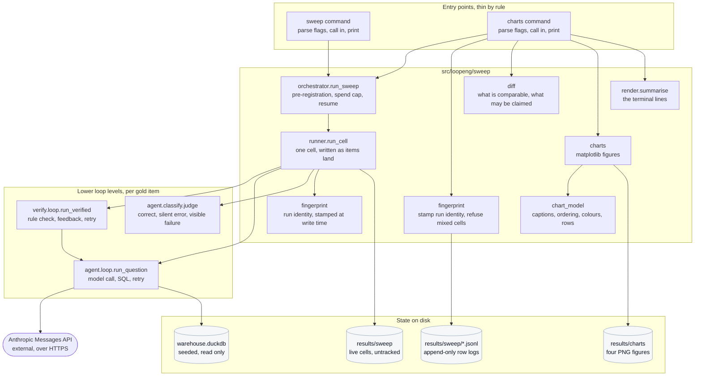
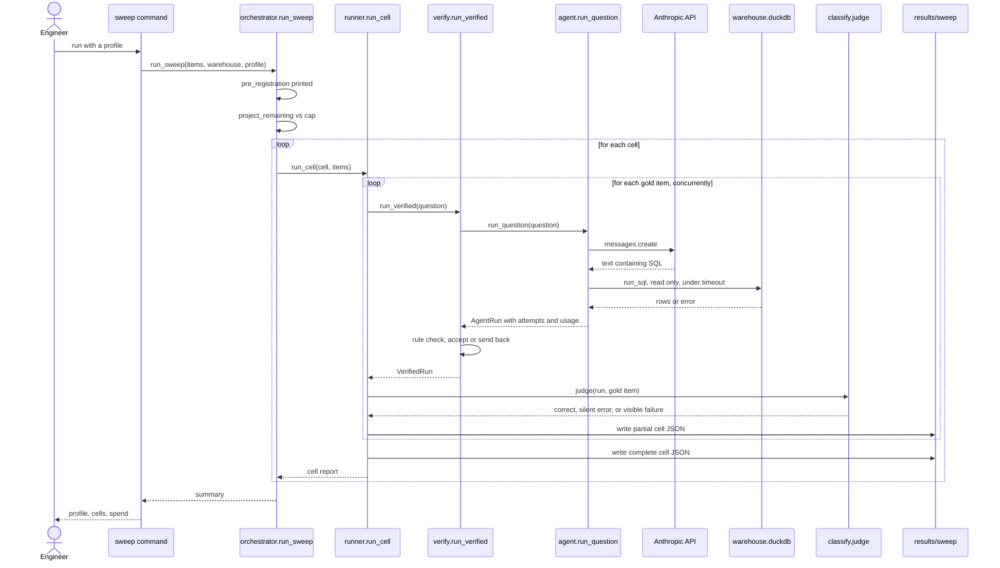

# Onboarding: Level 4, the hill-climbing sweep and its measurement pipeline

**Read [the onboarding hub](../../ONBOARDING.md) first.** It carries the product overview,
the shared glossary, the machine setup for macOS, Windows, and Linux, the configuration
reference, and how the tests work. This document assumes you have done that and covers
only Level 4.

When you have read this and run the demo in section 10, you should be able to run the
feature on your own machine, follow one request from the command you type to the file it
writes, debug a failure, run the tests, make a change without breaking anybody, and
explain the whole thing out loud to another engineer.

---

## 0. Scope of this document, and what I inspected

This repository contains four nested feature areas plus a web interface. Documenting all
of them at this depth would produce something nobody reads. **This document covers Level
4, the hill-climbing sweep, together with the measurement, provenance, and charting
machinery that surrounds it.** That is a complete, self-contained feature: it has its own
command line entry points, its own persisted data, its own test files, and its own
guarantees.

### What I read to write this

| Area | Files inspected |
|---|---|
| Entry points | `demos/04_hill_climbing_loop/sweep.py`, `demos/04_hill_climbing_loop/charts.py`, `demos/00_preflight/check.py`, `demos/views.py` |
| Build and dependencies | `pyproject.toml`, `.python-version`, `uv.lock` (metadata only, not the resolved graph) |
| Configuration | `.env.example`, `src/loopeng/settings.py`, `src/loopeng/env_guard.py`, `src/loopeng/views/live_mode.py` |
| Core feature code | Every file under `src/loopeng/sweep/`, plus `src/loopeng/metric.py`, `src/loopeng/paired.py`, `src/loopeng/pricing.py`, `src/loopeng/registry.py`, `src/loopeng/usage.py`, `src/loopeng/caching.py` |
| Called into per item | `src/loopeng/agent/loop.py`, `src/loopeng/agent/classify.py`, `src/loopeng/verify/loop.py` |
| Data layer | `src/loopeng/warehouse/schema.py`, `src/loopeng/warehouse/connect.py`, `src/loopeng/gold/build.py`, the JSON files under `results/` |
| Tests | `tests/conftest.py`, `tests/test_sweep.py`, `tests/test_diff.py`, `tests/test_caching.py`, `tests/test_deadline.py`, `tests/test_docs.py`, `tests/test_lint_no_numbers.py`, `tests/figures.py` |
| CI, logging, tooling | `.github/workflows/ci.yml`, `src/loopeng/logging.py`, `tools/lint_no_numbers.py` |

### What I deliberately excluded, and why

| Excluded | Why |
|---|---|
| `src/loopeng/queue/` (Level 3, the event driven worker) | A separate feature with its own database file and its own runbook in `demos/03_event_driven_loop/README.md`. The sweep never touches it. |
| `src/loopeng/views/` (the web screens) | The sweep writes files; the screens read them. They are downstream consumers, covered only where they read something this feature writes. |
| `src/loopeng/gold/patterns.py` internals | The question templates. You need to know that a gold set exists and what it contains, not how each SQL template is parameterised. |
| The resolved dependency graph in `uv.lock` | Four hundred kilobytes of pinned transitive dependencies. I read the direct dependencies from `pyproject.toml` instead. |

---

## 1. Overview

The sweep is a batch measurement harness. It runs a fixed set of natural language
questions through an AI agent several times under different configurations, scores every
answer against a known correct answer, and writes one JSON file per configuration to
disk. A second command turns those files into four charts and a printed summary.

It exists to answer one question with evidence rather than opinion: **does adding a
verification loop around an AI agent actually reduce the number of wrong answers that
look right?** The business problem underneath is that an agent writing SQL can return a
single clean plausible number that is wrong, and nothing about the answer tells you so.
You cannot fix what you cannot measure, so this feature is the measuring instrument.

The unusual part, and the part that shapes almost every design decision you will read
about below, is that these numbers get shown to a room of people on a projector while
being computed. That creates a hard requirement that most measurement code does not have:
**a number displayed must never be able to pass for something it is not.** A stored
number must not look freshly computed. An unmeasured cell must not render as zero. A
statistic that cannot be computed must say so rather than showing a blank.

---

## 2. Glossary

[The hub's glossary](../../ONBOARDING.md#2-glossary) defines the terms shared across every
area: agent, silent error, warehouse, gold set, pattern, semantic model, prompt level,
role, metric, and the rest. The terms below are specific to Level 4.

| Term | Definition |
|---|---|
| **Mode, one-shot and loop** | **one-shot** means the agent gets one attempt. **loop** means the Level 2 verification loop checks the SQL against the declared rules and can send it back for another try. |
| **Cell** | One combination of role, prompt level, mode, and replicate number, run over the whole gold set. For example `worker_L0_loop_r0`. A cell is the unit of measurement and becomes exactly one JSON file. Defined at `src/loopeng/sweep/runner.py :: Cell`. |
| **Replicate** | A repeat of an identical cell, used to measure how much the answer moves between runs when nothing has changed. |
| **Profile** | A named set of cells to run, with a spending cap. Three exist: `smoke`, `session`, `dev`. It also declares the item cap and the wall clock, because a ceiling that depends on someone typing a flag is not a ceiling. At `src/loopeng/sweep/runner.py :: PROFILES`. |
| **Sweep** | One execution of a profile: run every cell it names, write every cell file. |
| **Run fingerprint** | What makes two cell files the same measurement run: the gold digest, the prompt digest, the served model versions and the run id. Recorded at write time rather than inferred from which directory a file sits in. At `src/loopeng/sweep/fingerprint.py`. |
| **McNemar's test** | A statistical test for whether two methods differ, when both ran on the *same* items. It looks only at items where the two disagreed. At `src/loopeng/paired.py :: compare()`. |
| **Paired comparison** | Comparing two cells item by item rather than comparing their two summary percentages. More sensitive, and the only comparison this project will report a significance value for. |
| **Discordant pair** | An item where the two cells being compared disagreed: one right, one wrong. McNemar's test uses only these. |
| **p-value** | The probability of seeing a difference at least this large if there were really no difference. Below zero point zero five is conventionally called significant. |
| **Prompt caching** | An Anthropic API feature where a long unchanging prompt prefix is stored server side and charged at a tenth of the normal price on later calls. It applies only if the prefix exceeds a model specific minimum. See `src/loopeng/caching.py`. |
| **Run fingerprint** | A record stamped into every cell file saying which measurement run produced it: the data seed, a hash of the gold set, the price table date, the code revision, and a run identifier. At `src/loopeng/sweep/fingerprint.py :: RunFingerprint`. |
| **Provenance** | The record of where a number came from and what was checked about it. This codebase treats provenance as part of the number. |

---

## 3. Prerequisites

Everything in [the hub, section 3](../../ONBOARDING.md#3-prerequisites): Python 3.12, uv,
no database server, no broker, no container runtime.

Two things are specific to this area:

- **`matplotlib` is a runtime dependency rather than a development one**, because
  `src/loopeng/sweep/charts.py` imports it to draw the live charts. It is listed under
  `dependencies` in `pyproject.toml`, not under the `dev` group.
- **An Anthropic API key is needed only to run a live sweep.** The charts, the tests, and
  the entire demo in section 10 run without one.

---

## 4. Repository map

Only what matters for this feature. The rest of the repository is listed at the end for
orientation.

### The two command line entry points

| Path | Responsibility |
|---|---|
| `demos/04_hill_climbing_loop/sweep.py` | Parses flags, loads settings, builds the gold set, calls `run_sweep`, prints a summary. Contains no measurement logic. |
| `demos/04_hill_climbing_loop/charts.py` | Parses flags, loads cells from disk, writes every PNG, prints a summary. Contains no numeric literals at all, enforced by a lint rule. |

Both files are deliberately thin. `tests/test_demo_structure.py :: MAX_DEMO_LINES` caps
every file under `demos/` at one hundred lines, and
`tests/test_demo_structure.py` asserts no loop logic lives there.

### The feature core, under `src/loopeng/sweep/`

| Path and symbol | Responsibility |
|---|---|
| `runner.py :: Profile` | What a sweep run is for: which roles, levels, replicates, spending cap, and whether the item limit flag is permitted. |
| `runner.py :: PROFILES` | The three named profiles: `smoke`, `session`, `dev`. |
| `runner.py :: Cell` | One measurement unit. Provides `key`, `label`, and `projected_usd()`. |
| `runner.py :: build_cells()` | Expands a profile into the list of cells it will run. |
| `runner.py :: run_cell()` | Runs every gold item through one cell using a thread pool, writing partial state after each item lands. |
| `runner.py :: summarise_cell()` | Turns a list of per item results into the cell's JSON body, including the silent-error rate and its interval. |
| `runner.py :: require_fresh()` | Refuses to start when finished cells already exist on disk. |
| `orchestrator.py :: run_sweep()` | Prints the pre-registration, checks projected spend before each cell, resumes finished cells from disk, calls `run_cell` for the rest. |
| `orchestrator.py :: pre_registration()` | The text printed before the first cell, stating what the run can and cannot detect. |
| `orchestrator.py :: load_all()` | Reads every cell file in a directory. |
| `fingerprint.py :: RunFingerprint` | Which measurement run wrote a cell. |
| `fingerprint.py :: resolve_run_id()` | Adopts the run identifier already on disk when the inputs match, so a resumed sweep stays one run. |
| `deadline.py :: Deadline` | The wall clock, checked cooperatively BETWEEN items so no item is ever cut short and scored. |
| `deadline.py :: run_bounded()` | Feeds items in rather than queueing them, which is what makes the clock and Ctrl-C enforceable rather than advisory. |
| `runner.py :: append_row()` | Appends one measured item to the cell's row log and flushes it. The durable record. |
| `runner.py :: read_rows()` | Reads a row log back, dropping a truncated final line AND counting it. |
| `runner.py :: require_fresh()` | Refuses to start over completed cells. Runs by default; `--resume` opts out. |
| `fingerprint.py :: assert_comparable()` | Refuses to draw cells whose gold set or prompt differ — they do not measure the same thing. |
| `diff.py :: Comparison` | One difference between two cells, with everything needed to refuse to over-read it. |
| `diff.py :: all_comparisons()` | Every comparison the supplied cells support, including the ones that cannot be tested. |
| `diff.py :: partition()` | Splits comparisons into testable and untestable, returning both. |
| `chart_model.py` | Caption text, cell ordering, role colours, and the cell to chart row transform. Shared by both chart renderers. |
| `charts.py :: write_charts()` | Draws the four figures with matplotlib and saves them as PNG files. |
| `render.py :: summarise()` | The lines the chart command prints to the terminal. |
| `detach.py :: detach()` | Restarts the sweep as a background process and hands the terminal back. |

### Called into once per gold item

| Path and symbol | Responsibility |
|---|---|
| `src/loopeng/agent/loop.py :: run_question()` | One question to termination: call the model, extract SQL, run it read only, retry on failure, record every token. |
| `src/loopeng/verify/loop.py :: run_verified()` | The same, with a rule check between the model and acceptance, and rule names fed back on rejection. |
| `src/loopeng/agent/classify.py :: judge()` | Compares the agent's rows to the gold rows and returns correct, silent error, or visible failure. |

### Supporting modules

| Path and symbol | Responsibility |
|---|---|
| `src/loopeng/metric.py :: Metric` | A number that cannot exist without its sample size, its interval, and the time it was computed. |
| `src/loopeng/paired.py :: compare()` | Exact McNemar's test over two item to outcome maps. |
| `src/loopeng/pricing.py :: PRICES` | The hand entered price table, with the date it was taken. |
| `src/loopeng/usage.py :: UsageLedger` | Token accounting across every call, including calls that errored. |
| `src/loopeng/caching.py :: prefix_is_cacheable()` | Whether a prompt prefix is long enough to be cached, answered from a measurement rather than an estimate. |
| `src/loopeng/settings.py :: load_settings()` | Configuration, loaded once and frozen, failing immediately with the exact variable name. |
| `src/loopeng/warehouse/connect.py :: run_sql()` | The only way SQL reaches the warehouse. Read only, with a timeout enforced by interrupting the connection. |

### The rest of the repository, for orientation only

`src/loopeng/agent/` is Level 1, the retry loop. `src/loopeng/verify/` is Level 2, the
rule checking loop. `src/loopeng/queue/` is Level 3, an event driven worker. 
`src/loopeng/views/` holds six web screens built with Gradio. `src/loopeng/triage/`
classifies failures after the fact. `tools/` holds the numeric literal lint rule, the
README image renderer, and a deployment sync script.

---

## 5. Architecture and responsibilities

### The shape of it

There is no server, no queue, and no network service in this feature. It is two command
line programs that read and write files in the working directory, plus outbound HTTPS
calls to one external service.

Communication between components is **direct Python function calls** everywhere except
two boundaries:

1. The sweep talks to Anthropic over **synchronous HTTPS**, through the `anthropic`
   client library at `src/loopeng/agent/loop.py :: run_question()`.
2. The sweep talks to the chart renderer through **the filesystem**. They are separate
   processes and they never call each other. The contract between them is the shape of
   the JSON files in `results/sweep/`.

That second boundary is the important one to understand, because it is what lets you run
the charts while the sweep is still going, and what lets the charts work at all on a
machine that has never made an API call.



### Who owns what

**The entry points own argument parsing and printing, and nothing else.** This is a rule
with a test behind it. A number that reaches a projector must come from a `Metric` object
carried in a cell file, never from something typed into a display file. `tools/lint_no_numbers.py`
scans eleven rendering files and rejects numeric literals, including numbers written
inside strings. A literal that is genuine layout geometry, for example a font size, is
exempted by a trailing `# layout` comment on that exact line, and the count of such
exemptions is printed on every run.

**The orchestrator owns money.** It refuses to start a cell when the projected total spend
would breach the profile's cap. It checks projected spend rather than actual spend,
because a cap checked against money already spent only discovers the breach afterwards.
See `src/loopeng/sweep/orchestrator.py :: run_sweep()`.

**The runner owns the cell file format.** It writes a partial file after every item lands,
so a chart rendered mid-sweep shows real progress rather than nothing.

**The fingerprint module owns provenance.** Nothing else decides whether two sets of numbers
came from the same measurement run.

**The diff module owns refusal.** It decides not only what the difference between two cells
is, but what may not be claimed about it. Two examples that are enforced in code rather
than written in a comment: a comparison between the two different models never gets a
p-value, because the models are configured differently in a way that makes their
uncertainty ranges mean different things; and a comparison with fewer than six discordant
pairs reports that it is not distinguishable rather than printing a number, because below
that count no arrangement of the data could reach significance.

---

## 6. Execution flow

### The primary path, end to end

This is what happens when you run a sweep. Function names are in the order they are
called.

1. **`demos/04_hill_climbing_loop/sweep.py :: main()`** parses the command line. The
   `--profile` flag is required and has no default, so a cheap run cannot silently
   inherit expensive settings.
2. If `--foreground` was not passed, **`src/loopeng/sweep/detach.py :: detach()`** relaunches
   the same script as a background process with `--foreground` appended, writes its output
   to a log file, prints the process identifier, and returns. Everything below then happens
   in that background process.
3. **`src/loopeng/settings.py :: load_settings()`** reads `.env` and the environment. It
   raises immediately if `ANTHROPIC_API_KEY` is absent. Importing this module also runs
   `src/loopeng/env_guard.py :: check_environment()`, which refuses to continue if the
   checkout sits on a cloud synced path that breaks Python imports.
4. **`src/loopeng/warehouse/connect.py :: ensure_warehouse()`** creates `warehouse.duckdb`
   from the configured seed if the file is absent, and returns its path either way.
5. **`src/loopeng/gold/build.py :: build_gold()`** produces the list of gold items, using a
   cache file at `results/gold_cache.json` when the inputs have not changed.
6. **`src/loopeng/sweep/orchestrator.py :: run_sweep()`** takes over.
   1. Unless `--resume` was passed, **`runner.require_fresh()`** raises when finished cells are
      already on disk.
   2. **`runner.apply_item_limit()`** applies the profile's item cap and refuses the
      `--limit` flag on profiles that do not permit it.
   3. **`runner.build_cells()`** expands the profile into its list of cells.
   4. **`runner.project_remaining()`** estimates total cost before anything is spent.
   5. **`orchestrator.pre_registration()`** is printed. This states the hypothesis before
      any number exists, because a hypothesis stated after the numbers are in is not a
      hypothesis.
   6. **`fingerprint.RunFingerprint.for_run()`** then **`fingerprint.resolve_run_id()`**
      build the run identity, adopting the identifier already on disk when the inputs
      match so that a resumed sweep counts as one run.
7. For each cell, in order:
   1. **`runner.load_cell()`** returns the finished cell from disk if it exists. If so the
      cell is skipped and its cost added to the running total. This is the resume path and
      it is idempotent.
   2. **`runner.project_remaining()`** is recomputed for the cells that remain. If already
      spent plus projected remaining exceeds the cap, **`SweepAborted`** is raised before
      the cell runs.
   3. **`runner.run_cell()`** submits every gold item to a thread pool with a default of
      eight concurrent requests per model.
      - For a one-shot cell, each item calls **`agent/loop.py :: run_question()`** with
        `max_attempts=1`.
      - For a loop cell, each item calls **`verify/loop.py :: run_verified()`** with
        `max_attempts=3`, which calls `run_question` internally and applies rule checks
        between attempts.
      - Inside `run_question`: build the messages, call
        `client.messages.create(...)`, record token usage in a `UsageLedger`, extract SQL
        from the response text, execute it through
        **`warehouse/connect.py :: run_sql()`** on a read only connection under a thirty
        second timeout, and stop on success.
      - **`agent/classify.py :: judge()`** compares the returned rows with the gold rows
        and produces the outcome.
   4. After each item lands, **`runner.summarise_cell()`** is called with `complete=False`
      and the result is written to `results/sweep/<cell key>.json`.
   5. When every item is done, `summarise_cell` is called again with `complete=True` and
      the final file is written.
8. `run_sweep` returns a dictionary containing the profile name, the cell count, how many
   were resumed, projected and actual spend, the concurrency used, the run fingerprint,
   and every cell body.
9. `main()` prints the completion line and the spend line, and exits with status zero.

Then, separately and in a different process:

10. **`demos/04_hill_climbing_loop/charts.py :: main()`** parses its flags.
11. **`orchestrator.load_all()`** reads every JSON file in the cell directory.
12. **`fingerprint.assert_comparable()`** refuses to draw cells from different gold sets or prompts. The chart entry point
    decides how they sit beside the live ones; the default, `auto`, shows them only once
    this run has produced a cell of its own.
13. **`render.comparisons_for()`** calls **`diff.all_comparisons()`**, which builds four
    families of comparison and computes McNemar's test for each pair that supports one.
14. **`render.abstention_points()`** picks a completed live loop cell and computes a
    coverage against precision curve from its per item telemetry.
15. **`charts.write_charts()`** draws four matplotlib figures and saves them to
    `results/charts/` as PNG files.
16. **`render.summarise()`** produces the terminal lines, and `main()` prints them.



### Significant alternate paths

**Resume.** If a cell file already exists with `"complete": true`, `runner.load_cell()`
returns it and the cell is not re-run. This is what makes a dropped network connection
cost only the cell in flight. It is also the behaviour the freshness guard exists to refuse,
because a sweep that resumes and finishes instantly in front of an audience looks
identical to one that was faked.

**Spend cap reached.** `SweepAborted` is raised before the offending cell starts. Cells
that already completed keep their files, so the charts render what exists and the rest
show as not yet measured.

**A model call fails.** `src/loopeng/agent/loop.py :: triage_call_failure()` decides
whether the failure can be fixed by retrying. A rate limit or an overload can, so the loop
waits and retries; the wait honours the server's `retry-after` header when present. An
authentication failure or a bad request cannot, so the loop stops immediately with a
termination reason naming the cause. The tokens spent on a failed call are still recorded,
because they were still billed.

**The SQL fails or hangs.** A query that raises is caught and its error text becomes
feedback for the next attempt. A query that runs too long is interrupted from a timer
thread and raises `QueryTimeout`, which is deliberately not a DuckDB error type because
"this would never finish" and "this is invalid" belong in different buckets.

**A cell has no completed items.** `summarise_cell()` writes `"silent_error_rate": "not
yet measured"` and leaves `rate_value` as null. Charts render a dashed outline with those
words inside it. Nothing anywhere renders zero for an absent measurement.

---

## 7. Interfaces and data

This feature has no HTTP endpoints. Its interfaces are two command line programs, one
external API, one database, and a set of JSON files on disk.

### Entry point: the sweep

Command: `uv run python demos/04_hill_climbing_loop/sweep.py --profile <name>`

| Flag | Type | Required | Meaning |
|---|---|---|---|
| `--profile` | one of `smoke`, `session`, `dev` | **yes** | Which set of cells to run. No default, deliberately. |
| `--cap-usd` | float | no | Override the profile's spending cap. |
| `--limit` | integer | no | Run fewer gold items. Accepted only by `smoke` and `development`; raises `LimitNotAllowed` elsewhere. |
| `--dir` | path | no | Where cell files are written. Defaults to `results/sweep`. |
| `--foreground` | flag | no | Block the terminal instead of detaching. |
| `--concurrency` | integer | no | Requests in flight per model. Defaults to eight. |
| `--log` | path | no | Where the detached process writes output. Defaults to `results/sweep_run.log`. |
| `--resume` | flag | no | Continue from finished cells. Without it the sweep refuses to start when it finds any — that is the default. |
| `--deadline` | float | no | Override the wall-clock budget the profile declares. |

Exit codes, from `demos/04_hill_climbing_loop/sweep.py :: main()`:

| Code | Meaning |
|---|---|
| `0` | The sweep completed. |
| `2` | `SweepAborted`. Projected spend would breach the cap. Nothing was spent on the refused cell. |
| `3` | `StaleCellsPresent` or `LimitNotAllowed`. The run was refused before starting. |

### Entry point: the charts

Command: `uv run python demos/04_hill_climbing_loop/charts.py`

| Flag | Type | Required | Meaning |
|---|---|---|---|
| `--dir` | path | no | Where cell files are read from. Defaults to `results/sweep`. |
| `--out` | path | no | Where PNG files are written. Defaults to `results/charts`. |
**There is no `--reference` flag, and there is no stored set.** This table used to list
four modes for mixing stored cells with live ones, defined in a module that has since
been deleted along with the stored cell format, its loader and the frozen files.

The apparatus was five mechanisms guarding one capability — a hatched fill, a REFERENCE
badge, a date on every stored row, the mode flag itself, and a test that a fresh clone
renders nothing. Removing the capability is stronger than guarding it: a render path
that cannot express "stored" cannot show one. Every bar these charts draw was computed
by the run that is drawing it.

### External service call

One, at `src/loopeng/agent/loop.py :: run_question()`:

```python
response = client.messages.create(
    model=spec.model_id,
    messages=_build_messages(question, level, attempts, role=role),
    **spec.request_kwargs,
)
```

The request keyword arguments differ per role and this is not cosmetic. The cheap model
accepts `temperature=0`, which pins its output so repeat runs agree. The expensive model
rejects any non default sampling parameter with an HTTP 400, so it cannot be pinned. See
`src/loopeng/registry.py :: REGISTRY` for both, with the measured justification in the
comment there. The consequence is stated on every chart: the two models' uncertainty
ranges do not mean the same thing.

### Database reads and writes

**Reads only, always.** `src/loopeng/warehouse/connect.py :: agent_connection()` opens
DuckDB with `read_only=True`, and `tests/test_warehouse_readonly.py` asserts that
`INSERT`, `UPDATE`, `DELETE`, `DROP`, and `CREATE` all fail against it.

Tables and columns, from `src/loopeng/warehouse/schema.py :: SCHEMA_DDL`:

| Table | Columns |
|---|---|
| `products` | `product_id`, `category`, `list_price_minor` |
| `customers` | `customer_id`, `region`, `is_internal`, `deleted_at` |
| `orders` | `order_id`, `customer_id`, `status`, `currency`, `amount_minor`, `placed_at`, `deleted_at` |
| `order_items` | `order_item_id`, `order_id`, `product_id`, `qty`, `unit_price_minor` |
| `refunds` | `refund_id`, `order_id`, `amount_minor`, `issued_at` |

There are no foreign key constraints, and that is deliberate: several of the traps this
project measures are join and filter mistakes, and a database that refused to hold an
order pointing at a soft deleted customer would remove the trap before the model ever saw
it. Money columns are `BIGINT` because they hold minor units, so yen and cents share the
same column and the semantic model's conversion factor reconciles them.

The exact SQL is not fixed: it is written by the model at run time. What is fixed is that
it arrives through `run_sql()` and nowhere else.

### The cell file, which is the real interface

One JSON file per cell, written to `results/sweep/<key>.json`. Produced by
`src/loopeng/sweep/runner.py :: summarise_cell()`. This is a real example, taken from
`results/sweep/worker_L0_one_shot_r0.json`, with the `items` array removed:

```json
{
  "key": "worker_L0_one_shot_r0",
  "label": "Haiku · L0 · one-shot",
  "role": "worker",
  "level": "L0",
  "mode": "one_shot",
  "replicate": 0,
  "complete": true,
  "seconds": 26.9,
  "n_done": 50,
  "ran_and_returned": 37,
  "correct": 5,
  "silent_errors": 32,
  "silent_error_rate": "86.5% (n=37, ±14.5, computed 20:10 today)",
  "rate_value": 0.8648648648648649,
  "rate_ci_low": 0.7202258821599021,
  "rate_ci_high": 0.9408670557426799,
  "rate_n": 37,
  "cost_usd": { "value": 0.051052, "source": "estimated" },
  "tokens": {
    "n_calls": 50,
    "input_tokens": 15252,
    "output_tokens": 7160,
    "total_tokens": 22412
  },
  "rejections": 0,
  "termination": { "max_attempts": 7, "success": 43 },
  "patterns_with_interventions": []
}
```

Three things in that payload are worth understanding before you touch anything.

**`n_done` is fifty but `ran_and_returned` is thirty-seven.** Thirteen items produced no
usable answer at all: a crash, a timeout, or an empty result. The silent-error rate is
computed over the thirty-seven that *did* return, because a question that never returned
is not a wrong answer, it is a visible failure. Mixing the two would let a cell look
better by crashing more.

**`cost_usd.source` is the string `"estimated"` and never changes.** Tokens are measured,
taken off the API response. Dollars are those tokens multiplied by a table typed in by
hand on a particular day, at `src/loopeng/pricing.py :: PRICES_TAKEN_ON`. Only a billing
export would make cost a measurement and this project does not read one.

**`silent_error_rate` is a rendered sentence, not a number.** It carries the value, the
sample size, the interval, and the time it was computed, because those four things travel
together or the number is not checkable. Produced by `src/loopeng/metric.py :: Metric.render()`.

Each entry in the omitted `items` array is written by `runner.run_cell()._one()` and
carries `item_id`, `pattern_key`, `sql`, `rows`, `error`, `outcome`, `ran_and_returned`,
`correct`, `termination`, `n_attempts`, `rejections`, `cost_usd`, and `tokens`.

### The row log, which is the durable record

A cell writes two files, and only one of them is the measurement.

| Path | Contents | Written by |
|---|---|---|
| `<key>.jsonl` | One JSON object per measured item, appended and flushed as each lands. **This is the record.** Nothing already written is ever rewritten. | `runner.append_row()` |
| `<key>.json` | The summary the charts read: bands, rate, interval, cost, terminations. Derived from the rows and written atomically. | `runner.summarise_cell()` + `write_json_atomic()` |

The summary used to be the only file, rewritten in full after every item. `write_text`
truncates and then writes, so between those two steps the only record on disk was an
empty file — and a crash or a Ctrl-C in that window left a truncated document that made
`load_all` raise for the whole directory. An append has no such window. At worst an
interrupt cuts the last line, which `runner.read_rows()` drops **and counts**.

If a summary is ever unreadable, `orchestrator.load_all()` rebuilds it from the log and
stamps the result `recovered_from_log` rather than skipping the cell — a chart short one
cell with nothing saying which is the failure this directory exists to prevent.

**This section previously described four committed files under `results/reference/`.**
None of them is in the repository: the frozen-cell subsystem was removed, and
`reference/` is to be rebuilt from a dress rehearsal under the current model policy
rather than inherited from a build with different models, a different gold set and a
different price table.

---

## 8. Configuration

[The hub, section 7](../../ONBOARDING.md#7-configuration) carries the full table of every
variable the repository reads, with types, defaults, and where each is consumed. Nothing in
this area reads a variable that is not in that table.

Only four of them affect a sweep:

| Variable | Effect here |
|---|---|
| `ANTHROPIC_API_KEY` | Required for a live sweep. Not required for the charts or the tests. |
| `WAREHOUSE_SEED` | Passed into the run fingerprint by `demos/04_hill_climbing_loop/sweep.py :: main()`, so a sweep over different data is recorded as a different run. |
| `WAREHOUSE_PATH` | Which database file the agent queries. |
| `RESULTS_DIR` | Not read by the sweep itself, which takes `--dir` instead, but read by other stages writing beside it. |

The two flags that behave like configuration and are easy to miss are `--profile`, which is
required and has no default so a cheap run cannot silently inherit expensive settings, and
`--deadline`, which overrides the wall clock the profile declares.

---

## 9. Run it locally

Follow [the hub, section 6](../../ONBOARDING.md#6-run-it-locally) from a fresh clone:
install uv, clone, `uv sync`, run the tests, run the two lint checks. That is the whole
setup and it is identical for every area.

Nothing in this area needs a migration or a seed step. The warehouse is created on first
use by `warehouse/connect.py :: ensure_warehouse()` and the gold set is rebuilt from its
patterns, so the sweep cold starts from an empty working directory.

You only need `.env` if you intend to run a live sweep. The demo below does not.

---

## 10. Demo

This walkthrough costs nothing and makes no network calls. It uses the measurements
already committed to the repository. Work through it in order.

### Part A: prove that a fresh checkout renders nothing finished

This is the single most important property of this feature, so it is the first thing you
should see with your own eyes.

**macOS and Linux**

```bash
rm -rf results/charts
uv run python demos/04_hill_climbing_loop/charts.py
```

**Windows, in PowerShell**

```powershell
Remove-Item -Recurse -Force results\charts -ErrorAction SilentlyContinue
uv run python demos/04_hill_climbing_loop/charts.py
```

**Expected output**, exactly:

```
No cells in results/sweep yet. Charts render as 'not yet measured'.
cells on disk: 0 (0 complete)
  wrote results/charts/dial.png
  wrote results/charts/cost.png
  wrote results/charts/delta.png
  wrote results/charts/abstention.png
comparisons: 0 testable, 0 not
abstention curve: not yet measured — needs a completed live loop cell
```

If you have previously run a sweep on this machine, `results/sweep` will not be empty and
you will see cells listed instead. That is expected; move that directory aside if you want
to reproduce the output above exactly.

**Why this matters.** Nothing finished ships inside this repository, and the charts
cannot express "stored" even if it did. This paragraph used to explain that twelve
frozen measurements were committed and that the renderer's default flag had, until
recently, drawn them on a machine that had never made an API call — every row correctly
labelled, so nothing was a lie, while the promise was that a fresh checkout shows
nothing finished.

That whole capability is gone rather than defended. There is no stored cell format, no
loader, no flag and no frozen files, so this property now holds by construction instead
of by a default that someone chose correctly.

**Verification steps for Part A.**

1. Open `results/charts/dial.png`. It contains a dashed empty outline with the words
   `not yet measured` inside it, and no bars.
2. Confirm the word `REFERENCE` does not appear anywhere in the terminal output.
3. Confirm the word `McNemar` does not appear anywhere in the terminal output.
4. The automated version is `tests/test_sweep_render.py`, which asserts the summary a
   fresh directory produces says so in words rather than printing nothing.

### Part B: the guard that stops this happening on the day

Part A is the property. This is the enforcement, and it is the one to see working,
because a checklist line is not enforcement — which is the defect this entire project
is about.

Run the sweep into a directory that already holds finished cells:

```bash
uv run python demos/04_hill_climbing_loop/sweep.py --profile smoke --foreground --dir results/sweep
```

**Expected output** when completed cells are present — exit code **3**, and nothing
runs:

```
REFUSING TO START
2 completed cell(s) already in results/sweep: agent_L0_loop_r0, agent_L0_one_shot_r0.

Starting here would RESUME from those files: the sweep would finish in about a second
and render a full set of numbers that look computed and were not. Every figure would be
correct and the sentence said over them would be false.
```

**This is the default.** It used to fire only when you typed `--fresh`, which meant the
dangerous behaviour was what you got by forgetting a flag. `--resume` is now what you
type to opt back in, and it is the only way to reach the failure the guard exists for.

The refusal never deletes. Those cell files are the outage insurance for stages 0, the
Phase 2 probes and stage 4, and only the operator knows whether they are still needed —
so it names the three ways out and lets you choose.

### Part C: a live sweep, which costs money

**Do not run this unless you have a key and you accept the cost.** The `smoke` profile is
the cheapest live path in the repository: two cells, eight items, with a cap of five cents
declared at `src/loopeng/sweep/runner.py :: SMOKE`.

First, the cheapest possible check that your key works:

```bash
uv run python demos/00_preflight/check.py
```

`Unverified:` I did not execute this command, because it makes billed API calls. Derived
from `demos/00_preflight/check.py :: main()`, which prints a rendered report and exits
zero when every check passed and one otherwise.

Then the smoke sweep:

```bash
uv run python demos/04_hill_climbing_loop/sweep.py --profile smoke --foreground
```

`Unverified:` same reason. Derived from `demos/04_hill_climbing_loop/sweep.py :: main()`
and `src/loopeng/sweep/orchestrator.py :: run_sweep()`, which print the pre-registration
block, then one progress line per cell, then two summary lines beginning `complete:` and
`spend:`.

**Verification steps for Part C.**

1. `ls results/sweep` should list two files, `worker_L0_one_shot_r0.json` and
   `worker_L0_loop_r0.json`. On Windows use `Get-ChildItem results\sweep`.
2. Each file should have `"complete": true` and a `run_fingerprint` object containing
   `run_id`, `warehouse_seed`, `gold_sha256`, `prices_taken_on`, and `code_revision`.
3. Re-render the charts. The two cells now appear as solid bars labelled `LIVE`, and
   because you now have cells of your own, the `auto` default brings the stored baseline
   in beside them automatically.
4. The comparison count in the terminal output should rise, and rows of family
   every comparison is between cells this run computed; there is no stored arm to compare against.

### Fixtures and helpers you may find useful

| Path | What it is |
|---|---|
| `tests/figures.py :: texts()` | Reads every string drawn on a matplotlib figure. This is how the chart tests assert on what an image says. |
| `tests/test_sweep.py :: a_live_frontier_cell` | A pytest fixture that builds a sweep directory containing one complete cell, with no network and no key. |
| `tests/test_sweep.py` cell fixtures | Build a sweep directory with no network and no key, used to test resume, the freshness guard and the provenance guard. |
| `tests/test_diff.py :: cell()` | A tiny cell builder for comparison tests. |
| `results/prefix_v1/` | A committed set of measurements taken before a known defect was fixed, kept as evidence of what the defect cost. Documented in `results/prefix_v1/README.md`. |

---

## 11. Observability

Be aware that this feature is deliberately light on instrumentation, and it is better to
know that now than to go looking for dashboards that do not exist.

### Logging

Configured at `src/loopeng/logging.py :: configure_logging()`, which sets up `structlog`
with a console renderer, a level of `INFO`, and a timestamp formatted as hours, minutes,
and seconds. It renders for a human reading a terminal, not as JSON for a log aggregator.
The docstring states the reason plainly: these logs are read live, by a room of people.

**The sweep itself logs almost nothing.** `src/loopeng/sweep/orchestrator.py` and
`src/loopeng/sweep/runner.py` both create a logger at module level and then never call it.
Progress reaches you through `print()` instead, seven calls in `orchestrator.py` and four
in the sweep entry point.

`Inferred:` this is a choice rather than an omission, because the printed lines are the
narration for a live audience and structured log records would be the wrong shape for
that. Evidence: the module docstring in `src/loopeng/logging.py`, and the fact that the
printed lines carry `flush=True` so they appear immediately.

The log events that do exist on the sweep's path all come from the layers below it:

| Event name | Level | Emitted at | Meaning |
|---|---|---|---|
| `model_call_refused` | error | `src/loopeng/agent/loop.py :: run_question()` | A model call failed in a way retrying cannot fix. The loop stops. |
| `model_call_failed` | warning | `src/loopeng/agent/loop.py :: run_question()` | A model call failed in a way retrying might fix. The loop waits and tries again. |
| `model_call_refused` | error | `src/loopeng/verify/loop.py :: run_verified()` | The same, from the verification loop. |
| `trap_cell_failed` | error | `src/loopeng/agent/trap.py` | A cell in the separate trap demonstration failed. |
| `langsmith_unavailable` | warning | `src/loopeng/langsmith_ds.py :: advisory()` | The optional trace service could not be reached. Nothing measured is affected. |

### Metrics and tracing

**There are no metrics.** No counter, gauge, histogram, Prometheus endpoint, or StatsD
client exists anywhere in this repository.

**Tracing is optional and off by default.** When `LANGSMITH_API_KEY` is set and
`LANGSMITH_TRACING` is true, model calls are recorded to LangSmith. It is advisory only:
`src/loopeng/langsmith_ds.py :: advisory()` catches every exception and logs a warning, so
a tracing outage cannot fail a measurement. No number this project reports is ever read
back from it.

### What healthy looks like

During a sweep, in the log file named by `--log`:

- The pre-registration block prints once, before any cell.
- A line per cell of the form `[n/N] <label> — running (spent est. $..., projected total
  est. $... of $...)`.
- After each cell, a line carrying its rendered rate, its estimated cost, and its duration.
- Finally `complete: <profile> profile, N cells (M resumed from disk)` and a spend line.

Files appearing in `results/sweep/` while the sweep runs is the strongest healthy signal
available, because the runner writes a partial file after every single item lands.

### What unhealthy looks like

- **The log stops growing but the process is alive.** A model call is being retried with
  backoff, or a query is running against its thirty second budget.
- **Repeated `model_call_failed` warnings.** You are being rate limited. Lower
  `--concurrency`.
- **A single `model_call_refused` error and the sweep stops.** Authentication or a bad
  request. Retrying will not help, which is why it stops.
- **`cells on disk` stays at zero while the sweep claims to be running.** Check that the
  chart command's `--dir` matches the sweep command's `--dir`.

### What I would add

`Inferred:` these are my suggestions, not existing behaviour. A structured log event per
completed cell carrying the key, the rate, the cost, and the duration would make a sweep
diagnosable from a log file after the fact, which it currently is not. A counter of items
by outcome would let you see a cell degrading before it finishes. Neither exists today.

---

## 12. Troubleshooting

Rows shared with every other area — the missing key, the iCloud guard, the import error —
are in [the hub, section 11](../../ONBOARDING.md#11-troubleshooting-shared-across-areas).
Every row below is derived from error handling that exists in the code, and each says
something the hub's version does not. The symptom column is what you will actually see.

| Symptom | Likely cause | Diagnostic step | Fix |
|---|---|---|---|
| `12 completed cell(s) already in results/sweep: ...` | Finished cells exist and `--resume` was not passed. **This is the default**, not a flag you switched on. | The message lists the first four cell keys and names all three ways out. | Decide whether you still need those files. If not, delete the directory. The guard refuses rather than deleting, because those files may be your only offline copy. From `runner.py :: require_fresh()`. |
| `SWEEP ABORTED` followed by `aborting BEFORE '<label>'` | Projected total spend would exceed the profile cap. | Read the projected total in the message. | Do not retry into the cap. Either raise `--cap-usd` deliberately or run a smaller profile. Exit code is `2`. From `orchestrator.py :: run_sweep()`. |
| `--limit is not accepted by the 'session' profile.` | You passed `--limit` to a profile that forbids it. | The message lists which profiles accept it. | Use `smoke` or `dev`, or drop the flag. A cell run over fewer items is not that profile's measurement. From `runner.py :: resolve_item_limit()`. |
| A cell's rate reads `not yet measured` and its bar is a dashed outline | No item in that cell both ran and returned. | Open the cell file and look at `ran_and_returned` and `termination`. | Usually a model or SQL failure affecting the whole cell. This is correct behaviour, not a bug: rendering zero would be a false measurement. |
| `QueryTimeout: query exceeded its 30.0s budget and was interrupted` | The model wrote a query with no natural end, often an unintended cross join. | Look at the item's `sql` field in the cell file. | Nothing to fix in the harness. The timeout is the protection; one such query would otherwise stall the whole sweep. From `warehouse/connect.py :: run_sql()`. |
| `UnknownModelPrice: no price entry for '<model>'` | A model identifier was used that has no row in the price table. | Read `src/loopeng/pricing.py :: PRICES`. | Add the entry. It raises rather than defaulting to zero, because a sweep that looked free would be the most misleading possible failure. |
| The sweep refuses to start | Completed cells are already in the directory and `--resume` was not passed. **This is the default.** | The message lists the cell keys and names three ways out. | Delete the directory to build live, pass `--resume` to continue, or use `--dir` to keep both. Do NOT reach for `--resume` to get past it: that is the flag that produces the failure the guard exists for. From `runner.py :: require_fresh()`. |
| Charts render but the terminal says `0 testable, N not` | The cells present cannot be paired, either because per item outcomes were dropped at freeze time or because the two arms answered no items in common. | Read the row text on `delta.png`; it names which of the two applies. | If it says outcomes were not retained, that side was frozen without them. From `diff.py :: Comparison.unpairable_because()`. |
| On Windows, the detached sweep dies when you close the terminal | `subprocess.Popen(start_new_session=True)` is a POSIX feature. | Check whether the log file stops growing after you close the window. | Use `--foreground` on Windows. `Inferred:` from the Python standard library's documented platform support for `start_new_session`, applied to `sweep/detach.py :: detach()`. |
| On Windows, `tail -f results/sweep_run.log` is not a command | The detach helper prints a Unix command in its hint. | None needed. | Use `Get-Content results\sweep_run.log -Wait` in PowerShell. The hint text is at `sweep/detach.py :: detach()`. |

---

## 13. Testing

[The hub, section 8](../../ONBOARDING.md#8-testing) covers how the suite is invoked, why
`deselected` is correct rather than a problem, how to run one file or one test, and the two
`pyproject.toml` choices behind both. Nothing in this area invokes pytest differently.

### What each suite covers

| File | Covers |
|---|---|
| `tests/test_sweep.py` | The largest suite. Cell construction, profiles, the spend cap, the freshness guard and its inverted default, run fingerprints, and the chart writers. |
| `tests/test_diff.py` | Comparison families, what may and may not be claimed, and the delta chart's refusals. |
| `tests/test_caching.py` | Prompt cacheability, which cells and which profiles gain anything, retry backoff, and concurrency plumbing. |
| `tests/test_deadline.py` | The wall clock, Ctrl-C as a clean stop, the append-only row log, and the profile-clock plumbing. |
| `tests/test_metric.py`, `tests/test_paired.py` | The interval arithmetic and McNemar's test. |
| `tests/test_sweep_render.py` | Which cell the abstention curve is drawn from, and what the terminal prints after a sweep. |
| `tests/test_lint_no_numbers.py` | The numeric literal rule, including that it is not vacuous. |
| `tests/test_docs.py` | Every markdown file in the repository: relative links resolve, documented scripts exist, diagrams carry no numbers, and duplicated diagrams stay identical. |
| `tests/test_warehouse_readonly.py` | That the agent's connection genuinely refuses writes. |
| `tests/live/` | Two tests that hit the network. Deselected by default. |

### The two subsets worth knowing here

The largest suite, and the one to run after any change under `src/loopeng/sweep/`:

```bash
uv run pytest tests/test_sweep.py tests/test_diff.py -q
```

Everything touching the run fingerprint, which is what decides whether two sets of numbers
came from the same measurement run:

```bash
uv run pytest -q -k fingerprint
```

### Fixtures and test doubles

There are no test containers and no database fixtures, because the database is a file the
tests create in a temporary directory. The important shared pieces are:

- `tests/conftest.py :: _tracing_off_unless_live` is applied automatically to every test.
  It forces four tracing environment variables to false and removes the endpoint variable,
  so a developer machine with tracing exported cannot silently break the zero network
  property.
- `tests/figures.py :: texts()` extracts every string drawn on a matplotlib figure. Chart
  assertions use it rather than inspecting image bytes.
- `tests/test_deadline.py :: Clock` is a hand-cranked monotonic clock. The deadline
  tests drive it rather than sleeping — a test that proves a two-second deadline by
  waiting two seconds makes the suite slower every time it passes.
- Model calls in tests are avoided by passing simple stub objects, for example the
  `_Run` and `_Judgement` classes inside
  `tests/test_sweep.py :: test_a_run_fingerprint_is_stamped_into_every_cell_file`.

### Visible coverage gaps

These are gaps I observed, stated as facts about what is not tested:

1. **`src/loopeng/sweep/detach.py :: detach()` has no test.** Nothing exercises the
   detached launch path, so the Windows behaviour noted in the troubleshooting table is
   unverified in either direction.
2. **No test asserts anything about log output from the sweep.** Since the sweep emits no
   structured log events, there is nothing to assert, but that also means a future
   regression that removed the printed progress lines would not be caught.
3. **The `run_cell` concurrency path is only exercised with a stubbed model.** Real
   behaviour under a rate limit is covered only by unit tests of the backoff calculation
   at `tests/test_caching.py`, not end to end.

---

## 14. Changing this code safely

### Low risk to modify

- **Chart geometry** in `src/loopeng/sweep/charts.py`. Figure sizes, colours, fonts, and
  spacing. Every literal there carries a `# layout` comment which is what exempts it from
  the numeric literal rule. Keep the comment when you add a constant, and keep the
  constant named rather than inline.
- **Terminal summary lines** in `src/loopeng/sweep/render.py :: summarise()`. Nothing
  parses them.
- **Adding a new comparison family** in `src/loopeng/sweep/diff.py`, provided it goes
  through `_build()` so it inherits the cross model refusal and the provenance stamp.
- **Adding a profile** to `src/loopeng/sweep/runner.py :: PROFILES`. It must decide its
  own item cap, spend cap, wall clock and whether `--limit` is permitted — a profile that
  inherits a permissive default is a profile nobody chose the limits for, and
  `tests/test_sweep.py` asserts the decision was made.

### Load bearing, and why

- **`src/loopeng/sweep/runner.py :: summarise_cell()`.** Its return value is the cell file
  format, which is the contract between the sweep process and the chart process. Adding a
  key is safe because every reader treats absence as absence — that is how `stopped_early`
  and `interrupted` arrived. Renaming or removing one is not.
- **`src/loopeng/sweep/runner.py :: append_row()` and the `.jsonl` format.** The row log is
  the durable record; the summary is derived from it and can be rebuilt. Anything that
  rewrites the log rather than appending to it reintroduces the window in which earlier
  items are unreadable.
- **`src/loopeng/sweep/fingerprint.py :: COMPARABLE_FIELDS`.** The gold digest and the
  prompt digest decide whether two cells measure the same thing. Removing one weakens the
  guard silently, and it is deliberately narrower than the full fingerprint: a price-table
  change moves the cost column and leaves every outcome alone.
- **`src/loopeng/sweep/chart_model.py`.** The caption strings there are consumed by both
  chart renderers, and one of them draws the committed README images. **Changing a caption
  string changes those images.** `ABSTENTION_CAPTION` carries a comment saying it is word
  for word what the committed image already contains, for exactly this reason.
- **`src/loopeng/registry.py :: REGISTRY`.** The request keyword arguments per role are
  not interchangeable. Adding `temperature` to the frontier role would make every call to
  it fail with an HTTP 400.
- **The read only connection** at `warehouse/connect.py :: agent_connection()`. Model
  written SQL runs through it. It is the only thing standing between a generated query and
  your data.

### What depends on the current behaviour

| Depends on | What it consumes |
|---|---|
| `src/loopeng/views/dial.py` | Cell files via `orchestrator.load_all()`, and stored cells via `reference.load_reference()` in `fill` mode. |
| `src/loopeng/views/oversight.py` | Per item telemetry inside cell files, through the triage modules. |
| the preflight entry point | The exact commands and flags of both entry points, checked rather than listed. |

### Pre merge checklist

The repository-wide list — the suite, both lint checks, the chart re-render, and the
documentation checks — is in
[the hub, section 12](../../ONBOARDING.md#12-changing-this-code-safely-the-repository-wide-rules).
Three additions for this area, all of which have caught something:

1. **If you touched the cell file format, confirm the committed reference files still load**:
   `uv run python demos/04_hill_climbing_loop/charts.py --dir <a sweep directory>`, which
   reads every cell on disk and draws from what it finds.
2. **Run the demo in section 10, Part A, and confirm the output is unchanged.** That
   property — a fresh checkout rendering nothing finished — has regressed once already.
3. **Run Part B and confirm the sweep still refuses.** That guard used to be behind a
   flag, which meant the dangerous behaviour was what you got by forgetting one.

---

## 15. Open questions and assumptions

Each item below is either an inference I made or a genuine gap. They are phrased so a
teammate can answer yes or no.

### Questions for the team

1. ~~**The `spliced` block has no producer in this repository.**~~ **Closed by
   deletion.** The block appeared only in the committed frozen cells, which are gone; no
   cell this build writes carries one.

2. **Per item `sql` and `rows` are written but never read.** `runner.run_cell()._one()`
   stores them with the comment that they make a cell self sufficient for triage, yet no
   module under `src/`, `tools/`, or `demos/` reads `items[].sql` or `items[].rows`, and
   the cell files currently on disk do not contain them at all. **Should the runner stop
   writing them, or should a triage consumer be built that uses them?**

3. ~~**`results/reference/abstention_curve.json` has no writer in this repository.**~~
   **Closed by deletion.** Both modules that read it have been removed. The curve is
   computed from a live cell's per-item outcomes now, by
   `src/loopeng/triage/abstain.py :: curve()`, and which cell it comes from is decided by
   `src/loopeng/sweep/render.py :: curve_cell()` — which RAISES when the cell it is asked
   for is absent, rather than substituting the largest one it can find.

4. ~~**The committed reference cells predate the run fingerprint.**~~ **Closed by
   deletion.** There are no committed cells. Every cell now carries a fingerprint stamped
   at write time, and `assert_comparable()` refuses to draw a mixed set.

5. **The environment guard checks for iCloud only.** `env_guard.py :: ICLOUD_MARKERS`
   contains two macOS specific path fragments. **Should OneDrive and Dropbox markers be
   added for Windows and Linux contributors, or is the risk considered macOS specific?**

6. **The detached sweep is untested and probably POSIX only.** **Is Windows a supported
   development platform for this repository, and if so should `detach()` either support it
   or refuse explicitly?**

7. **`WAREHOUSE_SEED`, `WAREHOUSE_PATH`, and `RESULTS_DIR` are undocumented in
   `.env.example`.** They are real settings fields. **Should they be listed in the example
   file, or are they deliberately internal?**

### Assumptions I made, and the evidence

| Assumption | Evidence it rests on |
|---|---|
| Environment variable names for the three undocumented settings are the uppercased field names. | Standard `pydantic_settings.BaseSettings` behaviour. Not executed, so marked as inferred in section 8. |
| The sweep prints rather than logs because the output is narration for a live audience. | The docstring of `src/loopeng/logging.py` says console rendering is for logs read live on a projector, and the printed lines pass `flush=True`. |
| `start_new_session=True` has no effect on Windows. | Documented platform support for that argument in the Python standard library. Not tested on Windows. |
| The two tests that skip on Linux are the only conditional skips. | Parsed every test function's decorators and body across `tests/`; exactly two carry a skip condition. |
| The uv installer commands are correct. | Taken from the uv project's published instructions, not from this repository. Marked unverified in section 9. |

### Things I verified by executing them

Every command in sections 9 and 10 was run on macOS with Python 3.12.13 and uv 0.11.20,
except the three explicitly marked `Unverified:` because they make billed API calls. The
expected outputs quoted in this document are actual captured output, not reconstructions.
