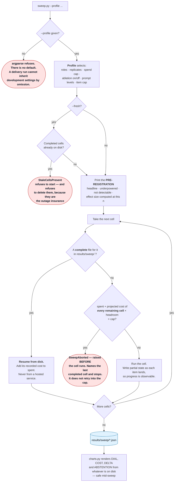

# Stage 04 — The Hill-Climbing Loop (Level 4)

> Folder numbers are **loop levels and session stage order**, not phase numbers.
> New to the vocabulary? Read [`demos/README.md`](../README.md) first.

---

## Purpose

**Measure which configuration is better, under a discipline that makes the measurement
worth having.**

Levels 1 to 3 answer a question. This level runs the whole gold set across a grid of
configurations — model role, prompt completeness, one-shot versus loop, replicate — and
reports each cell's silent-error rate with its interval.

Two entry points:

| entry point | what it does |
|---|---|
| `sweep.py` | Runs the grid. Prints the pre-registration **before the first cell**, resumes from disk, and aborts on *projected* rather than actual spend. Detaches by default. |
| `charts.py` | Renders DIAL, COST, DELTA and ABSTENTION from whatever is on disk. Safe to run repeatedly, mid-sweep. Makes no model call. |

The apparatus is the subject here, not the numbers. A hypothesis stated after the data is
not a hypothesis; a chart that silently fails to exist is indistinguishable from a chart
whose finding is absent; a zero on a bar reads as a measurement. All three are enforced in
code rather than remembered on the day.

---

## Prerequisites specific to this stage

| | |
|---|---|
| **API key** | **Required by `sweep.py`**, which validates it *before* detaching — a keyless sweep used to print a pid, exit 0, and die in a log nobody had reason to open. **Not required by `charts.py`**, which only reads files. |
| **Earlier stages** | None. The sweep builds whatever it needs. `charts.py` needs no sweep either: with nothing on disk it renders *not yet measured*, which is the correct output for a fresh clone. |
| **Cost** | The most expensive stage, and the only one that runs unattended long enough to matter. `--profile` is **required and has no default**, so a delivery run cannot inherit development settings from a flag nobody typed. Each profile carries its own cap and the runner refuses to start a cell whose projected total would breach it. |

**Which commands here are free and need no key.** `charts.py` in every form, and `--help`
on both entry points. Everything `sweep.py` does needs a key, and every profile except
`exhibit` spends — `exhibit` declares no roles and a zero cap, so it has no cell to run,
but it still validates the credential at the door like every other sweep invocation.

If you have not proved your key today, run
[`demos/00_preflight/check.py`](../00_preflight/README.md) first. It costs a fraction of a
cent and tells you in one call what a sweep would tell you in three.

---

## What this level ADDS

The loop around the loop.

Levels 1–3 answer a question. Level 4 asks which **configuration** answers questions
better, and measures it — a sweep across model and prompt completeness, every cell run
under the same harness.

A **cell** is one combination: a role (`worker` or `frontier`), a prompt level (`L0` or
`L3`), a mode (`one_shot` or `loop`), and a replicate index. Each cell runs the whole gold
set and reports a silent-error rate with its interval.

This is where the session's discipline stops being implicit and becomes the subject.

### Three things are stated on screen before the first cell runs

- **the headline** the sweep exists to test
- **what it is underpowered for**, named rather than discovered afterwards
- **what it already knows it cannot detect**, with the measurement that says so

A hypothesis stated after the numbers are in is not a hypothesis. The pre-registration is
printed by the runner itself, so it cannot be quietly skipped on the day. It includes the
**detectable effect size at this `n`, computed rather than asserted**, and the note that
clustering makes the true figure worse.

### The control flow



Three properties in that diagram matter more than any number the sweep produces.

**It resumes from `results/`, not from a hosted service.** A probe measured that LangSmith
re-runs everything on restart rather than skipping completed work, so a finished cell is a
file on disk and nothing else is consulted. A dropped venue connection costs the cell in
flight, never the cells behind it.

**It aborts on projected spend, not on actual.** Checking actual spend against a cap only
discovers the breach after it happened. Before every cell the runner adds what it has
already spent to what every remaining cell is projected to cost, and refuses to start if
that total exceeds the cap.

**`--fresh` refuses rather than deletes.** Two correct requirements collide here: cell
files must be *present* on the venue machine, because they are what keeps stages 0, the
Phase 2 probes and stage 4 alive through an API outage — and they must be *absent* when
the live sweep starts, or it resumes and completes instantly, rendering finished numbers
to a room just told nothing is precomputed. A checklist line is not enforcement, so the
live command carries `--fresh` and the code refuses. Silently deleting the outage
insurance to satisfy a flag would trade one failure for a worse one, and only the operator
knows whether those files are still needed.

### Incomplete cells are never blank, never zero, never a guess

A cell still running reports *"in progress, n=NN so far"* with the interval over what has
landed, and draws as a hollow bar. **A zero on a chart reads as a measurement.**

### Four charts ship, and two of them can be empty

**DIAL** (silent-error rate per cell) and **COST** (estimated spend per cell) are one row
per cell. **DELTA** is one row per compared pair, and **ABSTENTION** plots coverage
against precision over a single cell's items.

DELTA and ABSTENTION are written **even when their inputs are empty** — they render *not
yet measured* and say what would fill them. That is the same rule the other two follow,
applied to a chart rather than to a number: a chart that silently does not exist is
indistinguishable from a chart whose finding is absent, so neither is allowed to just not
appear. See `write_charts` in `src/loopeng/sweep/charts.py`.

What is still true, and is why this section used to say two: a chart plotting a finding
that did not reproduce would be the same defect as reporting an unmeasured number. DELTA
draws zero, and gives nothing untestable a bar.

### One asymmetry must be said out loud every time a cross-model comparison appears

The worker model is pinned to a fixed temperature. The frontier model **rejects that
parameter with a 400** and cannot be pinned. So the two models' error bars do not carry
the same thing — one is sampling noise, the other is sampling noise **plus** run-to-run
variance. **Within a model they are comparable. Across models they are not.** The DIAL
caption says so permanently rather than relying on anyone remembering, and the reference
badge on each row says which side was measured live.

---

## What this level COSTS

The most expensive stage, and the only one that runs unattended long enough to matter.
Every cell runs the whole gold set, and replicated cells run it several times.

The frontier model dominates the bill, and dominates it most where the rules are withheld,
because thinking runs longer when the task is harder.

Two budgets, tracked separately: the **grid** budget is what one delivery costs, paid fresh
each time; **development** spend is what building it cost once.

`--profile` is required and has no default. `delivery` is the cheap profile that runs in
front of a room; `development` runs both models with replicates and the ablation and was
run once to establish the findings; `exhibit` runs nothing at all and exists so the public
Space cannot spend.

---

## Run it COLD

No prior stage is required. The sweep builds whatever it needs.

### 1. Start the sweep — live, at the top of the stage

```bash
uv run python demos/04_hill_climbing_loop/sweep.py --profile delivery --fresh
```

**`--detach` is the default and that is deliberate.** A sweep that holds the terminal
cannot be started while you keep talking, which is the entire reason it exists. It prints
a pid, a `tail -f` command, and hands the terminal straight back.

**PRESS IT LIVE, AT THE TOP OF THIS STAGE.** The delivery sweep finishes fast enough to
watch — likely before you have finished introducing what it does. That is better than
starting it earlier and returning to a finished chart: the room sees it go from empty to
full, and a chart that fills while you talk is much harder to disbelieve than one that was
already there.

**The wait is what the pre-registration is for.** Read it aloud while the cells land:

1. the **headline comparison** — what this sweep exists to test
2. the **detectable effect size at this `n`**, computed rather than asserted, and the note
   that clustering makes the true figure worse
3. **what we said in advance we could not resolve**, with the measurement that says so

That is the strongest possible use of the gap. The room hears the claim registered
*before* the data lands, which is the difference between a prediction and a description —
the same discipline the whole session argues for, performed rather than described.

If you finish reading before the sweep finishes, talk about the cost cap and the fact that
it aborts on *projected* rather than actual spend.

### 2. Watch it, if you want to

```bash
tail -f results/sweep_run.log

# or run in the foreground instead of detaching
uv run python demos/04_hill_climbing_loop/sweep.py --profile delivery --foreground
```

### 3. Render the charts

```bash
uv run python demos/04_hill_climbing_loop/charts.py

# force the stored cells in — drawn hatched and dated — even with nothing of your own
uv run python demos/04_hill_climbing_loop/charts.py --reference compare
```

`--reference` defaults to `auto`: the stored baseline appears once this run has a cell
of its own to compare it against, and is hidden until then, so a machine that has made
no calls renders *not yet measured* rather than a full dial.

**Safe to run repeatedly, mid-sweep.** It renders from whatever exists so far.

**What appears:** `results/charts/dial.png`, `cost.png`, `delta.png` and
`abstention.png`, plus a line per cell showing its current rate.

**What to observe:** run it twice, a minute apart. The intervals narrow as more items land.
**That narrowing is the session's argument about measurement happening live** rather than
being asserted.

### 4. The views

```bash
uv run python -u demos/views.py --view dial
uv run python -u demos/views.py --view oversight
```

DIAL carries the live/reference badges on every row. OVERSIGHT carries abstention,
escalation and the triage panel, each with the caveat that travels with it.

**The question to sit with:** *the pre-registration named an effect size this design can
detect. Is the gap you are looking at bigger than that?*

### Configuration options

Read from the argparse declarations. The full `--help` output for both entry points is
captured verbatim in
[`captures/04-hill-climbing-loop-help.txt`](captures/04-hill-climbing-loop-help.txt).

**`sweep.py`** — needs a key; spends

| flag | default | what it does |
|---|---|---|
| `--profile` | **none — required** | `smoke`, `delivery`, `development` or `exhibit`. There is deliberately no default: a delivery run must not inherit development settings by omission. |
| `--cap-usd` | *(the profile's own cap)* | Override the ceiling. The runner aborts on the **projected** total before a cell runs, never on actual spend afterwards. |
| `--limit` | *(the profile's own item cap)* | Fewer items. **Accepted by `smoke` and `development` only**, and refused elsewhere with `LimitNotAllowed` — a cell run over fewer items than its profile declares is not that profile's measurement. |
| `--dir` | `results/sweep` | Where cell files live. This is also what it resumes from. |
| `--foreground` | off (i.e. **detached**) | Block the terminal instead of detaching. Detaching is the default because a sweep that holds the terminal cannot be started while you keep talking. |
| `--concurrency` | `CONCURRENCY_PER_MODEL`, from `src/loopeng/sweep/runner.py` | Requests in flight per model. **Lower it before the sweep**, not after it starts failing — the default was chosen against ceilings measured on one account, and a lower-tier account has a smaller pool than that. |
| `--log` | `results/sweep_run.log` | Where the detached run writes. This is the file `tail -f` reads. |
| `--fresh` | off | **Refuse to start** if completed cells are already on disk. Use it for the live session. It refuses rather than deletes, because those files are the outage insurance and only the operator knows whether they are still needed. |

**`charts.py`** — makes no model call; needs no key

| flag | default | what it does |
|---|---|---|
| `--dir` | `results/sweep` | Where cell files live. |
| `--out` | `results/charts` | Where the four PNGs go. |
| `--reference` | `auto` | `auto`, `hide`, `fill` or `compare`. **There is no `--with-reference`** — that flag never existed and the command carrying it exited 2 every time it was run. |

What each `--reference` mode does, from `src/loopeng/sweep/reference.py`:

| mode | behaviour |
|---|---|
| `auto` | `compare` once this run has a cell of its own; `hide` until then — so a machine that has made no calls renders *not yet measured* rather than a full dial. |
| `hide` | Live cells only. |
| `fill` | Stored cells only where no live one exists. |
| `compare` | Both, paired, with the difference computed between them. **This is the mode a cloner wants** once they have run anything. |

Exit codes on `sweep.py`: **0** complete · **1** missing credential · **2** `SweepAborted`
(the projected-spend cap) · **3** refused to start (`--fresh` found cells, or `--limit` on
a profile that does not accept it).

### Expected output — what is captured, and what is not

**Captured, verbatim, 2026-08-03** — `charts.py` from an empty working directory with no
cells and no key. This is the fresh-clone shape, and it is the one property most worth
seeing with your own eyes: **no chart in this repository can be produced without live API
calls**, so a machine that has spent nothing renders *not yet measured* rather than bars.

```text
$ uv run python demos/04_hill_climbing_loop/charts.py
No cells in results/sweep yet. Charts render as 'not yet measured'.
cells on disk: 0 (0 complete)
  wrote results/charts/dial.png
  wrote results/charts/cost.png
  wrote results/charts/delta.png
  wrote results/charts/abstention.png
comparisons: 0 testable, 0 not
abstention curve: not yet measured — needs a completed live loop cell
```

Exit code `0`. **All four PNGs were written**, and that is the rule this stage cares
about: DELTA and ABSTENTION are written even when their inputs are empty, because a chart
that silently does not exist is indistinguishable from a chart whose finding is absent.

**Captured: the keyless failure** of `sweep.py`, same day:

```text
$ uv run python demos/04_hill_climbing_loop/sweep.py --profile delivery --fresh

ANTHROPIC_API_KEY is not set. Add ANTHROPIC_API_KEY=<your key> to .env (see .env.example).

```

Exit `1`, and **nothing detached** — the credential is validated in the process you are
still watching, before the fork.

**Captured: argparse refusing a sweep with no profile**, same day:

```text
$ uv run python demos/04_hill_climbing_loop/sweep.py
usage: sweep.py [-h] --profile {delivery,development,exhibit,smoke}
                [--cap-usd CAP_USD] [--limit LIMIT] [--dir DIR] [--foreground]
                [--concurrency CONCURRENCY] [--log LOG] [--fresh]
sweep.py: error: the following arguments are required: --profile
```

Exit `2`. That is the "there is no default" box in the diagram above, doing its job.

**Not captured: a sweep that ran.** It makes live model calls, so nothing on this page
quotes the pre-registration, a completed cell, or a populated chart. What appears is
described above under *Run it COLD*, and it is produced by
`src/loopeng/sweep/orchestrator.py`. **Read your own output**, and read the intervals
rather than the point estimates.

---

## Expected SHAPE — and what to say if it does not appear

**The DIAL:** separation between cells, with the more complete prompt doing better than the
less complete one, and intervals that visibly narrow as more items land.

**The COST chart:** the cheap model's cells small, the frontier model's large, and the
withheld-rules cells larger than the rules-given ones on the frontier model. The shape is
*where the money goes*, not how much.

**The decision rule to state once the bars are up** — phrased as guidance, because the
numbers do not exist until the room is in front of you:

> Where the withheld-rules bars sit far apart between one-shot and loop, say the loop is
> doing the work. Where the rules-given bars sit close together, say **we cannot tell them
> apart at this `n`** — not that they are equal. The frontier model may still be
> numerically ahead there, and "cannot tell" is the honest word for it.
>
> The rule the room can take away: **the cheap model with a loop is never measurably
> worse, and is measurably better when the spec is incomplete.** That is what makes "use
> the big model *here*" a policy rather than "use the big model" being a purchase.

### If the shape does not appear

*If the cells overlap within their intervals*, that is a real result and reads as one: at
this `n` the difference is not resolvable, and the honest sentence is *"we cannot tell
these apart yet"* — not a claim about a winner. **Overlapping intervals reported honestly
is a better outcome for this session than a clean separation reported carelessly.** The
pre-registration already named the effect size the sweep can detect, so this is a
possibility the room was warned about rather than a surprise.

*If a cell is missing*, it has not finished or the cap stopped the sweep. It renders as
*not yet measured*. Say which — **a blank that the room reads as zero is exactly the
failure this whole apparatus exists to prevent.**

*If the sweep aborts*, the cap did its job **before** spending, not after. Show the
message: it names what was spent, what remained, and the last completed cell. **Do not
retry into the cap.**

*If the sweep refuses to start*, `--fresh` found completed cells on disk. It is telling
you they are still there. Decide whether you still want them for outage cover; if not,
remove them yourself and re-run. **Do not drop `--fresh` to get past it.**

*If the sweep finishes instantly and the chart is already full*, you ran without `--fresh`
and it resumed from disk. That is correct behaviour and exactly what you do not want in
front of a room told nothing was precomputed.

*If it is much slower than in development*, it is almost always the venue network. Say so.
The pre-registration is what the wait is for.

*If someone compares a worker bar to a frontier bar by eye*, **stop them.** That is the
asymmetry in the caption, and it is the easiest mistake in the room to make.

*If a rate limit appears mid-sweep*, lower the per-model concurrency with
`--concurrency` **before** re-running rather than after it starts failing, and say out
loud that it will take longer. The flag exists for this: the advice used to be "edit
`src/loopeng/sweep/runner.py`", and advice that can only be followed by patching source is
advice most people will not follow.

---

## Troubleshooting — the real failure text

The section above is what to *say* when the result is not what you hoped. This one is what
to do when the command itself is wrong.

**`ANTHROPIC_API_KEY is not set. Add ANTHROPIC_API_KEY=<your key> to .env (see
.env.example).`** — captured above, exit 1, nothing detached and nothing billed.

**`sweep.py: error: the following arguments are required: --profile`** — captured above,
exit 2. There is no default profile and there will not be one.

**`REFUSING TO START`** followed by a `StaleCellsPresent` message — exit 3. `--fresh`
found completed cells on disk. It is telling you they are still there, not asking you to
delete them. Decide whether you still want them for outage cover; if not, remove them
yourself and re-run. **Do not drop `--fresh` to get past it** — that is how a sweep
finishes instantly in front of a room told nothing was precomputed.

**`REFUSING TO START`** followed by a `LimitNotAllowed` message — exit 3. `--limit` was
passed to a profile that does not accept it. The message names the profiles that do. A
cell run over fewer items than its profile declares is not that profile's measurement, and
reporting it as one is how an unreproducible number ends up on a chart.

**`SWEEP ABORTED`** — exit 2. The projected total breached the cap **before** the cell
ran, not after. The message names what was spent, what remained, and the last completed
cell. **Do not retry into the cap.**

**The sweep detached and you cannot see anything.** That is the default and it is
deliberate. It printed a pid and a `tail -f` command; the log is `--log`, default
`results/sweep_run.log`. Use `--foreground` if you want it to block instead.

**Charts say *not yet measured*.** There are no cells in `--dir`. Captured above — that is
correct on a fresh clone, not a fault. Run the sweep, or serve `--view exhibit`, which
reads the committed reference measurements instead.

**The charts are full and you have not run anything.** You almost certainly passed
`--reference compare` or `--reference fill`. Those draw the committed baseline, which is
hatched and dated inside the image. `auto` exists so this cannot happen by accident.

**`--with-reference` is not a flag.** It never was. The real one is `--reference`, and the
command carrying the wrong name exited 2 every time it ran, for the whole life of this
runbook, while a paid sweep was in flight. `tests/test_docs.py` now checks every
documented flag against the script's own argparse for exactly this reason.

**Port already in use** when serving a view — another view is still running. Kill it or
pick a different `--port`.

---

## Limitations — what this stage does not show

- **Every committed measurement predates a verifier fix and has NOT been re-run.** The old
  AST checks asked only whether a column *appeared* in a `WHERE` or `JOIN`. Everything in
  `results/reference/` and `results/prefix_v1/`, and every figure in the root README,
  describes a verifier that no longer exists. Re-running costs real spend, so they are
  left alone rather than quietly regenerated. **If your numbers differ from the committed
  ones, that difference is the finding rather than a fault.**
- **The items are clustered, not independent.** Each pattern contributes several
  parameterisations, so **every interval here is narrower than the evidence strictly
  supports**. Every caption says so.
- **Cross-model error bars are not comparable.** The worker model is pinned to a fixed
  temperature; the frontier model rejects that parameter and cannot be pinned. One model's
  bars carry sampling noise, the other's carry sampling noise **plus** run-to-run
  variance. Within a model, comparable. Across models, not.
- **At delivery the frontier cells are reference measurements, not computed live.** Any
  cross-model comparison in a session puts a line measured minutes ago beside one measured
  weeks ago. Both sides are badged on the row.
- **Four of the ten comparisons are REFERENCE against REFERENCE** — two stored arms from
  one development run. They are within-model, so the temperature asymmetry does not touch
  them, but they are not something the session computes.
- **`smoke` measures nothing worth quoting.** Eight items cannot separate anything. It
  proves the pipeline on your key; it is not a result.
- **The subset analysis was chosen post-hoc.** Two patterns were found, by triaging
  failures, to be under-specified about whether refunds are netted. The exclusion
  criterion is visible in the question text without seeing any result — which is what
  makes it defensible rather than fitted — but post-hoc is post-hoc, and both figures are
  always shown.
- **Escalation is implemented and no entry point runs it.**
  `src/loopeng/triage/escalate.py` is tested, and `run_escalation` was the only thing that
  ever wrote `results/phase4_escalation.json`. The OVERSIGHT view reads that stored
  artifact. Nothing on this page recomputes it.
- **The hosted-live spend guard is not wired.** `src/loopeng/views/live_mode.py` implements
  and tests a three-condition opt-in and a per-process ceiling, but no view constructs a
  `LiveBudget` and `read_config()` is never called outside its own tests — so the
  `LOOPENG_LIVE*` variables are **inert**. Read it as a design, not a control. The enforced
  guarantee is the exhibit's, which builds no client at all.
- **Prompt caching saves nothing on any profile you are likely to run**, and that is
  measured rather than assumed. It is switched on, and on these profiles it correctly does
  nothing. See root README §13.
- **This is not a benchmark.** One provider, one synthetic warehouse, templated questions,
  no LLM judge blocking anything.

---

## Where to go next

| | |
|---|---|
| the deep-dive on this stage | [`ONBOARDING.md`](ONBOARDING.md) |
| the views this stage serves | [`demos/ONBOARDING-views.md`](../ONBOARDING-views.md) |
| the vocabulary this page assumes | [`demos/README.md`](../README.md) |
| the whole project | [the root README](../../README.md) |
| this stage in the root README | [§11 Stage 4](../../README.md#11--running-each-demo) |
| the committed reference figures, with their dates | [root README §12](../../README.md#12--expected-outputs) |
| profiles, caps and projected cost | [root README §13](../../README.md#13--profiles-and-cost) |
| everything this project does not claim | [root README §16](../../README.md#16--limitations) |
| **previous stage** — the loop this sweeps | [`03_event_driven_loop/`](../03_event_driven_loop/README.md) |
| **the first stage** — prove your key for a fraction of a cent | [`00_preflight/`](../00_preflight/README.md) |

This is the last stage. There is no next one.

---

## Where the code lives

| you are looking for | it is in |
|---|---|
| profiles, cells, the projected-spend abort, `--fresh` | `src/loopeng/sweep/runner.py` |
| the pre-registration and the resume loop | `src/loopeng/sweep/orchestrator.py` |
| the DIAL and COST figures and their permanent captions | `src/loopeng/sweep/charts.py` |
| the frozen reference cells and the noise floors | `src/loopeng/sweep/reference.py` |
| the DIAL view and its live/reference badges | `src/loopeng/views/dial.py` |
| abstention, escalation, triage | `src/loopeng/triage/` |

> **For whoever edits the rendering code:** numeric literals are banned in the eleven
> modules that render to a room, enforced by `tools/lint_no_numbers.py`. Every number the
> room sees comes from a `Metric` carrying its own `n`. Genuine layout geometry is exempt
> by a trailing `# layout` marker on the line, and the rule prints how many exemptions
> exist so the count cannot grow quietly. A typed number is indistinguishable from a
> measured one once it is on a projector.
