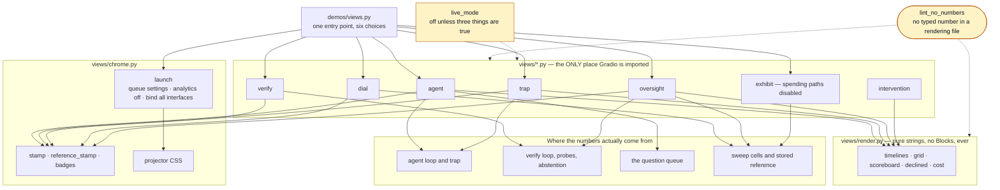

# Onboarding: the web screens

**Read [the onboarding hub](../ONBOARDING.md) first.** It carries the product overview, the
shared glossary, the machine setup for macOS, Windows, and Linux, the configuration
reference, and how the tests work. This document assumes you have done that and covers only
the browser screens.

When you have read this and run the demo in section 10, you should be able to serve any
screen on your own machine, explain the one rule that decides where every line of Gradio
code lives, name the two properties that make a number safe to put on a projector, and add
a screen without weakening either.

---

## 0. Scope of this document, and what I inspected

This area is unusual: **it owns no measurement.** Every number on every screen was computed
by one of the four loop levels. What this area owns is the difference between a number that
can be trusted on a projector and one that cannot.

### What I read to write this

| Area | Files inspected |
|---|---|
| Entry point | `demos/views.py` |
| Shared furniture | `src/loopeng/views/chrome.py`, in full |
| Pure renderers | `src/loopeng/views/render.py`, in full |
| The screens | `agent.py`, `trap.py`, `verify.py`, `dial.py`, `oversight.py`, `intervention.py`, `exhibit.py` |
| The hosted guard | `src/loopeng/views/live_mode.py`, in full |
| Tests | `tests/test_views.py`, `tests/test_exhibit.py`, `tests/test_live_mode.py`, `tests/test_docs.py` |
| The rule behind the rule | `tools/lint_no_numbers.py` |

### What I deliberately excluded, and why

| Excluded | Why |
|---|---|
| Every loop level | [Preflight](00_preflight/ONBOARDING.md), [Level 1](01_agent_loop/ONBOARDING.md), [Level 2](02_verification_loop/ONBOARDING.md), [Level 3](03_event_driven_loop/ONBOARDING.md), [Level 4](04_hill_climbing_loop/ONBOARDING.md). The screens are downstream consumers. |
| Chart rendering | `sweep/charts.py` draws figures for the sweep and the README, not for these screens. [Level 4](04_hill_climbing_loop/ONBOARDING.md). |
| The deployment sync script | `tools/sync_hf.py` pushes the exhibit to a host. This document covers what the exhibit *is*, not how it gets there. |
| Gradio's own internals | Version-specific behaviour is called out only where this code had to work around it. |

---

## 1. Overview

There are **six** screens, served by one entry point so nothing is served two ways.

| Screen | Shows | Spends? |
|---|---|---|
| `agent` | One question live, the attempt timeline, and the room's enqueue box | Yes |
| `trap` | The two-arm grid and the reveal | Yes |
| `verify` | A gold item through the verifiers, the swap, and the rule surface | Yes, except the rule surface |
| `dial` | Every sweep cell, live ones and stored ones, and the named secondary comparison | No |
| `oversight` | The abstention curve, escalation, and triage | No |
| `exhibit` | All of the above, frozen, with the spending paths disabled | **No — structurally** |

Two properties shape everything in this area, and both exist because of the same constraint:
**these numbers are shown to a room on a projector while being computed.**

**A number must never be able to pass for something it is not.** Every live figure carries
`computed HH:MM today · n=NN`. Every stored figure carries `measured <date> · not computed
in this session` and a differently coloured badge. A number with no time and no sample size
is indistinguishable from a number somebody typed.

**No number may be typed into a file that renders to a screen.**
`tools/lint_no_numbers.py` scans eleven rendering files and rejects numeric literals —
**including numbers inside strings**. That last clause is not pedantry; section 5 has the
story of what got through before it was added.

One more rule, structural rather than presentational: **`views/` owns all Gradio
composition and nothing else does.** Section 5 explains what that boundary is fixing, and
four tests enforce it.

---

## 2. Glossary

[The hub's glossary](../ONBOARDING.md#2-glossary) defines the shared terms. These are
specific to this area.

| Term | Definition |
|---|---|
| **View** | One Gradio `Blocks` app, built by a `build_*_app()` function in `src/loopeng/views/`. |
| **Stamp** | The provenance line under a figure: `computed HH:MM today · n=NN`, or the reference form. At `views/chrome.py :: stamp()`. |
| **Badge** | `LIVE` or `REFERENCE (<date>)`, rendered **in the row itself** rather than in a caption. A caption is read once; a badge is read every time the row is. |
| **Chrome** | The shared furniture: the stamps, the badges, the projector styling, the queue settings, and the launcher. |
| **Pure renderer** | A function in `views/render.py` that turns data into a markdown string and composes no Gradio. Used by the terminal paths too. |
| **Exhibit** | The frozen public build. Its guarantee is **structural**: no Anthropic client is ever constructed. |
| **Live mode** | **NOT WIRED.** `views/live_mode.py` implements a spend ceiling for a hosted instance and is tested, but no view calls it — `LiveBudget` is never constructed and `read_config()` is never invoked outside its own tests. Read it as a design, not a control. The enforced guarantee is the exhibit's, which builds no client at all. |
| **Named secondary** | The pre-registered comparison DIAL renders: the cheap model with a loop against the expensive model one-shot. |

---

## 3. Prerequisites

Everything in [the hub, section 3](../ONBOARDING.md#3-prerequisites), plus one runtime
dependency specific to this area:

- **`gradio`** builds every screen. It is a runtime dependency.
- **`qrcode`** renders a QR for whichever URL is live. It is imported inside a `try`, so a
  missing install degrades to no QR rather than a crash.

An Anthropic API key is needed for `agent`, `trap`, and the interactive halves of `verify`.
**`dial`, `oversight`, and `exhibit` need no key and make no model calls.** `exhibit` is the
one to point a browser at when you want the application readable without spending anything.

---

## 4. Repository map

| Path | Responsibility |
|---|---|
| `demos/views.py` | Parse `--view` and serve it. The only entry point for any screen. |
| `src/loopeng/views/chrome.py` | Stamps, badges, projector CSS, queue settings, LAN address, QR, and `launch()`. |
| `src/loopeng/views/render.py` | **Every pure string renderer. No `gr.Blocks` in this file, ever.** |
| `src/loopeng/views/agent.py` | `build_agent_app` (with the queue box) and `build_run_app` (without). |
| `src/loopeng/views/trap.py` | The grid and the reveal. |
| `src/loopeng/views/verify.py` | The verifier run, the swap, and the probe surface table. |
| `src/loopeng/views/dial.py` | The cell table and the named secondary comparison. |
| `src/loopeng/views/oversight.py` | The abstention curve, escalation, triage, and their caveats. |
| `src/loopeng/views/intervention.py` | What the loop declined, and why. Served by `demos/02_verification_loop/abstain.py`. |
| `src/loopeng/views/exhibit.py` | The frozen build, with the spending paths disabled. |
| `src/loopeng/views/live_mode.py` | Whether a hosted instance may spend, and what bounds it. |

---

## 5. Architecture and responsibilities

### The shape of it

Every screen is a function that returns a `gr.Blocks`. One launcher serves it. Nothing here
computes a measurement.



### The one boundary: `views/` owns all Gradio composition

This is the rule that shaped the module layout, and it was introduced to fix a real mess.
Before it there was no boundary at all, only two half-boundaries pointing at each other:

- **`build_trap_app` existed twice** — once under `agent/ui.py` and once in `views/trap.py`
  — and the two had already drifted. Different outcome labels, different withheld-scores
  wording, one checking a bare `== 2` and the other a named constant, one rendering a null
  metric through a helper and the other inline.
- **`render_attempts` also existed twice**, as two genuinely *different* functions sharing a
  name: one took an `AgentRun`, the other a recorded-run dictionary.
- **The boundary was crossed in both directions**: `views/agent.py` imported from
  `agent/ui.py` while `views/oversight.py` imported from `triage/ui.py`.

**Two copies of a renderer is two places for the wording of a disclosure to diverge**, and
the trap's scoreboard is the screen where that matters most.

The resolution: `views/` owns composition, `*/ui.py` modules do not exist, and the two
`render_attempts` became `render_attempt_timeline` (an `AgentRun`) and `render_declined_run`
(a recorded dictionary). **Different functions get different names.**

Four tests enforce it — that each helper is defined exactly once, that the old name is gone,
that no `ui.py` survives outside `views/`, and that **only `views/` imports gradio**.

### Which labels survived the merge, and why

When the two trap views were merged, the plain non-emoji labels won. One version used a
green tick and a red square; the other used `correct` and `**SILENTLY WRONG**`.

**Emoji render at the mercy of whichever font the projector's browser resolves**, and a
missing glyph in the cell that is supposed to read "silently wrong" is the single worst
place in this project for a rendering failure. Weight and capitals work everywhere. A test
asserts the surviving labels are not emoji.

The withheld-scores line kept its stronger wording — *"Scores are already computed. They are
withheld, not deferred."* — because it states the property. The other version described the
button. A test asserts that too.

### The lint rule, and the hole that made it necessary

`tools/lint_no_numbers.py` scans eleven rendering files for numeric literals. Genuine layout
geometry is exempted by a trailing `# layout` comment on that exact line, and the exemption
count is printed on every run — **an escape hatch whose usage nobody counts is how a rule
ends up exempting what it was written to catch.**

The rule originally checked numeric literals only. `views/dial.py` carried two hardcoded
conclusions with p-values typed into them, on the screen the lint rule's own docstring calls
"the single most quoted screen in the session", in a file the rule had always scanned — and
it passed, **because a number inside a string is a string constant, not a numeric literal.**

Worse than the typing: when the readings were rederived from the cells on disk, the derived
answer was **not** what had been typed. That comparison is cross-model, and
`sweep/diff.py` refuses to report a p-value across the temperature asymmetry between the two
models. The typed readings had been asserting exactly the significance claim the repository's
own guardrail forbids. **The guardrail existed in prose; the screen contradicted it.**

### Who owns what

**`chrome.py :: launch()` owns everything a view could forget.** It is one function so no
screen can be served without the queue settings, and it carries four fixes that each look
like a detail and each broke something:

| It does | Because |
|---|---|
| Sets a bounded concurrency limit and queue size | Gradio serialises requests by default, which with two browsers open reads as "the app hung". Bounded rather than unlimited, because an impatient room clicking twice would otherwise double the spend. |
| Disables Gradio analytics | Gradio phones home on launch. On a venue network that is an outbound call that can hang a start-up you are standing in front of. |
| Passes the CSS at `launch()` rather than to the constructor | Gradio 6 moved it. Without this the projector styling is **defined and never applied** — the same defect class as a rule declared in config that nothing enforces. |
| Launches non-blocking, prints the URLs, then holds the thread | A blocking launch means everything after it runs at *shutdown*, which silently disabled the LAN address and the QR code — the entire fallback for when a share tunnel cannot be reached. |
| Binds all interfaces | The default listens on loopback only, which silently defeats the LAN fallback. |

**`render.py` owns strings and composes nothing.** A test parses the module and asserts it
contains no Gradio composition. That is what lets the terminal paths in
[Level 1](01_agent_loop/ONBOARDING.md) reuse the same renderer the browser uses — and
therefore the same wording.

**`dial.py` owns the live-versus-stored distinction on screen.** At delivery the cheap
model's cells are live and the expensive model's are reference, which means the named
secondary compares a line measured minutes ago against one measured weeks ago. That is
rendered **in the row**, on both sides of the comparison table.

When a cell is missing the row still renders, with an explicit *awaiting measurement*
reading. That preserves the original concern — a missing row invites the room to fill the
gap themselves — without keeping a stored conclusion to fill it with.

**`oversight.py` owns caveats that cannot go stale.** Both are built from the constants they
describe rather than typed, because **a caveat that names a threshold the slider no longer
opens on is worse than no caveat: it is a disclosure that has quietly become false.**

**`exhibit.py` owns a structural guarantee.** The boundary is that it makes zero model
calls, and it is verified by spying on the `anthropic.Anthropic` constructor and asserting
none is ever built. Required rather than nice to have: the exhibit is public, and a path
that quietly spends would spend somebody else's money.

Note what survives the freeze and what does not. **VERIFY stays fully live**, and that is
the best part — V1 and V2 are pure functions over SQL text, so the rule checks, the probe
surface, and the swap all work at zero cost on stored queries. AGENT is **disabled, not
hidden by CSS**: a button that is merely invisible is still a button.

**`live_mode.py` owns the weaker, quantitative version of the same idea — and it is
not wired to anything.**

> **Read this before the three conditions below.** `LiveBudget` is never constructed
> outside its own tests, and `read_config()` is never called by any view, demo or
> entry point. `LOOPENG_LIVE`, `LOOPENG_LIVE_CEILING_USD` and `LOOPENG_LIVE_MAX_CALLS`
> are inert: setting them changes nothing at runtime.
>
> The conditions below describe a design that is implemented and tested, not a
> control that is in force. The guarantee this project actually enforces is the
> exhibit's — no `anthropic.Anthropic` is ever constructed, asserted by a test that
> spies on the constructor. That one is structural; this one is aspirational.
>
> A guard documented as active and wired to nothing is the precise defect this
> repository exists to demonstrate, so it is labelled rather than quietly left.

Where the exhibit guarantees no client is ever constructed, live mode *would* allow one
and stop it after a fixed amount. It *would* be off unless **three** things are all
true, because the failure mode is somebody else's money and it is silent until the bill
arrives:

1. `LOOPENG_LIVE` is set **explicitly** — not inferred from a key being present, since a key
   can arrive for a dozen reasons that are not "please spend it".
2. `ANTHROPIC_API_KEY` is set to something real, and not the exhibit's placeholder.
3. A spend ceiling is configured. **Live with no ceiling is not a configuration it accepts**
   — it refuses rather than defaulting to a number nobody chose.

Its docstring is blunt about the limit of this: *a public host with a working key is
unbounded spend by strangers. The ceiling turns "unbounded" into "capped", which is not the
same as safe. Password-gate it or keep it private; the cap is a backstop, not a door.*

---

## 6. Execution flow

### Serving a screen

1. `demos/views.py` parses `--view` against a six-name tuple. It is `required`, so there is
   no default screen to inherit by accident.
2. Settings load, the warehouse is ensured, and the gold set is built **only for the three
   screens that need it** — `trap`, `verify`, and `exhibit`.
3. The matching `build_*_app()` runs and returns a `gr.Blocks`.
4. `chrome.launch()` applies the queue settings and the CSS, binds, prints the reachable
   URLs, writes a QR for the first one, and holds the thread.

### How state is scoped, and why it matters

Every screen keeps per-user state in `gr.State`, never at module scope. The reason is
recorded in two places in the source and is worth internalising: **module state works
perfectly with one person clicking and leaks the moment two browsers are open.** In a room
where the presenter's laptop and an attendee's phone are both connected, that is not a
hypothetical.

### The TRAP reveal

`_run` is a generator: it yields the empty grid immediately, runs the trap, then yields the
filled grid. `_reveal` sets one boolean and re-renders. **It makes no model calls**, and a
test asserts that against the view rather than only against the script.

Until reveal, every landed cell renders as the same mark whatever happened inside it. A
cell reading "query failed" would hand the room a free answer key for that row.

### The AGENT enqueue box

It writes a row to the queue and returns immediately. **It does not need the worker to be
running** — a row submitted with no worker up sits in `queued`, and the note on screen says
so in words. That is correct behaviour and worth showing: *a queue whose consumer is down is
not a queue that lost your question.* See [Level 3](03_event_driven_loop/ONBOARDING.md).

---

## 7. Interfaces and data

### The command line surface

```
usage: views.py [-h] --view {agent,trap,verify,dial,oversight,exhibit}
                [--port PORT] [--share] [--queue QUEUE]
                [--sweep-dir SWEEP_DIR] [--share-url SHARE_URL]
```

`tests/test_docs.py :: test_documented_views_match_the_entry_point` parses this tuple out of
the source and asserts the root README documents exactly these names, so a screen added
without documentation fails the build.

### What the provenance markers actually render

```
<span class='stamp'>computed 02:12 today · n=50</span>
<span class='stamp'>computed 02:12 today · not yet measured</span>
<span class='stamp'><span class='ref-badge'>REFERENCE</span> · measured 2026-07-29 · n=50 · not computed in this session</span>
<span class='live-badge'>LIVE</span>
<span class='ref-badge'>REFERENCE (2026-07-29)</span>
```

Three things to notice. A live stamp **always** carries the time. A stamp with no sample size
says `not yet measured` rather than `n=0`. And a reference stamp says, in words, *not
computed in this session* — the badge alone would rely on colour, and colour is the first
thing a projector loses.

### The two guards, compared

| | Exhibit | Live mode |
|---|---|---|
| Guarantee | **Structural** — no client is ever constructed | **Quantitative** — a client may be constructed, and the ledger stops it |
| Verified by | Spying on the constructor in a test | Unit tests over the config and the budget |
| Fails by | Cannot spend at all | Raising `BudgetExhausted` before the next call |
| Where used | The public frozen build | A hosted instance that is meant to spend a little |

Both check **before** spending, never after. A cap enforced in arrears is a report of what
was overspent.

### Files this area reads and writes

| Path | Direction | Used by |
|---|---|---|
| `results/sweep/` | read | `dial`, `oversight`, `exhibit` |
| `results/reference/measurements.json` | read | `dial`, `exhibit` |
| `results/reference/abstention_curve.json` | read | `exhibit` |
| `results/phase4_escalation.json`, `results/phase4_triage.json` | read | `oversight`, `exhibit` |
| `question_queue.duckdb` | **read and write** | `agent` |
| `results/share_qr.png` | write | `chrome.qr_png()` |

`agent` is the only screen that writes anything a loop level reads.

---

## 8. Configuration

[The hub, section 7](../ONBOARDING.md#7-configuration) carries the full table. This area is
where most of the process-environment variables are actually consumed.

| Variable | Read at | Effect |
|---|---|---|
| `ANTHROPIC_API_KEY` | via settings | Needed by `agent`, `trap`, and the live halves of `verify` |
| `LOOPENG_LIVE` | `live_mode.read_config()` | Must be `1`, `true`, `True`, or `yes`. Anything else means off. |
| `LOOPENG_LIVE_CEILING_USD` | `live_mode.read_config()` | **Required** when `LOOPENG_LIVE` is set. No default. |
| `LOOPENG_LIVE_MAX_CALLS` | `live_mode.read_config()` | Call ceiling. Has a default. |
| `GRADIO_ANALYTICS_ENABLED` | `chrome.launch()` | Set to `False` by the code, not by you |

Two constants in `chrome.py` behave like configuration and are deliberately not flags:
the concurrency limit and the maximum queue size. Both are bounded on purpose, per section 5.

---

## 9. Run it locally

Follow [the hub, section 6](../ONBOARDING.md#6-run-it-locally) from a fresh clone.

Every screen cold starts: the warehouse is generated on first use, the queue table is
created on connect, and the gold set is rebuilt from its patterns.

`dial` and `oversight` will render but say `not yet measured` until a
[Level 4](04_hill_climbing_loop/ONBOARDING.md) sweep has written cells — and `dial` also
fills in stored reference rows, so it is never blank.

---

## 10. Demo

### Part A: the whole application, readable, with no key and no spend

```bash
uv run python -u demos/views.py --view exhibit
```

`Unverified:` I did not start a server while writing this document. Every panel it composes
*is* verified below, and `tests/test_exhibit.py` asserts the page constructs no model client
at all.

Use `-u`. Without it Python block-buffers stdout when you redirect to a file, and the URL
never appears even though the server is fine.

The banner it opens with:

```bash
uv run python -c "from loopeng.views.exhibit import BANNER; print(BANNER)"
```

**Actual output, captured:**

```
### This is a frozen exhibit
Every figure below was **measured on 2026-07-29** and is shown with its date. Nothing here is computed now, and nothing here calls a model. The live version runs from a laptop during the workshop, where the same views compute their numbers in front of the room and stamp them with the time.
```

The date is not typed into that string — it comes from `sweep/reference.py :: MEASURED_ON`,
so the banner cannot claim a date the measurements do not carry.

### Part B: the provenance markers, free

```bash
uv run python -c "
from loopeng.views.chrome import stamp, reference_stamp, live_or_reference_badge
print(stamp(50)); print(stamp(None)); print(reference_stamp('2026-07-29', 50))
print(live_or_reference_badge(False)); print(live_or_reference_badge(True, '2026-07-29'))
"
```

**Actual output, captured:**

```
<span class='stamp'>computed 02:12 today · n=50</span>
<span class='stamp'>computed 02:12 today · not yet measured</span>
<span class='stamp'><span class='ref-badge'>REFERENCE</span> · measured 2026-07-29 · n=50 · not computed in this session</span>
<span class='live-badge'>LIVE</span>
<span class='ref-badge'>REFERENCE (2026-07-29)</span>
```

**Read the second line.** A figure with no observations renders `not yet measured`, never
`n=0` and never a blank. A blank invites the reader to assume the number is fine and the
label is missing.

### Part C: DIAL's rows, exactly as a room sees them

```bash
uv run python -c "
from loopeng.sweep.reference import load_reference
from loopeng.views.dial import _rows
print(_rows(load_reference()))
"
```

**Actual output, captured** (first rows; the full table is longer):

```
| | cell | silent-error rate | cost |
|---|---|---|---|
| <span class='ref-badge'>REFERENCE (2026-07-29)</span> | Sonnet · L0 · loop | 42.6% (n=47, ±14.2, measured 2026-07-29) | est. $0.7240 |
| <span class='ref-badge'>REFERENCE (2026-07-29)</span> | Sonnet · L0 · one-shot | 83.8% (n=37, ±14.9, measured 2026-07-29) | est. $0.3921 |
| <span class='ref-badge'>REFERENCE (2026-07-29)</span> | Sonnet · L3 · one-shot | 0.0% (n=43, ±8.2, measured 2026-07-29) | est. $0.3646 |
| <span class='ref-badge'>REFERENCE (2026-07-29)</span> | Haiku · L0 · loop | 68.3% (n=41, ±15.3, measured 2026-07-29) | est. $0.1293 |
| <span class='ref-badge'>REFERENCE (2026-07-29)</span> | Haiku · L3 · loop | 9.3% (n=43, ±12.3, measured 2026-07-29) | est. $0.0841 |
```

**Every single cell carries four things**: the badge, the rate, the sample size **and** the
interval, and the date. Not one of them is optional and not one is in a caption. The
`0.0%` row is the clearest case for why: a bare `0.0%` is a claim of perfection, while
`0.0% (n=43, ±8.2, measured 2026-07-29)` is a measurement with a stated uncertainty.

The dollar figures all say `est.` They always will — tokens are measured, dollars are a
hand-entered price table.

### Part D: VERIFY's rule surface, free and fully live

This is the panel that survives the freeze, and it costs nothing.

```bash
uv run python -c "from loopeng.views.verify import _probe_table; print(_probe_table())"
```

**Actual output, captured:**

```
### Rule surface — 7/7 sound

| rule | catches the violation | accepts a nearby-legitimate query |
|---|---|---|
| soft_delete | True | True |
| cancelled_orders | True | True |
| internal_accounts | True | True |
| multi_currency | True | True |
| minor_units | True | True |
| fan_out | True | True |
| refunds_net | True | True |
```

**Two columns, not a score.** A verifier that rejected every query would be `True` down the
left and `False` down the right. See [Level 2](02_verification_loop/ONBOARDING.md) for what
each column means.

### Part E: the live-mode guard refusing, free

```bash
uv run python -c "
from loopeng.views.live_mode import read_config
print(read_config({}).summary)
print()
print(read_config({'LOOPENG_LIVE':'1','ANTHROPIC_API_KEY':'sk-real'}).summary)
print()
print(read_config({'LOOPENG_LIVE':'1','ANTHROPIC_API_KEY':'sk-real','LOOPENG_LIVE_CEILING_USD':'2.50'}).summary)
"
```

**Actual output, captured:**

```
**Live calls are off.** LOOPENG_LIVE is not set, so nothing calls a model.

**Live calls are off.** LOOPENG_LIVE is set but LOOPENG_LIVE_CEILING_USD is not. Live with no ceiling is not a configuration this accepts, and defaulting to a number nobody chose would be worse than refusing.

**Live calls are on**, capped at est. $2.50 and 60 calls for this process. When either runs out the app keeps working and stops calling.
```

**The middle case is the one to study.** A real key and an explicit opt-in are still not
enough. It refuses, and the refusal explains itself — because the alternative, picking a
ceiling nobody chose, would look like it worked.

### Part F: the live screens

```bash
uv run python -u demos/views.py --view agent
uv run python -u demos/views.py --view trap
uv run python -u demos/views.py --view verify
```

`Unverified:` all three serve screens whose buttons make billed API calls. I did not start
them. The renderers behind them are the ones exercised in
[Level 1](01_agent_loop/ONBOARDING.md) section 10 and
[Level 2](02_verification_loop/ONBOARDING.md) section 10, against real data with the model
call substituted.

Add `--share` for a public tunnel. The launcher prints every reachable URL and writes a QR
for the first one, because nobody types a URL off a projector.

---

## 11. Observability

**This area emits no log events of its own.** Everything you see comes from the loop levels
underneath, and everything the screens have to say, they say on screen.

That is the deliberate position: the audience *is* the monitoring. A structured record filed
somewhere else does not help a presenter standing in front of a room, which is the same
reasoning `src/loopeng/logging.py` gives for rendering to a console rather than as JSON.

`chrome.launch()` prints two things and they are the operational output of the whole area:

```
  reachable at: <url>
  QR code: results/share_qr.png
```

Both are printed with `flush=True`, **after** launch. The share URL does not exist until the
tunnel is up, and an earlier version printed before that and looked like a share-link
failure when it was only stdout buffering.

**There are no metrics.**

### What healthy looks like

- Every figure carries a stamp with a time and a sample size, or says `not yet measured`.
- Live rows are badged `LIVE`; stored rows are badged `REFERENCE` with a date.
- At least one reachable URL prints, and a QR file appears.
- The page is styled — large type, wide table. If it looks like default Gradio, the CSS is
  not being applied, which is a real bug this code has had before.

### What unhealthy looks like

- **A number with no stamp.** Treat as untrustworthy until you find where it came from.
- **A blank where a rate should be.** The convention is `not yet measured`; a blank means
  something bypassed the renderer.
- **No URL printed** — either the launch is blocking again, or stdout is buffered. Use `-u`.
- **The app appears to hang with two browsers open** — the queue settings are not being
  applied. Check that the screen was served through `chrome.launch()`.
- **A `REFERENCE` badge on a row you just measured** — the reference mode is filling in over
  a live cell. Check `--sweep-dir`.

---

## 12. Troubleshooting

Shared rows are in
[the hub, section 11](../ONBOARDING.md#11-troubleshooting-shared-across-areas).

| Symptom | Likely cause | Diagnostic | Fix |
|---|---|---|---|
| No URL appears when output is redirected | Python block-buffers stdout to a file. | Run without redirection. | Use `uv run python -u ...`. |
| The share URL never appears but the app works | The tunnel failed, often on a restricted network. | Look for a LAN address in the same output. | Use the LAN URL. Many venue access points enable client isolation, which blocks it — both paths get tested in the dry run for this reason. |
| Phones on the venue wifi cannot reach the LAN URL | Client isolation on the access point. | Try from a laptop on the same network. | Use `--share`. This is exactly the case the tunnel is the fallback for. |
| The page looks like default Gradio | The CSS is defined and not applied. | Confirm the screen was served via `chrome.launch()`. | Gradio 6 moved `css` from the constructor to `launch()`. A test asserts it is applied, not merely defined. |
| The app seems to hang with two browsers open | Requests are being serialised. | — | Serve through `chrome.launch()`, which sets the concurrency limit. |
| State from one browser appears in another | State was put at module scope. | Look for a mutable module-level variable in the view. | Move it into `gr.State`. This works perfectly with one clicker and leaks with two. |
| `dial` shows only `REFERENCE` rows | No live cells in the sweep directory. | `ls results/sweep` | Run a sweep, or point `--sweep-dir` at one. Reference rows filling the gap is intended. |
| `oversight` says `not yet measured — run the sweep first` | No cells for the key it reads. | The panel names it. | Run a [Level 4](04_hill_climbing_loop/ONBOARDING.md) sweep. |
| A comparison row reads *awaiting measurement* | One or both cells are missing. | Check the two cell keys on that row. | Correct behaviour. The row deliberately renders without a conclusion rather than being hidden. |
| No QR file is written | `qrcode` is not installed. | `uv run python -c "import qrcode"` | `uv sync`. The import is inside a `try`, so this degrades rather than crashing. |
| The exhibit tries to make a model call | It cannot, and a test proves it. | `uv run pytest tests/test_exhibit.py -q` | If that test ever fails, stop and fix it before deploying. It is a security boundary. |
| Live mode stays off with the key set | The other two conditions are not met. | Print `read_config().summary`; it names which one. | Set `LOOPENG_LIVE` **and** `LOOPENG_LIVE_CEILING_USD`. |
| `BudgetExhausted` on a hosted instance | The per-process ceiling is spent. | The message reports both figures. | Restart the process, or raise the ceiling deliberately. |
| `lint_no_numbers.py` fails after a view edit | A numeric literal, or a number inside a string, reached a rendering file. | The message names the file and line. | If it is genuine layout geometry, add a trailing `# layout` comment. If it is a measurement, derive it. |

---

## 13. Testing

```bash
uv run pytest tests/test_views.py tests/test_exhibit.py tests/test_live_mode.py -q
```

**Actual output, captured:**

```
...................................................................      [100%]
67 passed in 6.81s
```

**No view makes a model call in any of these tests.** Rendering is asserted against
substituted clients and stored data.

### What is asserted, grouped by the property it protects

| Property | Tests |
|---|---|
| **The reveal is a state flip** | `test_reveal_makes_zero_model_calls_through_the_view` |
| **A failure looks like a success until reveal** | `test_visible_failures_look_identical_to_successes_before_reveal`, `test_an_unlanded_cell_renders_as_pending` |
| Withheld is not the same as absent | `test_the_scoreboard_is_withheld_not_absent`, `test_the_withheld_line_states_the_property_not_the_button` |
| A queue with no consumer did not lose your question | `test_enqueue_works_when_no_worker_is_running`, `test_an_empty_queue_says_so_rather_than_rendering_nothing` |
| **Live and stored are visibly different, on both sides** | `test_a_reference_row_is_badged_and_dated`, `test_a_live_row_is_badged_live`, `test_the_comparison_carries_the_badge_on_both_sides` |
| **No stored conclusion is typed into a screen** | `test_no_stored_conclusion_is_typed_into_the_dial_view`, `test_the_reading_is_derived_from_the_cells_on_screen`, `test_a_row_with_no_cells_says_awaiting_measurement_not_a_conclusion` |
| Caveats are rendered, not filed | `test_the_oversight_caveats_are_rendered` |
| **Every stamp carries time and n** | `test_every_stamp_carries_time_and_n`, `test_a_stamp_without_an_n_says_not_yet_measured`, `test_a_reference_stamp_never_claims_it_was_computed_now` |
| The launcher's four fixes hold | `test_concurrency_is_explicit_and_the_queue_is_bounded`, `test_the_lan_url_is_offered_as_a_fallback`, `test_the_projector_css_is_actually_applied_not_merely_defined`, `test_launch_binds_to_all_interfaces_so_the_lan_fallback_resolves` |
| The CSS is sized for a room | `test_the_projector_css_sizes_type_for_a_room` |
| **The Gradio boundary holds** | `test_each_view_helper_is_defined_exactly_once`, `test_render_attempts_is_gone_as_a_name`, `test_no_ui_module_survives_outside_views`, `test_only_views_import_gradio`, `test_the_render_module_composes_nothing` |
| Labels survive a bad font | `test_the_surviving_outcome_labels_are_not_emoji` |
| **The exhibit constructs no model client** | `test_building_the_exhibit_constructs_no_model_client`, `test_a_sweep_under_the_exhibit_profile_cannot_spend` |
| The exhibit is disabled, not hidden | `test_the_spending_path_is_disabled_not_hidden`, `test_the_disabled_note_explains_rather_than_apologises` |
| VERIFY stays live in the exhibit | `test_verify_stays_fully_live_in_the_exhibit` |
| Every frozen figure is dated, and not today | `test_every_exhibit_figure_carries_a_measured_date_not_today`, `test_the_banner_says_it_is_frozen_and_names_the_date` |
| A fresh checkout renders nothing finished | `test_a_fresh_checkout_renders_not_yet_measured`, `test_the_chart_entry_point_renders_nothing_finished_on_a_fresh_clone` |
| **Live mode needs all three conditions** | `test_off_by_default`, `test_a_key_alone_does_not_enable_it`, `test_the_flag_alone_does_not_enable_it`, `test_it_refuses_rather_than_defaulting_the_ceiling`, `test_the_exhibit_placeholder_key_does_not_count`, `test_all_three_together_enable_it` |
| Both ceilings actually stop it | `test_the_call_ceiling_stops_it`, `test_the_spend_ceiling_stops_it`, `test_a_failed_call_still_counts_against_the_ceiling` |

`test_only_views_import_gradio` and `test_the_render_module_composes_nothing` are the two
that keep the layout from decaying back into what section 5 describes.

`tests/test_docs.py :: test_documented_views_match_the_entry_point` sits outside these files
and asserts the README's documented `--view` choices match the entry point's tuple exactly.

### Visible coverage gaps

1. **No test starts a server.** Everything is asserted against the composed `Blocks` object
   and the pure renderers, so nothing covers the actual HTTP path, the tunnel, or a real
   browser.
2. **`qr_png()`'s failure path is untested.** The `ImportError` branch returns `None` and
   nothing exercises it.
3. **`views/intervention.py` has no dedicated test.** Its renderers are covered through
   `render.py`; the screen's own wiring is not.
4. **Nothing asserts the six screens each build without error.** Tests cover specific
   panels, not "every `--view` choice constructs".

---

## 14. Changing this code safely

### Low risk to modify

- **Colours, spacing, and type scale in `PROJECTOR_CSS`**, provided the type stays large
  enough for the back of a room — a test checks that.
- **Headings and explanatory prose** on any screen, provided no number enters a string.
- **Layout — rows, columns, tabs.** Keep the `# layout` comments on geometry constants.
- **Adding a read-only panel** to an existing screen, if the data already exists elsewhere.

### Load bearing, and why

- **`views/` being the only place gradio is imported.** A test enforces it. Section 5 is
  what happens without it, and it had already happened.
- **`render.py` composing nothing.** It is what lets the terminal and browser paths share
  wording rather than drift.
- **Every figure going through `stamp()` or `reference_stamp()`.** A number without
  provenance on a projector is indistinguishable from one somebody typed.
- **Badges being rendered in the row, not in a caption.** A caption is read once; a badge is
  read every time the row is.
- **`NOT_MEASURED` rather than zero or blank.** Rendering an unmeasured cell as `0.0%` is a
  false measurement, and blank invites the reader to assume it is fine.
- **Deriving readings from cells rather than typing them.** The typed version was not merely
  stale — it asserted a significance claim the repository's own guardrail forbids.
- **Building the OVERSIGHT caveats from their constants.** A caveat naming a value the code
  no longer uses is a disclosure that has quietly become false.
- **The exhibit constructing no client.** This is a security boundary on a public page, and
  the test that proves it is not optional.
- **`live_mode` refusing rather than defaulting a ceiling.** Picking a number nobody chose
  would look like it worked.
- **Checking budgets before the call.** In arrears is a report, not a cap.
- **`chrome.launch()` being the only launcher.** All five of its fixes are things a
  per-screen `app.launch()` would silently drop.
- **`gr.State` rather than module scope.** Works with one clicker; leaks with two.
- **Non-emoji outcome labels.** A missing glyph in the "silently wrong" cell is the worst
  rendering failure available in this project.

### What depends on the current behaviour

| Depends on | What it consumes |
|---|---|
| `demos/01_agent_loop/run.py` | `build_run_app`, and `render_attempt_timeline` / `render_cost` |
| `demos/01_agent_loop/trap.py` | `build_trap_app` |
| `demos/02_verification_loop/abstain.py` | `build_intervention_app`, `render_declined` |
| `deploy/hf/app.py` | The exhibit build and its environment variables |
| `tools/sync_hf.py` | The exhibit's file set |
| The root `README.md` | The `--view` choices, asserted by `tests/test_docs.py` |
| `tools/lint_no_numbers.py` | The list of eleven rendering files |
| `question_queue.duckdb` | AGENT writes to it — see [Level 3](03_event_driven_loop/ONBOARDING.md) |

### Pre merge checklist

The repository-wide list is in
[the hub, section 12](../ONBOARDING.md#12-changing-this-code-safely-the-repository-wide-rules).
Five additions for this area:

1. `uv run python tools/lint_no_numbers.py` exits zero, and **if the exemption count
   changed, check every new exemption is genuinely layout geometry.**
2. If you added a screen, add it to `VIEWS` **and** to the root README's `--view` list.
   `tests/test_docs.py` compares them.
3. If you added a figure, confirm it goes through a stamp and that an unmeasured value
   renders as `not yet measured`.
4. If you touched anything the exhibit composes, run `uv run pytest tests/test_exhibit.py -q`
   before deploying. It is the only thing standing between a public page and somebody else's
   bill.
5. If you touched `chrome.launch()`, serve a screen and confirm a URL prints **and** the page
   is styled. Both have silently regressed before.

---

## 15. Open questions and assumptions

### Questions for the team

1. **`demos/views.py` says "five views" in two places and offers six.** The module docstring
   lists `AGENT · TRAP · VERIFY · DIAL · OVERSIGHT` and the argparse description reads
   *"Serve one of the five views"*, while `VIEWS` has six entries — `exhibit` was added and
   the prose was not. It is visible in `--help`, quoted in section 7. **Should the count be
   derived from `len(VIEWS)`, the way the OVERSIGHT caveats are derived from their
   constants?**

2. **`build_exhibit_app` imports `build_dial_app` and never calls it**, with a
   `# noqa: F401 (kept for parity)` comment. **Is that a placeholder for embedding the real
   DIAL screen, or should it go?**

3. **The exhibit reads `results/reference/abstention_curve.json`, which has no writer in this
   repository.** The same open question appears in the
   [Level 4 document](04_hill_climbing_loop/ONBOARDING.md). **Which tool produced it?**

4. **`build_intervention_app` takes a `warehouse` parameter it never uses.** **Left over, or
   reserved for the answer-submission path the module says was deliberately not built?**

5. **`chrome.lan_url()` opens a UDP socket to a public address to pick a route.** No packet
   is sent, but on a locked-down network the call itself may be blocked or slow. **Should it
   be bounded by a timeout, or is the `OSError` fallback sufficient?**

6. **Nothing asserts that all six `--view` choices construct.** A screen could be added to
   `VIEWS`, pass the docs test, and fail at launch. **Worth a parameterised smoke test?**

### Assumptions I made, and the evidence

| Assumption | Evidence it rests on |
|---|---|
| No view emits a log event of its own. | Searched the view modules for logger use; none creates or calls one. Events reaching the screen come from the loop levels. |
| The live screens' output shapes in section 10 Part F. | Read off the `build_*_app` functions and the renderers they call. Parts B through E exercise those same renderers with real data. |
| `qrcode` degrades rather than crashing when absent. | The import is inside a `try` returning `None`. I did not uninstall it to confirm. |
| The projector CSS is applied at launch in the installed Gradio. | `test_the_projector_css_is_actually_applied_not_merely_defined` passes here, which is the assertion rather than my reading. |
| The exhibit is the only screen that cannot spend. | `dial` and `oversight` also make no model calls, but only the exhibit's guarantee is *structural* and tested by constructor spying. |

### Things I verified by executing them

Every command in section 10 Parts B, C, D, and E was run on macOS from this checkout, along
with the banner in Part A, and the blocks marked **Actual output, captured** are what they
printed — Part C truncated to the first rows, which is noted there. The commands that serve
a screen are marked `Unverified:` because I did not start a server.
